**English** | [Türkçe](README.tr.md)

# Syncra Desktop

Syncra Desktop is a **Tauri 2**, offline-first desktop client for Syncra — a closed-circuit (invite-only) enterprise CRM covering the full customer lifecycle: leads, contacts, companies, deals, quotes, tickets, tasks, chat, reporting and system administration. It reuses the existing React UI as-is (no interface rewrite) and adds a local, encrypted SQLite mirror plus an outbox, so the app keeps working — both reading and writing — without a network connection, and syncs automatically once one is available.

This repository also contains the `backend/` and `frontend/` this client talks to, because the desktop client needs a local API to develop and sync against. The canonical documentation for those two layers — the full CRM feature tour, the complete API reference, the ER diagrams — lives in the web project's own repository (`ayberkaarda/Syncra-CRM`); this README keeps a reference copy of that material in the [Appendix](#appendix-the-web-application-this-desktop-shell-wraps) at the bottom, since this repo still has to run both layers locally.


<!-- capture: the Tauri app window, logged in, dashboard visible, ConnectivityBar showing "Online · synced Xs ago" -->
*The desktop shell — the same dashboard and modules as the web app, running inside the native Tauri window with the connectivity bar docked at the top.*

## Project Structure

| Directory | Description |
| --- | --- |
| `desktop/` | The Tauri 2 desktop shell (`src-tauri/`), the sync engine as a UI-independent Rust lib crate (`crates/syncra-sync/`), and desktop-only TypeScript (`src/`). See [Architecture](#architecture-brief) below. |
| `backend/` | Laravel 12 REST API (Sanctum authentication, Reverb real-time events, plus the device-token/delta-sync layer this client talks to). Kept in this repo so the desktop client has a local API to develop and sync against; canonical docs are in the web project's repo. |
| `frontend/` | The React 18 + Vite single-page app whose `src/` the desktop shell reuses unchanged as its UI. Canonical docs are in the web project's repo. |
| `docs/` | Desktop engineering docs (specs, decision logs, threat model — see [Documentation](#documentation)) plus the backend/frontend docs this repo inherited from its web-project history (see the [Appendix](#appendix-the-web-application-this-desktop-shell-wraps)). |

## Features

The desktop client ships the same CRM as the web app — leads, contacts, companies, deals, quotes, tickets, tasks, chat, reports, settings, all of it (see the [Appendix](#appendix-the-web-application-this-desktop-shell-wraps) for the full feature-by-feature tour, with its own screenshots). What is specific to the desktop shell is what's below: an offline-capable local mirror and a set of OS integrations the browser can't give you.

### Offline-first mirror
The engine keeps a local, SQLCipher-encrypted SQLite copy of your data (`rusqlite`, `bundled-sqlcipher-vendored-openssl`) plus an outbox of pending mutations. This isn't a read-only cache: both reading records and creating/editing them work with no network at all — a create, update, move, or delete queues in the outbox and is pushed the moment a connection comes back, in the right order. Delta sync pulls only what changed since your last `sync_version` cursor, so reconnecting after being offline doesn't mean re-downloading everything.


<!-- capture: ConnectivityBar in the "Offline" state, with at least one record showing a pending-sync badge -->
*The connectivity bar switches to "Offline" the moment the network drops — records you create or edit while offline carry a pending badge until they're pushed.*

### Conflict management
When two people edit the same record and both changes reach the server, the system doesn't silently pick a winner: a server-side rule takes priority where one exists, otherwise it falls back to field-level last-write-wins, and anything still ambiguous lands in the **Conflict Inbox** for a human to resolve — keep your version, take the server's, or merge specific fields. Nothing is overwritten silently.


<!-- capture: Conflict Inbox screen with at least two pending conflicts, diff view visible -->
*The Conflict Inbox shows a diff of your change against the server's and lets you keep yours, take the server's, or resolve field by field.*

### System tray & background sync
Closing the window doesn't quit the app — it drops to the system tray and keeps syncing in the background. The tray icon itself reflects the current state (online / offline / syncing / conflict), and its menu — Open, Sync now, Quick capture, Pause sync, Quit — is drawn in whichever of the four UI languages your account is set to, since the tray exists before the web view (and its i18n instance) has even started.


<!-- capture: right-click tray menu open, showing Open/Sync now/Quick capture/Pause sync/Quit, tray icon in its "syncing" state -->
*The tray menu — Open, Sync now, Quick capture, Pause sync, Quit — with the tray icon's status dot reflecting the engine's current state.*

### Native notifications
New tickets, deal assignments, mentions and the rest of the `notifications` table raise a native OS toast and update the taskbar badge, whether the row arrived from a background pull or a live Reverb event. Notifications you've already seen are never re-toasted, and a large backlog restored on first launch is counted in the badge without opening a wall of toasts.


<!-- capture: an OS-level toast notification raised by the app (e.g. a new ticket assignment), with the OS notification area visible for context -->
*A new assignment raises a native OS toast — this is the platform's own notification, not an in-app banner.*

### Quick capture (global hotkey)
A configurable global hotkey opens a small, frameless popup — instantly, without waiting for the main window — with four tabs for capturing a lead, a task, an activity, or a note on the spot. It writes through the same offline-capable mutation path as the rest of the app, so quick capture works with no connection too.


<!-- capture: the frameless quick-capture popup opened via the global hotkey, Lead tab active with sample data filled in -->
*The quick-capture popup — opened by a global hotkey from anywhere, four tabs, works offline.*

### Deep links
Clicking a `syncra://<entity>/<id>` link — from an email, chat, or anywhere else — opens the app and routes straight to that record, even if the app wasn't running yet: the launch target is held until the web view is ready to receive it, so a cold start never loses the link.

### Clipboard capture (opt-in, off by default)
When explicitly turned on, the app watches the clipboard for something that looks like an email address or an E.164 phone number and offers to add it as a lead. It is **off by default** (K10) and the underlying clipboard-read permission isn't even granted to the webview unless the feature is enabled — nothing is written to disk or logged in the meantime.

### File drag-and-drop & screenshot-to-ticket
Dropping a file onto the app attaches it to the record underneath. A ticket detail view also offers a one-click "capture screen" action that grabs the primary display, attaches it to that ticket's conversation, and — like every other write — queues it if you're offline rather than failing.

### Quote PDF cache
Once a quote's PDF has been opened, it's cached locally, so reopening it later — including with no connection — doesn't require hitting the server again.

### Storage control
A Storage settings screen lets you see and adjust how much local disk this app is allowed to use — retention window in days, a database size ceiling, an outbox size ceiling (defaults of 30 days / 500 MB / 5,000 pending mutations, with enforced floors so they can't be set dangerously low) — plus a **Download archive** action to temporarily widen the retention window and a **Clear local** action to wipe the mirror. A separate Devices screen lists and lets you revoke this account's other device tokens (`GET`/`DELETE /api/me/devices`).


<!-- capture: Storage settings panel showing the retention-days field, the size ceilings, and the Download archive / Clear local buttons -->
*Storage settings — retention window, size ceilings, and one-click archive download / local wipe.*

## Technology Stack

| Layer | Technology | Version / Note |
| --- | --- | --- |
| Shell | Tauri | 2 (`tauri = "2"`, `@tauri-apps/cli` 2.11.4, `@tauri-apps/api` ^2.11.0) |
| Shell | Rust | `rustc 1.98.0` (`rust-version = "1.80"` MSRV in both crates) |
| Sync engine | `rusqlite` | 0.32, `bundled-sqlcipher-vendored-openssl` feature — the local encrypted SQLite mirror, plus `functions`/`backup` |
| Sync engine | `reqwest` | 0.12, `rustls-tls` — the pull/push HTTP client |
| Sync engine | `tokio` | 1, `rt-multi-thread` — async runtime for the sync scheduler |
| Sync engine | `keyring` | 3 — OS keychain storage for the device token and the SQLCipher key (K9: no plaintext) |
| OS integration | `xcap` | 0.9 — screen capture for screenshot-to-ticket |
| OS integration | Tauri plugins | `notification`, `global-shortcut`, `deep-link`, `autostart`, `updater`, `window-state`, `clipboard-manager`, `dialog`, `fs`, `os`, `process`, `shell`, `log`, `single-instance` — all `2` |
| UI | React | 18.3.1 — `frontend/src`, reused as-is (see [Architecture](#architecture-brief)) |
| UI | Vite | ^8.2.0 — separate desktop build config (`vite.desktop.config.ts`) |
| UI | Tailwind CSS | ^4.3.3 |
| Testing | `vitest` | ^4.1.11 — desktop workspace unit tests |
| Testing | `cargo test` + `clippy` | `desktop/` cargo workspace (`crates/syncra-sync` + `src-tauri`) |

The `backend/` this client syncs against and the `frontend/` whose UI it reuses have their own, larger stack (Laravel 12, MySQL/MariaDB, Reverb, React Router, TanStack Query, Zustand, i18next, ...) — see [Technology Stack (backend & frontend)](#technology-stack-backend--frontend) in the Appendix, or the web project's own README for canonical docs.

## Prerequisites

### Desktop client

| Component | Version / Note |
| --- | --- |
| Rust | `rustc 1.98.0` (installed via `rustup`, stable channel). No `rust-toolchain.toml` is pinned in the repo — `rustup`'s default `stable` toolchain is used as-is. |
| Node.js | v26.7.0 |
| npm | 11.19.0 |
| Linux system packages (for `cargo build`/`tauri build`) | `libwebkit2gtk-4.1-dev`, `libayatana-appindicator3-dev`, `librsvg2-dev`, `libxdo-dev`, `libssl-dev`, `patchelf`, `build-essential`, `curl`, `wget`, `file` — this exact list is the source of truth in `.github/workflows/desktop-ci.yml`. |
| Windows | No extra system packages; the vendored SQLCipher/OpenSSL build additionally needs a full Perl on `PATH` with `ExtUtils::MakeMaker` (Git Bash's bundled Perl does not have it — see the CI workflow's comments for the exact failure mode). |

**Trap:** `cargo` is not necessarily on `PATH` in every shell. On this machine it resolves from `%USERPROFILE%\.cargo\bin` (`rustc.exe`, `cargo.exe`, `cargo-clippy.exe`, ...); if `cargo`/`rustc` "isn't found," check that directory before assuming Rust isn't installed.

### Local API stack (backend + frontend, for development)

The desktop client needs a running backend to authenticate against and sync with, and this repo carries `backend/` and `frontend/` for exactly that. This project has been verified against the following local environment:

| Component | Version / Location | Note |
| --- | --- | --- |
| PHP | 8.2.12 — `C:\xampp\php\php.exe` | `zip` and `intl` extensions must be enabled |
| Composer | 2.10.2 — `C:\xampp\php\composer.bat` | |
| MariaDB | 10.4.32 — `127.0.0.1:3306` | User `root`, empty password, utf8mb4. **Not installed as a Windows service** — must be started from the XAMPP Control Panel |
| Redis | 8.0.5 — on WSL2 Ubuntu, `127.0.0.1:6379` | Memurai is not installed |
| Node.js | v26.7.0 | |
| npm | 11.19.0 | |

Additional notes:
- The `redis` C extension is not installed for PHP; the backend therefore uses the `predis/predis` package (`REDIS_CLIENT=predis`).
- `C:\xampp\php` has been added to the user PATH. This change only takes effect in **newly opened terminals**; in existing terminals use the full path (`C:\xampp\php\php.exe`) instead of the `php` command.

#### Setup Steps (Prerequisites)

**XAMPP:** PHP 8.2 or higher is required — a lower version cannot run Laravel 12. After installing XAMPP, uncomment (remove the leading `;` from) the following lines in `php.ini`:
```ini
extension=zip
extension=intl
```

**Composer:** The `composer.bat` bundled with XAMPP can be used, or it can be installed separately via [getcomposer.org](https://getcomposer.org/).

**Redis (two options on Windows):**
- **(a) WSL2 + Ubuntu (the method used in this project):**
  ```
  wsl --install
  sudo apt install redis-server
  sudo service redis-server start
  ```
  Accessible from Windows via `127.0.0.1:6379`.
- **(b) Memurai:** A Windows-native Redis service, an alternative for those who don't want WSL2.

## Installation

1. Clone the repository.
2. Local API stack (needed either way — the desktop build resolves the shared `frontend/src`'s own dependencies from `frontend/node_modules`, not just its UI code):
   1. Start MySQL: XAMPP Control Panel → **MySQL** → **Start**. If you'll use phpMyAdmin, also start **Apache**.
   2. Create the database (the database name must be **`syncra_crm`**):
      - via phpMyAdmin, or
      - from the command line:
        ```
        mysql -u root -e "CREATE DATABASE syncra_crm CHARACTER SET utf8mb4 COLLATE utf8mb4_unicode_ci;"
        ```
   3. Start Redis (from within WSL): `sudo service redis-server start`. To verify: `redis-cli ping` should return `PONG`.
   4. Backend setup:
      ```
      cd backend
      composer install
      cp .env.example .env
      php artisan key:generate
      php artisan migrate --seed
      ```
      This command creates the roles, permissions, and the Super Admin account (credentials under [Default Accounts](#default-accounts) below).
   5. Frontend setup:
      ```
      cd frontend
      npm install
      cp .env.example .env
      ```
      Note: Since Tailwind v4 is used, there is no `tailwind.config.js`; the theme is defined via `@theme` in `frontend/src/styles/tokens.css`.
3. Desktop client setup:
   ```
   cd desktop
   npm install
   ```

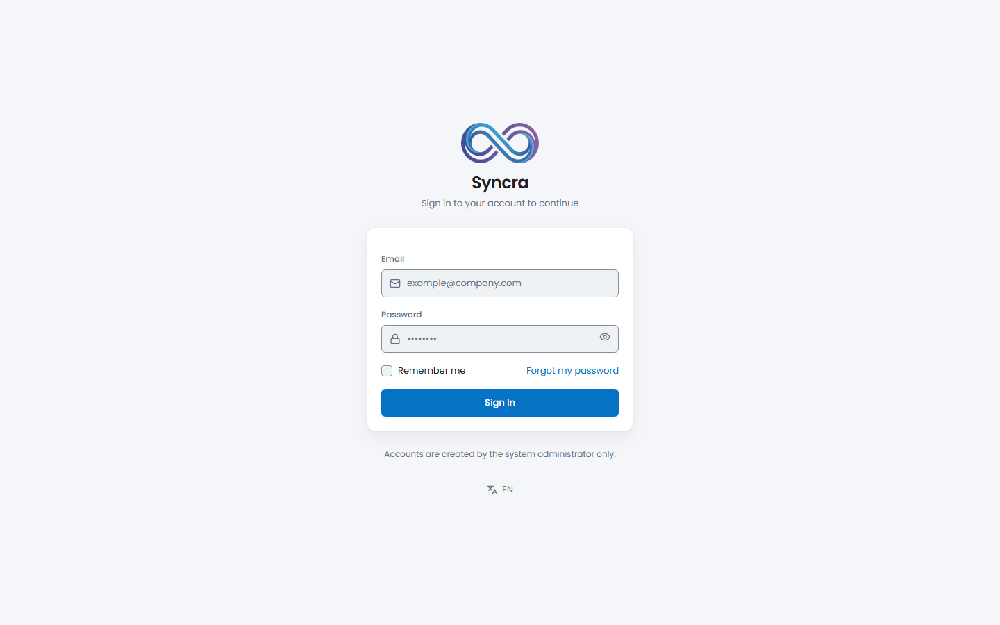
*The login screen — the system is closed-circuit, so this is also the only way in: there is no public sign-up form. Shown here from the web build; the desktop shell renders the identical screen inside the native window.*

## Running

### Desktop client

```
cd desktop
npm run dev
```

This launches the Tauri shell against the Vite dev server (port 1420, fixed — `strictPort: true`). It talks to the local API stack below, so that needs to be running too — at minimum the API and Reverb, for login and real-time updates.

The real script names, from `desktop/package.json`:

| Script | What it runs |
| --- | --- |
| `npm run dev` | `node scripts/tauri.mjs dev` — launches the Tauri shell against the Vite dev server. |
| `npm run dev:desktop` | `vite --config vite.desktop.config.ts` — the frontend dev server alone, without the Tauri shell. |
| `npm run build:desktop` | `tsc -b && vite build --config vite.desktop.config.ts` — type-checks and builds the web assets into `desktop/dist`. |
| `npm run tauri` | `node scripts/tauri.mjs` — a thin wrapper around `@tauri-apps/cli` that also injects a build-time CSP read from `frontend/.env`. |
| `npm test` | `vitest run` — the desktop workspace's unit tests (wire-fixture composer + mappers; the third consumer of `wire-fixtures/`, alongside the Rust crate and PHPUnit). |

### Local API stack

| Process | Command | Port |
| --- | --- | --- |
| API | `cd backend && php artisan serve` | 8000 |
| WebSocket (Reverb) | `cd backend && php artisan reverb:start` (ws://localhost:8080) | 8080 |
| Queue worker | `cd backend && php artisan queue:work` | — |
| Scheduler | `cd backend && php artisan schedule:work` | — |
| Frontend (web SPA, optional) | `cd frontend && npm run dev` | 5173 |

Alternatively, running the **`dev.bat`** file in the root directory starts the first four in one click, each in its own window — it also checks whether MySQL (port 3306) and Redis (port 6379) are already listening and starts them for you (MySQL via the XAMPP `mysqld`, Redis inside a dedicated, long-lived WSL window that must be left open).

`php artisan schedule:work` runs three scheduled commands: `logs:prune` prunes old log records every day at 03:17 (page_visit_logs after 90 days, session_logs and activity_log after 365 days), `tasks:dispatch-reminders` sends task reminders once a minute, `tickets:scan-sla` scans for tickets approaching or exceeding SLA every 5 minutes. Reminders and SLA scanning do not run unless `schedule:work` is running — this applies to the desktop client too, since reminders/SLA state reach it through the same backend.

## Verification Commands

### Desktop

Ten static checkers guard the parts a compiler can't see (five in `desktop/scripts/`, five in `frontend/scripts/`) — each cross-references two or more sources that nothing else links together:

| Command | Checks |
| --- | --- |
| `cd desktop && npm run check:commands` | Tauri command name matches across the Rust `#[tauri::command]` fn, the `invoke('...')` call sites in `desktop/src`, and the `SYNCDESKTOP.md` §6.2 contract. |
| `cd desktop && npm run check:data` | The desktop `DataSource` manifest — every contract method is actually bound to a query/mutate/http/hybrid data path, none left as `NOT_IMPLEMENTED`. |
| `cd desktop && npm run check:realtime` | The realtime bridge — web channels/events vs. the desktop `bridge/realtime.ts` map vs. the Tauri command vs. the Rust `Entity` vocabulary. |
| `cd desktop && npm run check:identifier` | `tauri.conf.json`'s `identifier` field is present and stable (it's the OS storage key for per-user data — a changed value silently loses local settings). |
| `cd desktop && npm run check:errors` | Symmetry between `desktop/src/ui/errors.ts`'s `KNOWN_ERROR_CODES` allowlist and the `errors.*` keys in `desktop.json`. |
| `cd frontend && npm run i18n:check` | Translation key-parity across tr/en/de/fr (both directions) + a static code→dictionary scan — same as the web app, `desktop` namespace included. |
| `cd frontend && npm run i18n:check-bootstrap` | i18n bootstrap/config sanity check — also asserts against `desktop/src/main.desktop.tsx`'s source text, not just the web entry. |
| `cd frontend && npm run i18n:dead-keys` | Reports dictionary keys no source file references (report-only, not a hard gate). |
| `cd frontend && npm run i18n:notifications` | Cross-checks `backend/lang/*/notifications.php` against `frontend/src/i18n/locales/*/notifications.json` for drift. |
| `cd frontend && npm run test:money-currency` | Currency symbol/formatting regression check, shared with the web app. |

```
cd desktop
npm test                                             # vitest — wire-fixture composer + mappers
npm run build:desktop                                # tsc -b && vite build — typechecks + builds desktop/dist
cargo test --workspace                                # crates/syncra-sync + src-tauri
cargo clippy --workspace --all-targets -- -D warnings
```

⚠️ **`tsconfig.app.json` trap:** a bare `tsc --noEmit` against a solution-style config silently checks nothing. `desktop/tsconfig.json` extends `frontend/tsconfig.app.json` directly for this reason — `npm run build:desktop` (`tsc -b`) is the correct way to typecheck the desktop entry; the same rule applies to `frontend`'s own `npx tsc -p tsconfig.app.json --noEmit` below.

### Full regression gate (backend + frontend)

The commands below are the project's standing regression gate — required green before any change to `backend/`, `frontend/`, or `desktop/` (since the desktop build type-checks against `frontend/src`) is considered complete. Current status: `docs/PROGRESS.md`.

| Command | Checks | Result |
| --- | --- | --- |
| `cd backend && php artisan test` | Full backend test suite (feature + unit) | **1316 tests / 9695 assertions (2026-08-25)**, run alone against the canonical `syncra_crm_test` database |
| `cd frontend && npx tsc -p tsconfig.app.json --noEmit` | Frontend TypeScript type check | ⚠️ **Do not run bare `npx tsc --noEmit`** from the repo root — the root `tsconfig.json` is solution-style (only `references`, no files of its own) and the command silently exits 0 without checking a single file. Always pass `-p tsconfig.app.json`. |
| `cd frontend && npm run i18n:check` | Translation key-parity across tr/en/de/fr (both directions) + a static code→dictionary scan | Green in both directions |
| `cd frontend && npm run i18n:check-bootstrap` | i18n bootstrap/config sanity check | Green |
| `cd frontend && npm run test:money-currency` | Currency symbol/formatting regression check (`money.ts`, `currencyDisplay: 'narrowSymbol'`) | 16/16 |

## Packaging

```
cd desktop
npm run tauri -- build
```

`desktop/src-tauri/tauri.conf.json` sets `bundle.targets` to `"all"`, i.e. it asks Tauri for every bundle format available for the host OS rather than naming specific ones. This repository has not run a packaged build yet — a parallel workstream is exercising it for the first time as this section is being written — so no artifact list or size is claimed here; see `docs/PROGRESS.md` for current status once that lands.

## Architecture (brief)

| Path | What it is |
| --- | --- |
| `desktop/src-tauri` | The Rust shell — Tauri 2 app (`main.rs`, `lib.rs`, `commands/`, tray, deep link, clipboard, quick-capture window). |
| `desktop/crates/syncra-sync` | The sync engine as a UI-independent Rust lib crate: local SQLCipher-encrypted SQLite mirror, outbox, conflict store, pull/push protocol. |
| `desktop/src` | Desktop-only TypeScript: the Tauri entry point (`main.desktop.tsx`), the realtime/command bridge, and the desktop `platform` adapter. |
| `frontend/src` | The same React UI the web app ships, **reused as-is** — no desktop fork of the component tree. |

The two apps share `frontend/src` but the alias that connects them is one-directional: `desktop/vite.desktop.config.ts` and `desktop/tsconfig.json` both point `@` at `../frontend/src`, while `frontend/src` itself contains zero `@`-aliased imports and is unaware the desktop build exists.

## Desktop Sync API (device token + delta sync)

Binding contract: `docs/DESKTOP-SYNC-PROTOCOL.md`. The desktop client authenticates with a **bearer token**, not the SPA session cookie. The SPA's own `/broadcasting/auth` is unchanged; the desktop client uses the second registration at `/api/broadcasting/auth`.

| Method + Path | What it does | Required permission | Note |
| --- | --- | --- | --- |
| `POST /api/auth/device` | Issues a device token (`desktop` ability, no expiry) | **Public** — no auth chain | Same keyed lockout as `throttle:login` (email+IP, 5/min, escalating 1→60 min). One token per `device_fingerprint`; the previous one is deleted. Errors: `401 INVALID_CREDENTIALS`, `403 USER_INACTIVE`, `423 LOCKED_OUT` |
| `GET /api/me/devices` | Lists the caller's own devices | no permission required | Inside the `password.changed` group — a user who must change their password cannot manage devices |
| `DELETE /api/me/devices/{token}` | Revokes one of the caller's own tokens | no permission required | `404` for anyone else's token |
| `GET /api/sync/manifest` | Protocol version, permitted tables, effective permissions, policy limits | `desktop` ability + device token | `throttle:30,1,sync`. A module without `.view` permission is absent from `tables` — the key itself is not sent |
| `POST /api/sync/pull` | Keyset delta by `sync_version`, plus tombstones | `desktop` ability + device token | `throttle:30,1,sync`. Response is truncated at 5 MB with `has_more=true`; `next_cursor` stops at the last row actually sent |
| `POST /api/sync/push` | Applies a mutation batch through the existing Action/Service/Policy layer | `desktop` ability + device token | `throttle:20,1,sync-push`; batch ≤ 200 mutations, ≤ 2 MB. Partial `200` is legal: a `seq` missing from `results` stays queued on the client |
| `GET\|POST /api/broadcasting/auth` | Channel authorization over bearer | — | Second registration; the SPA's `/broadcasting/auth` is untouched |

Sync route chain: `auth:sanctum` + `active` + `password.changed` + `ability:desktop` + `device.token`. The last one is not redundant: Sanctum hands every cookie session a `TransientToken` whose `can()` returns `true` unconditionally, so `ability:desktop` alone would **not** keep an SPA session out.

New error codes: `ONLINE_ONLY`, `UNRESOLVED_REFERENCE`, `FIELD_CONFLICT`, `RECORD_DELETED`, `PROTOCOL_VERSION_MISMATCH`, `PUSH_BATCH_TOO_LARGE`, `INVALID_MUTATION`, `ABILITY_REQUIRED`, `LOCKED_OUT`, `USER_INACTIVE`.

## Default Accounts

| Email | Password | Role |
| --- | --- | --- |
| `admin@syncra.local` | `SyncraAdmin!2026` | Super Admin |

> **Warning:** This is for local development only. The account comes with `must_change_password=true`; the password change screen is mandatory on first login (in both the web app and the desktop client), and no module can be accessed until the password is changed. The seeder password must always be changed in production.

The system is closed-circuit: there is no public registration, only a Super Admin can create new accounts. Logging into the desktop client for the first time also registers a device token for it (`POST /api/auth/device`) — see [Desktop Sync API](#desktop-sync-api-device-token--delta-sync) above.

## Security Note

`.env` files must never be committed to the repository; `.env.example` files are kept complete. The system is closed-circuit — there is no public registration, user accounts are only created by a Super Admin.

Desktop-specific: the local mirror database is encrypted with SQLCipher, and both the device token and the SQLCipher key are stored in the OS keychain via `keyring`, never as a plaintext file (K9). Clipboard capture is opt-in and off by default, and the underlying OS clipboard-read permission isn't granted to the webview unless the feature is turned on (K10). See `docs/DESKTOP-THREAT-MODEL.md` for the full STRIDE threat model of the desktop client and sync API surface.

## Documentation

The documents below are internal engineering references and are kept **in Turkish** — only this README and its Turkish counterpart (`README.tr.md`) are bilingual.

| Document | What it covers |
| --- | --- |
| [SYNCDESKTOP.md](SYNCDESKTOP.md) | The binding desktop engineering specification — decisions, phases, operating rules. |
| [docs/DESKTOP-ARCHITECTURE.md](docs/DESKTOP-ARCHITECTURE.md) | Repo layout, Tauri shell, and frontend adapter contract. |
| [docs/DESKTOP-SYNC-PROTOCOL.md](docs/DESKTOP-SYNC-PROTOCOL.md) | The backend sync/auth endpoint contract and the `syncra-sync` crate's conflict algorithm. |
| [docs/DESKTOP-OPEN-ITEMS.md](docs/DESKTOP-OPEN-ITEMS.md) | The open-items ledger — a decision only counts as closed once decision + code + test all check out. |
| [docs/DESKTOP-THREAT-MODEL.md](docs/DESKTOP-THREAT-MODEL.md) | The STRIDE threat model for the desktop client and sync API surface. |
| [docs/DESKTOP-OFFLINE-TEST.md](docs/DESKTOP-OFFLINE-TEST.md) | The F4 offline acceptance scenario — network cut, a batch of local mutations, network restored, and the consistency checks that must hold. |
| [docs/PROGRESS.md](docs/PROGRESS.md) | Live progress log and verified environment status — read at the start of every work session. |

`docs/` also carries the complete backend/frontend engineering doc set this repo inherited from its web-project history (database schema, auth flows, quote financials, SLA design, design system, and more) — listed in full in the [Appendix](#appendix-the-web-application-this-desktop-shell-wraps) below, since their canonical home is the web project's own repository.

## Appendix: The Web Application This Desktop Shell Wraps

This repository's `backend/` and `frontend/` are the same Laravel + React application the desktop client syncs against and reuses the UI of — they're carried here because this client needs a local instance of both to develop against, not because this is where they're documented. Their canonical home, with this material kept current, is the web project's own repository (`ayberkaarda/Syncra-CRM`). What follows is a reference copy: the full CRM feature tour, the backend/frontend technology stack, the complete API reference, and the ER diagrams.

### The full CRM feature set

The full module-by-module tour, reproduced from the web project's own README (screenshots included) since this repo builds and runs that application too.

### Leads, Contacts & Companies
Lead capture with duplicate detection (by email/phone/name), one-way conversion into a contact + company + optional deal, and bulk CSV import (synchronous under 500 rows, queued above that, UTF-8 BOM template for Turkish characters). Contacts and companies share a single address book with a unified activity/task/deal/ticket timeline per record.

### Deals & Pipeline
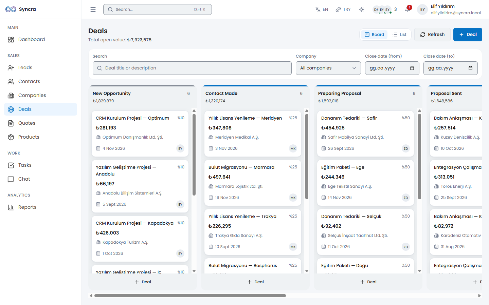
*The Kanban board: drag-and-drop between pipeline stages with optimistic-locking conflict detection — if someone else moved the card first, it snaps back with a live warning instead of silently overwriting.*

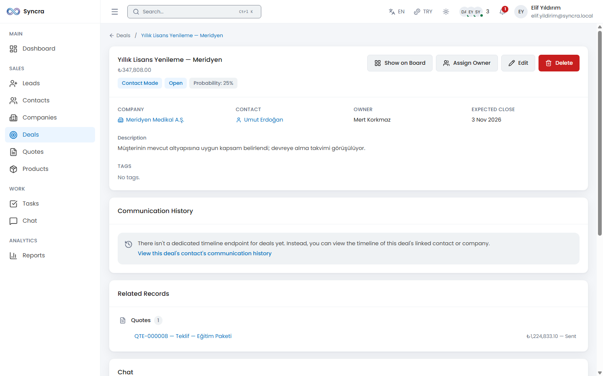
*Deal detail: linked contact/company, quotes, tasks and activity timeline in one view. Each deal carries its own currency; on close, the TRY-equivalent amount is frozen (`base_amount`/`base_rate`) so historical revenue reports never silently reprice.*

### Products, Price Lists & Quotes
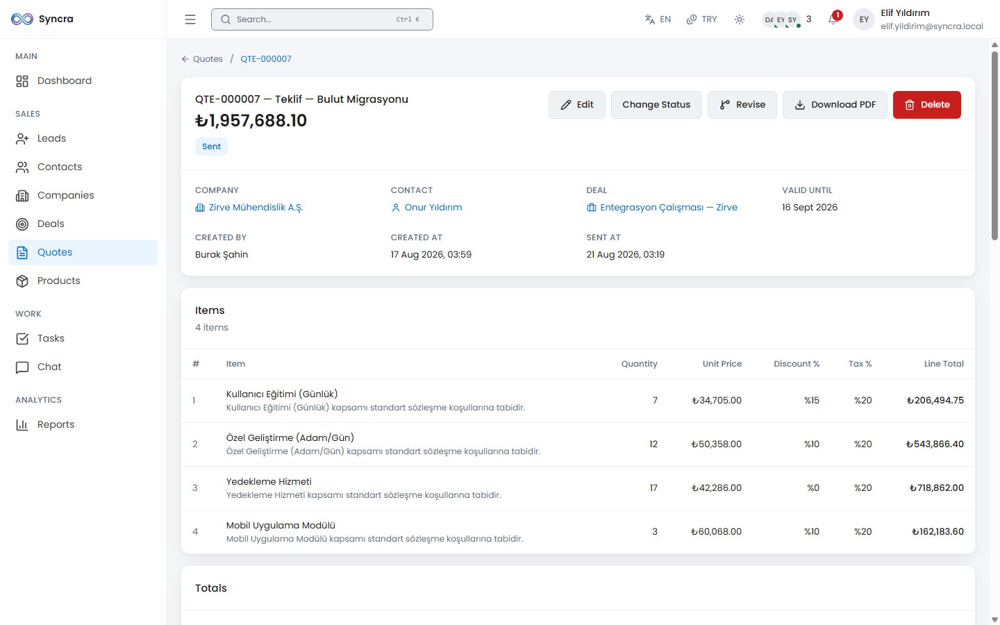
*Quote detail: multi-line items resolved from a product or a specific price list, VAT calculated on the post-discount tax base (Turkish VAT Law art. 25/a), and a print-ready PDF (DejaVu Sans, correct Turkish characters and ₺). Once a quote is sent, amount-affecting fields lock — a "Create Revision" produces a new, editable document with a fresh exchange rate.*

### Tasks & Tickets
Task calendar view with reminders (dispatched every minute via the scheduler), and a support-ticket module with an SLA countdown per ticket, a guarded status state machine, and per-ticket internal notes.

### Reports & Live Dashboard
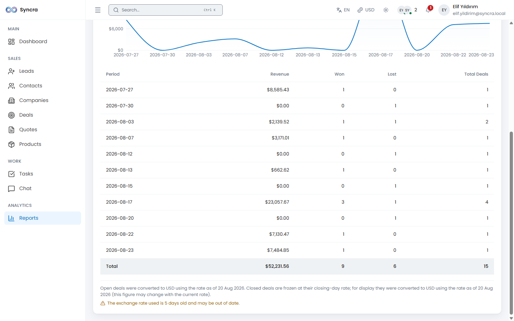
*Sales performance, per-user performance, lead-source analysis and conversion-rate reports, all date-filterable and exportable to CSV/XLSX. Open deals are summed by their current exchange rate (grouped by currency); closed deals use their frozen TRY amount — the dashboard KPIs update live over Reverb.*

### Chat
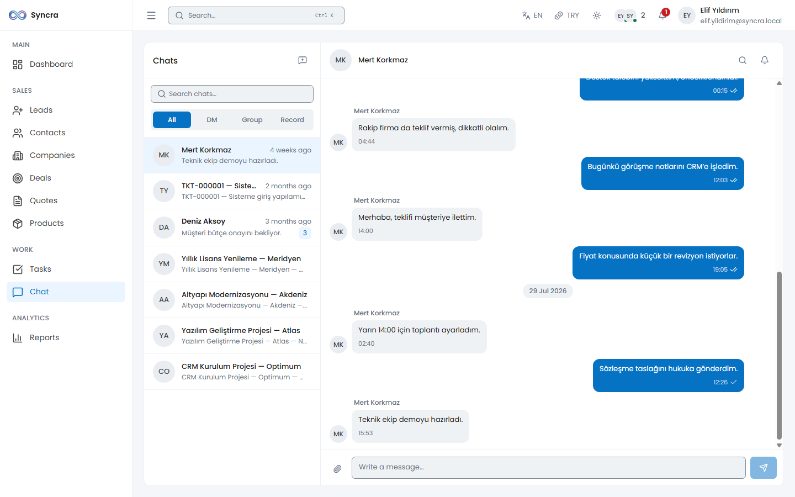
*Direct messages, group conversations, and conversations bound to a specific deal/ticket record. Delivered/read double-tick status, @mentions, file attachments, message search, and edit/delete on your own messages.*

### Command Palette & Global Search
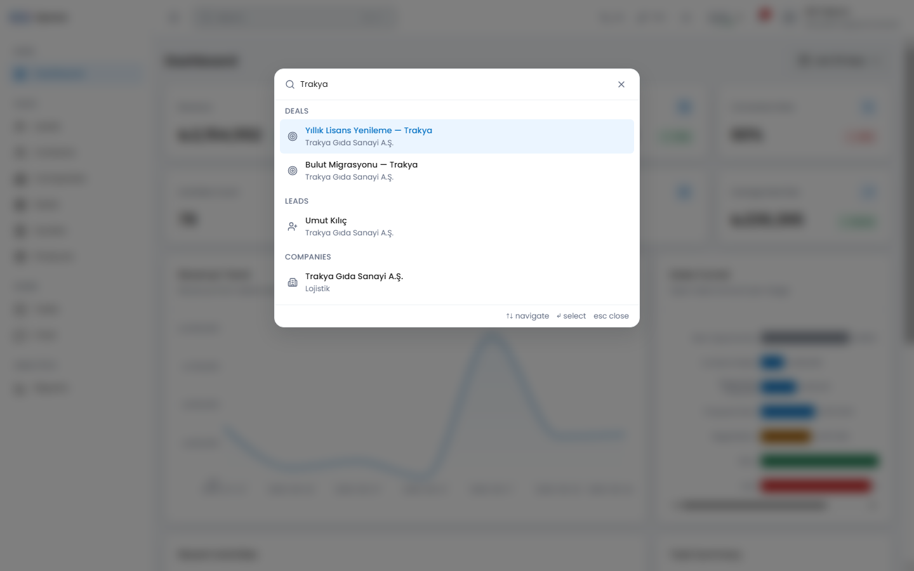
*A `Ctrl/Cmd+K` command palette searching across deals, leads, contacts, companies, quotes, tickets and users — each module's results only appear if the caller holds that module's view permission, so an unauthorized module never even shows its section header.*

Two more Phase 14 additions build on this: **saved views** (per-module, own or shared, filter presets across 9 modules) and a **related-records panel** on record detail pages, plus **automation rules** — a fixed catalog of triggers/actions (no arbitrary code), re-validated for permission both when the rule is saved and every time it runs.

### Settings & Administration
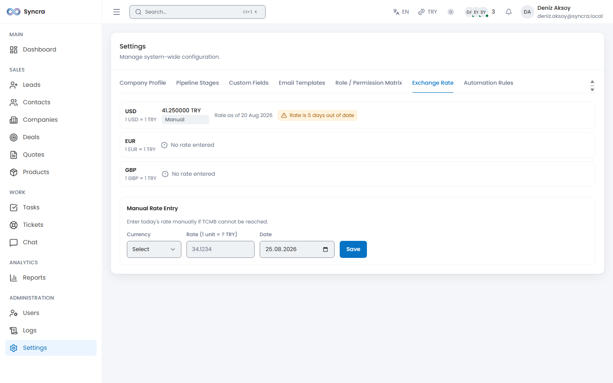
*Pipeline-stage editor (deactivating a stage forces its open cards to a replacement stage), custom-field definitions per entity, the full role × permission matrix, email templates, and — new in Phase 14 — manual exchange-rate entry and automation-rule management.*

### Logs & Audit Trail
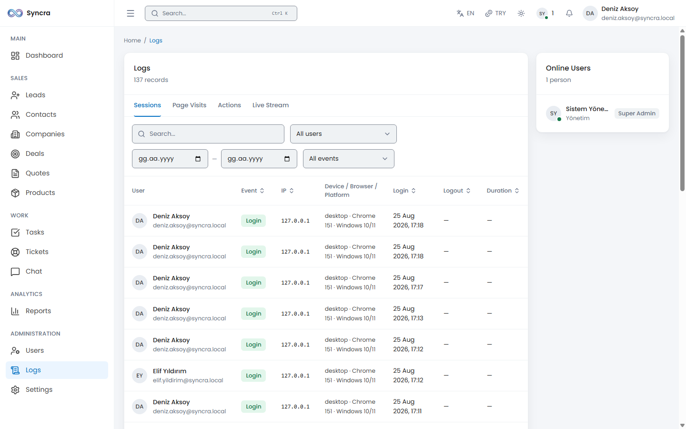
*Session logs (login/logout/failed attempts/lockouts), page-visit tracking (heartbeat-based duration), and a full audit trail (before/after diff on every tracked model change), each independently filterable and exportable as CSV/XLSX (capped at 50,000 rows per export).*

### Internationalization & Multi-Currency (Phase 14)
The UI is fully navigable in **Turkish, English, German and French** (react-i18next, ~2,089 keys across 27 namespaces on the frontend, matching `lang/{tr,en,de,fr}` files on the backend), with an automated key-parity checker in both directions. Money amounts carry their own currency independent of the UI language (TRY/USD/EUR/GBP); the daily TRY rate is fetched from the Central Bank of Türkiye (TCMB) with XXE-safe XML parsing and hardened outbound-call settings, with a manual fallback in Settings and a staleness warning after 4 days.

### Security
A dedicated red-team security pass (Phase 13) hardened session/CSRF handling, added security headers/CSP, sanitized rich-text input, closed CSV-formula-injection and mass-assignment gaps, and added rate limiting to sensitive endpoints (login, password change, heavy exports, search). Authorization is fully role/permission-based (`spatie/laravel-permission`); several endpoints add horizontal ownership checks (IDOR protection) on top — e.g. a page-visit heartbeat can only be updated by its own owner, and a chat attachment resolves 404 (never 403) to avoid leaking whether a record exists.

### Technology Stack (backend & frontend)

| Layer | Technology | Version / Note |
| --- | --- | --- |
| Backend | Laravel | 12.67.0 |
| Backend | Laravel Sanctum | Authentication (SPA cookie-based) |
| Backend | spatie/laravel-permission | Role and permission management |
| Backend | Laravel Reverb | ^1.11 — WebSocket server |
| Backend | PHP | 8.2.12 |
| Frontend | React | 18.3.1 |
| Frontend | Vite | Build/dev server |
| Frontend | React Router | ^7.18 — client-side routing |
| Frontend | TanStack Query | ^5.102 — server state management / data fetching |
| Frontend | Zustand | ^5.0 — client state management |
| Frontend | Tailwind CSS | 4.3.3 |
| Frontend | i18next + react-i18next | ^26.4 / ^17.0 — 4-language UI (tr/en/de/fr) |
| Frontend | Recharts | ^3.10 — dashboard and report charts |
| Database | MySQL / MariaDB | 10.4.32 (MariaDB), database name: `syncra_crm` |
| Realtime | Laravel Reverb + Laravel Echo | WebSocket server and client library |
| Queue / Cache | Redis | 8.0.5 (on WSL2) via `predis/predis` |
| Tooling | Node.js | 26.7.0 |
| Logging | spatie/laravel-activitylog ^4.12 + maatwebsite/excel ^3.1 | audit trail, CSV/XLSX export |
| Drag-and-drop | @dnd-kit/core ^6.3 + sortable ^10 | Kanban board, with keyboard accessibility |
| PDF | barryvdh/laravel-dompdf ^3.1 | quote output, DejaVu Sans (Turkish + ₺), font subsetting enabled |
| Sanitization | ezyang/htmlpurifier ^4.19 | rich-text/note input sanitization |

> **Note:** The project originally targeted Laravel 11. Because Laravel 11.x has unpatched security vulnerabilities (including CVE-2026-48019) with no fix on the 11.x line, the project migrated to Laravel 12. See details in the `docs/PROGRESS.md` decision log.

### API Endpoint List (backend & frontend)

**Authentication flow (Sanctum SPA):** The client first calls `GET /sanctum/csrf-cookie` (obtains the CSRF cookie), then calls `POST /api/login` with the `X-XSRF-TOKEN` header; the session is carried by an HttpOnly session cookie, no API token is ever issued. An unauthenticated request gets `401`; a missing/stale CSRF cookie gets `419`. For forced password change, deactivated-user rejection, and lockout/rate-limit details, the binding contract is `docs/AUTH-FLOWS.md`.

Every endpoint below (unless noted otherwise) passes through the `auth:sanctum` + `EnsureUserIsActive` (`active`) + `EnsurePasswordIsChanged` (`password.changed`) middleware chain. The **Permission** column shows the extra authorization check layered ON TOP of those three; "no permission required" means authentication alone is sufficient.

#### Authentication

| Method + Path | What it does | Required permission | Note |
| --- | --- | --- | --- |
| `POST /api/login` | Logs in with email/password, starts a session. | No permission (public — doesn't even require `auth:sanctum`). | `throttle:login` — 5 attempts/min keyed by email+IP hash, increasing lockout (1→2→4→8→16→32→60 min). |
| `POST /api/password/forgot` | Closed-circuit "forgot password" — always returns 202 regardless of whether the account exists; the actual reset requires admin approval. | No permission (public). | `throttle:6,1`. |
| `POST /api/logout` | Ends the active session. | No permission (authentication only, `active` included — `password.changed` is EXEMPT, whitelisted). | — |
| `GET /api/me` | Returns the logged-in user's own profile + roles/permissions. | No permission (authentication only — `password.changed` EXEMPT). | — |
| `POST /api/password/change` | The user changes their own password (current password required). | No permission (authentication only — `password.changed` EXEMPT, it IS the flow itself). | `throttle:6,1` — mandatory so `current_password` can't become a password oracle. |
| `PATCH /api/me/preferences` | Updates the user's own UI language (`locale`) and preferred currency (`preferred_currency`). | **No permission** (deliberate — a personal preference, not an admin capability). | Phase 14. |

#### Users & Roles

| Method + Path | What it does | Required permission | Note |
| --- | --- | --- | --- |
| `GET /api/users` | Lists users, paginated/filtered. | `users.view` | — |
| `POST /api/users` | Creates a new user (closed-circuit — only an admin can open one). | `users.create` | — |
| `GET /api/users/{user}` | Single user detail. | `users.view` | — |
| `PATCH /api/users/{user}` | Updates user fields. | `users.update` + if the target is a Super Admin, additionally `users.manage_roles` | — |
| `DELETE /api/users/{user}` | Deletes the user (soft delete). | `users.delete` + cannot be your own account + the last active Super Admin is protected | — |
| `PATCH /api/users/{user}/active` | Activates/deactivates a user (deactivation triggers instant session revoke). | `users.toggle_active` + cannot be your own account + the last active Super Admin is protected | — |
| `POST /api/users/{user}/reset-password` | Admin-approved password reset. | `users.reset_password` | — |
| `GET /api/roles` | Returns the role list (with permissions) — feeds the role picker in the user form. | `roles.view` OR `users.manage_roles` | — |

#### Realtime & Presence

| Method + Path | What it does | Required permission | Note |
| --- | --- | --- | --- |
| `GET /api/presence/online` | Returns the roster of currently online users (first-paint/polling fallback for the WebSocket). | No permission (authentication only — knowing a colleague is online is already visible to anyone subscribed to `presence-online`). | — |
| `GET/POST/HEAD /broadcasting/auth` | Authorizes Laravel Echo's private/presence channel subscriptions (per-channel rules live in `routes/channels.php`). | Varies per channel — see `routes/channels.php` (`private-user.{id}`, `presence-online`, `presence-record.{type}.{id}`, `private-conversation.{id}`, `private-logs`, `private-dashboard`, `private-deals`, `private-tickets`). | On the `web` middleware group (not `api`); `password.changed` is deliberately NOT applied — opening a socket is allowed even though reading "other people's data" (like `/presence/online`) is not. |
| `GET/HEAD /sanctum/csrf-cookie` | Issues the CSRF cookie (`XSRF-TOKEN`) — the first step of the SPA flow. | No permission (public). | Registered by Sanctum's own service provider; not redeclared in `routes/api.php`. |

#### Logs

| Method + Path | What it does | Required permission | Note |
| --- | --- | --- | --- |
| `GET /api/logs/sessions` | Lists session logs (login/logout/failed_login/locked_out). | `logs.view` | — |
| `GET /api/logs/page-visits` | Lists page-visit logs. | `logs.view` | — |
| `GET /api/logs/activities` | Lists audit trail (activity_log) entries. | `logs.view` | — |
| `GET /api/logs/export` | Exports log records as CSV/XLSX. | `logs.export` | `throttle:10,1,heavy-export` (budget SHARED with `/reports/export`). |

#### Page Visits

| Method + Path | What it does | Required permission | Note |
| --- | --- | --- | --- |
| `POST /api/page-visits` | Opens a new page-visit record (on route change). | No permission (authentication only — everyone records their own visit). | — |
| `PATCH /api/page-visits/{pageVisit}/heartbeat` | Updates the duration of an existing visit (every 30s), does NOT open a new row. | No permission, but has IDOR protection: only the owner of the visit can heartbeat it (`HeartbeatRequest::authorize()`); anyone else gets 403. | — |

#### Leads

| Method + Path | What it does | Required permission | Note |
| --- | --- | --- | --- |
| `GET /api/leads` | Lists leads, paginated/filtered/searchable. | `leads.view` | — |
| `POST /api/leads` | Creates a new lead. | `leads.create` | — |
| `POST /api/leads/check-duplicates` | Searches for possible duplicate lead/contact candidates from the given input (before saving). | `leads.create` | — |
| `POST /api/leads/import` | Bulk CSV import (synchronous under 500 rows, queued above that). | `leads.import` | `throttle:5,1,leads-import`. |
| `GET /api/leads/import/template` | Downloads a sample CSV template for import. | `leads.import` | — |
| `GET /api/leads/import/{batch}` | Queries the status of a queued import job. | `leads.import` | — |
| `GET /api/leads/{lead}` | Single lead detail. | `leads.view` | — |
| `PATCH /api/leads/{lead}` | Updates a lead. | `leads.update` + horizontal boundary: owner/unowned/manager holding `leads.assign` + a converted lead cannot be updated | — |
| `DELETE /api/leads/{lead}` | Deletes a lead (soft delete). | `leads.delete` + a converted lead cannot be deleted | — |
| `POST /api/leads/{lead}/convert` | Converts a lead into a contact + (optionally) a company + (optionally) a deal — one-way, irreversible. | `leads.convert` + horizontal boundary (owner/unowned/`leads.assign`) | — |
| `PATCH /api/leads/{lead}/assign` | Reassigns the lead's owner. | `leads.assign` | — |

#### Contacts

| Method + Path | What it does | Required permission | Note |
| --- | --- | --- | --- |
| `GET /api/contacts` | Lists contacts, paginated/filtered/searchable. | `contacts.view` | — |
| `POST /api/contacts` | Creates a new contact. | `contacts.create` | — |
| `GET /api/contacts/{contact}` | Single contact detail. | `contacts.view` | — |
| `PATCH /api/contacts/{contact}` | Updates a contact. | `contacts.update` (NO horizontal write isolation — shared address book, see the `ContactPolicy` docblock) | — |
| `DELETE /api/contacts/{contact}` | Deletes a contact; 422 if it has an open deal. | `contacts.delete` | — |
| `GET /api/contacts/{contact}/timeline` | Returns a merged timeline of the contact's activities/tasks/deals/tickets/attachments. | `contacts.view` (visible sub-sections are further filtered by each module's own `.view` permission) | — |

#### Companies

| Method + Path | What it does | Required permission | Note |
| --- | --- | --- | --- |
| `GET /api/companies` | Lists companies, paginated/filtered/searchable. | `companies.view` | — |
| `POST /api/companies` | Creates a new company. | `companies.create` | — |
| `GET /api/companies/{company}` | Single company detail. | `companies.view` | — |
| `PATCH /api/companies/{company}` | Updates a company. | `companies.update` (NO horizontal write isolation — shared address book) | — |
| `DELETE /api/companies/{company}` | Deletes a company; 422 if it has an open deal. | `companies.delete` | — |
| `GET /api/companies/{company}/timeline` | Merged timeline of deals/quotes/tickets etc. tied to the company. | `companies.view` (sub-sections filtered by each module's own `.view` permission) | — |

#### Tags & Custom Fields

| Method + Path | What it does | Required permission | Note |
| --- | --- | --- | --- |
| `GET /api/tags` | Lists all tags (shared, small lookup data). | No permission (any authenticated user). | — |
| `POST /api/tags` | Creates a new tag (only from the lead/contact/company form). | `leads.create` OR `contacts.create` OR `companies.create` | — |
| `GET /api/custom-fields` | Returns the ACTIVE custom-field definitions for an `entity_type` (form schema). | No permission (authentication only — the real protection lives in each module's own `.view` permission). | `entity_type` query parameter is required. |

#### Deals & Pipeline

| Method + Path | What it does | Required permission | Note |
| --- | --- | --- | --- |
| `GET /api/deals` | Lists deals, paginated/filtered; `meta.totals` sums the ENTIRE filtered set. | `deals.view` | — |
| `GET /api/deals/board` | Returns Kanban board data (cards per stage). | `deals.view` | Default 50 cards per stage (max 200 via `?per_stage=`). |
| `POST /api/deals` | Creates a new deal. | `deals.create` | — |
| `GET /api/deals/{deal}` | Single deal detail. | `deals.view` | — |
| `PATCH /api/deals/{deal}` | Updates a deal (stage/position/version/status do NOT change from this endpoint). | `deals.update` + horizontal boundary (owner/unowned/`deals.assign`) | `pipeline_stage_id`/`position`/`version`/`status` are rejected (422). |
| `DELETE /api/deals/{deal}` | Deletes a deal; a won/lost deal cannot be deleted. | `deals.delete` | — |
| `PATCH /api/deals/{deal}/move` | Moves a card on the Kanban board — position is server-generated, optimistic locking (`version`). | `deals.move` + horizontal boundary (owner/unowned/`deals.assign`) | Stale `version` → 409 `DEAL_VERSION_CONFLICT` + the card's current state. |
| `PATCH /api/deals/{deal}/assign` | Reassigns the deal's owner. | `deals.assign` | — |
| `GET /api/pipeline-stages` | Kanban column list (active only, by default). | `deals.view` (no dedicated policy — delegates to Deal) | — |

#### Tasks

| Method + Path | What it does | Required permission | Note |
| --- | --- | --- | --- |
| `GET /api/tasks` | Lists tasks, paginated/filtered. | `tasks.view` | — |
| `GET /api/tasks/calendar` | Returns tasks within a date range for the calendar view. | `tasks.view` | `?from`/`?to` required, max 90 days, no pagination. |
| `POST /api/tasks` | Creates a new task. | `tasks.create` | — |
| `GET /api/tasks/{task}` | Single task detail. | `tasks.view` | — |
| `PATCH /api/tasks/{task}` | Updates a task. | `tasks.update` + horizontal boundary (`assigned_to` owner/unowned/`tasks.assign`) | — |
| `DELETE /api/tasks/{task}` | Deletes a task. | `tasks.delete` | — |
| `PATCH /api/tasks/{task}/complete` | Marks a task complete (idempotent). | `tasks.update` + horizontal boundary (assignee/unowned/`tasks.assign`) | — |
| `PATCH /api/tasks/{task}/assign` | Reassigns the task to another user. | `tasks.assign` | — |

#### Tickets

| Method + Path | What it does | Required permission | Note |
| --- | --- | --- | --- |
| `GET /api/tickets` | Lists tickets, paginated/filtered. | `tickets.view` | — |
| `GET /api/tickets/stats` | Returns ticket statistics (including derived SLA breach status). | `tickets.view` | — |
| `POST /api/tickets` | Opens a new ticket. | `tickets.create` | — |
| `GET /api/tickets/{ticket}` | Single ticket detail. | `tickets.view` | — |
| `PATCH /api/tickets/{ticket}` | Updates a ticket. | `tickets.update` + horizontal boundary (`assigned_to` owner/unowned/`tickets.assign`) | — |
| `DELETE /api/tickets/{ticket}` | Deletes a ticket; a resolved/closed ticket cannot be deleted. | `tickets.delete` | — |
| `PATCH /api/tickets/{ticket}/status` | Changes ticket status through the state machine. | `tickets.update` (SAME policy method — no separate permission) + horizontal boundary | Invalid transition → 422 `INVALID_STATUS_TRANSITION`. |
| `PATCH /api/tickets/{ticket}/assign` | Reassigns the ticket to another user. | `tickets.assign` | — |

#### Activities

| Method + Path | What it does | Required permission | Note |
| --- | --- | --- | --- |
| `GET /api/activities` | Lists activities (call/meeting/email/note), paginated/filtered. | `activities.view` | Internal ticket notes also live here as `type='note'`. |
| `POST /api/activities` | Adds a new activity record. | `activities.create` | — |
| `GET /api/activities/{activity}` | Single activity detail. | `activities.view` | — |
| `PATCH /api/activities/{activity}` | Updates an activity. | `activities.update` + (the author OR a manager holding `activities.delete`); if the author was deleted, manager only | — |
| `DELETE /api/activities/{activity}` | Deletes an activity. | (The author) OR `activities.delete` | — |

#### Products & Price Lists

| Method + Path | What it does | Required permission | Note |
| --- | --- | --- | --- |
| `GET /api/products` | Lists products, paginated/filtered. | `products.view` | — |
| `GET /api/products/categories` | Returns the list of existing product categories. | `products.view` | — |
| `POST /api/products` | Creates a new product. | `products.create` | — |
| `GET /api/products/{product}` | Single product detail. | `products.view` | — |
| `PATCH /api/products/{product}` | Updates a product. | `products.update` | — |
| `DELETE /api/products/{product}` | Deletes a product. | `products.delete` | — |
| `GET /api/products/{product}/price` | Returns the product's price (optionally within a specific price list). | `products.view` | — |
| `GET /api/price-lists` | Lists price lists. | `products.view` (no separate `price-lists.*` permission — an extension of the catalog) | — |
| `POST /api/price-lists` | Creates a new price list. | `products.create` | — |
| `GET /api/price-lists/{priceList}` | Single price list detail. | `products.view` | — |
| `PATCH /api/price-lists/{priceList}` | Updates a price list. | `products.update` | — |
| `DELETE /api/price-lists/{priceList}` | Deletes a price list (soft delete; its items are PRESERVED). | `products.delete` | — |
| `GET /api/price-lists/{priceList}/products` | Returns the product prices within the list. | `products.view` | — |
| `PUT /api/price-lists/{priceList}/products/{product}` | Sets/updates a custom price for a product in the list. | `products.update` | — |
| `DELETE /api/price-lists/{priceList}/products/{product}` | Removes a product's custom price from the list. | `products.update` | — |

#### Quotes

| Method + Path | What it does | Required permission | Note |
| --- | --- | --- | --- |
| `GET /api/quotes` | Lists quotes, paginated/filtered. | `quotes.view` | — |
| `POST /api/quotes` | Creates a new quote. | `quotes.create` | — |
| `POST /api/quotes/calculate` | Computes a live total/tax/discount preview without saving. | `quotes.create` OR `quotes.update` (a plain permission check, not a policy method) | — |
| `GET /api/quotes/{quote}` | Single quote detail. | `quotes.view` | — |
| `PATCH /api/quotes/{quote}` | Updates a quote. | `quotes.update` (NO horizontal boundary — this endpoint is already manager-level) | Amount-affecting fields lock after `sent` (422 `QUOTE_LOCKED`). |
| `DELETE /api/quotes/{quote}` | Deletes a quote; an accepted/rejected quote cannot be deleted. | `quotes.delete` | — |
| `POST /api/quotes/{quote}/send` | Marks the quote "sent" to the customer, locking its amounts. | `quotes.send` (SEPARATE permission from `quotes.update`) | — |
| `PATCH /api/quotes/{quote}/status` | Changes quote status (accepted/rejected/expired etc.). | `quotes.update` | — |
| `POST /api/quotes/{quote}/revise` | Produces a new revision (a new record) from an existing quote. | `quotes.create` (a revision produces a NEW document) | — |
| `GET /api/quotes/{quote}/pdf` | Downloads the quote's PDF output. | `quotes.view` | — |

#### Notifications

| Method + Path | What it does | Required permission | Note |
| --- | --- | --- | --- |
| `GET /api/notifications` | Lists the user's own notifications. | `notifications.view` | — |
| `GET /api/notifications/unread-count` | Returns the unread notification count. | `notifications.view` | — |
| `POST /api/notifications/read-all` | Marks all notifications as read. | `notifications.view` | — |
| `PATCH /api/notifications/{notification}/read` | Marks a single notification as read. | `notifications.view` | — |
| `DELETE /api/notifications/{notification}` | Deletes a notification. | `notifications.view` | — |

#### Settings

| Method + Path | What it does | Required permission | Note |
| --- | --- | --- | --- |
| `GET /api/settings` | Returns general system settings (company profile etc.). | `settings.manage` | — |
| `PATCH /api/settings` | Updates general system settings. | `settings.manage` | — |
| `GET /api/settings/pipeline-stages` | Pipeline-stage EDITOR listing (INCLUDES inactive stages). | `settings.manage` | Shares the same controller/method as `GET /api/pipeline-stages`; distinguished by route name. |
| `POST /api/settings/pipeline-stages` | Creates a new pipeline stage. | `settings.manage` | — |
| `POST /api/settings/pipeline-stages/reorder` | Reorders the stages. | `settings.manage` | — |
| `PATCH /api/settings/pipeline-stages/{stage}` | Updates/deactivates a stage. | `settings.manage` | Open cards in a deactivated stage are forced to a mandatory target stage. |
| `GET /api/settings/custom-fields` | Custom-field EDITOR listing (INCLUDES inactive fields). | `settings.manage` | Shares the same controller/method as `GET /api/custom-fields`; distinguished by route name. |
| `POST /api/settings/custom-fields` | Creates a new custom-field definition. | `settings.manage` | — |
| `PATCH /api/settings/custom-fields/{customField}` | Updates a custom-field definition. | `settings.manage` | — |
| `DELETE /api/settings/custom-fields/{customField}` | Does NOT delete the field, deactivates it (200 response, the record itself). | `settings.manage` | — |
| `GET /api/settings/email-templates` | Lists email templates (inactive included). | `settings.manage` | No actual email is SENT in this phase; storage/preview only. |
| `POST /api/settings/email-templates` | Creates a new email template. | `settings.manage` | — |
| `PATCH /api/settings/email-templates/{emailTemplate}` | Updates a template. | `settings.manage` | — |
| `DELETE /api/settings/email-templates/{emailTemplate}` | Permanently deletes a template. | `settings.manage` | — |
| `GET /api/settings/permission-matrix` | Returns the full role × permission matrix. | `settings.manage` | Reading also requires `settings.manage` (it's the system's complete authorization map). |
| `PATCH /api/settings/roles/{role}/permissions` | Replaces a role's permission set as a FULL STATE (sync). | `settings.manage` | The Super Admin role returns 422 `ROLE_NOT_EDITABLE`. |
| `GET /api/settings/exchange-rates` | Lists stored exchange rates (management screen). | `settings.manage` | Phase 14. |
| `POST /api/settings/exchange-rates` | Manually enters/corrects the rate for a currency/date. | `settings.manage` | Phase 14. The automatic TCMB fetch is a console command, not an HTTP endpoint. |
| `GET /api/settings/automation-rules` | Lists automation rules. | `settings.manage` | Phase 14. |
| `POST /api/settings/automation-rules` | Creates a new automation rule. | `settings.manage` **+** whatever permissions the chosen trigger/action require (`AutomationPermissionChecker`) | Phase 14. Two-layer check — `settings.manage` alone is not enough. |
| `PATCH /api/settings/automation-rules/{automationRule}` | Updates an automation rule. | `settings.manage` **+** `AutomationPermissionChecker` | Phase 14. |
| `DELETE /api/settings/automation-rules/{automationRule}` | Deletes an automation rule. | `settings.manage` | Phase 14. |

#### Exchange Rate (Public — Phase 14)

| Method + Path | What it does | Required permission | Note |
| --- | --- | --- | --- |
| `GET /api/exchange-rates/current` | Returns the most recent (possibly frozen/stale) rate per currency — lets a user see amounts in their own preferred currency. | **No permission** (deliberate — TCMB rates are public data; SEPARATE from, and NOT a loosening of, the `/settings/exchange-rates` management screen). | `throttle:30,1,exchange-rates-current`. |

#### Reports & Dashboard

| Method + Path | What it does | Required permission | Note |
| --- | --- | --- | --- |
| `GET /api/reports/sales-performance` | Sales performance report (date-filterable). | `reports.view` | — |
| `GET /api/reports/user-performance` | Per-user performance report. | `reports.view` | — |
| `GET /api/reports/source-analysis` | Lead source analysis report. | `reports.view` | — |
| `GET /api/reports/conversion` | Conversion rate report. | `reports.view` | — |
| `GET /api/reports/export` | Exports report data as CSV/XLSX. | `reports.export` | `throttle:10,1,heavy-export` (budget SHARED with `/logs/export`). |
| `GET /api/dashboard/kpis` | KPI cards (monthly revenue, open deals, conversion rate, activity count). | `dashboard.view` | — |
| `GET /api/dashboard/funnel` | Sales funnel data. | `dashboard.view` | — |
| `GET /api/dashboard/revenue-trend` | Revenue trend (time series). | `dashboard.view` | — |
| `GET /api/dashboard/recent-activities` | Recent activity feed. | `dashboard.view` | — |
| `GET /api/dashboard/task-summary` | Task summary. | `dashboard.view` | — |

#### Chat

| Method + Path | What it does | Required permission | Note |
| --- | --- | --- | --- |
| `GET /api/conversations` | Lists the conversations the user is a member of. | `chat.use` | — |
| `GET /api/conversations/unread-count` | Returns the total unread message count. | `chat.use` | — |
| `POST /api/conversations` | Starts a new DM or group conversation. | `chat.use` | — |
| `POST /api/conversations/for-record` | Gets/creates the conversation attached to a record (deal/ticket). | `chat.use` **+** `.view` permission on the underlying record (`RecordChatRegistry` whitelist) | — |
| `GET /api/conversations/{conversation}` | Conversation detail. | `chat.use` + membership OR (if record-bound) permission to view the record; otherwise 404 (403 is deliberately AVOIDED to prevent an IDOR/existence leak) | — |
| `PATCH /api/conversations/{conversation}` | Renames a group (group-only, creator-only). | Visibility + group + creator | — |
| `DELETE /api/conversations/{conversation}` | Archives a group conversation (group-only, creator-only; `dm`/`record` CANNOT be deleted). | Visibility + group + creator | — |
| `POST /api/conversations/{conversation}/members` | Adds a member to the group (any existing member may add). | Visibility + group + membership | — |
| `DELETE /api/conversations/{conversation}/members/{user}` | Removes a member from the group (creator-only). | Visibility + group + creator | — |
| `POST /api/conversations/{conversation}/leave` | The user leaves the group themselves (cannot leave a `dm`). | Visibility + group + membership | — |
| `PATCH /api/conversations/{conversation}/mute` | Mutes/unmutes the conversation. | Visibility + membership | — |
| `POST /api/conversations/{conversation}/read` | Marks the conversation read up to a given message (double-tick). | Visibility + membership | — |
| `POST /api/conversations/{conversation}/delivered` | Marks messages as "delivered". | Visibility + membership | — |
| `GET /api/conversations/{conversation}/messages` | Lists the conversation's messages (paginated). | Conversation visibility (`view`) | — |
| `POST /api/conversations/{conversation}/messages` | Sends a new message. | `sendMessage` (membership is not a precondition on a record conversation — the first message auto-joins) | — |
| `GET /api/messages/search` | Searches messages across conversations the user can access. | `chat.use` (`viewAny` Conversation) | — |
| `PATCH /api/messages/{message}` | Edits your own text message (NO time limit, transparent via `edited_at`). | Only the message's author + `type=text` + not deleted | — |
| `DELETE /api/messages/{message}` | Deletes a message. | The message's author OR a Super Admin (moderation is deliberately NOT tied to `settings.manage`) | — |

#### Attachments

| Method + Path | What it does | Required permission | Note |
| --- | --- | --- | --- |
| `POST /api/attachments` | Uploads a file/image (chat attachment). | `chat.use` | — |
| `GET /api/attachments/{attachment}` | Downloads/serves the attached file. | **Critical IDOR surface** — if linked to a message, only that conversation's members; otherwise only the uploader; denial returns 404, NOT 403 (to avoid an existence leak). | — |

#### Search

| Method + Path | What it does | Required permission | Note |
| --- | --- | --- | --- |
| `GET /api/search` | Global search / command palette — searches deal, lead, contact, company, quote, ticket, and user modules. | Per module: a module's results are only returned if the caller holds that module's `.view` permission (inside `GlobalSearchService`; an unauthorized module's key never appears in the result at all). | `throttle:60,1,search`. Up to 5 results per module, 35 total. |

#### Saved Views (Phase 14)

| Method + Path | What it does | Required permission | Note |
| --- | --- | --- | --- |
| `GET /api/saved-views` | Lists the user's own + shared views for the given module. | The relevant module's `.view` permission (`?module=` — one of 9 modules: deals/leads/contacts/companies/quotes/tickets/tasks/products/users) | Returns metadata only (name/filter) — actual data never comes from this endpoint. |
| `POST /api/saved-views` | Creates a new saved view. | The relevant module's `.view` permission | The same user+module cannot reuse the same name twice (422). |
| `PATCH /api/saved-views/{savedView}` | Updates a saved view. | Only the view's OWNER (`is_shared` does not change this) | — |
| `DELETE /api/saved-views/{savedView}` | Deletes a saved view. | Only the view's OWNER | — |

### ER Diagram (backend & frontend)

Okunabilirlik için şema beş mantıksal gruba bölünmüştür (40+ tablonun tek diyagramda tüm kolonlarıyla gösterilmesi okunamaz bir sonuç üretir). Her varlık kutusunda yalnızca PK, FK'lar ve tabloyu tanımlayan 3-6 kolon gösterilir — tam kolon dökümü için `docs/DATABASE.md`. Gruplar arası FK'lar (ör. `deals.company_id → companies.id`) ilgili diyagramın altında düz metinle not edilir; `USERS` yalnızca ilişki çizmek gerektiğinde diğer diyagramlarda küçültülmüş (yalnızca `id`/`email`) hâliyle tekrarlanır — tam tanımı yalnızca Diyagram A'dadır.

#### Diyagram A — Çekirdek CRM

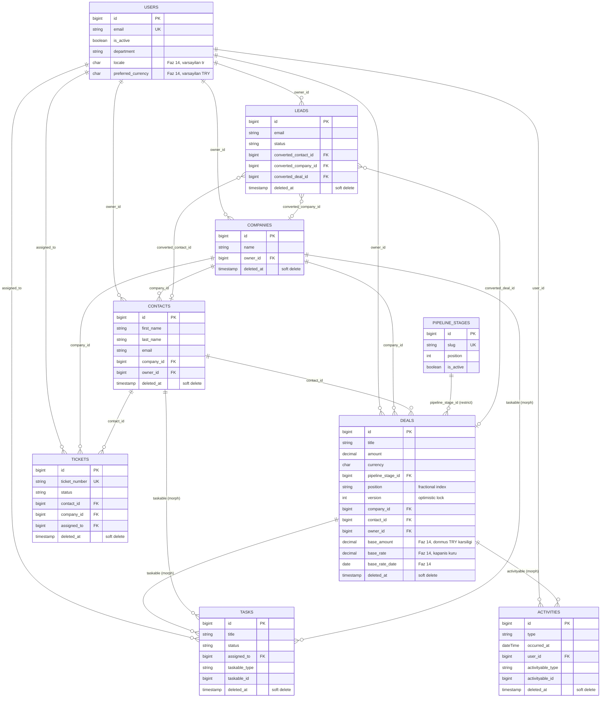

*This is the transactional core: accounts, the pipeline, and everything that hangs off a deal. `deals.base_amount/base_rate/base_rate_date` (Phase 14) freeze the TRY-equivalent value at close time so historical revenue reports never silently reprice; `users.locale`/`preferred_currency` (Phase 14) are personal, permission-free preferences.*

*Bu, işlemsel çekirdektir: hesaplar, pipeline ve bir fırsata bağlı her şey. `deals.base_amount/base_rate/base_rate_date` (Faz 14) kapanış anındaki TRY karşılığını dondurur ki geçmiş gelir raporları sessizce yeniden fiyatlanmasın; `users.locale`/`preferred_currency` (Faz 14) izin gerektirmeyen kişisel tercihlerdir.*

#### Diyagram B — Teklif / Ürün

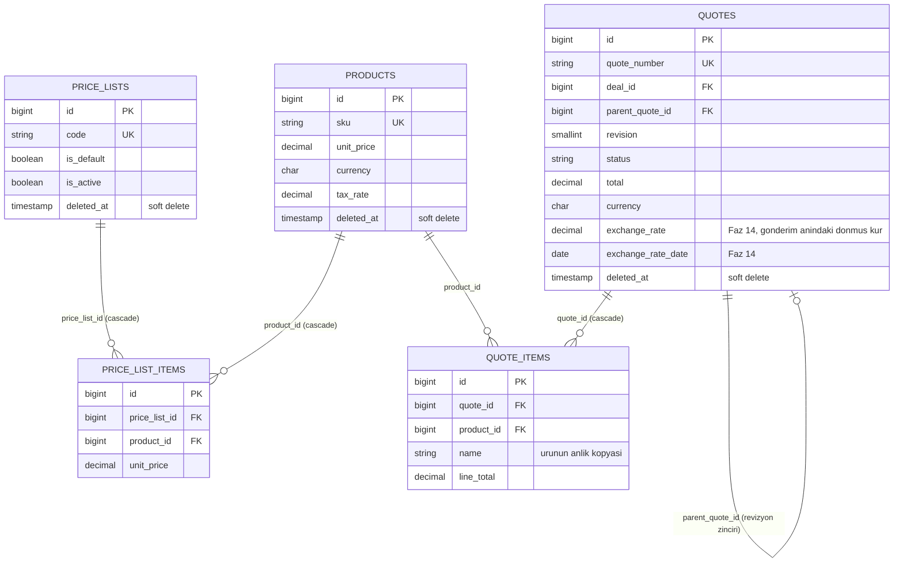

*Cross-group FKs not redrawn here: `quotes.deal_id → deals.id`, `quotes.company_id/contact_id → companies.id/contacts.id` (all in Diagram A). `quote_items.name`/`unit_price`/`tax_rate` are point-in-time snapshots of the product, not live references — a later price or catalog change never rewrites a quote already issued. `quotes.exchange_rate/exchange_rate_date` (Phase 14) freeze the rate at `sent` time for the same reason; they stay `null` for drafts.*

*Burada yeniden çizilmeyen gruplar-arası FK'lar: `quotes.deal_id → deals.id`, `quotes.company_id/contact_id → companies.id/contacts.id` (hepsi Diyagram A'da). `quote_items.name`/`unit_price`/`tax_rate` ürünün o anki anlık kopyasıdır, canlı referans değildir — sonradan yapılan bir fiyat/katalog değişikliği zaten kesilmiş bir teklifi asla değiştirmez. `quotes.exchange_rate/exchange_rate_date` (Faz 14) aynı gerekçeyle `sent` anındaki kuru dondurur; taslaklarda `null` kalır.*

#### Diyagram C — Sohbet & Bildirim

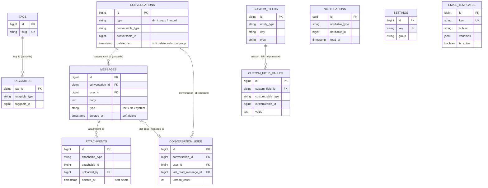

*`USERS` (Diagram A) links in via `conversation_user.user_id`, `messages.user_id`, `attachments.uploaded_by`, and `notifications.notifiable_id` (polymorphic) — not redrawn. `NOTIFICATIONS`/`SETTINGS`/`EMAIL_TEMPLATES`/`TAGS` have no FK of their own and appear here without a relationship line; `notifications` uses a UUID primary key to stay wire-compatible with Laravel's `Notification::send()`.*

*`USERS` (Diyagram A) buraya `conversation_user.user_id`, `messages.user_id`, `attachments.uploaded_by` ve `notifications.notifiable_id` (polymorphic) ile bağlanır — tekrar çizilmez. `NOTIFICATIONS`/`SETTINGS`/`EMAIL_TEMPLATES`/`TAGS` kendi başlarına bir FK taşımaz, burada ilişki çizgisi olmadan görünürler; `notifications` Laravel'in `Notification::send()` akışıyla tel-uyumlu kalmak için UUID birincil anahtar kullanır.*

#### Diyagram D — Log & Audit

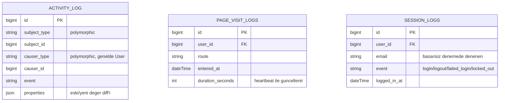

*No table in this group is soft-deleted — these are telemetry/audit rows pruned by retention (`logs:prune`: 90 days for page visits, 365 for sessions and the audit trail), not business records with a "restore" need. All three link to `USERS` (Diagram A) — `activity_log.causer_id` polymorphically, `page_visit_logs.user_id` (cascade — deleting the user deletes their browsing history) and `session_logs.user_id` (null-on-delete, so the row survives account deletion for audit purposes) — not redrawn here.*

*Bu gruptaki hiçbir tablo soft delete kullanmaz — bunlar retention ile budanan (`logs:prune`: sayfa ziyaretleri 90 gün, oturum ve audit trail 365 gün) telemetri/audit satırlarıdır, "geri getirme" ihtiyacı olan iş kayıtları değildir. Üçü de `USERS`'a (Diyagram A) bağlanır — `activity_log.causer_id` polymorphic olarak, `page_visit_logs.user_id` (cascade — kullanıcı silinince gezinme geçmişi de silinir) ve `session_logs.user_id` (nullOnDelete, satır denetim amacıyla hesap silinse de kalır) — burada tekrar çizilmez.*

#### Diyagram E — Sistem (Kimlik/Yetki, Kayıtlı Görünümler, Otomasyon, Kur)

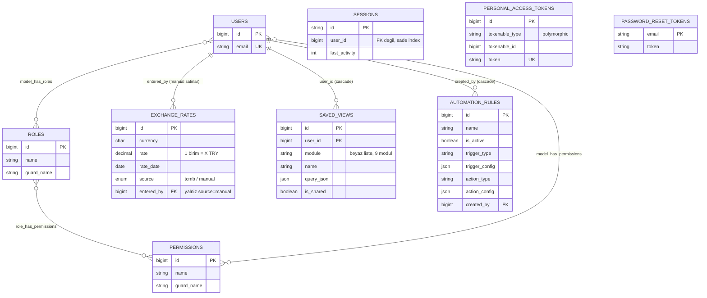

*`EXCHANGE_RATES`/`SAVED_VIEWS`/`AUTOMATION_RULES` are the three Phase 14 tables — none of them carry a real FK to `deals`/`quotes`/business data: `exchange_rates` is looked up by `(currency, rate_date)`, not joined; `saved_views.query_json` is validated filter metadata, never executed data; `automation_rules` config is validated against a fixed catalog, never interpolated into a query. `personal_access_tokens` exists in schema (Sanctum) but is unused in practice — this app authenticates via cookie/session only, `User` deliberately does not use `HasApiTokens`. Deliberately excluded from every diagram above: `cache`, `cache_locks`, `jobs`, `job_batches`, `failed_jobs`, and Laravel's own `migrations` ledger table — pure framework plumbing with no FK to any business table.*

*`EXCHANGE_RATES`/`SAVED_VIEWS`/`AUTOMATION_RULES`, Faz 14'ün üç tablosudur — hiçbiri `deals`/`quotes`/iş verisine gerçek bir FK taşımaz: `exchange_rates` `(currency, rate_date)` ile aranır, JOIN edilmez; `saved_views.query_json` doğrulanmış filtre metadata'sıdır, hiçbir zaman çalıştırılan veri değildir; `automation_rules` konfigürasyonu sabit bir kataloğa karşı doğrulanır, asla bir sorguya enterpole edilmez. `personal_access_tokens` şemada vardır (Sanctum) ama pratikte KULLANILMAZ — bu uygulama yalnızca çerez/oturum ile kimlik doğrular, `User` bilinçli olarak `HasApiTokens` KULLANMAZ. Yukarıdaki diyagramların tümünden bilinçli olarak dışarıda bırakılanlar: `cache`, `cache_locks`, `jobs`, `job_batches`, `failed_jobs` ve Laravel'in kendi `migrations` defter tablosu — hiçbirinin iş tablolarına FK'si olmayan saf framework altyapısı.*

### Documentation (backend & frontend)

The documents below are internal engineering references (roadmap, decision logs, module contracts) and are kept **in Turkish** — only this README and its Turkish counterpart (`README.tr.md`) are bilingual.

| Document | What it covers |
| --- | --- |
| [docs/ROADMAP.md](docs/ROADMAP.md) | The phase-by-phase project roadmap and parallelization plan. |
| [docs/PROGRESS.md](docs/PROGRESS.md) | Live progress log and verified environment status — read at the start of every work session. |
| [docs/DATABASE.md](docs/DATABASE.md) | Full database schema documentation generated from the migrations (all tables, foreign keys, indexing strategy). |
| [docs/AUTH-FLOWS.md](docs/AUTH-FLOWS.md) | The binding contract for the mandatory first-login password change (`must_change_password`) flow. |
| [docs/SLA-DESIGN.md](docs/SLA-DESIGN.md) | The ticket SLA countdown and status state-machine design contract. |
| [docs/QUOTE-FINANCIALS.md](docs/QUOTE-FINANCIALS.md) | The quote calculation model — VAT, discounts, and totals — as a single source of truth. |
| [docs/SETTINGS-SAFETY.md](docs/SETTINGS-SAFETY.md) | Data-integrity contract for the Settings module (pipeline stages, custom fields, permission matrix). |
| [docs/DESIGN-SYSTEM.md](docs/DESIGN-SYSTEM.md) | The Figma-derived design system: tokens, typography, spacing, and contrast verification. |
| [docs/PHASE-AUDIT.md](docs/PHASE-AUDIT.md) | Phase 13 contract: the red-team security audit, and the 6-role user-acceptance pass. |
| [docs/PHASE-INTL.md](docs/PHASE-INTL.md) | Phase 14 contract: internationalization, multi-currency, and the Attio-inspired features (command palette, saved views, related records, automation rules). |

## License

MIT — see [LICENSE](LICENSE). Copyright (c) 2026 Ayberk Arda.

