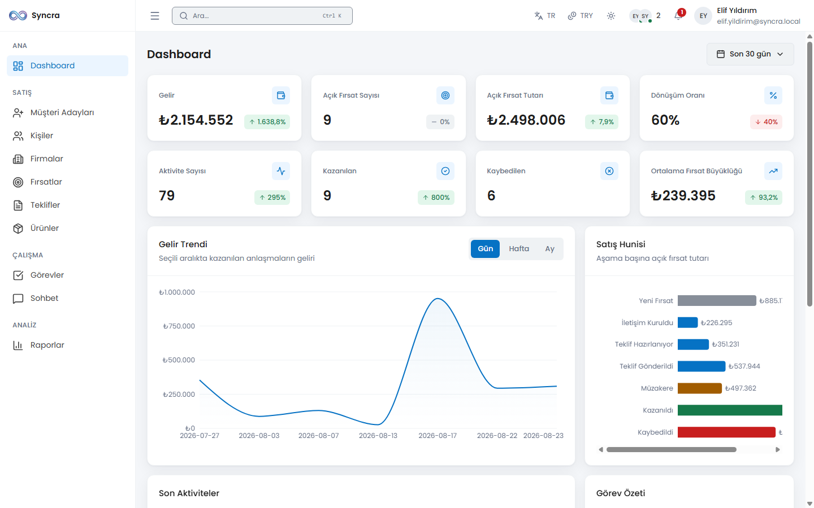
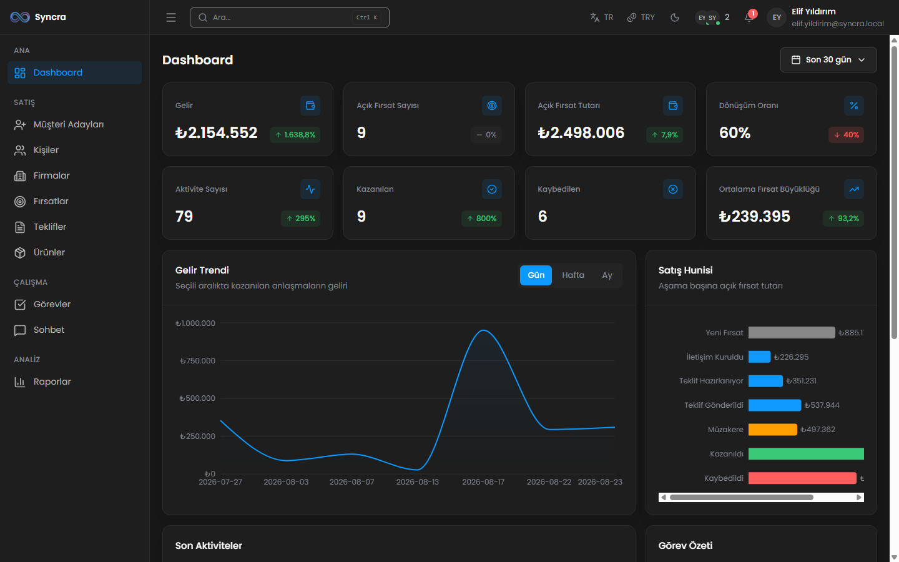
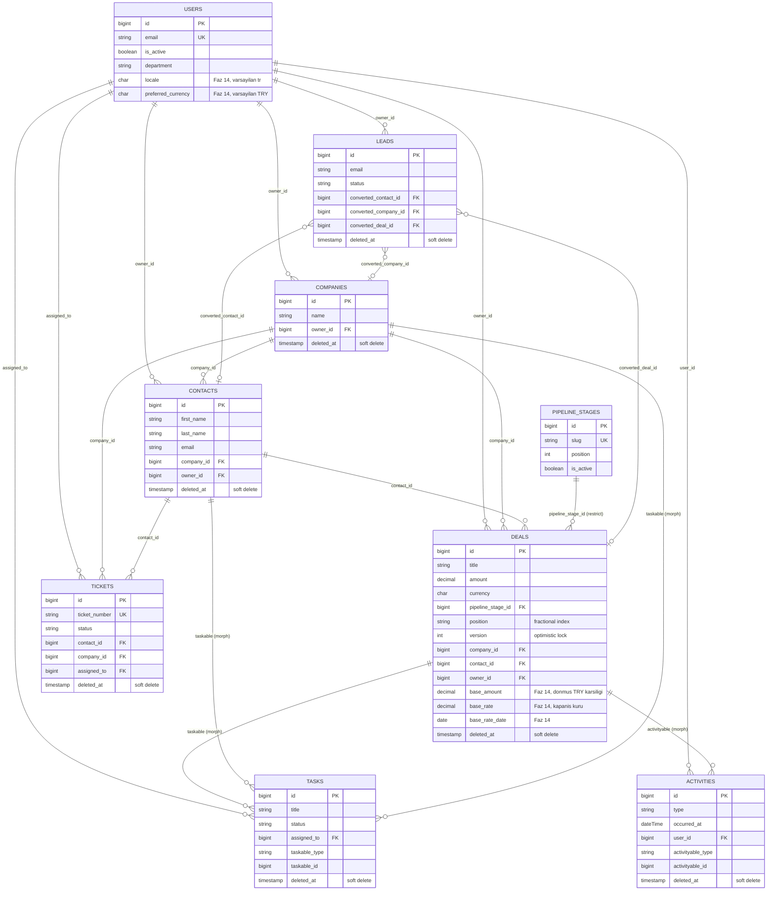
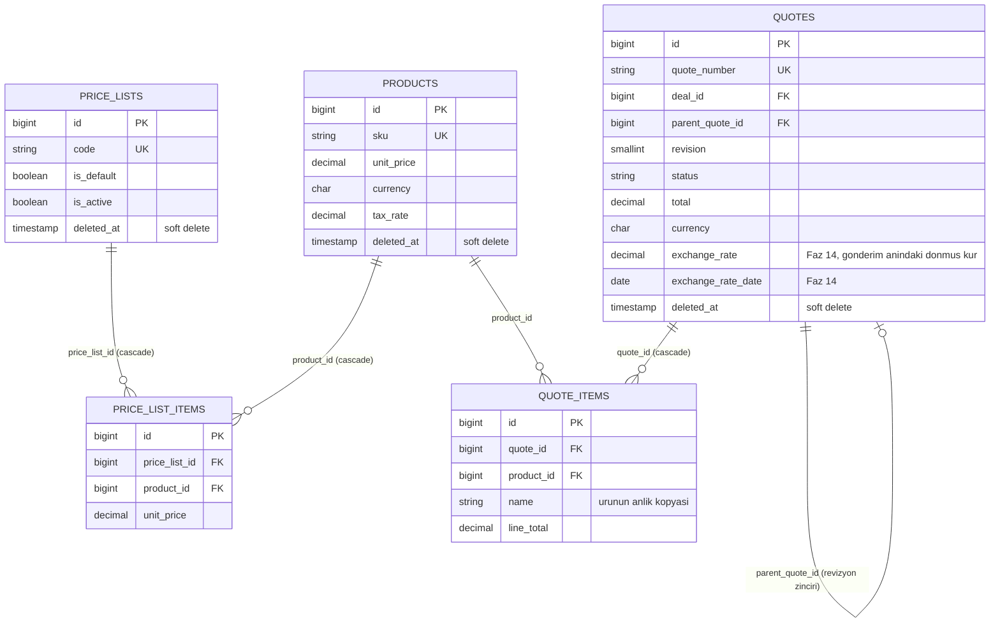
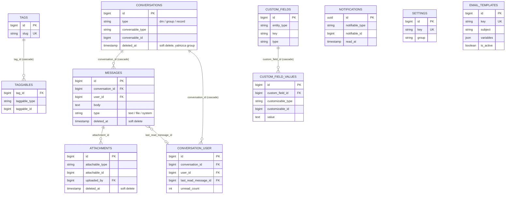
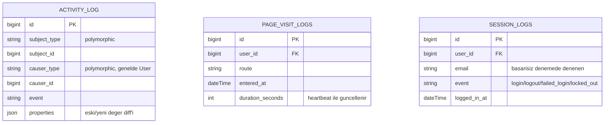
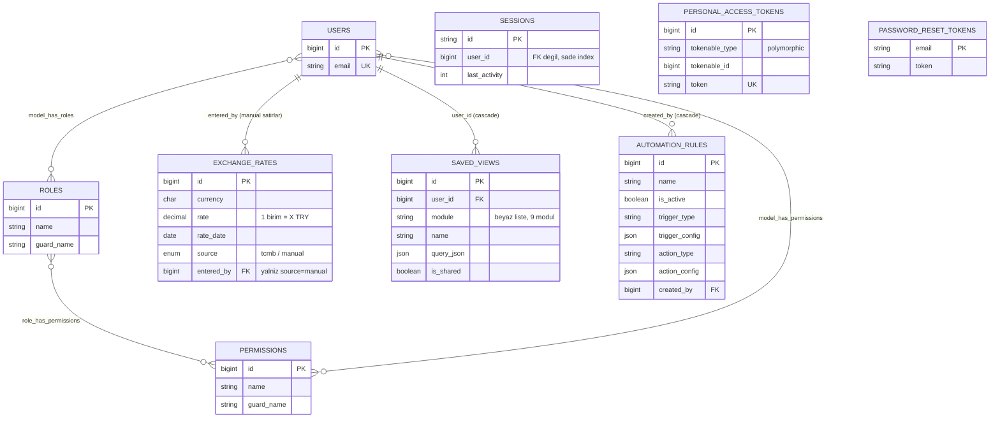

[English](README.md) | **Türkçe**

# Syncra

Syncra, kapalı devre (yalnızca davetle erişilen) bir kurumsal CRM sistemidir. Laravel 12 + React 18 tabanlı bir monorepo olarak geliştirilir; lead, kişi, firma, fırsat, teklif, destek talebi, görev, sohbet, raporlama ve sistem yönetimini uçtan uca kapsar.


*Ana dashboard: canlı KPI kartları, satış hunisi, gelir trendi ve son aktiviteler — Reverb üzerinden gerçek zamanlı güncellenir.*

<details>
<summary>Koyu tema</summary>


*Aynı dashboard koyu temada — uygulamadaki her ekran açık/koyu/sistem temasını destekler, kullanıcı bazında değiştirilebilir.*

</details>

## Proje Yapısı

| Dizin | Açıklama |
| --- | --- |
| `backend/` | Laravel 12 tabanlı REST API (Sanctum ile kimlik doğrulama, Reverb ile gerçek zamanlı olaylar). |
| `frontend/` | React 18 + Vite ile geliştirilen tek sayfa uygulama (SPA). |
| `docs/` | Yol haritası, ilerleme kaydı ve tasarım sistemi dokümanları (bkz. aşağıda [Dokümantasyon](#dokümantasyon)). |

## Teknoloji Yığını

| Katman | Teknoloji | Sürüm / Not |
| --- | --- | --- |
| Backend | Laravel | 12.67.0 |
| Backend | Laravel Sanctum | Kimlik doğrulama (SPA cookie tabanlı) |
| Backend | spatie/laravel-permission | Rol ve yetki yönetimi |
| Backend | Laravel Reverb | ^1.11 — WebSocket sunucusu |
| Backend | PHP | 8.2.12 |
| Frontend | React | 18.3.1 |
| Frontend | Vite | Build/dev sunucusu |
| Frontend | React Router | ^7.18 — istemci tarafı yönlendirme |
| Frontend | TanStack Query | ^5.102 — sunucu state yönetimi / veri çekme |
| Frontend | Zustand | ^5.0 — istemci state yönetimi |
| Frontend | Tailwind CSS | 4.3.3 |
| Frontend | i18next + react-i18next | ^26.4 / ^17.0 — 4 dilli arayüz (tr/en/de/fr) |
| Frontend | Recharts | ^3.10 — dashboard ve rapor grafikleri |
| Veritabanı | MySQL / MariaDB | 10.4.32 (MariaDB), veritabanı adı: `syncra_crm` |
| Realtime | Laravel Reverb + Laravel Echo | WebSocket sunucusu ve istemci kütüphanesi |
| Queue / Cache | Redis | 8.0.5 (WSL2 üzerinde), `predis/predis` ile |
| Araç | Node.js | 26.7.0 |
| Loglama | spatie/laravel-activitylog ^4.12 + maatwebsite/excel ^3.1 | audit trail, CSV/XLSX export |
| Sürükle-bırak | @dnd-kit/core ^6.3 + sortable ^10 | Kanban panosu, klavye erişilebilirliği ile |
| PDF | barryvdh/laravel-dompdf ^3.1 | teklif çıktısı, DejaVu Sans (Türkçe + ₺), font subsetting açık |
| Sanitizasyon | ezyang/htmlpurifier ^4.19 | zengin metin/not girdisi temizleme |

> **Not:** Proje başlangıçta Laravel 11 hedefliyordu. Laravel 11.x'te yamalanmamış güvenlik açıkları (CVE-2026-48019 dahil) bulunduğu ve 11.x hattında düzeltme olmadığı için Laravel 12'ye geçildi. Ayrıntı: `docs/PROGRESS.md` karar günlüğü.

## Özellikler

### Lead, Kişi & Firma
E-posta/telefon/isim üzerinden duplicate tespitiyle lead yakalama, lead'i kişi + firma + (opsiyonel) fırsata tek yönlü dönüştürme, ve toplu CSV import (500 satır altı senkron, üstü kuyruklu; Türkçe karakterler için UTF-8 BOM'lu şablon). Kişiler ve firmalar tek bir ortak adres defterini paylaşır; her kayıt için birleşik aktivite/görev/fırsat/ticket timeline'ı vardır.

### Fırsatlar & Pipeline

*Kanban panosu: pipeline aşamaları arasında sürükle-bırak, optimistic-locking çakışma tespitiyle — başka biri kartı önce taşımışsa kart canlı bir uyarıyla gerçek konumuna geri döner, sessizce üzerine yazılmaz.*


*Fırsat detayı: bağlı kişi/firma, teklifler, görevler ve aktivite timeline'ı tek ekranda. Her fırsat kendi para biriminde tutulur; kapanışta TRY karşılığı (`base_amount`/`base_rate`) dondurulur, böylece geçmiş gelir raporları sessizce yeniden fiyatlanmaz.*

### Ürünler, Fiyat Listeleri & Teklifler

*Teklif detayı: kalemler üründen veya belirli bir fiyat listesinden çözülür, KDV indirim sonrası matrah üzerinden hesaplanır (KDVK md. 25/a), ve baskıya hazır bir PDF üretilir (DejaVu Sans, doğru Türkçe karakterler ve ₺). Teklif gönderildikten sonra tutarı etkileyen alanlar kilitlenir — "Revizyon Oluştur" taze kurla yeni, düzenlenebilir bir belge üretir.*

### Görevler & Destek Talepleri
Hatırlatıcılı görev takvimi görünümü (zamanlayıcı ile dakikada bir gönderilir) ve her ticket için SLA geri sayımı, korumalı durum akışı ve ticket'a özel iç notlarla bir destek talebi modülü.

### Raporlar & Canlı Dashboard

*Satış performansı, kullanıcı bazlı performans, lead kaynak analizi ve dönüşüm oranı raporları — hepsi tarih filtrelenebilir ve CSV/XLSX'e aktarılabilir. Açık fırsatlar güncel kurla (para birimine göre gruplanarak) toplanır; kapanmış fırsatlar dondurulmuş TRY tutarını kullanır — dashboard KPI'ları Reverb üzerinden canlı güncellenir.*

### Sohbet

*Birebir mesajlar, grup sohbetleri ve belirli bir fırsat/ticket kaydına bağlı sohbetler. İletildi/okundu çift tik durumu, @mention, dosya eki, mesaj araması, ve kendi mesajlarında düzenleme/silme.*

### Komut Paleti & Global Arama

*Fırsat, lead, kişi, firma, teklif, ticket ve kullanıcı modüllerinde arama yapan bir `Ctrl/Cmd+K` komut paleti — bir modülün sonuçları yalnızca çağıran kullanıcı o modülün görüntüleme iznine sahipse görünür; yetkisiz bir modülün başlığı hiç basılmaz.*

Faz 14'ün iki eklentisi daha bunun üzerine kurulur: **kayıtlı görünümler** (modül bazlı, kendi veya paylaşılan, 9 modülde filtre ön ayarları) ve kayıt detay sayfalarında bir **ilişkili-kayıt paneli**, ayrıca **otomasyon kuralları** — sabit bir tetikleyici/eylem kataloğu (keyfi kod yok), hem kural kaydedilirken hem her çalıştığında yeniden doğrulanan izinlerle.

### Ayarlar & Yönetim

*Pipeline aşama editörü (bir aşamayı pasifleştirmek açık kartlarını zorunlu bir hedef aşamaya taşır), varlık bazlı özel alan tanımları, tam rol × izin matrisi, e-posta şablonları — ve Faz 14 ile yeni gelen manuel kur girişi ve otomasyon kuralı yönetimi.*

### Loglar & Denetim İzi

*Oturum logları (login/logout/başarısız deneme/kilitlenme), sayfa ziyareti takibi (heartbeat tabanlı süre) ve tam bir audit trail (izlenen her model değişikliğinde önce/sonra diff'i) — her biri bağımsız filtrelenebilir ve CSV/XLSX olarak dışa aktarılabilir (export başına tavan 50.000 satır).*

### Uluslararasılaştırma & Çoklu Para Birimi (Faz 14)
Arayüz **Türkçe, İngilizce, Almanca ve Fransızca** olarak tam gezilebilir (react-i18next, frontend'de 27 namespace'te ~2.089 anahtar, backend'de `lang/{tr,en,de,fr}` dosyalarıyla eşleşir), iki yönlü otomatik anahtar-parite kontrolüyle. Para tutarları arayüz dilinden bağımsız kendi para birimini taşır (TRY/USD/EUR/GBP); günlük TRY kuru Türkiye Cumhuriyet Merkez Bankası'ndan (TCMB) XXE-güvenli XML ayrıştırma ve sertleştirilmiş giden-çağrı ayarlarıyla çekilir, Ayarlar'da manuel yedek girişi ve 4 günden eski kurlar için bayatlık uyarısı vardır.

### Güvenlik
Özel bir kırmızı takım güvenlik turu (Faz 13) oturum/CSRF yönetimini sertleştirdi, güvenlik header'ları/CSP ekledi, zengin metin girdisini temizledi, CSV-formül-enjeksiyonu ve mass-assignment açıklarını kapattı, ve hassas uçlara (login, şifre değişimi, ağır export'lar, arama) rate limiting ekledi. Yetkilendirme tamamen rol/izin tabanlıdır (`spatie/laravel-permission`); bazı uçlar bunun üzerine yatay sahiplik kontrolü (IDOR koruması) ekler — ör. bir sayfa ziyareti heartbeat'i yalnızca kendi sahibi tarafından güncellenebilir, ve bir sohbet eki, bir kaydın var olup olmadığını sızdırmamak için 404 döner (asla 403 değil).

## Ön Koşullar

Bu proje aşağıdaki ortamda doğrulanmıştır:

| Bileşen | Sürüm / Konum | Not |
| --- | --- | --- |
| PHP | 8.2.12 — `C:\xampp\php\php.exe` | `zip` ve `intl` eklentileri açık olmalı |
| Composer | 2.10.2 — `C:\xampp\php\composer.bat` | |
| MariaDB | 10.4.32 — `127.0.0.1:3306` | Kullanıcı `root`, şifre boş, utf8mb4. **Windows servisi olarak kurulu değildir**, XAMPP Control Panel'den başlatılmalıdır |
| Redis | 8.0.5 — WSL2 Ubuntu üzerinde, `127.0.0.1:6379` | Memurai kurulu değil |
| Node.js | v26.7.0 | |
| npm | 11.19.0 | |

Ek notlar:
- PHP için `redis` C eklentisi kurulu değildir; bu nedenle backend'de `predis/predis` paketi kullanılır (`REDIS_CLIENT=predis`).
- `C:\xampp\php` kullanıcı PATH'ine eklenmiştir. Bu değişiklik yalnızca **yeni açılan terminallerde** geçerlidir; eski terminallerde `php` komutu yerine tam yol (`C:\xampp\php\php.exe`) kullanılmalıdır.

### Kurulum Adımları (Ön Koşullar)

**XAMPP:** PHP 8.2 veya üzeri şarttır — daha düşük bir sürüm Laravel 12'yi çalıştıramaz. XAMPP kurulumundan sonra `php.ini` dosyasında aşağıdaki satırların başındaki `;` işaretini kaldırın:
```ini
extension=zip
extension=intl
```

**Composer:** XAMPP ile birlikte gelen `composer.bat` kullanılabilir veya [getcomposer.org](https://getcomposer.org/) üzerinden ayrıca kurulabilir.

**Redis (Windows'ta iki seçenek):**
- **(a) WSL2 + Ubuntu (bu projede kullanılan yöntem):**
  ```
  wsl --install
  sudo apt install redis-server
  sudo service redis-server start
  ```
  Windows tarafından `127.0.0.1:6379` üzerinden erişilebilir.
- **(b) Memurai:** Windows-native Redis servisi, WSL2 istemeyenler için alternatiftir.

## Kurulum

1. Repoyu klonlayın.
2. MySQL'i başlatın: XAMPP Control Panel → **MySQL** → **Start**. phpMyAdmin kullanacaksanız **Apache**'yi de başlatın.
3. Veritabanını oluşturun (veritabanı adı **`syncra_crm`** olmalıdır):
   - phpMyAdmin üzerinden, veya
   - komut satırından:
     ```
     mysql -u root -e "CREATE DATABASE syncra_crm CHARACTER SET utf8mb4 COLLATE utf8mb4_unicode_ci;"
     ```
4. Redis'i başlatın (WSL içinden): `sudo service redis-server start`. Doğrulamak için: `redis-cli ping` → `PONG` dönmelidir.
5. Backend kurulumu:
   ```
   cd backend
   composer install
   cp .env.example .env
   php artisan key:generate
   php artisan migrate --seed
   ```
   Bu komut roller, izinler ve Super Admin hesabını oluşturur (giriş bilgileri aşağıda [Varsayılan Hesaplar](#varsayılan-hesaplar)).
6. Frontend kurulumu:
   ```
   cd frontend
   npm install
   cp .env.example .env
   ```
   Not: Tailwind v4 kullanıldığı için `tailwind.config.js` yoktur; tema `frontend/src/styles/tokens.css` içinde `@theme` ile tanımlanır.


*Giriş ekranı — sistem kapalı devre olduğu için içeri girmenin tek yolu da budur: public kayıt formu yoktur.*

## Çalıştırma

Uygulamanın tam çalışması için beş backend/frontend süreci gerekir, her biri kendi terminalinde:

| Süreç | Komut | Port |
| --- | --- | --- |
| API | `cd backend && php artisan serve` | 8000 |
| WebSocket (Reverb) | `cd backend && php artisan reverb:start` (ws://localhost:8080) | 8080 |
| Queue worker | `cd backend && php artisan queue:work` | — |
| Scheduler | `cd backend && php artisan schedule:work` | — |
| Frontend | `cd frontend && npm run dev` | 5173 |

Alternatif olarak, kök dizindeki **`dev.bat`** dosyası çalıştırılarak yukarıdakilerin tümü tek tıkla, her biri kendi penceresinde başlatılabilir — ayrıca MySQL'in (3306 portu) ve Redis'in (6379 portu) zaten dinlemede olup olmadığını kontrol eder ve gerekirse sizin için başlatır (MySQL, XAMPP'in `mysqld`'i ile; Redis, açık bırakılması gereken ayrı, uzun ömürlü bir WSL penceresi içinde).

`php artisan schedule:work` üç zamanlanmış komut çalıştırır: `logs:prune` her gün 03:17'de eski log kayıtlarını budar (page_visit_logs 90 gün, session_logs ve activity_log 365 gün sonra), `tasks:dispatch-reminders` dakikada bir görev hatırlatıcılarını gönderir, `tickets:scan-sla` 5 dakikada bir SLA ihlali yaklaşan/aşan ticket'ları tarar. Hatırlatıcılar ve SLA taraması `schedule:work` çalışmadan işlemez.

## Doğrulama Komutları

| Komut | Ne kontrol eder | Sonuç |
| --- | --- | --- |
| `cd backend && php artisan test` | Tüm backend test paketi (feature + unit) | **1316 test / 9695 assertion (2026-08-25)**, kanonik `syncra_crm_test` veritabanında tek başına koşuldu |
| `cd frontend && npx tsc -p tsconfig.app.json --noEmit` | Frontend TypeScript tip kontrolü | ⚠️ **Çıplak `npx tsc --noEmit` komutunu repo kökünden ÇALIŞTIRMAYIN** — kök `tsconfig.json` solution-style'dır (yalnızca `references` taşır, kendi dosyası yoktur) ve komut tek bir dosya bile kontrol etmeden sessizce 0 kodla çıkar. Her zaman `-p tsconfig.app.json` verin. |
| `cd frontend && npm run i18n:check` | tr/en/de/fr arası çeviri anahtar-paritesi (iki yönde) + statik kod→sözlük taraması | İki yönde de yeşil |
| `cd frontend && npm run i18n:check-bootstrap` | i18n bootstrap/config sağlık kontrolü | Yeşil |
| `cd frontend && npm run test:money-currency` | Para birimi sembolü/biçimlendirme regresyon kontrolü (`money.ts`, `currencyDisplay: 'narrowSymbol'`) | 16/16 |


## API Uç Listesi

**Kimlik doğrulama akışı (Sanctum SPA):** İstemci önce `GET /sanctum/csrf-cookie` çağırır (CSRF çerezini alır), ardından `X-XSRF-TOKEN` header'ıyla `POST /api/login` çağırır; oturum bir HttpOnly çerezle (session cookie) taşınır, API token üretilmez. Yetkisiz istekte `401`, CSRF çerezi eksik/bayatsa `419` döner. Zorunlu şifre değişimi, pasif kullanıcı reddi ve kilitlenme/rate-limit ayrıntıları için bağlayıcı sözleşme: `docs/AUTH-FLOWS.md`.

Aşağıdaki tüm uçlar (aksi belirtilmedikçe) `auth:sanctum` + `EnsureUserIsActive` (`active`) + `EnsurePasswordIsChanged` (`password.changed`) middleware zincirinden geçer. **İzin** sütunu bu üçünün ÜSTÜNE gelen ek yetki kontrolünü gösterir; boş/"izin yok" ibaresi yalnızca kimlik doğrulamanın yeterli olduğu anlamına gelir.

#### Kimlik Doğrulama

| Metot + Yol | Ne yapar | Gerekli izin | Not |
| --- | --- | --- | --- |
| `POST /api/login` | E-posta/şifre ile giriş yapar, oturum başlatır. | İzin yok (herkese açık — `auth:sanctum` bile gerekmez). | `throttle:login` — e-posta+IP karmasına göre dakikada 5 deneme, artan kilitlenme (1→2→4→8→16→32→60 dk). |
| `POST /api/password/forgot` | Kapalı devre "şifremi unuttum" — kayıt var/yok fark etmeksizin her zaman 202 döner, gerçek sıfırlama admin onayı gerektirir. | İzin yok (herkese açık). | `throttle:6,1`. |
| `POST /api/logout` | Aktif oturumu kapatır. | İzin yok (yalnızca kimlik doğrulaması, `active` dahil — `password.changed` HARİÇ, beyaz liste). | — |
| `GET /api/me` | Giriş yapmış kullanıcının kendi profilini + rol/izinlerini döner. | İzin yok (yalnızca kimlik doğrulaması — `password.changed` HARİÇ). | — |
| `POST /api/password/change` | Kullanıcının kendi şifresini değiştirir (mevcut şifre zorunlu). | İzin yok (yalnızca kimlik doğrulaması — `password.changed` HARİÇ, akışın kendisi). | `throttle:6,1` — `current_password` bir parola kâhinine dönüşmesin diye zorunlu. |
| `PATCH /api/me/preferences` | Kullanıcının kendi arayüz dili (`locale`) ve tercih ettiği para birimini (`preferred_currency`) günceller. | **İzin yok** (bilinçli — kişisel tercih, yönetici yetkisi değil). | Faz 14. |

#### Kullanıcılar & Roller

| Metot + Yol | Ne yapar | Gerekli izin | Not |
| --- | --- | --- | --- |
| `GET /api/users` | Kullanıcıları sayfalı/filtreli listeler. | `users.view` | — |
| `POST /api/users` | Yeni kullanıcı oluşturur (kapalı devre — yalnızca admin açabilir). | `users.create` | — |
| `GET /api/users/{user}` | Tek kullanıcı detayı. | `users.view` | — |
| `PATCH /api/users/{user}` | Kullanıcı bilgilerini günceller. | `users.update` + hedef Super Admin ise ayrıca `users.manage_roles` | — |
| `DELETE /api/users/{user}` | Kullanıcıyı siler (soft delete). | `users.delete` + kendi hesabı olamaz + son aktif Super Admin korunur | — |
| `PATCH /api/users/{user}/active` | Kullanıcıyı aktif/pasif yapar (pasifleşen anında session revoke). | `users.toggle_active` + kendi hesabı olamaz + son aktif Super Admin korunur | — |
| `POST /api/users/{user}/reset-password` | Admin onaylı şifre sıfırlama. | `users.reset_password` | — |
| `GET /api/roles` | Rol listesini (izinleriyle) döner — kullanıcı formundaki rol seçici. | `roles.view` VEYA `users.manage_roles` | — |

#### Gerçek Zamanlı & Presence

| Metot + Yol | Ne yapar | Gerekli izin | Not |
| --- | --- | --- | --- |
| `GET /api/presence/online` | Şu an bağlı (online) kullanıcı listesini döner (WebSocket'in ilk-boyama/polling alternatifi). | İzin yok (yalnızca kimlik doğrulaması — bir meslektaşının online olduğunu bilmek zaten `presence-online` kanalına abone olan herkese açık). | — |
| `GET/POST/HEAD /broadcasting/auth` | Laravel Echo'nun private/presence kanal aboneliklerini yetkilendirir (kanal bazlı kurallar `routes/channels.php`'de). | Kanal başına değişir — bkz. `routes/channels.php` (`private-user.{id}`, `presence-online`, `presence-record.{type}.{id}`, `private-conversation.{id}`, `private-logs`, `private-dashboard`, `private-deals`, `private-tickets`). | `web` middleware grubunda (API grubunda değil); `password.changed` kasıtlı olarak UYGULANMAZ — soket açmak izinli, "başkalarının verisini okumak" (`/presence/online` gibi) değil. |
| `GET/HEAD /sanctum/csrf-cookie` | CSRF çerezini (`XSRF-TOKEN`) verir — SPA akışının ilk adımı. | İzin yok (herkese açık). | Sanctum'un kendi service provider'ı tarafından kaydedilir; `routes/api.php`'de tekrar tanımlanmaz. |

#### Loglar

| Metot + Yol | Ne yapar | Gerekli izin | Not |
| --- | --- | --- | --- |
| `GET /api/logs/sessions` | Oturum (login/logout/failed_login/locked_out) loglarını listeler. | `logs.view` | — |
| `GET /api/logs/page-visits` | Sayfa ziyaret loglarını listeler. | `logs.view` | — |
| `GET /api/logs/activities` | Audit trail (activity_log) kayıtlarını listeler. | `logs.view` | — |
| `GET /api/logs/export` | Log kayıtlarını CSV/XLSX olarak dışa aktarır. | `logs.export` | `throttle:10,1,heavy-export` (`/reports/export` ile PAYLAŞILAN bütçe). |

#### Sayfa Ziyaretleri

| Metot + Yol | Ne yapar | Gerekli izin | Not |
| --- | --- | --- | --- |
| `POST /api/page-visits` | Yeni bir sayfa ziyareti kaydı açar (route değişiminde). | İzin yok (yalnızca kimlik doğrulaması — herkes kendi ziyaretini kaydeder). | — |
| `PATCH /api/page-visits/{pageVisit}/heartbeat` | Mevcut ziyaretin süresini günceller (30 sn'de bir), yeni satır AÇMAZ. | İzin yok, ama IDOR koruması var: yalnızca kendi ziyaretine heartbeat atabilir (`HeartbeatRequest::authorize()`), başkasınınkine 403. | — |

#### Potansiyel Müşteriler (Leads)

| Metot + Yol | Ne yapar | Gerekli izin | Not |
| --- | --- | --- | --- |
| `GET /api/leads` | Lead'leri sayfalı/filtreli/aranabilir listeler. | `leads.view` | — |
| `POST /api/leads` | Yeni lead oluşturur. | `leads.create` | — |
| `POST /api/leads/check-duplicates` | Girilen bilgilerle olası yinelenen lead/contact adaylarını arar (kaydetmeden önce). | `leads.create` | — |
| `POST /api/leads/import` | CSV toplu içe aktarma (500 satır altı senkron, üstü kuyruklu). | `leads.import` | `throttle:5,1,leads-import`. |
| `GET /api/leads/import/template` | İçe aktarma için örnek CSV şablonu indirir. | `leads.import` | — |
| `GET /api/leads/import/{batch}` | Kuyruklu bir içe aktarma işleminin durumunu sorgular. | `leads.import` | — |
| `GET /api/leads/{lead}` | Tek lead detayı. | `leads.view` | — |
| `PATCH /api/leads/{lead}` | Lead günceller. | `leads.update` + yatay sınır: sahibi/sahipsiz/`leads.assign` taşıyan yönetici + dönüşmüş lead güncellenemez | — |
| `DELETE /api/leads/{lead}` | Lead siler (soft delete). | `leads.delete` + dönüşmüş lead silinemez | — |
| `POST /api/leads/{lead}/convert` | Lead'i contact + (varsa) company + (opsiyonel) deal'a dönüştürür (tek yönlü, geri alınamaz). | `leads.convert` + yatay sınır (sahibi/sahipsiz/`leads.assign`) | — |
| `PATCH /api/leads/{lead}/assign` | Lead'in sahibini değiştirir. | `leads.assign` | — |

#### Kişiler (Contacts)

| Metot + Yol | Ne yapar | Gerekli izin | Not |
| --- | --- | --- | --- |
| `GET /api/contacts` | Kişileri sayfalı/filtreli/aranabilir listeler. | `contacts.view` | — |
| `POST /api/contacts` | Yeni kişi oluşturur. | `contacts.create` | — |
| `GET /api/contacts/{contact}` | Tek kişi detayı. | `contacts.view` | — |
| `PATCH /api/contacts/{contact}` | Kişi günceller. | `contacts.update` (yatay yazma izolasyonu YOK — paylaşılan adres defteri, bkz. `ContactPolicy` dokümanı) | — |
| `DELETE /api/contacts/{contact}` | Kişi siler; açık fırsatı varsa 422. | `contacts.delete` | — |
| `GET /api/contacts/{contact}/timeline` | Kişiye bağlı aktivite/görev/fırsat/ticket/ek dosyaları birleşik zaman çizelgesinde döner. | `contacts.view` (görünen alt-bölümler ayrıca ilgili modülün `.view` iznine göre süzülür) | — |

#### Firmalar (Companies)

| Metot + Yol | Ne yapar | Gerekli izin | Not |
| --- | --- | --- | --- |
| `GET /api/companies` | Firmaları sayfalı/filtreli/aranabilir listeler. | `companies.view` | — |
| `POST /api/companies` | Yeni firma oluşturur. | `companies.create` | — |
| `GET /api/companies/{company}` | Tek firma detayı. | `companies.view` | — |
| `PATCH /api/companies/{company}` | Firma günceller. | `companies.update` (yatay yazma izolasyonu YOK — paylaşılan adres defteri) | — |
| `DELETE /api/companies/{company}` | Firma siler; açık fırsatı varsa 422. | `companies.delete` | — |
| `GET /api/companies/{company}/timeline` | Firmaya bağlı deal/quote/ticket vb. birleşik zaman çizelgesi. | `companies.view` (alt-bölümler ilgili modülün `.view` iznine göre süzülür) | — |

#### Etiketler & Özel Alanlar

| Metot + Yol | Ne yapar | Gerekli izin | Not |
| --- | --- | --- | --- |
| `GET /api/tags` | Tüm etiketleri listeler (paylaşılan küçük lookup verisi). | İzin yok (kimliği doğrulanmış her kullanıcı). | — |
| `POST /api/tags` | Yeni etiket oluşturur (yalnızca lead/contact/company formundan). | `leads.create` VEYA `contacts.create` VEYA `companies.create` | — |
| `GET /api/custom-fields` | Bir `entity_type` için AKTİF özel alan tanımlarını döner (form şeması). | İzin yok (yalnızca kimlik doğrulaması — asıl koruma ilgili modülün kendi `.view` izninde). | `entity_type` query parametresi zorunludur. |

#### Fırsatlar & Pipeline (Deals)

| Metot + Yol | Ne yapar | Gerekli izin | Not |
| --- | --- | --- | --- |
| `GET /api/deals` | Fırsatları sayfalı/filtreli listeler; `meta.totals` FİLTRELENMİŞ TÜM kümenin toplamıdır. | `deals.view` | — |
| `GET /api/deals/board` | Kanban pano verisini (aşama başına kart) döner. | `deals.view` | Aşama başına varsayılan 50 kart (max 200, `?per_stage=`). |
| `POST /api/deals` | Yeni fırsat oluşturur. | `deals.create` | — |
| `GET /api/deals/{deal}` | Tek fırsat detayı. | `deals.view` | — |
| `PATCH /api/deals/{deal}` | Fırsat günceller (aşama/pozisyon/versiyon/durum bu uçtan DEĞİŞMEZ). | `deals.update` + yatay sınır (sahibi/sahipsiz/`deals.assign`) | `pipeline_stage_id`/`position`/`version`/`status` reddedilir (422). |
| `DELETE /api/deals/{deal}` | Fırsat siler; kazanılmış/kaybedilmiş fırsat silinemez. | `deals.delete` | — |
| `PATCH /api/deals/{deal}/move` | Kanban'da kart taşır — pozisyonu sunucu üretir, optimistic locking (`version`). | `deals.move` + yatay sınır (sahibi/sahipsiz/`deals.assign`) | Bayat `version` → 409 `DEAL_VERSION_CONFLICT` + kartın güncel hâli. |
| `PATCH /api/deals/{deal}/assign` | Fırsatın sahibini değiştirir. | `deals.assign` | — |
| `GET /api/pipeline-stages` | Kanban sütun listesi (yalnızca aktif, varsayılan). | `deals.view` (ayrı bir Policy yok — Deal'e devredilir) | — |

#### Görevler (Tasks)

| Metot + Yol | Ne yapar | Gerekli izin | Not |
| --- | --- | --- | --- |
| `GET /api/tasks` | Görevleri sayfalı/filtreli listeler. | `tasks.view` | — |
| `GET /api/tasks/calendar` | Belirli bir tarih aralığındaki görevleri takvim görünümü için döner. | `tasks.view` | `?from`/`?to` zorunlu, max 90 gün, sayfalama yok. |
| `POST /api/tasks` | Yeni görev oluşturur. | `tasks.create` | — |
| `GET /api/tasks/{task}` | Tek görev detayı. | `tasks.view` | — |
| `PATCH /api/tasks/{task}` | Görev günceller. | `tasks.update` + yatay sınır (`assigned_to` sahibi/sahipsiz/`tasks.assign`) | — |
| `DELETE /api/tasks/{task}` | Görev siler. | `tasks.delete` | — |
| `PATCH /api/tasks/{task}/complete` | Görevi tamamlanmış işaretler (idempotent). | `tasks.update` + yatay sınır (atanan/sahipsiz/`tasks.assign`) | — |
| `PATCH /api/tasks/{task}/assign` | Görevi başka bir kullanıcıya atar. | `tasks.assign` | — |

#### Destek Talepleri (Tickets)

| Metot + Yol | Ne yapar | Gerekli izin | Not |
| --- | --- | --- | --- |
| `GET /api/tickets` | Ticket'ları sayfalı/filtreli listeler. | `tickets.view` | — |
| `GET /api/tickets/stats` | Ticket istatistiklerini (SLA ihlali dahil, türetilmiş) döner. | `tickets.view` | — |
| `POST /api/tickets` | Yeni ticket açar. | `tickets.create` | — |
| `GET /api/tickets/{ticket}` | Tek ticket detayı. | `tickets.view` | — |
| `PATCH /api/tickets/{ticket}` | Ticket günceller. | `tickets.update` + yatay sınır (`assigned_to` sahibi/sahipsiz/`tickets.assign`) | — |
| `DELETE /api/tickets/{ticket}` | Ticket siler; çözülmüş/kapanmış ticket silinemez. | `tickets.delete` | — |
| `PATCH /api/tickets/{ticket}/status` | Durum makinesi üzerinden ticket durumunu değiştirir. | `tickets.update` (AYNI Policy metodu — ayrı izin yok) + yatay sınır | Geçersiz geçiş → 422 `INVALID_STATUS_TRANSITION`. |
| `PATCH /api/tickets/{ticket}/assign` | Ticket'ı başka bir kullanıcıya atar. | `tickets.assign` | — |

#### Aktiviteler (Activities)

| Metot + Yol | Ne yapar | Gerekli izin | Not |
| --- | --- | --- | --- |
| `GET /api/activities` | Aktiviteleri (çağrı/toplantı/e-posta/not) sayfalı/filtreli listeler. | `activities.view` | Ticket iç notları da `type='note'` olarak burada yaşar. |
| `POST /api/activities` | Yeni aktivite kaydı ekler. | `activities.create` | — |
| `GET /api/activities/{activity}` | Tek aktivite detayı. | `activities.view` | — |
| `PATCH /api/activities/{activity}` | Aktivite günceller. | `activities.update` + (yazan kişi VEYA `activities.delete` taşıyan yönetici); yazarı silinmişse yalnız yönetici | — |
| `DELETE /api/activities/{activity}` | Aktivite siler. | (Yazan kişi) VEYA `activities.delete` | — |

#### Ürünler & Fiyat Listeleri

| Metot + Yol | Ne yapar | Gerekli izin | Not |
| --- | --- | --- | --- |
| `GET /api/products` | Ürünleri sayfalı/filtreli listeler. | `products.view` | — |
| `GET /api/products/categories` | Mevcut ürün kategorilerinin listesini döner. | `products.view` | — |
| `POST /api/products` | Yeni ürün oluşturur. | `products.create` | — |
| `GET /api/products/{product}` | Tek ürün detayı. | `products.view` | — |
| `PATCH /api/products/{product}` | Ürün günceller. | `products.update` | — |
| `DELETE /api/products/{product}` | Ürün siler. | `products.delete` | — |
| `GET /api/products/{product}/price` | Ürünün (opsiyonel bir fiyat listesindeki) fiyatını döner. | `products.view` | — |
| `GET /api/price-lists` | Fiyat listelerini listeler. | `products.view` (ayrı `price-lists.*` izni YOK — kataloğun uzantısı) | — |
| `POST /api/price-lists` | Yeni fiyat listesi oluşturur. | `products.create` | — |
| `GET /api/price-lists/{priceList}` | Tek fiyat listesi detayı. | `products.view` | — |
| `PATCH /api/price-lists/{priceList}` | Fiyat listesi günceller. | `products.update` | — |
| `DELETE /api/price-lists/{priceList}` | Fiyat listesi siler (soft delete; kalemleri KORUNUR). | `products.delete` | — |
| `GET /api/price-lists/{priceList}/products` | Listedeki ürün fiyatlarını döner. | `products.view` | — |
| `PUT /api/price-lists/{priceList}/products/{product}` | Listede bir ürün için özel fiyat tanımlar/günceller. | `products.update` | — |
| `DELETE /api/price-lists/{priceList}/products/{product}` | Listeden bir ürünün özel fiyatını kaldırır. | `products.update` | — |

#### Teklifler (Quotes)

| Metot + Yol | Ne yapar | Gerekli izin | Not |
| --- | --- | --- | --- |
| `GET /api/quotes` | Teklifleri sayfalı/filtreli listeler. | `quotes.view` | — |
| `POST /api/quotes` | Yeni teklif oluşturur. | `quotes.create` | — |
| `POST /api/quotes/calculate` | Kaydetmeden, canlı toplam/KDV/indirim önizlemesi hesaplar. | `quotes.create` VEYA `quotes.update` (düz izin sorusu, Policy metodu değil) | — |
| `GET /api/quotes/{quote}` | Tek teklif detayı. | `quotes.view` | — |
| `PATCH /api/quotes/{quote}` | Teklif günceller. | `quotes.update` (yatay sınır YOK — bu uç zaten yönetici seviyesinde) | `sent` sonrası tutarı etkileyen alanlar kilitli (422 `QUOTE_LOCKED`). |
| `DELETE /api/quotes/{quote}` | Teklif siler; kabul edilmiş/reddedilmiş teklif silinemez. | `quotes.delete` | — |
| `POST /api/quotes/{quote}/send` | Teklifi müşteriye "gönderildi" işaretler, tutarı kilitler. | `quotes.send` (AYRI izin, `quotes.update`'ten farklı) | — |
| `PATCH /api/quotes/{quote}/status` | Teklif durumunu değiştirir (kabul/red/süre doldu vb.). | `quotes.update` | — |
| `POST /api/quotes/{quote}/revise` | Mevcut tekliften yeni bir revizyon (yeni kayıt) üretir. | `quotes.create` (revizyon YENİ bir belge ürettiği için) | — |
| `GET /api/quotes/{quote}/pdf` | Teklifin PDF çıktısını indirir. | `quotes.view` | — |

#### Bildirimler (Notifications)

| Metot + Yol | Ne yapar | Gerekli izin | Not |
| --- | --- | --- | --- |
| `GET /api/notifications` | Kullanıcının kendi bildirimlerini listeler. | `notifications.view` | — |
| `GET /api/notifications/unread-count` | Okunmamış bildirim sayısını döner. | `notifications.view` | — |
| `POST /api/notifications/read-all` | Tüm bildirimleri okundu işaretler. | `notifications.view` | — |
| `PATCH /api/notifications/{notification}/read` | Tek bildirimi okundu işaretler. | `notifications.view` | — |
| `DELETE /api/notifications/{notification}` | Bildirimi siler. | `notifications.view` | — |

#### Ayarlar (Settings)

| Metot + Yol | Ne yapar | Gerekli izin | Not |
| --- | --- | --- | --- |
| `GET /api/settings` | Genel sistem ayarlarını (şirket profili vb.) döner. | `settings.manage` | — |
| `PATCH /api/settings` | Genel sistem ayarlarını günceller. | `settings.manage` | — |
| `GET /api/settings/pipeline-stages` | Pipeline aşama EDİTÖRÜ listesi (pasifler DAHİL). | `settings.manage` | Aynı controller/metodu `GET /api/pipeline-stages` ile paylaşır; ayrım rota adına göre. |
| `POST /api/settings/pipeline-stages` | Yeni pipeline aşaması oluşturur. | `settings.manage` | — |
| `POST /api/settings/pipeline-stages/reorder` | Aşamaların sırasını günceller. | `settings.manage` | — |
| `PATCH /api/settings/pipeline-stages/{stage}` | Aşama günceller/pasifleştirir. | `settings.manage` | Pasifleşen aşamadaki açık kartlar zorunlu hedef aşamaya taşınır. |
| `GET /api/settings/custom-fields` | Özel alan EDİTÖRÜ listesi (pasifler DAHİL). | `settings.manage` | Aynı controller/metodu `GET /api/custom-fields` ile paylaşır; ayrım rota adına göre. |
| `POST /api/settings/custom-fields` | Yeni özel alan tanımı oluşturur. | `settings.manage` | — |
| `PATCH /api/settings/custom-fields/{customField}` | Özel alan tanımını günceller. | `settings.manage` | — |
| `DELETE /api/settings/custom-fields/{customField}` | Özel alanı SİLMEZ, pasifleştirir (yanıt 200, kaydın kendisi). | `settings.manage` | — |
| `GET /api/settings/email-templates` | E-posta şablonlarını listeler (pasifler dahil). | `settings.manage` | Bu fazda gerçek e-posta GÖNDERİLMEZ; yalnızca saklama/önizleme. |
| `POST /api/settings/email-templates` | Yeni e-posta şablonu oluşturur. | `settings.manage` | — |
| `PATCH /api/settings/email-templates/{emailTemplate}` | Şablon günceller. | `settings.manage` | — |
| `DELETE /api/settings/email-templates/{emailTemplate}` | Şablonu kalıcı siler. | `settings.manage` | — |
| `GET /api/settings/permission-matrix` | Tam rol × izin matrisini döner. | `settings.manage` | Okuma da `settings.manage` ister (sistemin tam yetki haritası). |
| `PATCH /api/settings/roles/{role}/permissions` | Bir rolün izin kümesini TAM DURUM olarak değiştirir (sync). | `settings.manage` | Super Admin rolü 422 `ROLE_NOT_EDITABLE`. |
| `GET /api/settings/exchange-rates` | Kayıtlı döviz kurlarını (yönetim ekranı) listeler. | `settings.manage` | Faz 14. |
| `POST /api/settings/exchange-rates` | Bir para birimi/tarih için kuru elle girer/düzeltir. | `settings.manage` | Faz 14. Otomatik TCMB çekmesi bir konsol komutudur, HTTP ucu değil. |
| `GET /api/settings/automation-rules` | Otomasyon kurallarını listeler. | `settings.manage` | Faz 14. |
| `POST /api/settings/automation-rules` | Yeni otomasyon kuralı oluşturur. | `settings.manage` **+** seçilen tetikleyici/eylemin gerektirdiği izinler (`AutomationPermissionChecker`) | Faz 14. İki katmanlı kontrol — tek başına `settings.manage` yetmez. |
| `PATCH /api/settings/automation-rules/{automationRule}` | Otomasyon kuralını günceller. | `settings.manage` **+** `AutomationPermissionChecker` | Faz 14. |
| `DELETE /api/settings/automation-rules/{automationRule}` | Otomasyon kuralını siler. | `settings.manage` | Faz 14. |

#### Kur (Genel — Faz 14)

| Metot + Yol | Ne yapar | Gerekli izin | Not |
| --- | --- | --- | --- |
| `GET /api/exchange-rates/current` | Her para birimi için en güncel (donmuş/bayat olabilir) kuru döner — kullanıcının kendi tercih ettiği para biriminde tutar göstermesi içindir. | **İzin yok** (bilinçli — TCMB kurları kamuya açık veridir, `/settings/exchange-rates` yönetim ekranından AYRI ve ondan gevşek DEĞİLDİR). | `throttle:30,1,exchange-rates-current`. |

#### Raporlar & Panel (Dashboard)

| Metot + Yol | Ne yapar | Gerekli izin | Not |
| --- | --- | --- | --- |
| `GET /api/reports/sales-performance` | Satış performansı raporu (tarih filtreli). | `reports.view` | — |
| `GET /api/reports/user-performance` | Kullanıcı bazlı performans raporu. | `reports.view` | — |
| `GET /api/reports/source-analysis` | Lead kaynak analizi raporu. | `reports.view` | — |
| `GET /api/reports/conversion` | Dönüşüm oranı raporu. | `reports.view` | — |
| `GET /api/reports/export` | Rapor verisini CSV/XLSX dışa aktarır. | `reports.export` | `throttle:10,1,heavy-export` (`/logs/export` ile PAYLAŞILAN bütçe). |
| `GET /api/dashboard/kpis` | KPI kartları (aylık gelir, açık fırsat, dönüşüm oranı, aktivite sayısı). | `dashboard.view` | — |
| `GET /api/dashboard/funnel` | Satış hunisi verisi. | `dashboard.view` | — |
| `GET /api/dashboard/revenue-trend` | Gelir trendi (zaman serisi). | `dashboard.view` | — |
| `GET /api/dashboard/recent-activities` | Son aktiviteler akışı. | `dashboard.view` | — |
| `GET /api/dashboard/task-summary` | Görev özeti. | `dashboard.view` | — |

#### Sohbet (Chat)

| Metot + Yol | Ne yapar | Gerekli izin | Not |
| --- | --- | --- | --- |
| `GET /api/conversations` | Kullanıcının üyesi olduğu konuşmaları listeler. | `chat.use` | — |
| `GET /api/conversations/unread-count` | Toplam okunmamış mesaj sayısını döner. | `chat.use` | — |
| `POST /api/conversations` | Yeni DM veya grup konuşması başlatır. | `chat.use` | — |
| `POST /api/conversations/for-record` | Bir kayda (deal/ticket) bağlı sohbeti getirir/oluşturur. | `chat.use` **+** ilgili kaydın `.view` izni (`RecordChatRegistry` beyaz listesi) | — |
| `GET /api/conversations/{conversation}` | Konuşma detayı. | `chat.use` + üyelik VEYA (kayda-bağlı ise) kaydı görme izni; aksi halde 404 (IDOR/varlık sızıntısını önlemek için 403 DEĞİL) | — |
| `PATCH /api/conversations/{conversation}` | Grup adını değiştirir (yalnızca grup, yalnızca kurucu). | Görünürlük + grup + kurucu | — |
| `DELETE /api/conversations/{conversation}` | Grup sohbetini arşivler (yalnızca grup, yalnızca kurucu; `dm`/`record` SİLİNEMEZ). | Görünürlük + grup + kurucu | — |
| `POST /api/conversations/{conversation}/members` | Gruba üye ekler (konuşmanın herhangi bir üyesi ekleyebilir). | Görünürlük + grup + üyelik | — |
| `DELETE /api/conversations/{conversation}/members/{user}` | Gruptan üye çıkarır (yalnızca kurucu). | Görünürlük + grup + kurucu | — |
| `POST /api/conversations/{conversation}/leave` | Kullanıcı gruptan kendisi ayrılır (`dm`'den ayrılınamaz). | Görünürlük + grup + üyelik | — |
| `PATCH /api/conversations/{conversation}/mute` | Konuşmayı sessize alır/açar. | Görünürlük + üyelik | — |
| `POST /api/conversations/{conversation}/read` | Konuşmayı belirli bir mesaja kadar okundu işaretler (çift tik). | Görünürlük + üyelik | — |
| `POST /api/conversations/{conversation}/delivered` | Mesajları "iletildi" olarak işaretler. | Görünürlük + üyelik | — |
| `GET /api/conversations/{conversation}/messages` | Konuşmanın mesajlarını (sayfalı) listeler. | Konuşma görünürlüğü (`view`) | — |
| `POST /api/conversations/{conversation}/messages` | Yeni mesaj gönderir. | `sendMessage` (record sohbette üyelik önkoşul değildir, ilk mesajda otomatik üye olunur) | — |
| `GET /api/messages/search` | Kullanıcının erişebildiği konuşmalarda mesaj arar. | `chat.use` (`viewAny` Conversation) | — |
| `PATCH /api/messages/{message}` | Kendi metin mesajını düzenler (zaman sınırı YOK, `edited_at` ile şeffaf). | Yalnızca mesajın yazarı + `type=text` + silinmemiş | — |
| `DELETE /api/messages/{message}` | Mesaj siler. | Mesajın yazarı VEYA Super Admin (moderasyon `settings.manage`'e BAĞLI DEĞİL) | — |

#### Dosya Ekleri (Attachments)

| Metot + Yol | Ne yapar | Gerekli izin | Not |
| --- | --- | --- | --- |
| `POST /api/attachments` | Dosya/görsel yükler (sohbet eki). | `chat.use` | — |
| `GET /api/attachments/{attachment}` | Ek dosyayı indirir/servis eder. | **Kritik IDOR yüzeyi** — mesaja bağlıysa yalnızca o konuşmanın üyeleri, değilse yalnızca yükleyen kişi; ret 403 DEĞİL 404 (varlık sızıntısını önlemek için). | — |

#### Arama (Search)

| Metot + Yol | Ne yapar | Gerekli izin | Not |
| --- | --- | --- | --- |
| `GET /api/search` | Genel arama/komut paleti — deal, lead, contact, company, quote, ticket, user modüllerinde arar. | Modül bazlı: her modülün sonucu yalnızca o modülün `.view` iznine sahipse döner (`GlobalSearchService` içinde, izinsiz modülün anahtarı sonuçta hiç görünmez). | `throttle:60,1,search`. Modül başına en fazla 5, toplam en fazla 35 sonuç. |

#### Kayıtlı Görünümler (Saved Views — Faz 14)

| Metot + Yol | Ne yapar | Gerekli izin | Not |
| --- | --- | --- | --- |
| `GET /api/saved-views` | Belirtilen modül için kullanıcının kendi + paylaşılan görünümlerini listeler. | İlgili modülün `.view` izni (`?module=` — 9 modülden biri: deals/leads/contacts/companies/quotes/tickets/tasks/products/users) | Yalnızca metadata (isim/filtre) döner — gerçek veri hiçbir zaman bu uçtan gelmez. |
| `POST /api/saved-views` | Yeni kayıtlı görünüm oluşturur. | İlgili modülün `.view` izni | Aynı kullanıcı+modülde aynı isim iki kez kullanılamaz (422). |
| `PATCH /api/saved-views/{savedView}` | Kayıtlı görünümü günceller. | Yalnızca görünümün SAHİBİ (`is_shared` bunu değiştirmez) | — |
| `DELETE /api/saved-views/{savedView}` | Kayıtlı görünümü siler. | Yalnızca görünümün SAHİBİ | — |

## ER Diyagramı

Okunabilirlik için şema beş mantıksal gruba bölünmüştür (40+ tablonun tek diyagramda tüm kolonlarıyla gösterilmesi okunamaz bir sonuç üretir). Her varlık kutusunda yalnızca PK, FK'lar ve tabloyu tanımlayan 3-6 kolon gösterilir — tam kolon dökümü için `docs/DATABASE.md`. Gruplar arası FK'lar (ör. `deals.company_id → companies.id`) ilgili diyagramın altında düz metinle not edilir; `USERS` yalnızca ilişki çizmek gerektiğinde diğer diyagramlarda küçültülmüş (yalnızca `id`/`email`) hâliyle tekrarlanır — tam tanımı yalnızca Diyagram A'dadır.

#### Diyagram A — Çekirdek CRM



*This is the transactional core: accounts, the pipeline, and everything that hangs off a deal. `deals.base_amount/base_rate/base_rate_date` (Phase 14) freeze the TRY-equivalent value at close time so historical revenue reports never silently reprice; `users.locale`/`preferred_currency` (Phase 14) are personal, permission-free preferences.*

*Bu, işlemsel çekirdektir: hesaplar, pipeline ve bir fırsata bağlı her şey. `deals.base_amount/base_rate/base_rate_date` (Faz 14) kapanış anındaki TRY karşılığını dondurur ki geçmiş gelir raporları sessizce yeniden fiyatlanmasın; `users.locale`/`preferred_currency` (Faz 14) izin gerektirmeyen kişisel tercihlerdir.*

#### Diyagram B — Teklif / Ürün



*Cross-group FKs not redrawn here: `quotes.deal_id → deals.id`, `quotes.company_id/contact_id → companies.id/contacts.id` (all in Diagram A). `quote_items.name`/`unit_price`/`tax_rate` are point-in-time snapshots of the product, not live references — a later price or catalog change never rewrites a quote already issued. `quotes.exchange_rate/exchange_rate_date` (Phase 14) freeze the rate at `sent` time for the same reason; they stay `null` for drafts.*

*Burada yeniden çizilmeyen gruplar-arası FK'lar: `quotes.deal_id → deals.id`, `quotes.company_id/contact_id → companies.id/contacts.id` (hepsi Diyagram A'da). `quote_items.name`/`unit_price`/`tax_rate` ürünün o anki anlık kopyasıdır, canlı referans değildir — sonradan yapılan bir fiyat/katalog değişikliği zaten kesilmiş bir teklifi asla değiştirmez. `quotes.exchange_rate/exchange_rate_date` (Faz 14) aynı gerekçeyle `sent` anındaki kuru dondurur; taslaklarda `null` kalır.*

#### Diyagram C — Sohbet & Bildirim



*`USERS` (Diagram A) links in via `conversation_user.user_id`, `messages.user_id`, `attachments.uploaded_by`, and `notifications.notifiable_id` (polymorphic) — not redrawn. `NOTIFICATIONS`/`SETTINGS`/`EMAIL_TEMPLATES`/`TAGS` have no FK of their own and appear here without a relationship line; `notifications` uses a UUID primary key to stay wire-compatible with Laravel's `Notification::send()`.*

*`USERS` (Diyagram A) buraya `conversation_user.user_id`, `messages.user_id`, `attachments.uploaded_by` ve `notifications.notifiable_id` (polymorphic) ile bağlanır — tekrar çizilmez. `NOTIFICATIONS`/`SETTINGS`/`EMAIL_TEMPLATES`/`TAGS` kendi başlarına bir FK taşımaz, burada ilişki çizgisi olmadan görünürler; `notifications` Laravel'in `Notification::send()` akışıyla tel-uyumlu kalmak için UUID birincil anahtar kullanır.*

#### Diyagram D — Log & Audit



*No table in this group is soft-deleted — these are telemetry/audit rows pruned by retention (`logs:prune`: 90 days for page visits, 365 for sessions and the audit trail), not business records with a "restore" need. All three link to `USERS` (Diagram A) — `activity_log.causer_id` polymorphically, `page_visit_logs.user_id` (cascade — deleting the user deletes their browsing history) and `session_logs.user_id` (null-on-delete, so the row survives account deletion for audit purposes) — not redrawn here.*

*Bu gruptaki hiçbir tablo soft delete kullanmaz — bunlar retention ile budanan (`logs:prune`: sayfa ziyaretleri 90 gün, oturum ve audit trail 365 gün) telemetri/audit satırlarıdır, "geri getirme" ihtiyacı olan iş kayıtları değildir. Üçü de `USERS`'a (Diyagram A) bağlanır — `activity_log.causer_id` polymorphic olarak, `page_visit_logs.user_id` (cascade — kullanıcı silinince gezinme geçmişi de silinir) ve `session_logs.user_id` (nullOnDelete, satır denetim amacıyla hesap silinse de kalır) — burada tekrar çizilmez.*

#### Diyagram E — Sistem (Kimlik/Yetki, Kayıtlı Görünümler, Otomasyon, Kur)



*`EXCHANGE_RATES`/`SAVED_VIEWS`/`AUTOMATION_RULES` are the three Phase 14 tables — none of them carry a real FK to `deals`/`quotes`/business data: `exchange_rates` is looked up by `(currency, rate_date)`, not joined; `saved_views.query_json` is validated filter metadata, never executed data; `automation_rules` config is validated against a fixed catalog, never interpolated into a query. `personal_access_tokens` exists in schema (Sanctum) but is unused in practice — this app authenticates via cookie/session only, `User` deliberately does not use `HasApiTokens`. Deliberately excluded from every diagram above: `cache`, `cache_locks`, `jobs`, `job_batches`, `failed_jobs`, and Laravel's own `migrations` ledger table — pure framework plumbing with no FK to any business table.*

*`EXCHANGE_RATES`/`SAVED_VIEWS`/`AUTOMATION_RULES`, Faz 14'ün üç tablosudur — hiçbiri `deals`/`quotes`/iş verisine gerçek bir FK taşımaz: `exchange_rates` `(currency, rate_date)` ile aranır, JOIN edilmez; `saved_views.query_json` doğrulanmış filtre metadata'sıdır, hiçbir zaman çalıştırılan veri değildir; `automation_rules` konfigürasyonu sabit bir kataloğa karşı doğrulanır, asla bir sorguya enterpole edilmez. `personal_access_tokens` şemada vardır (Sanctum) ama pratikte KULLANILMAZ — bu uygulama yalnızca çerez/oturum ile kimlik doğrular, `User` bilinçli olarak `HasApiTokens` KULLANMAZ. Yukarıdaki diyagramların tümünden bilinçli olarak dışarıda bırakılanlar: `cache`, `cache_locks`, `jobs`, `job_batches`, `failed_jobs` ve Laravel'in kendi `migrations` defter tablosu — hiçbirinin iş tablolarına FK'si olmayan saf framework altyapısı.*

## Varsayılan Hesaplar

| E-posta | Şifre | Rol |
| --- | --- | --- |
| `admin@syncra.local` | `SyncraAdmin!2026` | Super Admin |

> **Uyarı:** Bu yalnızca yerel geliştirme içindir. Hesap `must_change_password=true` ile gelir; ilk girişte şifre değiştirme ekranı zorunludur ve değiştirilmeden hiçbir modüle erişilemez. Üretimde seeder'daki şifre mutlaka değiştirilmelidir.

Sistem kapalı devredir: public kayıt yoktur, yeni hesapları yalnızca Super Admin oluşturur.

## Güvenlik Notu

`.env` dosyaları asla repoya girmez; `.env.example` dosyaları eksiksiz tutulur. Sistem kapalı devredir — herkese açık kayıt (public registration) yoktur, kullanıcı hesapları yalnızca Super Admin tarafından oluşturulur.

## Dokümantasyon

Aşağıdaki dokümanlar iç geliştirme referanslarıdır (yol haritası, karar günlükleri, modül sözleşmeleri) ve **Türkçe** kalır — yalnızca bu README ve İngilizce karşılığı (`README.md`) iki dillidir.

| Doküman | Ne anlatır |
| --- | --- |
| [docs/ROADMAP.md](docs/ROADMAP.md) | Faz faz proje yol haritası ve paralelleştirme planı. |
| [docs/PROGRESS.md](docs/PROGRESS.md) | Canlı ilerleme kaydı ve doğrulanmış ortam durumu — her çalışma oturumu başında okunur. |
| [docs/DATABASE.md](docs/DATABASE.md) | Migration'lardan üretilen tam veritabanı şema dokümantasyonu (tüm tablolar, foreign key'ler, index stratejisi). |
| [docs/AUTH-FLOWS.md](docs/AUTH-FLOWS.md) | İlk girişte zorunlu şifre değişimi (`must_change_password`) akışının bağlayıcı sözleşmesi. |
| [docs/SLA-DESIGN.md](docs/SLA-DESIGN.md) | Ticket SLA geri sayımı ve durum akışı tasarım sözleşmesi. |
| [docs/QUOTE-FINANCIALS.md](docs/QUOTE-FINANCIALS.md) | Teklif hesaplama modeli — KDV, indirim ve toplamlar — tek doğruluk kaynağı olarak. |
| [docs/SETTINGS-SAFETY.md](docs/SETTINGS-SAFETY.md) | Ayarlar modülü (pipeline aşamaları, özel alanlar, izin matrisi) veri bütünlüğü sözleşmesi. |
| [docs/DESIGN-SYSTEM.md](docs/DESIGN-SYSTEM.md) | Figma kaynaklı tasarım sistemi: token'lar, tipografi, spacing ve kontrast doğrulaması. |
| [docs/PHASE-AUDIT.md](docs/PHASE-AUDIT.md) | Faz 13 sözleşmesi: kırmızı takım güvenlik denetimi ve 6-rol kullanıcı kabul turu. |
| [docs/PHASE-INTL.md](docs/PHASE-INTL.md) | Faz 14 sözleşmesi: uluslararasılaştırma, çoklu para birimi ve Attio esinli özellikler (komut paleti, kayıtlı görünümler, ilişkili kayıtlar, otomasyon kuralları). |

## Lisans

MIT — bkz. [LICENSE](LICENSE). Telif hakkı (c) 2026 Ayberk Arda.
