[English](README.md) | **Türkçe**

# Syncra Desktop

Syncra Desktop, Syncra için **Tauri 2** tabanlı, offline-first bir masaüstü istemcisidir — Syncra, tam müşteri yaşam döngüsünü kapsayan kapalı devre (yalnızca davetle erişilen) bir kurumsal CRM'dir: lead, kişi, firma, fırsat, teklif, destek talebi, görev, sohbet, raporlama ve sistem yönetimi. Mevcut React arayüzünü olduğu gibi yeniden kullanır (arayüz yeniden yazımı yok) ve buna ek olarak yerel, şifreli bir SQLite aynası ile bir outbox ekler — böylece uygulama bağlantı yokken de çalışmaya devam eder (hem okuma hem yazma), bağlantı geri geldiğinde otomatik senkronlanır.

Bu repo ayrıca bu istemcinin konuştuğu `backend/` ve `frontend/`'i de barındırır, çünkü masaüstü istemcisinin geliştirme ve senkron için yerel bir API'ye ihtiyacı vardır. Bu iki katmanın bağlayıcı dokümantasyonu — tam CRM özellik turu, eksiksiz API referansı, ER diyagramları — web projesinin kendi reposunda (`ayberkaarda/Syncra-CRM`) yaşar; bu README, bu repo hâlâ her iki katmanı da yerelde çalıştırmak zorunda olduğu için o materyalin bir referans kopyasını en altta [Ek](#ek-bu-masaüstü-kabuğunun-sardığı-web-uygulaması) bölümünde tutar.

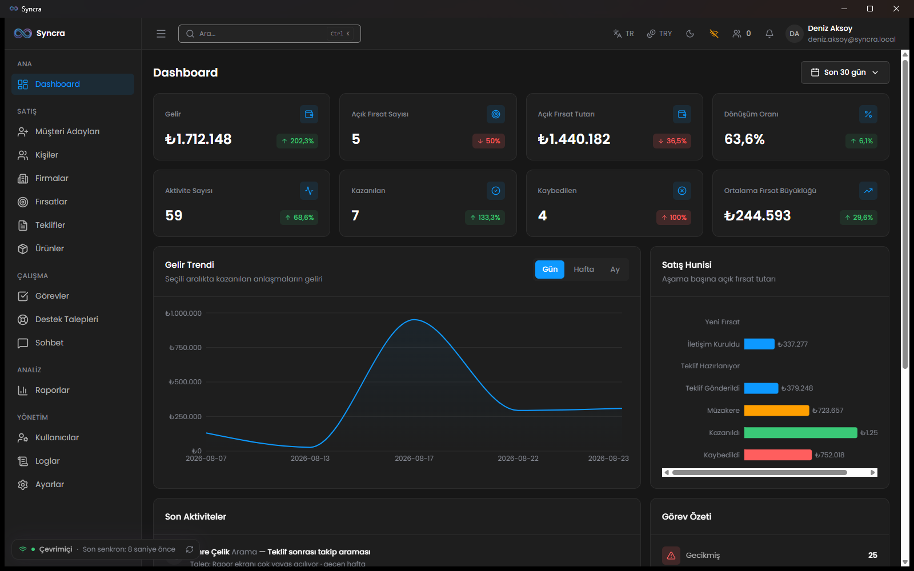
<!-- capture: giriş yapılmış Tauri uygulama penceresi, dashboard görünür, ConnectivityBar "Online · Xsn önce senkronlandı" durumunda -->
*Masaüstü kabuğu — web uygulamasıyla aynı dashboard ve modüller, üstte docklenmiş bağlantı çubuğuyla native Tauri penceresi içinde çalışıyor.*

## Proje Yapısı

| Dizin | Açıklama |
| --- | --- |
| `desktop/` | Tauri 2 masaüstü kabuğu (`src-tauri/`), arayüzden bağımsız bir Rust lib crate olarak senkron motoru (`crates/syncra-sync/`), ve yalnızca masaüstüne özgü TypeScript (`src/`). Aşağıda [Mimari](#mimari-kısa) bölümüne bakın. |
| `backend/` | Laravel 12 REST API (Sanctum kimlik doğrulama, Reverb gerçek zamanlı olaylar, artı bu istemcinin konuştuğu cihaz-belirteci/delta-senkron katmanı). Masaüstü istemcisinin geliştirme ve senkron için yerel bir API'ye ihtiyacı olduğu için bu repoda tutulur; bağlayıcı dokümantasyon web projesinin reposundadır. |
| `frontend/` | Masaüstü kabuğunun arayüzü olarak değiştirilmeden yeniden kullandığı `src/`'e sahip React 18 + Vite tek sayfa uygulaması. Bağlayıcı dokümantasyon web projesinin reposundadır. |
| `docs/` | Masaüstü mühendislik dokümanları (şartname, karar günlükleri, tehdit modeli — bkz. [Dokümantasyon](#dokümantasyon)) artı bu reponun web-proje geçmişinden devraldığı backend/frontend dokümanları (bkz. [Ek](#ek-bu-masaüstü-kabuğunun-sardığı-web-uygulaması)). |

## Özellikler

Masaüstü istemcisi web uygulamasıyla aynı CRM'i taşır — lead, kişi, firma, fırsat, teklif, destek talebi, görev, sohbet, raporlar, ayarlar, hepsi (kendi ekran görüntüleriyle tam özellik turu için [Ek](#ek-bu-masaüstü-kabuğunun-sardığı-web-uygulaması) bölümüne bakın). Masaüstü kabuğuna özgü olan aşağıdakiler: offline çalışabilen bir yerel ayna ve tarayıcının veremeyeceği bir dizi OS entegrasyonu.

### Offline-first ayna
Motor, verinizin yerel, SQLCipher ile şifrelenmiş bir SQLite kopyasını (`rusqlite`, `bundled-sqlcipher-vendored-openssl`) artı bekleyen mutasyonların bir outbox'ını tutar. Bu salt-okunur bir önbellek değildir: hem kayıtları okumak hem de oluşturmak/düzenlemek ağ olmadan tamamen çalışır — bir create, update, move veya delete outbox'a kuyruğa girer ve bağlantı geri geldiği anda, doğru sırayla gönderilir. Delta sync yalnızca son `sync_version` imlecinizden bu yana değişeni çeker, böylece offline'dan sonra yeniden bağlanmak her şeyi yeniden indirmek anlamına gelmez.

<!-- TODO(screenshot):  — not captured yet; see the capture brief below. Commented out rather than left broken: a missing image renders as a broken-image icon on GitHub, which is worse than no image. -->
<!-- capture: ConnectivityBar "Offline" durumunda, en az bir kaydın pending-sync rozeti görünür -->
*Bağlantı çubuğu ağ kesilir kesilmez "Offline"a döner — offline iken oluşturduğunuz veya düzenlediğiniz kayıtlar, gönderilene kadar bekliyor rozeti taşır.*

### Çakışma yönetimi
İki kişi aynı kaydı düzenler ve her iki değişiklik de sunucuya ulaşırsa, sistem sessizce bir kazanan seçmez: varsa önce sunucu-tarafı bir kural devreye girer, yoksa alan bazlı last-write-wins'e düşer, ve hâlâ belirsiz kalan her şey bir insanın çözmesi için **Conflict Inbox**'a düşer — kendi versiyonunuzu koruyun, sunucununkini alın, veya alan alan birleştirin. Hiçbir şey sessizce üzerine yazılmaz.

<!-- TODO(screenshot):  — not captured yet; see the capture brief below. Commented out rather than left broken: a missing image renders as a broken-image icon on GitHub, which is worse than no image. -->
<!-- capture: en az iki bekleyen çakışmalı Conflict Inbox ekranı, diff görünümü görünür -->
*Conflict Inbox, değişikliğinizi sunucununkiyle karşılaştıran bir diff gösterir ve kendinizinkini korumanıza, sunucununkini almanıza veya alan alan çözmenize izin verir.*

### Sistem tepsisi & arka plan senkron
Pencereyi kapatmak uygulamayı kapatmaz — sistem tepsisine iner ve arka planda senkronlamaya devam eder. Tepsi ikonunun kendisi güncel durumu yansıtır (online / offline / syncing / conflict), ve menüsü — Open, Sync now, Quick capture, Pause sync, Quit — hesabınızın ayarlı olduğu dört arayüz dilinden hangisiyse onunla çizilir, çünkü tepsi web view'ından (ve onun i18n örneğinden) önce var olur.

<!-- TODO(screenshot):  — not captured yet; see the capture brief below. Commented out rather than left broken: a missing image renders as a broken-image icon on GitHub, which is worse than no image. -->
<!-- capture: sağ tık tray menüsü açık, Open/Sync now/Quick capture/Pause sync/Quit görünür, tray ikonu "syncing" durumunda -->
*Tray menüsü — Open, Sync now, Quick capture, Pause sync, Quit — tray ikonunun durum noktası motorun güncel durumunu yansıtıyor.*

### Native bildirimler
Yeni ticket'lar, fırsat atamaları, mention'lar ve `notifications` tablosunun geri kalanı, satır ister arka plan pull'undan ister canlı bir Reverb olayından gelsin, native bir OS toast'ı tetikler ve görev çubuğu rozetini günceller. Daha önce görülmüş bildirimler bir daha toast'lanmaz, ve ilk açılışta geri yüklenen büyük bir birikinti, bir toast duvarı açmadan rozette sayılır.

<!-- TODO(screenshot):  — not captured yet; see the capture brief below. Commented out rather than left broken: a missing image renders as a broken-image icon on GitHub, which is worse than no image. -->
<!-- capture: uygulamanın tetiklediği bir OS-seviyesi toast bildirimi (örn. yeni ticket ataması), bağlam için OS bildirim alanı görünür -->
*Yeni bir atama native bir OS toast'ı tetikler — bu uygulama-içi bir banner değil, platformun kendi bildirimidir.*

### Hızlı kayıt (global kısayol)
Yapılandırılabilir bir global kısayol, ana pencereyi beklemeden — anında — küçük, çerçevesiz bir popup açar; lead, görev, aktivite veya not yakalamak için dört sekmeyle. Uygulamanın geri kalanıyla aynı offline-çalışabilir mutasyon yolundan yazar, dolayısıyla hızlı kayıt da bağlantı olmadan çalışır.

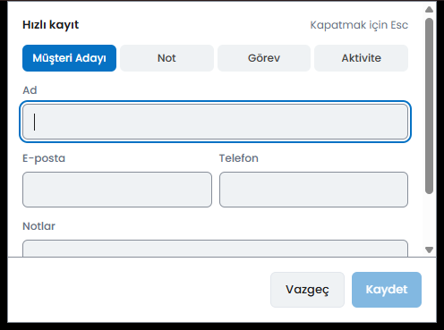
<!-- capture: global kısayolla açılmış çerçevesiz hızlı-kayıt popup'ı, Lead sekmesi aktif, örnek veri doldurulmuş -->
*Hızlı kayıt popup'ı — her yerden global kısayolla açılır, dört sekme, offline çalışır.*

### Deep link'ler
Bir `syncra://<entity>/<id>` linkine tıklamak — e-postadan, sohbetten veya başka herhangi bir yerden — uygulama henüz çalışmıyor olsa bile uygulamayı açar ve doğrudan o kayda yönlendirir: hedef, web view alıcıya hazır olana kadar tutulur, böylece soğuk bir başlangıç linki hiç kaybetmez.

### Pano yakalama (opt-in, varsayılan kapalı)
Açıkça etkinleştirildiğinde, uygulama panoyu bir e-posta adresine veya E.164 telefon numarasına benzeyen bir şey için izler ve bunu lead olarak eklemeyi önerir. **Varsayılan olarak kapalıdır** (K10) ve özellik etkinleştirilmediği sürece altta yatan pano-okuma izni webview'e hiç verilmez — bu arada hiçbir şey diske yazılmaz veya loglanmaz.

### Dosya sürükle-bırak & ekran görüntüsü → ticket
Uygulamaya bir dosya bırakmak onu altındaki kayda ekler. Bir ticket detay görünümü ayrıca birincil ekranı yakalayan, o ticket'ın sohbetine ekleyen ve — diğer her yazma gibi — offline iseniz başarısız olmak yerine kuyruğa alan tek tıkla "ekranı yakala" eylemi sunar.

### Teklif PDF önbelleği
Bir teklifin PDF'i bir kez açıldığında yerelde önbelleğe alınır, böylece daha sonra — bağlantı olmadan dahil — tekrar açmak sunucuya tekrar gitmeyi gerektirmez.

### Depolama denetimi
Bir Storage ayarları ekranı, bu uygulamanın ne kadar yerel disk kullanmasına izin verildiğini görmenizi ve ayarlamanızı sağlar — gün cinsinden saklama penceresi, bir veritabanı boyutu tavanı, bir outbox boyutu tavanı (varsayılanlar 30 gün / 500 MB / 5.000 bekleyen mutasyon, tehlikeli derecede düşük ayarlanamasınlar diye zorunlu alt sınırlarla) — artı saklama penceresini geçici olarak genişletmek için bir **Download archive** eylemi ve aynayı silmek için bir **Clear local** eylemi. Ayrı bir Devices ekranı bu hesabın diğer cihaz belirteçlerini listeler ve iptal etmenize izin verir (`GET`/`DELETE /api/me/devices`).

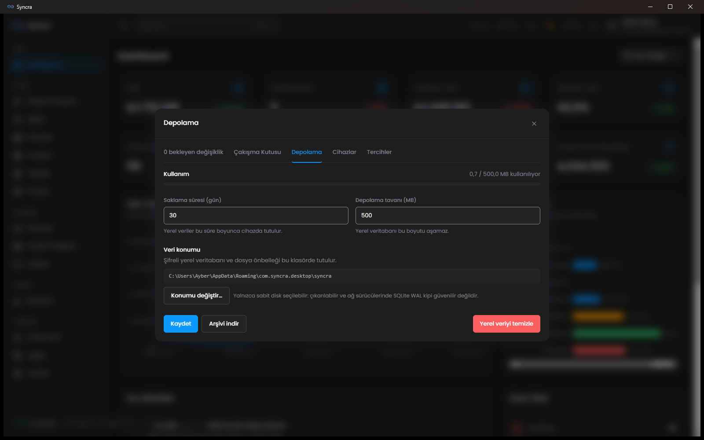
<!-- capture: retention-days alanını, boyut tavanlarını ve Download archive / Clear local butonlarını gösteren Storage ayarları paneli -->
*Storage ayarları — saklama penceresi, boyut tavanları, tek tıkla arşiv indirme / yerel temizleme.*

## Teknoloji Yığını

| Katman | Teknoloji | Sürüm / Not |
| --- | --- | --- |
| Kabuk | Tauri | 2 (`tauri = "2"`, `@tauri-apps/cli` 2.11.4, `@tauri-apps/api` ^2.11.0) |
| Kabuk | Rust | `rustc 1.98.0` (her iki crate'te `rust-version = "1.80"` MSRV) |
| Senkron motoru | `rusqlite` | 0.32, `bundled-sqlcipher-vendored-openssl` özelliği — yerel şifreli SQLite aynası, artı `functions`/`backup` |
| Senkron motoru | `reqwest` | 0.12, `rustls-tls` — pull/push HTTP istemcisi |
| Senkron motoru | `tokio` | 1, `rt-multi-thread` — senkron zamanlayıcısı için async runtime |
| Senkron motoru | `keyring` | 3 — cihaz belirteci ve SQLCipher anahtarı için OS keychain depolaması (K9: düz metin yok) |
| OS entegrasyonu | `xcap` | 0.9 — screenshot-to-ticket için ekran yakalama |
| OS entegrasyonu | Tauri eklentileri | `notification`, `global-shortcut`, `deep-link`, `autostart`, `updater`, `window-state`, `clipboard-manager`, `dialog`, `fs`, `os`, `process`, `shell`, `log`, `single-instance` — hepsi `2` |
| Arayüz | React | 18.3.1 — `frontend/src`, olduğu gibi yeniden kullanılır (bkz. [Mimari](#mimari-kısa)) |
| Arayüz | Vite | ^8.2.0 — ayrı masaüstü build konfigürasyonu (`vite.desktop.config.ts`) |
| Arayüz | Tailwind CSS | ^4.3.3 |
| Test | `vitest` | ^4.1.11 — masaüstü çalışma alanı birim testleri |
| Test | `cargo test` + `clippy` | `desktop/` cargo workspace (`crates/syncra-sync` + `src-tauri`) |

Bu istemcinin senkronladığı `backend/` ve arayüzünü yeniden kullandığı `frontend/`'in kendi, daha büyük bir yığını var (Laravel 12, MySQL/MariaDB, Reverb, React Router, TanStack Query, Zustand, i18next, ...) — bağlayıcı dokümantasyon için Ek'teki [Teknoloji Yığını (backend & frontend)](#teknoloji-yığını-backend--frontend) bölümüne veya web projesinin kendi README'sine bakın.

## Ön Koşullar

### Masaüstü istemcisi

| Bileşen | Sürüm / Not |
| --- | --- |
| Rust | `rustc 1.98.0` (`rustup` ile kurulu, stable kanal). Repoda pinlenmiş bir `rust-toolchain.toml` yok — `rustup`'ın varsayılan `stable` araç zinciri olduğu gibi kullanılıyor. |
| Node.js | v26.7.0 |
| npm | 11.19.0 |
| Linux sistem paketleri (`cargo build`/`tauri build` için) | `libwebkit2gtk-4.1-dev`, `libayatana-appindicator3-dev`, `librsvg2-dev`, `libxdo-dev`, `libssl-dev`, `patchelf`, `build-essential`, `curl`, `wget`, `file` — bu tam liste `.github/workflows/desktop-ci.yml`'deki gerçek kaynaktan alınmıştır. |
| Windows | Ekstra sistem paketi yok; vendored SQLCipher/OpenSSL derlemesi ayrıca `PATH`'te `ExtUtils::MakeMaker`'a sahip tam bir Perl gerektiriyor (Git Bash'in gömülü Perl'inde bu yok — tam hata şekli için CI iş akışındaki yorumlara bakın). |

**Tuzak:** `cargo` her kabukta `PATH`'te olmak zorunda değil. Bu makinede `%USERPROFILE%\.cargo\bin` altından çözülüyor (`rustc.exe`, `cargo.exe`, `cargo-clippy.exe`, ...); `cargo`/`rustc` "bulunamadı" derse, Rust'ın kurulu olmadığını varsaymadan önce bu klasörü kontrol edin.

### Yerel API yığını (backend + frontend, geliştirme için)

Masaüstü istemcisinin kimlik doğrulaması yapacağı ve senkronlayacağı çalışan bir backend'e ihtiyacı var, ve bu repo tam da bunun için `backend/` ve `frontend/`'i taşır. Bu proje aşağıdaki yerel ortamda doğrulanmıştır:

| Bileşen | Sürüm / Konum | Not |
| --- | --- | --- |
| PHP | 8.2.12 — `C:\xampp\php\php.exe` | `zip` ve `intl` eklentileri açık olmalı |
| Composer | 2.10.2 — `C:\xampp\php\composer.bat` | |
| MariaDB | 10.4.32 — `127.0.0.1:3306` | Kullanıcı `root`, şifre boş, utf8mb4. **Windows servisi olarak kurulu değildir**, XAMPP Control Panel'den başlatılmalıdır |
| Redis | 8.0.5 — WSL2 Ubuntu üzerinde, `127.0.0.1:6379` | Memurai kurulu değil |
| Node.js | v26.7.0 | |
| npm | 11.19.0 | |

Ek notlar:
- PHP için `redis` C eklentisi kurulu değildir; bu nedenle backend'de `predis/predis` paketi kullanılır (`REDIS_CLIENT=predis`).
- `C:\xampp\php` kullanıcı PATH'ine eklenmiştir. Bu değişiklik yalnızca **yeni açılan terminallerde** geçerlidir; eski terminallerde `php` komutu yerine tam yol (`C:\xampp\php\php.exe`) kullanılmalıdır.

#### Kurulum Adımları (Ön Koşullar)

**XAMPP:** PHP 8.2 veya üzeri şarttır — daha düşük bir sürüm Laravel 12'yi çalıştıramaz. XAMPP kurulumundan sonra `php.ini` dosyasında aşağıdaki satırların başındaki `;` işaretini kaldırın:
```ini
extension=zip
extension=intl
```

**Composer:** XAMPP ile birlikte gelen `composer.bat` kullanılabilir veya [getcomposer.org](https://getcomposer.org/) üzerinden ayrıca kurulabilir.

**Redis (Windows'ta iki seçenek):**
- **(a) WSL2 + Ubuntu (bu projede kullanılan yöntem):**
  ```
  wsl --install
  sudo apt install redis-server
  sudo service redis-server start
  ```
  Windows tarafından `127.0.0.1:6379` üzerinden erişilebilir.
- **(b) Memurai:** Windows-native Redis servisi, WSL2 istemeyenler için alternatiftir.

## Kurulum

1. Repoyu klonlayın.
2. Yerel API yığını (her hâlükârda gerekli — masaüstü build'i paylaşılan `frontend/src`'in kendi bağımlılıklarını da `frontend/node_modules`'tan çözer, yalnızca arayüz kodunu değil):
   1. MySQL'i başlatın: XAMPP Control Panel → **MySQL** → **Start**. phpMyAdmin kullanacaksanız **Apache**'yi de başlatın.
   2. Veritabanını oluşturun (veritabanı adı **`syncra_crm`** olmalıdır):
      - phpMyAdmin üzerinden, veya
      - komut satırından:
        ```
        mysql -u root -e "CREATE DATABASE syncra_crm CHARACTER SET utf8mb4 COLLATE utf8mb4_unicode_ci;"
        ```
   3. Redis'i başlatın (WSL içinden): `sudo service redis-server start`. Doğrulamak için: `redis-cli ping` → `PONG` dönmelidir.
   4. Backend kurulumu:
      ```
      cd backend
      composer install
      cp .env.example .env
      php artisan key:generate
      php artisan migrate --seed
      ```
      Bu komut roller, izinler ve Super Admin hesabını oluşturur (giriş bilgileri aşağıda [Varsayılan Hesaplar](#varsayılan-hesaplar)).
   5. Frontend kurulumu:
      ```
      cd frontend
      npm install
      cp .env.example .env
      ```
      Not: Tailwind v4 kullanıldığı için `tailwind.config.js` yoktur; tema `frontend/src/styles/tokens.css` içinde `@theme` ile tanımlanır.
3. Masaüstü istemcisi kurulumu:
   ```
   cd desktop
   npm install
   ```

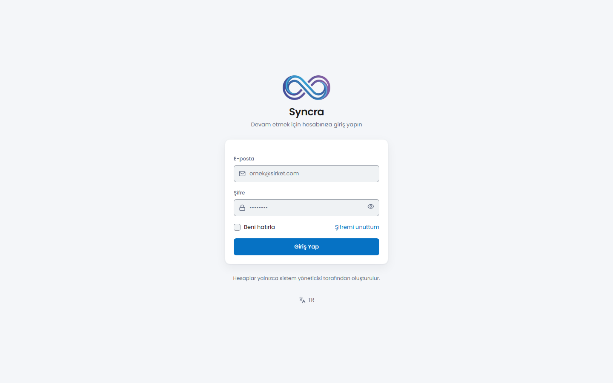
*Giriş ekranı — sistem kapalı devre olduğu için içeri girmenin tek yolu da budur: public kayıt formu yoktur. Burada web build'inden gösteriliyor; masaüstü kabuğu aynı ekranı native pencere içinde render eder.*

## Çalıştırma

### Masaüstü istemcisi

```
cd desktop
npm run dev
```

Bu, Tauri kabuğunu Vite dev sunucusuna (port 1420, sabit — `strictPort: true`) karşı başlatır. Aşağıdaki yerel API yığınıyla konuşur, dolayısıyla o da çalışıyor olmalı — en azından giriş ve gerçek zamanlı güncellemeler için API ve Reverb.

`desktop/package.json`'daki gerçek script adları:

| Script | Ne çalıştırır |
| --- | --- |
| `npm run dev` | `node scripts/tauri.mjs dev` — Tauri kabuğunu Vite dev sunucusuna karşı başlatır. |
| `npm run dev:desktop` | `vite --config vite.desktop.config.ts` — Tauri kabuğu olmadan yalnızca frontend dev sunucusu. |
| `npm run build:desktop` | `tsc -b && vite build --config vite.desktop.config.ts` — web varlıklarını tip kontrolünden geçirip `desktop/dist`'e derler. |
| `npm run tauri` | `node scripts/tauri.mjs` — `@tauri-apps/cli`'ı saran ince bir sarmalayıcı; ayrıca `frontend/.env`'den okunan build-time CSP'yi enjekte eder. |
| `npm test` | `vitest run` — masaüstü çalışma alanının birim testleri (wire-fixture composer + mapper'lar; `wire-fixtures/`'ın Rust crate ve PHPUnit'in yanındaki üçüncü tüketicisi). |

### Yerel API yığını

| Süreç | Komut | Port |
| --- | --- | --- |
| API | `cd backend && php artisan serve` | 8000 |
| WebSocket (Reverb) | `cd backend && php artisan reverb:start` (ws://localhost:8080) | 8080 |
| Queue worker | `cd backend && php artisan queue:work` | — |
| Scheduler | `cd backend && php artisan schedule:work` | — |
| Frontend (web SPA, opsiyonel) | `cd frontend && npm run dev` | 5173 |

Alternatif olarak, kök dizindeki **`dev.bat`** dosyası çalıştırılarak ilk dördü tek tıkla, her biri kendi penceresinde başlatılabilir — ayrıca MySQL'in (3306 portu) ve Redis'in (6379 portu) zaten dinlemede olup olmadığını kontrol eder ve gerekirse sizin için başlatır (MySQL, XAMPP'in `mysqld`'i ile; Redis, açık bırakılması gereken ayrı, uzun ömürlü bir WSL penceresi içinde).

`php artisan schedule:work` üç zamanlanmış komut çalıştırır: `logs:prune` her gün 03:17'de eski log kayıtlarını budar (page_visit_logs 90 gün, session_logs ve activity_log 365 gün sonra), `tasks:dispatch-reminders` dakikada bir görev hatırlatıcılarını gönderir, `tickets:scan-sla` 5 dakikada bir SLA ihlali yaklaşan/aşan ticket'ları tarar. Hatırlatıcılar ve SLA taraması `schedule:work` çalışmadan işlemez — bu masaüstü istemcisi için de geçerlidir, çünkü hatırlatıcı/SLA durumu ona da aynı backend üzerinden ulaşır.

## Doğrulama Komutları

### Masaüstü

Derleyicinin göremediği kısımları on statik denetleyici korur (`desktop/scripts/` altında beş, `frontend/scripts/` altında beş) — her biri hiçbir şeyin başka türlü birbirine bağlamadığı iki veya daha fazla kaynağı çapraz karşılaştırır:

| Komut | Ne kontrol eder |
| --- | --- |
| `cd desktop && npm run check:commands` | Tauri komut adının Rust `#[tauri::command]` fonksiyonu, `desktop/src`'teki `invoke('...')` çağrı noktaları ve `SYNCDESKTOP.md` §6.2 sözleşmesi arasında eşleşmesi. |
| `cd desktop && npm run check:data` | Masaüstü `DataSource` manifest'i — her sözleşme metodunun gerçekten bir query/mutate/http/hybrid veri yoluna bağlı olduğu, hiçbirinin `NOT_IMPLEMENTED` bırakılmadığı. |
| `cd desktop && npm run check:realtime` | Realtime köprüsü — web kanalları/olayları ile masaüstü `bridge/realtime.ts` haritası, Tauri komutu ve Rust `Entity` sözlüğü arasında. |
| `cd desktop && npm run check:identifier` | `tauri.conf.json`'ın `identifier` alanının var ve sabit olduğu (bu alan kullanıcı-başı verinin OS depolama anahtarıdır — değişen bir değer yerel ayarları sessizce kaybettirir). |
| `cd desktop && npm run check:errors` | `desktop/src/ui/errors.ts`'teki `KNOWN_ERROR_CODES` izin listesi ile `desktop.json`'daki `errors.*` anahtarları arasındaki simetri. |
| `cd frontend && npm run i18n:check` | tr/en/de/fr arası çeviri anahtar-paritesi (iki yönde) + statik kod→sözlük taraması — web uygulamasıyla aynı, `desktop` namespace'i dahil. |
| `cd frontend && npm run i18n:check-bootstrap` | i18n bootstrap/config sağlık kontrolü — yalnızca web girişini değil, `desktop/src/main.desktop.tsx`'in kaynak metnini de doğrular. |
| `cd frontend && npm run i18n:dead-keys` | Hiçbir kaynak dosyanın referans vermediği sözlük anahtarlarını raporlar (yalnızca rapor, sert kapı değil). |
| `cd frontend && npm run i18n:notifications` | `backend/lang/*/notifications.php` ile `frontend/src/i18n/locales/*/notifications.json` arasındaki sapmayı çapraz kontrol eder. |
| `cd frontend && npm run test:money-currency` | Web uygulamasıyla paylaşılan para birimi sembolü/biçimlendirme regresyon kontrolü. |

```
cd desktop
npm test                                             # vitest — wire-fixture composer + mapper'lar
npm run build:desktop                                # tsc -b && vite build — tip kontrolü + desktop/dist derlemesi
cargo test --workspace                                # crates/syncra-sync + src-tauri
cargo clippy --workspace --all-targets -- -D warnings
```

⚠️ **`tsconfig.app.json` tuzağı:** solution-style bir konfigürasyona karşı çıplak `tsc --noEmit` sessizce hiçbir şey kontrol etmez. `desktop/tsconfig.json` tam bu yüzden doğrudan `frontend/tsconfig.app.json`'ı extend eder — masaüstü girişini tip kontrolünden geçirmenin doğru yolu `npm run build:desktop` (`tsc -b`) komutudur; aynı kural aşağıdaki `frontend`'in kendi `npx tsc -p tsconfig.app.json --noEmit` komutu için de geçerlidir.

### Tam regresyon kapısı (backend + frontend)

Aşağıdaki komutlar projenin standart regresyon kapısıdır — `backend/`, `frontend/` veya `desktop/`'a (masaüstü build'i `frontend/src`'e karşı tip kontrolü yaptığı için) yapılan her değişiklik tamamlanmış sayılmadan önce yeşil olmalıdır. Güncel durum: `docs/PROGRESS.md`.

| Komut | Ne kontrol eder | Sonuç |
| --- | --- | --- |
| `cd backend && php artisan test` | Tüm backend test paketi (feature + unit) | **1316 test / 9695 assertion (2026-08-25)**, kanonik `syncra_crm_test` veritabanında tek başına koşuldu |
| `cd frontend && npx tsc -p tsconfig.app.json --noEmit` | Frontend TypeScript tip kontrolü | ⚠️ **Çıplak `npx tsc --noEmit` komutunu repo kökünden ÇALIŞTIRMAYIN** — kök `tsconfig.json` solution-style'dır (yalnızca `references` taşır, kendi dosyası yoktur) ve komut tek bir dosya bile kontrol etmeden sessizce 0 kodla çıkar. Her zaman `-p tsconfig.app.json` verin. |
| `cd frontend && npm run i18n:check` | tr/en/de/fr arası çeviri anahtar-paritesi (iki yönde) + statik kod→sözlük taraması | İki yönde de yeşil |
| `cd frontend && npm run i18n:check-bootstrap` | i18n bootstrap/config sağlık kontrolü | Yeşil |
| `cd frontend && npm run test:money-currency` | Para birimi sembolü/biçimlendirme regresyon kontrolü (`money.ts`, `currencyDisplay: 'narrowSymbol'`) | 16/16 |

## Paketleme

```
cd desktop
npm run tauri -- build
```

`desktop/src-tauri/tauri.conf.json`, `bundle.targets`'ı `"all"` olarak ayarlar — yani belirli formatları adlandırmak yerine Tauri'den host işletim sistemi için mevcut olan her paket formatını ister. Bu repoda henüz paketlenmiş bir build çalıştırılmadı — bu bölüm yazılırken paralel bir şerit onu ilk kez çalıştırıyor — bu yüzden burada artefakt listesi veya boyutu iddia edilmiyor; o iş inince güncel durum için `docs/PROGRESS.md`'ye bakın.

## Kendi Sunucunda Barındırma

**Sınır (KARAR K14, bağlayıcı):** masaüstü istemcisi **her zaman** bir Laravel backend'inin istemcisidir — standalone/offline-only bir mod yoktur ve backend hiçbir zaman kuruluma gömülmez (K14 ikisini de kalıcı olarak reddetti: yetkilendirme, teklif finansalları, ticket durum makinesi ve SLA tamamen sunucu tarafındadır, ve yerel ayna bilinçli olarak eksiktir — retention penceresi dışındaki kayıtlar hiç inmez — dolayısıyla kaynak olamaz). Bu bölüm bir **"kendi backend'ini kur"** rehberidir, **"backend'siz çalıştır"** rehberi değildir — aşağıdakilerin tamamını kurup son adımı (masaüstü build'ini kendi sunucunuza yönlendirmeyi) atlarsanız, çalışan bir web uygulamanız olur ama masaüstü uygulaması yine de `http://localhost:8000`'i bekler.

### 1. Bağımlılıklar

| Bileşen | Gereksinim | Not |
| --- | --- | --- |
| PHP | `^8.2` (`backend/composer.json:8`) | Laravel 12, 8.2+ ister. Bu reponun kendi geliştirme ortamında 8.2.12 olarak doğrulandı (`docs/PROGRESS.md` "Ortam Durumu"). |
| PHP eklentileri | `zip` (zorlanıyor), `intl` (isteğe bağlı) | İkisi de `backend/composer.json`'ın kendi `require`'ında yok, ama davranışları farklı ve bu fark önemli. **`zip` yine de zorlanıyor**: `composer.lock`'ta dört paket `ext-zip` bildiriyor, yani `composer install` o eklenti olmadan devam etmiyor — bu yoldan bozuk bir kurulum elde edemezsiniz. **`intl` ise tasarım gereği isteğe bağlı**: `app/Support/LocaleNumberFormatter.php:53` her kullanımı `class_exists(NumberFormatter::class)` arkasına alıyor ve eklenti yoksa geri düşüyor; yani `intl`'siz bir sunucu kurulur ve çalışır — yalnızca teklif PDF'lerindeki sayı biçimlendirmesi yerel-duyarlı olmaktan çıkar (tek tüketici `resources/views/pdf/quote.blade.php`). O biçimlendirme sizin için önemliyse açın; açmazsanız hiçbir şey kırılmaz. |
| Composer | 2.x | 2.10.2 doğrulandı. |
| MariaDB / MySQL | 10.4+ (MariaDB) veya MySQL 8+ | Collation `DB_COLLATION=utf8mb4_unicode_ci` ile **mutlaka** ayarlanmalı — Laravel'in kendi varsayılanı (`utf8mb4_0900_ai_ci`) MySQL 8'e özgüdür ve MariaDB bunu reddeder (`backend/config/database.php:52`, `backend/.env.example:42`). |
| Redis | Herhangi bir güncel sürüm | `REDIS_CLIENT=predis` (saf PHP istemci) `redis` C eklentisi olmadan çalışır — bu reponun kendi ortamında da bu eklenti kurulu değil. |
| Node.js / npm | npm 11+ ile Node | v26.7.0 / 11.19.0 doğrulandı. Hem `frontend/` hem `desktop/` için gerekli. |

Tam doğrulanmış sürüm tablosu (PHP, Composer, MariaDB, Redis, Node, Laravel, Reverb, dompdf, ...): `docs/PROGRESS.md` → "Ortam Durumu".

### 2. Veritabanı

```
mysql -u root -e "CREATE DATABASE <veritabani_adiniz> CHARACTER SET utf8mb4 COLLATE utf8mb4_unicode_ci;"
```

Veritabanı adı `syncra_crm` olmak zorunda değil — bu yalnızca bu reponun kendi geliştirme kuralı; ne kullanırsanız aşağıda `DB_DATABASE`'e girer.

### 3. Backend `.env`

```
cd backend
cp .env.example .env
php artisan key:generate
```

Gerçek bir dağıtım için örnekten gerçekten değişmesi gereken şeyler (geri kalanının çalışan bir varsayılanı var):

| Değişken(ler) | Neden önemli |
| --- | --- |
| `APP_URL`, `FRONTEND_URL` | Bunları `localhost` değil, gerçek adreslerinize yönlendirin. |
| `DB_HOST`/`PORT`/`DATABASE`/`USERNAME`/`PASSWORD`, `DB_COLLATION` | 2. adımdaki veritabanınız. MariaDB'de `DB_COLLATION=utf8mb4_unicode_ci` kalmalı. |
| `REDIS_HOST`/`PORT`/`PASSWORD` | Redis örneğiniz. |
| `REVERB_APP_ID`/`APP_KEY`/`APP_SECRET` | Yerel geliştirme dışındaki her şey için örneğin yer tutucu değerlerinden değiştirin. |
| `REVERB_HOST`/`PORT`/`SCHEME` vs `REVERB_SERVER_HOST`/`SERVER_PORT` | Bunlar **aynı şey değildir** ve örneğin varsayılanları (`backend/.env.example:101-108`) yalnızca tek makinede eşleşir: `REVERB_SERVER_HOST`/`SERVER_PORT`, `reverb:start`'ın dinlediği yerel bind adresidir; `REVERB_HOST`/`PORT`/`SCHEME` ise istemcilere (SPA ve masaüstü istemcisi) bağlanmalarını söylediğiniz adrestir — bir reverse proxy veya TLS sonlandırma arkasında bunlar ayrışır (ör. sunucu `127.0.0.1:8080`'e bind olur, istemciler `wss://reverb.example.com`'a bağlanır). |
| `DESKTOP_ORIGINS` | **Masaüstüne özgü ve kolayca gözden kaçar** — `FRONTEND_URL` bunu kapsamaz. Masaüstü webview'inin origin'(lerini) buraya ekleyin (Windows'ta `http://tauri.localhost`, Linux'ta `tauri://localhost` — bkz. `backend/.env.example:9-20`'deki yorum). |
| `SESSION_DOMAIN`, `SANCTUM_STATEFUL_DOMAINS` | Üretimde gerçek web domain'inize ayarlayın. **Bir masaüstü origin'ini asla `SANCTUM_STATEFUL_DOMAINS`'e eklemeyin** — o liste yalnızca SPA'nın çerez oturumu içindir; masaüstü istemcisi bearer token ile kimlik doğrular. İkisini karıştırmak `EnsureFrontendRequestsAreStateful`'ın masaüstü isteklerini oturum isteği sanmasına yol açar, ve her masaüstü `POST`'u (ilki `/api/broadcasting/auth`) geçerli bir token taşırken bile `419 CSRF_TOKEN_MISMATCH` ile başarısız olur — tam uyarı için `backend/.env.example:65-78`'e bakın (KARAR A12). |

### 4. Kurulum, migration, seed

```
cd backend
composer install
php artisan migrate --seed
```

⚠️ **`--seed`, temiz olmayan herhangi bir veritabanında yıkıcıdır.** Varsayılan rolleri/izinleri ekler ve Super Admin hesabını oluşturur (`admin@syncra.local` / `SyncraAdmin!2026`, `must_change_password=true`) — yalnızca boş bir şemaya karşı çalıştırın. Bu veriye zaten sahip bir veritabanına karşı tekrar çalıştırmak unique-constraint ihlalleriyle başarısız olur (veya seeder'a göre lookup verisini yineler). Seed edilen Super Admin şifresini ilk girişte değiştirin — uygulama bunu zorunlu kılar — ve herhangi bir gerçek kullanımdan önce tekrar değiştirin; bu yayınlanmış bir varsayılandır, gizli değil.

### 5. Ayakta kalması gereken süreçler

| Süreç | Komut | Not |
| --- | --- | --- |
| API | `php artisan serve` (veya gerçek bir web sunucusu — aşağıya bakın) | `artisan serve`'in tek-iş-parçacıklı dev sunucusu bu reponun kendi araçlarının kullandığı şeydir; üretim dağıtımı bunu nginx/php-fpm veya eşdeğeriyle önden geçirmelidir, bu reponun kapsamı dışındadır. |
| WebSocket (Reverb) | `php artisan reverb:start` | `REVERB_SERVER_HOST`/`SERVER_PORT`'a bind olur (3. adıma bakın). |
| Queue worker | `php artisan queue:work` | |
| Scheduler | `php artisan schedule:work` | **Sürekli çalışmalıdır** — `backend/routes/console.php`'deki dört zamanlanmış komutu gerçekten tetikleyen budur: `logs:prune` (günlük 03:17), `tasks:dispatch-reminders` (dakikada bir), `tickets:scan-sla` (5 dakikada bir), `exchange:fetch-tcmb` (günlük 16:00, TCMB'nin ~15:30 yayın saatine uygun). O olmadan hatırlatıcılar/SLA uyarıları/kur güncellemesi sessizce durur — hiçbir hata vermez, sadece olmaz. |

`attachments:prune-orphans` bir komut olarak var ama `routes/console.php`'ye **kayıtlı değil** — zamanlaması operatöre bırakılmıştır (bilinçli bir kapsam kararı, `docs/ENGINEERING-RULES.md` §6), bu reponun araçlarının sizin yerinize yaptığı bir şey değil.

`dev.bat` (repo kökü), MySQL ve Redis'i kontrol edip başlatan ve Reverb/API/queue/scheduler/frontend için beş pencere açan bir Windows/XAMPP kolaylık script'idir — bir süreç denetleyicisi değildir. Gerçek bir self-host dağıtımı için aynı süreç listesini (API, Reverb, queue, scheduler) platformunuzun kullandığı herhangi bir denetleyiciyle (systemd, supervisord, NSSM, pm2, Docker, ...) yeniden üretin.

### 6. Masaüstü istemcisini kendi sunucunuza yönlendirme

K14'ün sınırının gerçekten anlattığı adım budur, ve tek bir katı kısıtı var: **`frontend/.env`'in `VITE_API_URL` ve `VITE_REVERB_*` değerleri, çalışma anında değil, derleme zamanında masaüstü ikili dosyasına gömülür.** `desktop/scripts/tauri.mjs`, her `tauri dev`/`build`'den önce bunlardan iki şey türetir (`desktop/scripts/build-env.mjs` aracılığıyla):

- `SYNCRA_API_URL` — `desktop/src-tauri/src/state.rs`'teki `option_env!("SYNCRA_API_URL")` ile gömülür, uygulamanın yaptığı her HTTP çağrısının çözüldüğü temel URL;
- paketlenmiş webview'in Content-Security-Policy `connect-src`'i — dolayısıyla bir build, bir CSP ihlali olmadan başka bir host ile kelimenin tam anlamıyla konuşamaz.

Zaten build edilmiş bir kurulumu farklı bir backend'e yönlendirecek **hiçbir uygulama-içi ayarlar ekranı yoktur**. Bunu çalışma anında yapılandırılabilir kılmak kendi karar turu olarak izlenir (`SYNCDESKTOP.md` §10 F8/3) ve **henüz uygulanmadı** — bugün backend adresini değiştirmek `frontend/.env`'i düzenleyip yeniden build almak demektir.

> **⚠️ Kendi build'inizi başkasına dağıtmadan önce: updater'ı kapatın, yoksa sizin build'inizin yerini bizimki alır.**
>
> `desktop/src-tauri/tauri.conf.json` **tek ve sabit** bir updater endpoint'i (bu projenin GitHub Releases `latest.json`'ı) ve **bu projenin** minisign public key'ini taşıyor. Bu depodan ürettiğiniz bir build ikisini de devralır. Yani resmî bir Syncra sürümü yayınlandığı anda sizin kurulumunuz *bizim* endpoint'imizi yoklar, zaten güvendiği bir anahtarla imzalanmış bir güncelleme bulur ve `windows.installMode: "passive"` ile onu kurar. Kullanıcılarınız *bizim* derlediğimiz backend'e göre derlenmiş bir binary çalıştırmaya başlar ve istemcileri sizin sunucunuza ulaşamaz.
>
> Bu varsayım değil, mevcut konfigürasyonun tasarım gereği yaptığı şey — ve per-backend build modeline karşı en güçlü pratik argüman (`SYNCDESKTOP.md` §10 F8/3 bunu launch-time yapılandırmayla değiştirmeye karar verdi, ama henüz uygulanmadı). O gelene kadar, build'iniz kendi makinenizden çıkacaksa derlemeden önce şunlardan birini yapın:
>
> - `tauri.conf.json`'dan `plugins.updater` bloğunu kaldırın, **ya da**
> - `endpoints`'i kendi güncelleme sunucunuzla, `pubkey`'i kendi minisign anahtarınızla değiştirin (`npm run tauri -- signer generate`).
>
> Yalnız kendi yönettiğiniz makinelerde kalan ve hiç güncelleme yayınlamayan bir build pratikte etkilenmez, ama kontrol yine de koşar — endpoint her ağdan erişilebilir.

```
cd frontend
cp .env.example .env
# .env'i düzenleyin: VITE_API_URL, VITE_REVERB_HOST/PORT/SCHEME -> gerçek sunucunuz, localhost/127.0.0.1 değil
cd ../desktop
npm install
npm run tauri -- build
```

Kendi makinenizden çıkacak bir build üretiyorsanız önce release-host kapısını çalıştırın: `cd desktop && npm run check:release-host`. Bu, build'in kullanacağı aynı `frontend/.env`'i okur ve `VITE_API_URL`/`VITE_REVERB_HOST` hâlâ bir loopback veya link-local host'a (`localhost`, `127.0.0.0/8`, `::1`, bir `.local` mDNS adı) çözülüyorsa gürültülü şekilde başarısız olur — tam olarak, build eden makineye sessizce konuşan imzalı bir kurulum üreten hata. Bu projenin kendi CI release iş akışı (`.github/workflows/desktop-release.yml`) aynı kapıyı zorunlu kılar ve üretim `frontend/.env`'ini `secrets.DESKTOP_RELEASE_ENV`'den alır; bu yalnızca o iş akışını kendi CI'nız için uyarlıyorsanız ilgilidir, elle build için değil.

### 7. Windows dışı platformlar

Bu repo Windows üzerinde geliştirildi ve doğrulandı — `dev.bat`, XAMPP/WSL2-Redis kurulumu ve bu rehberdeki her sürüm numarası Windows ölçümleridir (`docs/PROGRESS.md`). Linux/macOS için:

- **Linux:** CI, `ubuntu-24.04` üzerinde bir debug paketi (`desktop-ci.yml`) ve `ubuntu-24.04` üzerinde bir release paketi (`desktop-release.yml`, bilinçli olarak geride tutuluyor — o iş akışının matrix yorumundaki glibc tabanına bakın) derliyor, ikisi de `libwebkit2gtk-4.1-dev`'e karşı. Bu bir derleme kontrolüdür, çalışan-uygulama doğrulaması değil: bu repoda masaüstü kabuğunun OS özelliklerinin (tray, bildirimler, deep link'ler vb.) gerçekten canlı bir Linux WebKitGTK build'inde çalıştırıldığına dair bir kayıt yok. SYNCDESKTOP K11, Linux'u (Ubuntu 22.04+/Fedora 39+, WebKitGTK 2.42+) Windows ile eşit birinci sınıf hedef olarak adlandırıyor, ama bu doğrulama turu bu rehber yazıldığı sırada bu reponun dokümanlarına henüz inmemişti.
- **macOS:** SYNCDESKTOP K11, macOS'un yalnızca derlendiğini, bilinçli olarak test edilmediğini belirtiyor. `desktop-release.yml`'de bir macOS release ayağı var (`macos-latest`), ama bu repoda macOS'a özgü hiçbir kurulum veya çalışma zamanı notu yok.
- Backend/frontend'in kendisi (PHP/Node/MariaDB/Redis) yukarıdaki 3. adımdaki CORS/CSRF notları dışında Windows'a özgü bir gereksinimi olmayan sıradan bir cross-platform Laravel + Vite yığınıdır. `dev.bat`'in otomasyonu (MySQL/Redis başlatma, pencere açma) burada gerçekten Windows'a özgü tek parçadır — onun yerine platformunuzun kendi servis yönetimini kullanın.

### 8. Sık hatalar

- **Eksik `zip`/`intl` PHP eklentisi:** Laravel daha ayağa kalkmadan bir fatal error (temiz bir Laravel hata sayfası değil, `Uncaught Error: Class "ZipArchive" not found` benzeri bir şey). İkisini de `php.ini`'de açın ve PHP'yi yeniden başlatın.
- **Redis WSL2 içinden erişilebilir ama Windows/host'tan "connection refused":** WSL2'nin `127.0.0.1` port aktarımı dağıtım boşta kalınca düşer — bu, projenin kendi Faz 12'sinde 12 testi kırdı (`docs/PROGRESS.md` "Ortam Durumu", Redis satırı) ve testlerin dışında bir uygulamayı da aynı şekilde vurur. Uzun ömürlü bir WSL süreci açık tutun (`dev.bat` bunu sizin için yapar), veya uygulamanın kendisinin bozuk olduğunu varsaymadan önce `redis-cli ping` çalıştırın.
- **Frontend'in kendi Vite dev sunucusu (port 5173) `127.0.0.1:5173`'te erişilemezken `localhost:5173` çalışıyor:** yalnızca `localhost`'ta (IPv6 `::1`) dinliyor, `127.0.0.1`'de değil — `127.0.0.1:5173`'e sabitlenmiş bir script veya tarayıcı, sunucu çalışmıyormuş gibi görünen bir bağlantı hatası alır (`docs/PROGRESS.md`).
- **Özellikle masaüstü istemcisinden CORS/`419` hataları, web uygulaması etkilenmiyor:** `DESKTOP_ORIGINS` eksik veya `SANCTUM_STATEFUL_DOMAINS`'e (yanlışlıkla) bir masaüstü origin'i verilmiş — yukarıdaki 3. adımdaki `DESKTOP_ORIGINS`/`SANCTUM_STATEFUL_DOMAINS` satırına bakın.
- **Başka bir yerel servis (ör. Docker Desktop) de 8000 portunu dinlerken backend'e erişilememesi:** `VITE_API_URL` için `localhost` yerine `127.0.0.1` kullanın — `localhost` önce `::1`'e çözülüp sessizce Laravel yerine diğer servise gidebilir (`frontend/.env.example:1-6`).
- **Kendi build ettiğiniz bir paketi kurduktan sonra "uygulama açılıyor ama hiçbir şey yüklenmiyor":** neredeyse her zaman 6. adımdaki tuzak — ikili dosya, erişilebilir bir sunucuyu göstermeyen bir `frontend/.env`'e (localhost varsayılanı dahil) karşı build edilmiş. `frontend/.env`'i düzeltip yeniden build alın; bir dahaki sefere paketlemeden önce `npm run check:release-host` çalıştırarak bunu erkenden yakalayın.

**Bu makinede doğrulanmadı:** Sıfırdan bir veritabanına karşı sıfırdan `composer install`/`npm install` (bu tur mevcut, zaten kurulu reponun üzerinde ölçüm yaptı — PHP 8.2.12'nin `zip`/`intl` açık olduğu ve Node v26.7.0/npm 11.19.0 canlı olarak yeniden kontrol edildi; kurulum/migration/seed sırasının kendisi, çalışan geliştirme veritabanına dokunmamak için burada baştan sona yeniden çalıştırılmadı). Yukarıdaki adımlar `backend/.env.example`, `backend/composer.json`, `backend/routes/console.php`, `desktop/scripts/*.mjs` ve `dev.bat`'ten aktarılmış, `docs/PROGRESS.md`'nin doğrulanmış-ortam kaydına karşı çapraz kontrol edilmiştir — baştan sona taze çalıştırılmamıştır.

## Mimari (kısa)

| Yol | Ne olduğu |
| --- | --- |
| `desktop/src-tauri` | Rust kabuğu — Tauri 2 uygulaması (`main.rs`, `lib.rs`, `commands/`, tray, deep link, clipboard, quick-capture penceresi). |
| `desktop/crates/syncra-sync` | Senkron motoru, arayüzden bağımsız bir Rust lib crate olarak: yerel SQLCipher ile şifrelenmiş SQLite aynası, outbox, conflict store, pull/push protokolü. |
| `desktop/src` | Yalnızca masaüstüne özgü TypeScript: Tauri giriş noktası (`main.desktop.tsx`), realtime/komut köprüsü ve masaüstü `platform` adaptörü. |
| `frontend/src` | Web uygulamasının kullandığı aynı React arayüzü, **olduğu gibi yeniden kullanılır** — bileşen ağacının masaüstüne özgü bir çatalı yok. |

İki uygulama `frontend/src`'i paylaşır ama onları birbirine bağlayan alias tek yönlüdür: `desktop/vite.desktop.config.ts` ve `desktop/tsconfig.json`'ın ikisi de `@`'yi `../frontend/src`'e işaret eder, `frontend/src`'in kendisi ise sıfır `@`-alias'lı import içerir ve masaüstü build'inin var olduğundan habersizdir.

## Masaüstü Senkronizasyon API'si (cihaz belirteci + delta senkron)

Bağlayıcı sözleşme: `docs/DESKTOP-SYNC-PROTOCOL.md`. Masaüstü istemcisi SPA oturum çerezi ile değil, **bearer token** ile kimlik doğrular. SPA'nın kendi `/broadcasting/auth`'u değişmemiştir; masaüstü `/api/broadcasting/auth`'taki ikinci kaydı kullanır.

| Metot + Yol | Ne yapar | Gereken izin | Not |
| --- | --- | --- | --- |
| `POST /api/auth/device` | Cihaz belirteci üretir (`desktop` ability, süresiz) | **Public** — auth zinciri yok | `throttle:login` ile aynı anahtarlı kilitleme (email+IP, 5/dk, 1→60 dk üstel). `device_fingerprint` başına tek token; eskisi silinir. Hatalar: `401 INVALID_CREDENTIALS`, `403 USER_INACTIVE`, `423 LOCKED_OUT` |
| `GET /api/me/devices` | Çağıranın kendi cihazlarını listeler | izin gerekmez | `password.changed` grubunun İÇİNDE — şifre değiştirmek zorunda olan kullanıcı cihaz yönetemez |
| `DELETE /api/me/devices/{token}` | Çağıranın kendi token'ını iptal eder | izin gerekmez | Başkasının token'ı için `404` |
| `GET /api/sync/manifest` | Protokol sürümü, izinli tablolar, efektif izinler, politika sınırları | `desktop` ability + cihaz belirteci | `throttle:30,1,sync`. `.view` izni olmayan modül `tables`'ta hiç yoktur — anahtarı bile gönderilmez |
| `POST /api/sync/pull` | `sync_version` ile keyset delta + tombstone'lar | `desktop` ability + cihaz belirteci | `throttle:30,1,sync`. Yanıt 5 MB'da `has_more=true` ile kesilir; `next_cursor` gönderilen SON satırda durur |
| `POST /api/sync/push` | Mutasyon batch'ini mevcut Action/Service/Policy katmanından geçirerek uygular | `desktop` ability + cihaz belirteci | `throttle:20,1,sync-push`; batch ≤ 200 mutasyon, ≤ 2 MB. Kısmi `200` meşrudur: `results`'ta olmayan `seq` istemcide kuyrukta kalır |
| `GET\|POST /api/broadcasting/auth` | Bearer ile kanal yetkilendirmesi | — | İkinci kayıt; SPA'nın `/broadcasting/auth`'una dokunulmadı |

Sync route zinciri: `auth:sanctum` + `active` + `password.changed` + `ability:desktop` + `device.token`. Sonuncusu gereksiz değildir: Sanctum her cookie oturumuna `can()`'i koşulsuz `true` dönen bir `TransientToken` verir, dolayısıyla `ability:desktop` tek başına bir SPA oturumunu **dışarıda tutmaz**.

Yeni hata kodları: `ONLINE_ONLY`, `UNRESOLVED_REFERENCE`, `FIELD_CONFLICT`, `RECORD_DELETED`, `PROTOCOL_VERSION_MISMATCH`, `PUSH_BATCH_TOO_LARGE`, `INVALID_MUTATION`, `ABILITY_REQUIRED`, `LOCKED_OUT`, `USER_INACTIVE`.

## Varsayılan Hesaplar

| E-posta | Şifre | Rol |
| --- | --- | --- |
| `admin@syncra.local` | `SyncraAdmin!2026` | Super Admin |

> **Uyarı:** Bu yalnızca yerel geliştirme içindir. Hesap `must_change_password=true` ile gelir; ilk girişte şifre değiştirme ekranı zorunludur (hem web uygulamasında hem masaüstü istemcisinde), ve değiştirilmeden hiçbir modüle erişilemez. Üretimde seeder'daki şifre mutlaka değiştirilmelidir.

Sistem kapalı devredir: public kayıt yoktur, yeni hesapları yalnızca Super Admin oluşturur. Masaüstü istemcisine ilk giriş, onun için de bir cihaz belirteci kaydeder (`POST /api/auth/device`) — yukarıda [Masaüstü Senkronizasyon API'si](#masaüstü-senkronizasyon-apisi-cihaz-belirteci--delta-senkron) bölümüne bakın.

## Güvenlik Notu

`.env` dosyaları asla repoya girmez; `.env.example` dosyaları eksiksiz tutulur. Sistem kapalı devredir — herkese açık kayıt (public registration) yoktur, kullanıcı hesapları yalnızca Super Admin tarafından oluşturulur.

Masaüstüne özgü: yerel ayna veritabanı SQLCipher ile şifrelenir, ve hem cihaz belirteci hem SQLCipher anahtarı `keyring` üzerinden OS keychain'de saklanır, asla düz metin dosya olarak değil (K9). Pano yakalama opt-in'dir ve varsayılan olarak kapalıdır; altta yatan OS pano-okuma izni özellik açılmadığı sürece webview'e verilmez (K10). Masaüstü istemcisi ve senkron API yüzeyi için tam STRIDE tehdit modeli için `docs/DESKTOP-THREAT-MODEL.md`'ye bakın.

## Dokümantasyon

Aşağıdaki dokümanlar iç geliştirme referanslarıdır ve **Türkçe** kalır — yalnızca bu README ve İngilizce karşılığı (`README.md`) iki dillidir.

| Doküman | Ne anlatır |
| --- | --- |
| [SYNCDESKTOP.md](SYNCDESKTOP.md) | Bağlayıcı masaüstü mühendislik şartnamesi — kararlar, fazlar, operasyonel kurallar. |
| [docs/DESKTOP-ARCHITECTURE.md](docs/DESKTOP-ARCHITECTURE.md) | Repo yerleşimi, Tauri kabuğu ve frontend adaptör sözleşmesi. |
| [docs/DESKTOP-SYNC-PROTOCOL.md](docs/DESKTOP-SYNC-PROTOCOL.md) | Backend senkron/kimlik doğrulama endpoint sözleşmesi ve `syncra-sync` crate'inin çakışma algoritması. |
| [docs/DESKTOP-OPEN-ITEMS.md](docs/DESKTOP-OPEN-ITEMS.md) | Açık işler defteri — bir madde ancak karar + kod + test üçü de tamamsa kapanmış sayılır. |
| [docs/DESKTOP-THREAT-MODEL.md](docs/DESKTOP-THREAT-MODEL.md) | Masaüstü istemcisi ve senkron API yüzeyi için STRIDE tehdit modeli. |
| [docs/DESKTOP-OFFLINE-TEST.md](docs/DESKTOP-OFFLINE-TEST.md) | F4 offline kabul senaryosu — ağ kesme, bir grup yerel mutasyon, ağ açma, ve tutması gereken tutarlılık kontrolleri. |
| [docs/PROGRESS.md](docs/PROGRESS.md) | Canlı ilerleme kaydı ve doğrulanmış ortam durumu — her çalışma oturumu başında okunur. |

`docs/`, bu reponun web-proje geçmişinden devraldığı eksiksiz backend/frontend mühendislik doküman setini de taşır (veritabanı şeması, auth akışları, teklif finansalları, SLA tasarımı, tasarım sistemi ve daha fazlası) — bağlayıcı ana kaynakları web projesinin kendi reposu olduğu için tam listesi aşağıdaki [Ek](#ek-bu-masaüstü-kabuğunun-sardığı-web-uygulaması) bölümündedir.

## Ek: Bu Masaüstü Kabuğunun Sardığı Web Uygulaması

Bu reponun `backend/` ve `frontend/`'i, masaüstü istemcisinin senkronladığı ve arayüzünü yeniden kullandığı aynı Laravel + React uygulamasıdır — burada taşınmalarının nedeni bu istemcinin geliştirme için ikisinin de yerel bir örneğine ihtiyaç duyması, burada dokümante edildikleri için değil. Bu materyalin güncel tutulduğu bağlayıcı ana kaynağı web projesinin kendi reposudur (`ayberkaarda/Syncra-CRM`). Aşağıda bir referans kopyası var: tam CRM özellik turu, backend/frontend teknoloji yığını, eksiksiz API referansı ve ER diyagramları.

### Tam CRM özellik seti

Web projesinin kendi README'sinden aynen aktarılan, modül modül tam tur (ekran görüntüleri dahil) — bu repo o uygulamayı da build edip çalıştırdığı için.

### Lead, Kişi & Firma
E-posta/telefon/isim üzerinden duplicate tespitiyle lead yakalama, lead'i kişi + firma + (opsiyonel) fırsata tek yönlü dönüştürme, ve toplu CSV import (500 satır altı senkron, üstü kuyruklu; Türkçe karakterler için UTF-8 BOM'lu şablon). Kişiler ve firmalar tek bir ortak adres defterini paylaşır; her kayıt için birleşik aktivite/görev/fırsat/ticket timeline'ı vardır.

### Fırsatlar & Pipeline
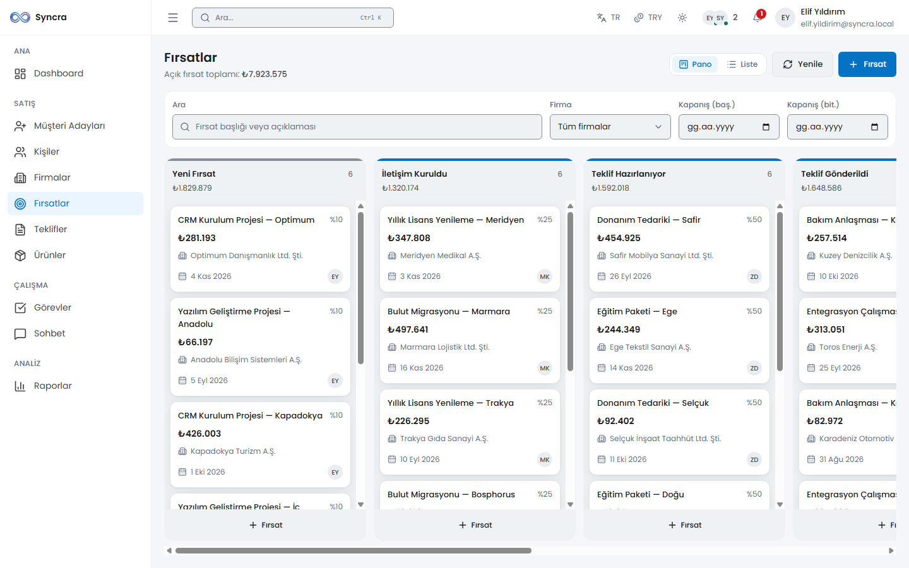
*Kanban panosu: pipeline aşamaları arasında sürükle-bırak, optimistic-locking çakışma tespitiyle — başka biri kartı önce taşımışsa kart canlı bir uyarıyla gerçek konumuna geri döner, sessizce üzerine yazılmaz.*

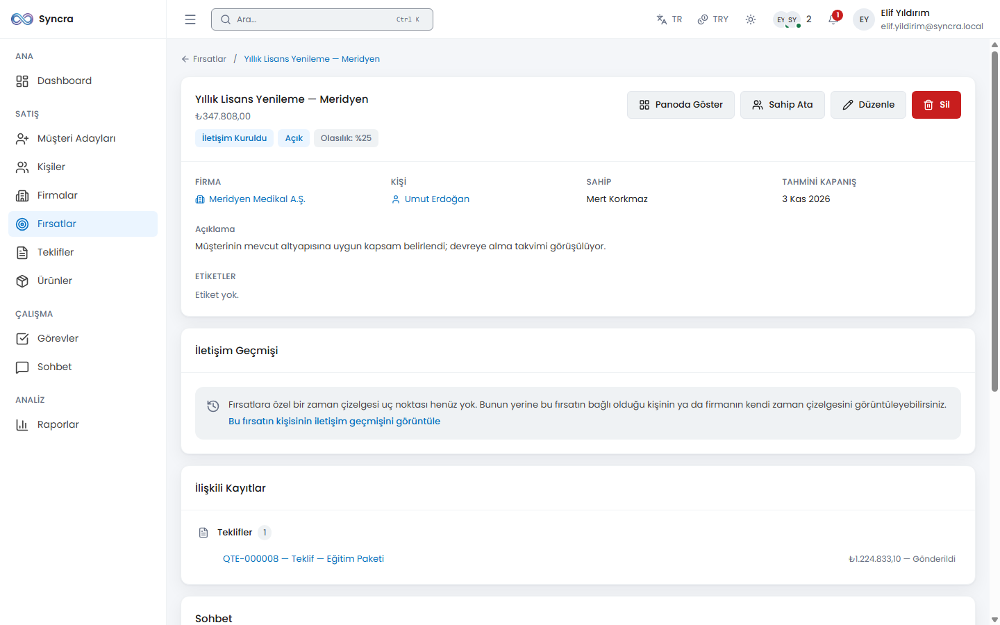
*Fırsat detayı: bağlı kişi/firma, teklifler, görevler ve aktivite timeline'ı tek ekranda. Her fırsat kendi para biriminde tutulur; kapanışta TRY karşılığı (`base_amount`/`base_rate`) dondurulur, böylece geçmiş gelir raporları sessizce yeniden fiyatlanmaz.*

### Ürünler, Fiyat Listeleri & Teklifler
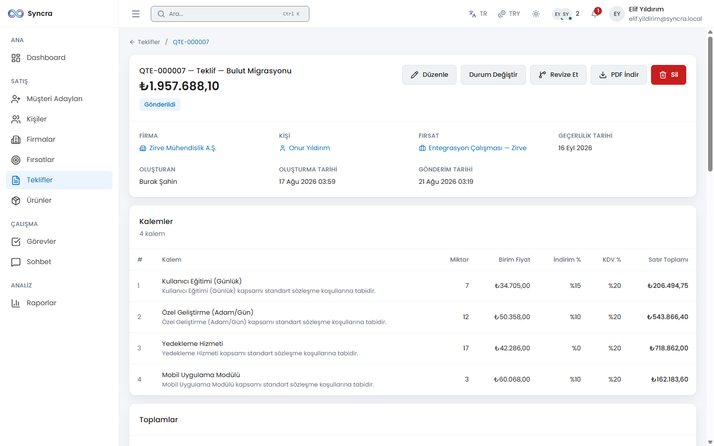
*Teklif detayı: kalemler üründen veya belirli bir fiyat listesinden çözülür, KDV indirim sonrası matrah üzerinden hesaplanır (KDVK md. 25/a), ve baskıya hazır bir PDF üretilir (DejaVu Sans, doğru Türkçe karakterler ve ₺). Teklif gönderildikten sonra tutarı etkileyen alanlar kilitlenir — "Revizyon Oluştur" taze kurla yeni, düzenlenebilir bir belge üretir.*

### Görevler & Destek Talepleri
Hatırlatıcılı görev takvimi görünümü (zamanlayıcı ile dakikada bir gönderilir) ve her ticket için SLA geri sayımı, korumalı durum akışı ve ticket'a özel iç notlarla bir destek talebi modülü.

### Raporlar & Canlı Dashboard
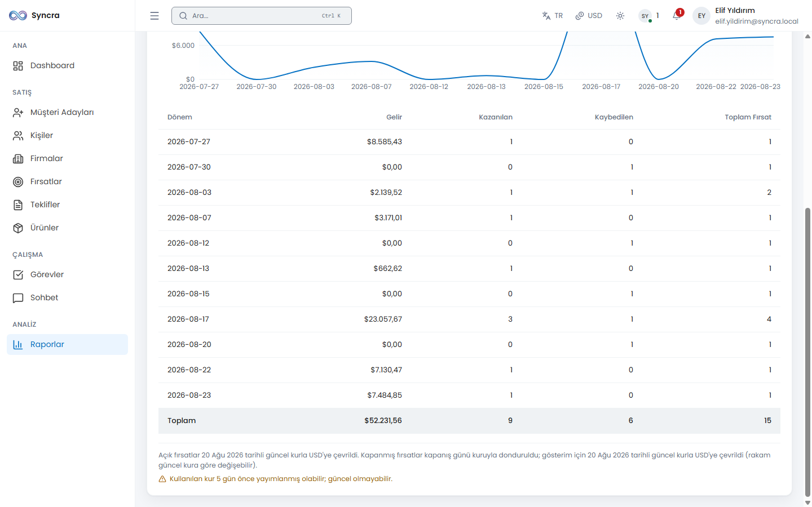
*Satış performansı, kullanıcı bazlı performans, lead kaynak analizi ve dönüşüm oranı raporları — hepsi tarih filtrelenebilir ve CSV/XLSX'e aktarılabilir. Açık fırsatlar güncel kurla (para birimine göre gruplanarak) toplanır; kapanmış fırsatlar dondurulmuş TRY tutarını kullanır — dashboard KPI'ları Reverb üzerinden canlı güncellenir.*

### Sohbet
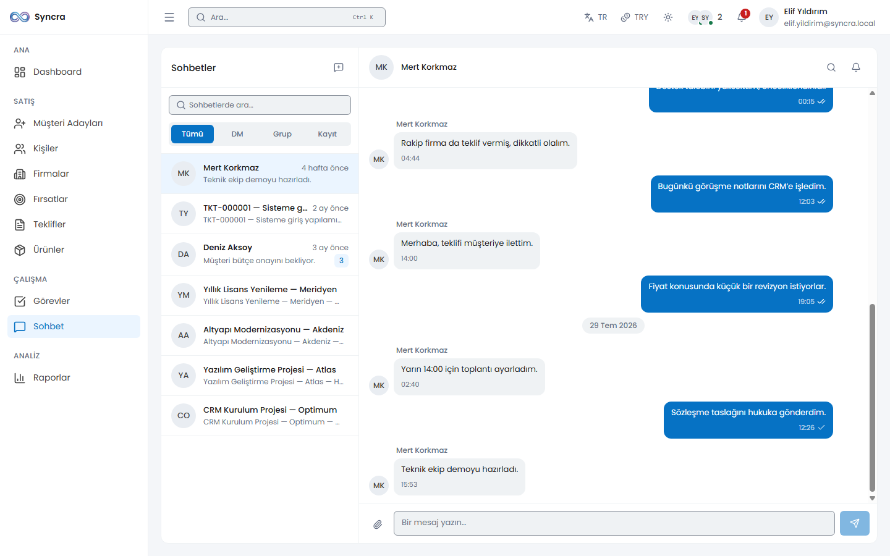
*Birebir mesajlar, grup sohbetleri ve belirli bir fırsat/ticket kaydına bağlı sohbetler. İletildi/okundu çift tik durumu, @mention, dosya eki, mesaj araması, ve kendi mesajlarında düzenleme/silme.*

### Komut Paleti & Global Arama
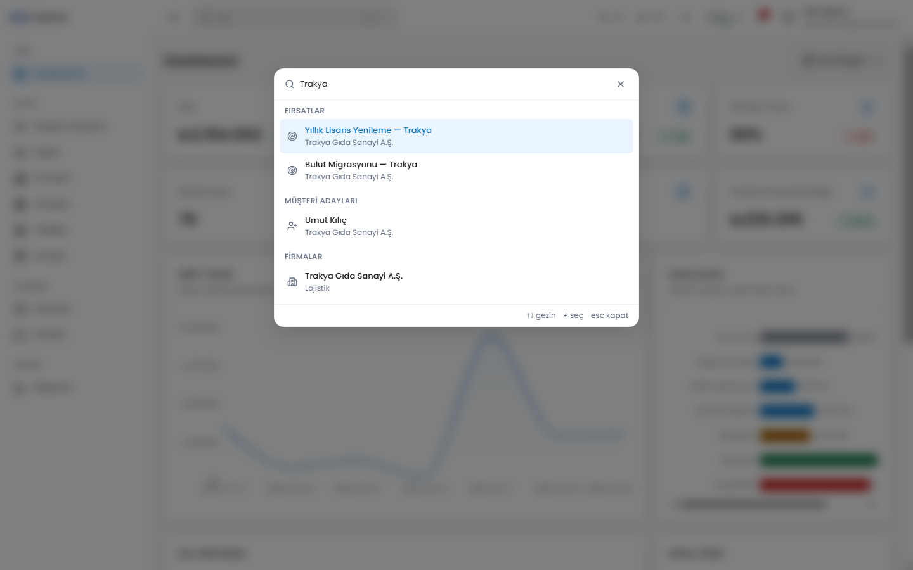
*Fırsat, lead, kişi, firma, teklif, ticket ve kullanıcı modüllerinde arama yapan bir `Ctrl/Cmd+K` komut paleti — bir modülün sonuçları yalnızca çağıran kullanıcı o modülün görüntüleme iznine sahipse görünür; yetkisiz bir modülün başlığı hiç basılmaz.*

Faz 14'ün iki eklentisi daha bunun üzerine kurulur: **kayıtlı görünümler** (modül bazlı, kendi veya paylaşılan, 9 modülde filtre ön ayarları) ve kayıt detay sayfalarında bir **ilişkili-kayıt paneli**, ayrıca **otomasyon kuralları** — sabit bir tetikleyici/eylem kataloğu (keyfi kod yok), hem kural kaydedilirken hem her çalıştığında yeniden doğrulanan izinlerle.

### Ayarlar & Yönetim
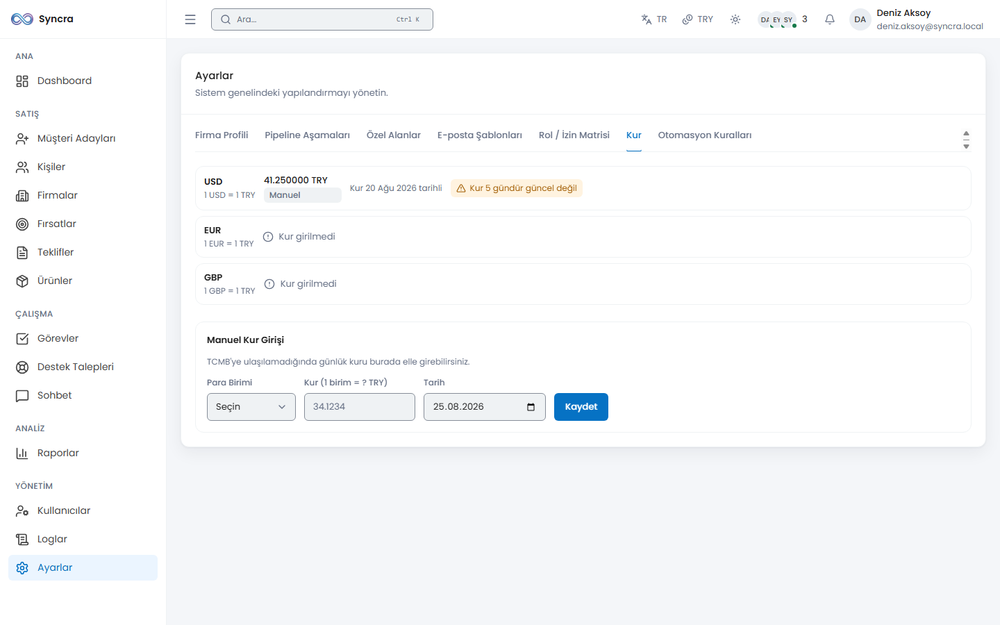
*Pipeline aşama editörü (bir aşamayı pasifleştirmek açık kartlarını zorunlu bir hedef aşamaya taşır), varlık bazlı özel alan tanımları, tam rol × izin matrisi, e-posta şablonları — ve Faz 14 ile yeni gelen manuel kur girişi ve otomasyon kuralı yönetimi.*

### Loglar & Denetim İzi
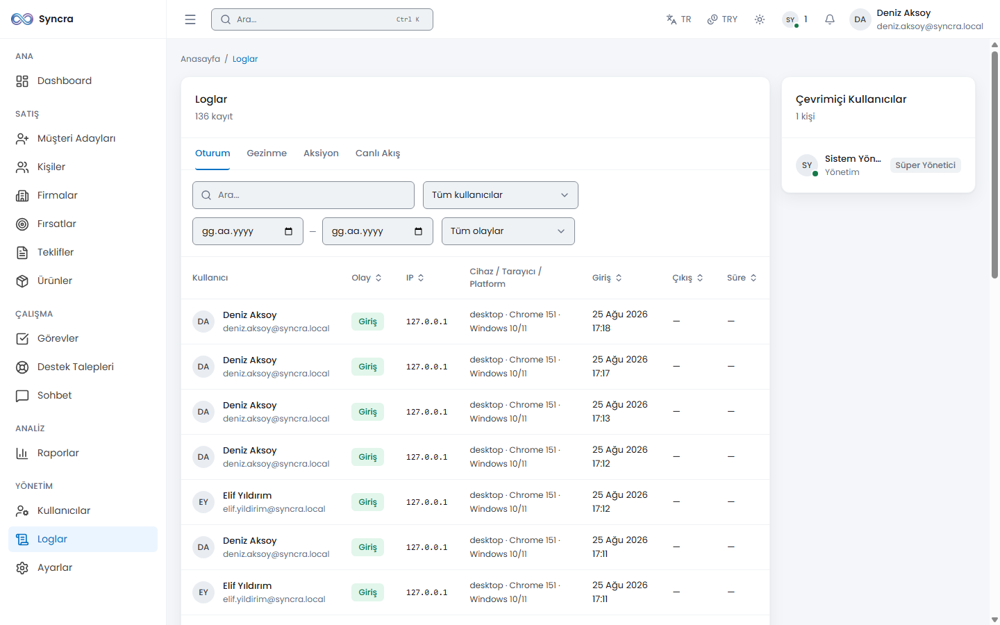
*Oturum logları (login/logout/başarısız deneme/kilitlenme), sayfa ziyareti takibi (heartbeat tabanlı süre) ve tam bir audit trail (izlenen her model değişikliğinde önce/sonra diff'i) — her biri bağımsız filtrelenebilir ve CSV/XLSX olarak dışa aktarılabilir (export başına tavan 50.000 satır).*

### Uluslararasılaştırma & Çoklu Para Birimi (Faz 14)
Arayüz **Türkçe, İngilizce, Almanca ve Fransızca** olarak tam gezilebilir (react-i18next, frontend'de 27 namespace'te ~2.089 anahtar, backend'de `lang/{tr,en,de,fr}` dosyalarıyla eşleşir), iki yönlü otomatik anahtar-parite kontrolüyle. Para tutarları arayüz dilinden bağımsız kendi para birimini taşır (TRY/USD/EUR/GBP); günlük TRY kuru Türkiye Cumhuriyet Merkez Bankası'ndan (TCMB) XXE-güvenli XML ayrıştırma ve sertleştirilmiş giden-çağrı ayarlarıyla çekilir, Ayarlar'da manuel yedek girişi ve 4 günden eski kurlar için bayatlık uyarısı vardır.

### Güvenlik
Özel bir kırmızı takım güvenlik turu (Faz 13) oturum/CSRF yönetimini sertleştirdi, güvenlik header'ları/CSP ekledi, zengin metin girdisini temizledi, CSV-formül-enjeksiyonu ve mass-assignment açıklarını kapattı, ve hassas uçlara (login, şifre değişimi, ağır export'lar, arama) rate limiting ekledi. Yetkilendirme tamamen rol/izin tabanlıdır (`spatie/laravel-permission`); bazı uçlar bunun üzerine yatay sahiplik kontrolü (IDOR koruması) ekler — ör. bir sayfa ziyareti heartbeat'i yalnızca kendi sahibi tarafından güncellenebilir, ve bir sohbet eki, bir kaydın var olup olmadığını sızdırmamak için 404 döner (asla 403 değil).

### Teknoloji Yığını (backend & frontend)

| Katman | Teknoloji | Sürüm / Not |
| --- | --- | --- |
| Backend | Laravel | 12.67.0 |
| Backend | Laravel Sanctum | Kimlik doğrulama (SPA cookie tabanlı) |
| Backend | spatie/laravel-permission | Rol ve yetki yönetimi |
| Backend | Laravel Reverb | ^1.11 — WebSocket sunucusu |
| Backend | PHP | 8.2.12 |
| Frontend | React | 18.3.1 |
| Frontend | Vite | Build/dev sunucusu |
| Frontend | React Router | ^7.18 — istemci tarafı yönlendirme |
| Frontend | TanStack Query | ^5.102 — sunucu state yönetimi / veri çekme |
| Frontend | Zustand | ^5.0 — istemci state yönetimi |
| Frontend | Tailwind CSS | 4.3.3 |
| Frontend | i18next + react-i18next | ^26.4 / ^17.0 — 4 dilli arayüz (tr/en/de/fr) |
| Frontend | Recharts | ^3.10 — dashboard ve rapor grafikleri |
| Veritabanı | MySQL / MariaDB | 10.4.32 (MariaDB), veritabanı adı: `syncra_crm` |
| Realtime | Laravel Reverb + Laravel Echo | WebSocket sunucusu ve istemci kütüphanesi |
| Queue / Cache | Redis | 8.0.5 (WSL2 üzerinde), `predis/predis` ile |
| Araç | Node.js | 26.7.0 |
| Loglama | spatie/laravel-activitylog ^4.12 + maatwebsite/excel ^3.1 | audit trail, CSV/XLSX export |
| Sürükle-bırak | @dnd-kit/core ^6.3 + sortable ^10 | Kanban panosu, klavye erişilebilirliği ile |
| PDF | barryvdh/laravel-dompdf ^3.1 | teklif çıktısı, DejaVu Sans (Türkçe + ₺), font subsetting açık |
| Sanitizasyon | ezyang/htmlpurifier ^4.19 | zengin metin/not girdisi temizleme |

> **Not:** Proje başlangıçta Laravel 11 hedefliyordu. Laravel 11.x'te yamalanmamış güvenlik açıkları (CVE-2026-48019 dahil) bulunduğu ve 11.x hattında düzeltme olmadığı için Laravel 12'ye geçildi. Ayrıntı: `docs/PROGRESS.md` karar günlüğü.

### API Uç Listesi (backend & frontend)

**Kimlik doğrulama akışı (Sanctum SPA):** İstemci önce `GET /sanctum/csrf-cookie` çağırır (CSRF çerezini alır), ardından `X-XSRF-TOKEN` header'ıyla `POST /api/login` çağırır; oturum bir HttpOnly çerezle (session cookie) taşınır, API token üretilmez. Yetkisiz istekte `401`, CSRF çerezi eksik/bayatsa `419` döner. Zorunlu şifre değişimi, pasif kullanıcı reddi ve kilitlenme/rate-limit ayrıntıları için bağlayıcı sözleşme: `docs/AUTH-FLOWS.md`.

Aşağıdaki tüm uçlar (aksi belirtilmedikçe) `auth:sanctum` + `EnsureUserIsActive` (`active`) + `EnsurePasswordIsChanged` (`password.changed`) middleware zincirinden geçer. **İzin** sütunu bu üçünün ÜSTÜNE gelen ek yetki kontrolünü gösterir; boş/"izin yok" ibaresi yalnızca kimlik doğrulamanın yeterli olduğu anlamına gelir.

#### Kimlik Doğrulama

| Metot + Yol | Ne yapar | Gerekli izin | Not |
| --- | --- | --- | --- |
| `POST /api/login` | E-posta/şifre ile giriş yapar, oturum başlatır. | İzin yok (herkese açık — `auth:sanctum` bile gerekmez). | `throttle:login` — e-posta+IP karmasına göre dakikada 5 deneme, artan kilitlenme (1→2→4→8→16→32→60 dk). |
| `POST /api/password/forgot` | Kapalı devre "şifremi unuttum" — kayıt var/yok fark etmeksizin her zaman 202 döner, gerçek sıfırlama admin onayı gerektirir. | İzin yok (herkese açık). | `throttle:6,1`. |
| `POST /api/logout` | Aktif oturumu kapatır. | İzin yok (yalnızca kimlik doğrulaması, `active` dahil — `password.changed` HARİÇ, beyaz liste). | — |
| `GET /api/me` | Giriş yapmış kullanıcının kendi profilini + rol/izinlerini döner. | İzin yok (yalnızca kimlik doğrulaması — `password.changed` HARİÇ). | — |
| `POST /api/password/change` | Kullanıcının kendi şifresini değiştirir (mevcut şifre zorunlu). | İzin yok (yalnızca kimlik doğrulaması — `password.changed` HARİÇ, akışın kendisi). | `throttle:6,1` — `current_password` bir parola kâhinine dönüşmesin diye zorunlu. |
| `PATCH /api/me/preferences` | Kullanıcının kendi arayüz dili (`locale`) ve tercih ettiği para birimini (`preferred_currency`) günceller. | **İzin yok** (bilinçli — kişisel tercih, yönetici yetkisi değil). | Faz 14. |

#### Kullanıcılar & Roller

| Metot + Yol | Ne yapar | Gerekli izin | Not |
| --- | --- | --- | --- |
| `GET /api/users` | Kullanıcıları sayfalı/filtreli listeler. | `users.view` | — |
| `POST /api/users` | Yeni kullanıcı oluşturur (kapalı devre — yalnızca admin açabilir). | `users.create` | — |
| `GET /api/users/{user}` | Tek kullanıcı detayı. | `users.view` | — |
| `PATCH /api/users/{user}` | Kullanıcı bilgilerini günceller. | `users.update` + hedef Super Admin ise ayrıca `users.manage_roles` | — |
| `DELETE /api/users/{user}` | Kullanıcıyı siler (soft delete). | `users.delete` + kendi hesabı olamaz + son aktif Super Admin korunur | — |
| `PATCH /api/users/{user}/active` | Kullanıcıyı aktif/pasif yapar (pasifleşen anında session revoke). | `users.toggle_active` + kendi hesabı olamaz + son aktif Super Admin korunur | — |
| `POST /api/users/{user}/reset-password` | Admin onaylı şifre sıfırlama. | `users.reset_password` | — |
| `GET /api/roles` | Rol listesini (izinleriyle) döner — kullanıcı formundaki rol seçici. | `roles.view` VEYA `users.manage_roles` | — |

#### Gerçek Zamanlı & Presence

| Metot + Yol | Ne yapar | Gerekli izin | Not |
| --- | --- | --- | --- |
| `GET /api/presence/online` | Şu an bağlı (online) kullanıcı listesini döner (WebSocket'in ilk-boyama/polling alternatifi). | İzin yok (yalnızca kimlik doğrulaması — bir meslektaşının online olduğunu bilmek zaten `presence-online` kanalına abone olan herkese açık). | — |
| `GET/POST/HEAD /broadcasting/auth` | Laravel Echo'nun private/presence kanal aboneliklerini yetkilendirir (kanal bazlı kurallar `routes/channels.php`'de). | Kanal başına değişir — bkz. `routes/channels.php` (`private-user.{id}`, `presence-online`, `presence-record.{type}.{id}`, `private-conversation.{id}`, `private-logs`, `private-dashboard`, `private-deals`, `private-tickets`). | `web` middleware grubunda (API grubunda değil); `password.changed` kasıtlı olarak UYGULANMAZ — soket açmak izinli, "başkalarının verisini okumak" (`/presence/online` gibi) değil. |
| `GET/HEAD /sanctum/csrf-cookie` | CSRF çerezini (`XSRF-TOKEN`) verir — SPA akışının ilk adımı. | İzin yok (herkese açık). | Sanctum'un kendi service provider'ı tarafından kaydedilir; `routes/api.php`'de tekrar tanımlanmaz. |

#### Loglar

| Metot + Yol | Ne yapar | Gerekli izin | Not |
| --- | --- | --- | --- |
| `GET /api/logs/sessions` | Oturum (login/logout/failed_login/locked_out) loglarını listeler. | `logs.view` | — |
| `GET /api/logs/page-visits` | Sayfa ziyaret loglarını listeler. | `logs.view` | — |
| `GET /api/logs/activities` | Audit trail (activity_log) kayıtlarını listeler. | `logs.view` | — |
| `GET /api/logs/export` | Log kayıtlarını CSV/XLSX olarak dışa aktarır. | `logs.export` | `throttle:10,1,heavy-export` (`/reports/export` ile PAYLAŞILAN bütçe). |

#### Sayfa Ziyaretleri

| Metot + Yol | Ne yapar | Gerekli izin | Not |
| --- | --- | --- | --- |
| `POST /api/page-visits` | Yeni bir sayfa ziyareti kaydı açar (route değişiminde). | İzin yok (yalnızca kimlik doğrulaması — herkes kendi ziyaretini kaydeder). | — |
| `PATCH /api/page-visits/{pageVisit}/heartbeat` | Mevcut ziyaretin süresini günceller (30 sn'de bir), yeni satır AÇMAZ. | İzin yok, ama IDOR koruması var: yalnızca kendi ziyaretine heartbeat atabilir (`HeartbeatRequest::authorize()`), başkasınınkine 403. | — |

#### Potansiyel Müşteriler (Leads)

| Metot + Yol | Ne yapar | Gerekli izin | Not |
| --- | --- | --- | --- |
| `GET /api/leads` | Lead'leri sayfalı/filtreli/aranabilir listeler. | `leads.view` | — |
| `POST /api/leads` | Yeni lead oluşturur. | `leads.create` | — |
| `POST /api/leads/check-duplicates` | Girilen bilgilerle olası yinelenen lead/contact adaylarını arar (kaydetmeden önce). | `leads.create` | — |
| `POST /api/leads/import` | CSV toplu içe aktarma (500 satır altı senkron, üstü kuyruklu). | `leads.import` | `throttle:5,1,leads-import`. |
| `GET /api/leads/import/template` | İçe aktarma için örnek CSV şablonu indirir. | `leads.import` | — |
| `GET /api/leads/import/{batch}` | Kuyruklu bir içe aktarma işleminin durumunu sorgular. | `leads.import` | — |
| `GET /api/leads/{lead}` | Tek lead detayı. | `leads.view` | — |
| `PATCH /api/leads/{lead}` | Lead günceller. | `leads.update` + yatay sınır: sahibi/sahipsiz/`leads.assign` taşıyan yönetici + dönüşmüş lead güncellenemez | — |
| `DELETE /api/leads/{lead}` | Lead siler (soft delete). | `leads.delete` + dönüşmüş lead silinemez | — |
| `POST /api/leads/{lead}/convert` | Lead'i contact + (varsa) company + (opsiyonel) deal'a dönüştürür (tek yönlü, geri alınamaz). | `leads.convert` + yatay sınır (sahibi/sahipsiz/`leads.assign`) | — |
| `PATCH /api/leads/{lead}/assign` | Lead'in sahibini değiştirir. | `leads.assign` | — |

#### Kişiler (Contacts)

| Metot + Yol | Ne yapar | Gerekli izin | Not |
| --- | --- | --- | --- |
| `GET /api/contacts` | Kişileri sayfalı/filtreli/aranabilir listeler. | `contacts.view` | — |
| `POST /api/contacts` | Yeni kişi oluşturur. | `contacts.create` | — |
| `GET /api/contacts/{contact}` | Tek kişi detayı. | `contacts.view` | — |
| `PATCH /api/contacts/{contact}` | Kişi günceller. | `contacts.update` (yatay yazma izolasyonu YOK — paylaşılan adres defteri, bkz. `ContactPolicy` dokümanı) | — |
| `DELETE /api/contacts/{contact}` | Kişi siler; açık fırsatı varsa 422. | `contacts.delete` | — |
| `GET /api/contacts/{contact}/timeline` | Kişiye bağlı aktivite/görev/fırsat/ticket/ek dosyaları birleşik zaman çizelgesinde döner. | `contacts.view` (görünen alt-bölümler ayrıca ilgili modülün `.view` iznine göre süzülür) | — |

#### Firmalar (Companies)

| Metot + Yol | Ne yapar | Gerekli izin | Not |
| --- | --- | --- | --- |
| `GET /api/companies` | Firmaları sayfalı/filtreli/aranabilir listeler. | `companies.view` | — |
| `POST /api/companies` | Yeni firma oluşturur. | `companies.create` | — |
| `GET /api/companies/{company}` | Tek firma detayı. | `companies.view` | — |
| `PATCH /api/companies/{company}` | Firma günceller. | `companies.update` (yatay yazma izolasyonu YOK — paylaşılan adres defteri) | — |
| `DELETE /api/companies/{company}` | Firma siler; açık fırsatı varsa 422. | `companies.delete` | — |
| `GET /api/companies/{company}/timeline` | Firmaya bağlı deal/quote/ticket vb. birleşik zaman çizelgesi. | `companies.view` (alt-bölümler ilgili modülün `.view` iznine göre süzülür) | — |

#### Etiketler & Özel Alanlar

| Metot + Yol | Ne yapar | Gerekli izin | Not |
| --- | --- | --- | --- |
| `GET /api/tags` | Tüm etiketleri listeler (paylaşılan küçük lookup verisi). | İzin yok (kimliği doğrulanmış her kullanıcı). | — |
| `POST /api/tags` | Yeni etiket oluşturur (yalnızca lead/contact/company formundan). | `leads.create` VEYA `contacts.create` VEYA `companies.create` | — |
| `GET /api/custom-fields` | Bir `entity_type` için AKTİF özel alan tanımlarını döner (form şeması). | İzin yok (yalnızca kimlik doğrulaması — asıl koruma ilgili modülün kendi `.view` izninde). | `entity_type` query parametresi zorunludur. |

#### Fırsatlar & Pipeline (Deals)

| Metot + Yol | Ne yapar | Gerekli izin | Not |
| --- | --- | --- | --- |
| `GET /api/deals` | Fırsatları sayfalı/filtreli listeler; `meta.totals` FİLTRELENMİŞ TÜM kümenin toplamıdır. | `deals.view` | — |
| `GET /api/deals/board` | Kanban pano verisini (aşama başına kart) döner. | `deals.view` | Aşama başına varsayılan 50 kart (max 200, `?per_stage=`). |
| `POST /api/deals` | Yeni fırsat oluşturur. | `deals.create` | — |
| `GET /api/deals/{deal}` | Tek fırsat detayı. | `deals.view` | — |
| `PATCH /api/deals/{deal}` | Fırsat günceller (aşama/pozisyon/versiyon/durum bu uçtan DEĞİŞMEZ). | `deals.update` + yatay sınır (sahibi/sahipsiz/`deals.assign`) | `pipeline_stage_id`/`position`/`version`/`status` reddedilir (422). |
| `DELETE /api/deals/{deal}` | Fırsat siler; kazanılmış/kaybedilmiş fırsat silinemez. | `deals.delete` | — |
| `PATCH /api/deals/{deal}/move` | Kanban'da kart taşır — pozisyonu sunucu üretir, optimistic locking (`version`). | `deals.move` + yatay sınır (sahibi/sahipsiz/`deals.assign`) | Bayat `version` → 409 `DEAL_VERSION_CONFLICT` + kartın güncel hâli. |
| `PATCH /api/deals/{deal}/assign` | Fırsatın sahibini değiştirir. | `deals.assign` | — |
| `GET /api/pipeline-stages` | Kanban sütun listesi (yalnızca aktif, varsayılan). | `deals.view` (ayrı bir Policy yok — Deal'e devredilir) | — |

#### Görevler (Tasks)

| Metot + Yol | Ne yapar | Gerekli izin | Not |
| --- | --- | --- | --- |
| `GET /api/tasks` | Görevleri sayfalı/filtreli listeler. | `tasks.view` | — |
| `GET /api/tasks/calendar` | Belirli bir tarih aralığındaki görevleri takvim görünümü için döner. | `tasks.view` | `?from`/`?to` zorunlu, max 90 gün, sayfalama yok. |
| `POST /api/tasks` | Yeni görev oluşturur. | `tasks.create` | — |
| `GET /api/tasks/{task}` | Tek görev detayı. | `tasks.view` | — |
| `PATCH /api/tasks/{task}` | Görev günceller. | `tasks.update` + yatay sınır (`assigned_to` sahibi/sahipsiz/`tasks.assign`) | — |
| `DELETE /api/tasks/{task}` | Görev siler. | `tasks.delete` | — |
| `PATCH /api/tasks/{task}/complete` | Görevi tamamlanmış işaretler (idempotent). | `tasks.update` + yatay sınır (atanan/sahipsiz/`tasks.assign`) | — |
| `PATCH /api/tasks/{task}/assign` | Görevi başka bir kullanıcıya atar. | `tasks.assign` | — |

#### Destek Talepleri (Tickets)

| Metot + Yol | Ne yapar | Gerekli izin | Not |
| --- | --- | --- | --- |
| `GET /api/tickets` | Ticket'ları sayfalı/filtreli listeler. | `tickets.view` | — |
| `GET /api/tickets/stats` | Ticket istatistiklerini (SLA ihlali dahil, türetilmiş) döner. | `tickets.view` | — |
| `POST /api/tickets` | Yeni ticket açar. | `tickets.create` | — |
| `GET /api/tickets/{ticket}` | Tek ticket detayı. | `tickets.view` | — |
| `PATCH /api/tickets/{ticket}` | Ticket günceller. | `tickets.update` + yatay sınır (`assigned_to` sahibi/sahipsiz/`tickets.assign`) | — |
| `DELETE /api/tickets/{ticket}` | Ticket siler; çözülmüş/kapanmış ticket silinemez. | `tickets.delete` | — |
| `PATCH /api/tickets/{ticket}/status` | Durum makinesi üzerinden ticket durumunu değiştirir. | `tickets.update` (AYNI Policy metodu — ayrı izin yok) + yatay sınır | Geçersiz geçiş → 422 `INVALID_STATUS_TRANSITION`. |
| `PATCH /api/tickets/{ticket}/assign` | Ticket'ı başka bir kullanıcıya atar. | `tickets.assign` | — |

#### Aktiviteler (Activities)

| Metot + Yol | Ne yapar | Gerekli izin | Not |
| --- | --- | --- | --- |
| `GET /api/activities` | Aktiviteleri (çağrı/toplantı/e-posta/not) sayfalı/filtreli listeler. | `activities.view` | Ticket iç notları da `type='note'` olarak burada yaşar. |
| `POST /api/activities` | Yeni aktivite kaydı ekler. | `activities.create` | — |
| `GET /api/activities/{activity}` | Tek aktivite detayı. | `activities.view` | — |
| `PATCH /api/activities/{activity}` | Aktivite günceller. | `activities.update` + (yazan kişi VEYA `activities.delete` taşıyan yönetici); yazarı silinmişse yalnız yönetici | — |
| `DELETE /api/activities/{activity}` | Aktivite siler. | (Yazan kişi) VEYA `activities.delete` | — |

#### Ürünler & Fiyat Listeleri

| Metot + Yol | Ne yapar | Gerekli izin | Not |
| --- | --- | --- | --- |
| `GET /api/products` | Ürünleri sayfalı/filtreli listeler. | `products.view` | — |
| `GET /api/products/categories` | Mevcut ürün kategorilerinin listesini döner. | `products.view` | — |
| `POST /api/products` | Yeni ürün oluşturur. | `products.create` | — |
| `GET /api/products/{product}` | Tek ürün detayı. | `products.view` | — |
| `PATCH /api/products/{product}` | Ürün günceller. | `products.update` | — |
| `DELETE /api/products/{product}` | Ürün siler. | `products.delete` | — |
| `GET /api/products/{product}/price` | Ürünün (opsiyonel bir fiyat listesindeki) fiyatını döner. | `products.view` | — |
| `GET /api/price-lists` | Fiyat listelerini listeler. | `products.view` (ayrı `price-lists.*` izni YOK — kataloğun uzantısı) | — |
| `POST /api/price-lists` | Yeni fiyat listesi oluşturur. | `products.create` | — |
| `GET /api/price-lists/{priceList}` | Tek fiyat listesi detayı. | `products.view` | — |
| `PATCH /api/price-lists/{priceList}` | Fiyat listesi günceller. | `products.update` | — |
| `DELETE /api/price-lists/{priceList}` | Fiyat listesi siler (soft delete; kalemleri KORUNUR). | `products.delete` | — |
| `GET /api/price-lists/{priceList}/products` | Listedeki ürün fiyatlarını döner. | `products.view` | — |
| `PUT /api/price-lists/{priceList}/products/{product}` | Listede bir ürün için özel fiyat tanımlar/günceller. | `products.update` | — |
| `DELETE /api/price-lists/{priceList}/products/{product}` | Listeden bir ürünün özel fiyatını kaldırır. | `products.update` | — |

#### Teklifler (Quotes)

| Metot + Yol | Ne yapar | Gerekli izin | Not |
| --- | --- | --- | --- |
| `GET /api/quotes` | Teklifleri sayfalı/filtreli listeler. | `quotes.view` | — |
| `POST /api/quotes` | Yeni teklif oluşturur. | `quotes.create` | — |
| `POST /api/quotes/calculate` | Kaydetmeden, canlı toplam/KDV/indirim önizlemesi hesaplar. | `quotes.create` VEYA `quotes.update` (düz izin sorusu, Policy metodu değil) | — |
| `GET /api/quotes/{quote}` | Tek teklif detayı. | `quotes.view` | — |
| `PATCH /api/quotes/{quote}` | Teklif günceller. | `quotes.update` (yatay sınır YOK — bu uç zaten yönetici seviyesinde) | `sent` sonrası tutarı etkileyen alanlar kilitli (422 `QUOTE_LOCKED`). |
| `DELETE /api/quotes/{quote}` | Teklif siler; kabul edilmiş/reddedilmiş teklif silinemez. | `quotes.delete` | — |
| `POST /api/quotes/{quote}/send` | Teklifi müşteriye "gönderildi" işaretler, tutarı kilitler. | `quotes.send` (AYRI izin, `quotes.update`'ten farklı) | — |
| `PATCH /api/quotes/{quote}/status` | Teklif durumunu değiştirir (kabul/red/süre doldu vb.). | `quotes.update` | — |
| `POST /api/quotes/{quote}/revise` | Mevcut tekliften yeni bir revizyon (yeni kayıt) üretir. | `quotes.create` (revizyon YENİ bir belge ürettiği için) | — |
| `GET /api/quotes/{quote}/pdf` | Teklifin PDF çıktısını indirir. | `quotes.view` | — |

#### Bildirimler (Notifications)

| Metot + Yol | Ne yapar | Gerekli izin | Not |
| --- | --- | --- | --- |
| `GET /api/notifications` | Kullanıcının kendi bildirimlerini listeler. | `notifications.view` | — |
| `GET /api/notifications/unread-count` | Okunmamış bildirim sayısını döner. | `notifications.view` | — |
| `POST /api/notifications/read-all` | Tüm bildirimleri okundu işaretler. | `notifications.view` | — |
| `PATCH /api/notifications/{notification}/read` | Tek bildirimi okundu işaretler. | `notifications.view` | — |
| `DELETE /api/notifications/{notification}` | Bildirimi siler. | `notifications.view` | — |

#### Ayarlar (Settings)

| Metot + Yol | Ne yapar | Gerekli izin | Not |
| --- | --- | --- | --- |
| `GET /api/settings` | Genel sistem ayarlarını (şirket profili vb.) döner. | `settings.manage` | — |
| `PATCH /api/settings` | Genel sistem ayarlarını günceller. | `settings.manage` | — |
| `GET /api/settings/pipeline-stages` | Pipeline aşama EDİTÖRÜ listesi (pasifler DAHİL). | `settings.manage` | Aynı controller/metodu `GET /api/pipeline-stages` ile paylaşır; ayrım rota adına göre. |
| `POST /api/settings/pipeline-stages` | Yeni pipeline aşaması oluşturur. | `settings.manage` | — |
| `POST /api/settings/pipeline-stages/reorder` | Aşamaların sırasını günceller. | `settings.manage` | — |
| `PATCH /api/settings/pipeline-stages/{stage}` | Aşama günceller/pasifleştirir. | `settings.manage` | Pasifleşen aşamadaki açık kartlar zorunlu hedef aşamaya taşınır. |
| `GET /api/settings/custom-fields` | Özel alan EDİTÖRÜ listesi (pasifler DAHİL). | `settings.manage` | Aynı controller/metodu `GET /api/custom-fields` ile paylaşır; ayrım rota adına göre. |
| `POST /api/settings/custom-fields` | Yeni özel alan tanımı oluşturur. | `settings.manage` | — |
| `PATCH /api/settings/custom-fields/{customField}` | Özel alan tanımını günceller. | `settings.manage` | — |
| `DELETE /api/settings/custom-fields/{customField}` | Özel alanı SİLMEZ, pasifleştirir (yanıt 200, kaydın kendisi). | `settings.manage` | — |
| `GET /api/settings/email-templates` | E-posta şablonlarını listeler (pasifler dahil). | `settings.manage` | Bu fazda gerçek e-posta GÖNDERİLMEZ; yalnızca saklama/önizleme. |
| `POST /api/settings/email-templates` | Yeni e-posta şablonu oluşturur. | `settings.manage` | — |
| `PATCH /api/settings/email-templates/{emailTemplate}` | Şablon günceller. | `settings.manage` | — |
| `DELETE /api/settings/email-templates/{emailTemplate}` | Şablonu kalıcı siler. | `settings.manage` | — |
| `GET /api/settings/permission-matrix` | Tam rol × izin matrisini döner. | `settings.manage` | Okuma da `settings.manage` ister (sistemin tam yetki haritası). |
| `PATCH /api/settings/roles/{role}/permissions` | Bir rolün izin kümesini TAM DURUM olarak değiştirir (sync). | `settings.manage` | Super Admin rolü 422 `ROLE_NOT_EDITABLE`. |
| `GET /api/settings/exchange-rates` | Kayıtlı döviz kurlarını (yönetim ekranı) listeler. | `settings.manage` | Faz 14. |
| `POST /api/settings/exchange-rates` | Bir para birimi/tarih için kuru elle girer/düzeltir. | `settings.manage` | Faz 14. Otomatik TCMB çekmesi bir konsol komutudur, HTTP ucu değil. |
| `GET /api/settings/automation-rules` | Otomasyon kurallarını listeler. | `settings.manage` | Faz 14. |
| `POST /api/settings/automation-rules` | Yeni otomasyon kuralı oluşturur. | `settings.manage` **+** seçilen tetikleyici/eylemin gerektirdiği izinler (`AutomationPermissionChecker`) | Faz 14. İki katmanlı kontrol — tek başına `settings.manage` yetmez. |
| `PATCH /api/settings/automation-rules/{automationRule}` | Otomasyon kuralını günceller. | `settings.manage` **+** `AutomationPermissionChecker` | Faz 14. |
| `DELETE /api/settings/automation-rules/{automationRule}` | Otomasyon kuralını siler. | `settings.manage` | Faz 14. |

#### Kur (Genel — Faz 14)

| Metot + Yol | Ne yapar | Gerekli izin | Not |
| --- | --- | --- | --- |
| `GET /api/exchange-rates/current` | Her para birimi için en güncel (donmuş/bayat olabilir) kuru döner — kullanıcının kendi tercih ettiği para biriminde tutar göstermesi içindir. | **İzin yok** (bilinçli — TCMB kurları kamuya açık veridir, `/settings/exchange-rates` yönetim ekranından AYRI ve ondan gevşek DEĞİLDİR). | `throttle:30,1,exchange-rates-current`. |

#### Raporlar & Panel (Dashboard)

| Metot + Yol | Ne yapar | Gerekli izin | Not |
| --- | --- | --- | --- |
| `GET /api/reports/sales-performance` | Satış performansı raporu (tarih filtreli). | `reports.view` | — |
| `GET /api/reports/user-performance` | Kullanıcı bazlı performans raporu. | `reports.view` | — |
| `GET /api/reports/source-analysis` | Lead kaynak analizi raporu. | `reports.view` | — |
| `GET /api/reports/conversion` | Dönüşüm oranı raporu. | `reports.view` | — |
| `GET /api/reports/export` | Rapor verisini CSV/XLSX dışa aktarır. | `reports.export` | `throttle:10,1,heavy-export` (`/logs/export` ile PAYLAŞILAN bütçe). |
| `GET /api/dashboard/kpis` | KPI kartları (aylık gelir, açık fırsat, dönüşüm oranı, aktivite sayısı). | `dashboard.view` | — |
| `GET /api/dashboard/funnel` | Satış hunisi verisi. | `dashboard.view` | — |
| `GET /api/dashboard/revenue-trend` | Gelir trendi (zaman serisi). | `dashboard.view` | — |
| `GET /api/dashboard/recent-activities` | Son aktiviteler akışı. | `dashboard.view` | — |
| `GET /api/dashboard/task-summary` | Görev özeti. | `dashboard.view` | — |

#### Sohbet (Chat)

| Metot + Yol | Ne yapar | Gerekli izin | Not |
| --- | --- | --- | --- |
| `GET /api/conversations` | Kullanıcının üyesi olduğu konuşmaları listeler. | `chat.use` | — |
| `GET /api/conversations/unread-count` | Toplam okunmamış mesaj sayısını döner. | `chat.use` | — |
| `POST /api/conversations` | Yeni DM veya grup konuşması başlatır. | `chat.use` | — |
| `POST /api/conversations/for-record` | Bir kayda (deal/ticket) bağlı sohbeti getirir/oluşturur. | `chat.use` **+** ilgili kaydın `.view` izni (`RecordChatRegistry` beyaz listesi) | — |
| `GET /api/conversations/{conversation}` | Konuşma detayı. | `chat.use` + üyelik VEYA (kayda-bağlı ise) kaydı görme izni; aksi halde 404 (IDOR/varlık sızıntısını önlemek için 403 DEĞİL) | — |
| `PATCH /api/conversations/{conversation}` | Grup adını değiştirir (yalnızca grup, yalnızca kurucu). | Görünürlük + grup + kurucu | — |
| `DELETE /api/conversations/{conversation}` | Grup sohbetini arşivler (yalnızca grup, yalnızca kurucu; `dm`/`record` SİLİNEMEZ). | Görünürlük + grup + kurucu | — |
| `POST /api/conversations/{conversation}/members` | Gruba üye ekler (konuşmanın herhangi bir üyesi ekleyebilir). | Görünürlük + grup + üyelik | — |
| `DELETE /api/conversations/{conversation}/members/{user}` | Gruptan üye çıkarır (yalnızca kurucu). | Görünürlük + grup + kurucu | — |
| `POST /api/conversations/{conversation}/leave` | Kullanıcı gruptan kendisi ayrılır (`dm`'den ayrılınamaz). | Görünürlük + grup + üyelik | — |
| `PATCH /api/conversations/{conversation}/mute` | Konuşmayı sessize alır/açar. | Görünürlük + üyelik | — |
| `POST /api/conversations/{conversation}/read` | Konuşmayı belirli bir mesaja kadar okundu işaretler (çift tik). | Görünürlük + üyelik | — |
| `POST /api/conversations/{conversation}/delivered` | Mesajları "iletildi" olarak işaretler. | Görünürlük + üyelik | — |
| `GET /api/conversations/{conversation}/messages` | Konuşmanın mesajlarını (sayfalı) listeler. | Konuşma görünürlüğü (`view`) | — |
| `POST /api/conversations/{conversation}/messages` | Yeni mesaj gönderir. | `sendMessage` (record sohbette üyelik önkoşul değildir, ilk mesajda otomatik üye olunur) | — |
| `GET /api/messages/search` | Kullanıcının erişebildiği konuşmalarda mesaj arar. | `chat.use` (`viewAny` Conversation) | — |
| `PATCH /api/messages/{message}` | Kendi metin mesajını düzenler (zaman sınırı YOK, `edited_at` ile şeffaf). | Yalnızca mesajın yazarı + `type=text` + silinmemiş | — |
| `DELETE /api/messages/{message}` | Mesaj siler. | Mesajın yazarı VEYA Super Admin (moderasyon `settings.manage`'e BAĞLI DEĞİL) | — |

#### Dosya Ekleri (Attachments)

| Metot + Yol | Ne yapar | Gerekli izin | Not |
| --- | --- | --- | --- |
| `POST /api/attachments` | Dosya/görsel yükler (sohbet eki). | `chat.use` | — |
| `GET /api/attachments/{attachment}` | Ek dosyayı indirir/servis eder. | **Kritik IDOR yüzeyi** — mesaja bağlıysa yalnızca o konuşmanın üyeleri, değilse yalnızca yükleyen kişi; ret 403 DEĞİL 404 (varlık sızıntısını önlemek için). | — |

#### Arama (Search)

| Metot + Yol | Ne yapar | Gerekli izin | Not |
| --- | --- | --- | --- |
| `GET /api/search` | Genel arama/komut paleti — deal, lead, contact, company, quote, ticket, user modüllerinde arar. | Modül bazlı: her modülün sonucu yalnızca o modülün `.view` iznine sahipse döner (`GlobalSearchService` içinde, izinsiz modülün anahtarı sonuçta hiç görünmez). | `throttle:60,1,search`. Modül başına en fazla 5, toplam en fazla 35 sonuç. |

#### Kayıtlı Görünümler (Saved Views — Faz 14)

| Metot + Yol | Ne yapar | Gerekli izin | Not |
| --- | --- | --- | --- |
| `GET /api/saved-views` | Belirtilen modül için kullanıcının kendi + paylaşılan görünümlerini listeler. | İlgili modülün `.view` izni (`?module=` — 9 modülden biri: deals/leads/contacts/companies/quotes/tickets/tasks/products/users) | Yalnızca metadata (isim/filtre) döner — gerçek veri hiçbir zaman bu uçtan gelmez. |
| `POST /api/saved-views` | Yeni kayıtlı görünüm oluşturur. | İlgili modülün `.view` izni | Aynı kullanıcı+modülde aynı isim iki kez kullanılamaz (422). |
| `PATCH /api/saved-views/{savedView}` | Kayıtlı görünümü günceller. | Yalnızca görünümün SAHİBİ (`is_shared` bunu değiştirmez) | — |
| `DELETE /api/saved-views/{savedView}` | Kayıtlı görünümü siler. | Yalnızca görünümün SAHİBİ | — |

### ER Diyagramı (backend & frontend)

Okunabilirlik için şema beş mantıksal gruba bölünmüştür (40+ tablonun tek diyagramda tüm kolonlarıyla gösterilmesi okunamaz bir sonuç üretir). Her varlık kutusunda yalnızca PK, FK'lar ve tabloyu tanımlayan 3-6 kolon gösterilir — tam kolon dökümü için `docs/DATABASE.md`. Gruplar arası FK'lar (ör. `deals.company_id → companies.id`) ilgili diyagramın altında düz metinle not edilir; `USERS` yalnızca ilişki çizmek gerektiğinde diğer diyagramlarda küçültülmüş (yalnızca `id`/`email`) hâliyle tekrarlanır — tam tanımı yalnızca Diyagram A'dadır.

#### Diyagram A — Çekirdek CRM


*This is the transactional core: accounts, the pipeline, and everything that hangs off a deal. `deals.base_amount/base_rate/base_rate_date` (Phase 14) freeze the TRY-equivalent value at close time so historical revenue reports never silently reprice; `users.locale`/`preferred_currency` (Phase 14) are personal, permission-free preferences.*

*Bu, işlemsel çekirdektir: hesaplar, pipeline ve bir fırsata bağlı her şey. `deals.base_amount/base_rate/base_rate_date` (Faz 14) kapanış anındaki TRY karşılığını dondurur ki geçmiş gelir raporları sessizce yeniden fiyatlanmasın; `users.locale`/`preferred_currency` (Faz 14) izin gerektirmeyen kişisel tercihlerdir.*

#### Diyagram B — Teklif / Ürün

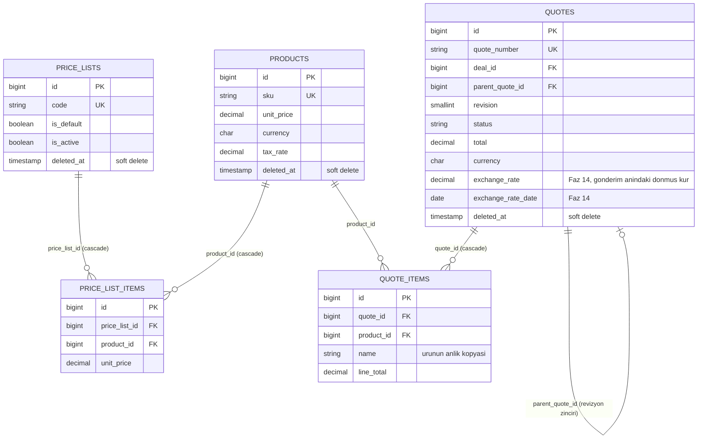

*Cross-group FKs not redrawn here: `quotes.deal_id → deals.id`, `quotes.company_id/contact_id → companies.id/contacts.id` (all in Diagram A). `quote_items.name`/`unit_price`/`tax_rate` are point-in-time snapshots of the product, not live references — a later price or catalog change never rewrites a quote already issued. `quotes.exchange_rate/exchange_rate_date` (Phase 14) freeze the rate at `sent` time for the same reason; they stay `null` for drafts.*

*Burada yeniden çizilmeyen gruplar-arası FK'lar: `quotes.deal_id → deals.id`, `quotes.company_id/contact_id → companies.id/contacts.id` (hepsi Diyagram A'da). `quote_items.name`/`unit_price`/`tax_rate` ürünün o anki anlık kopyasıdır, canlı referans değildir — sonradan yapılan bir fiyat/katalog değişikliği zaten kesilmiş bir teklifi asla değiştirmez. `quotes.exchange_rate/exchange_rate_date` (Faz 14) aynı gerekçeyle `sent` anındaki kuru dondurur; taslaklarda `null` kalır.*

#### Diyagram C — Sohbet & Bildirim

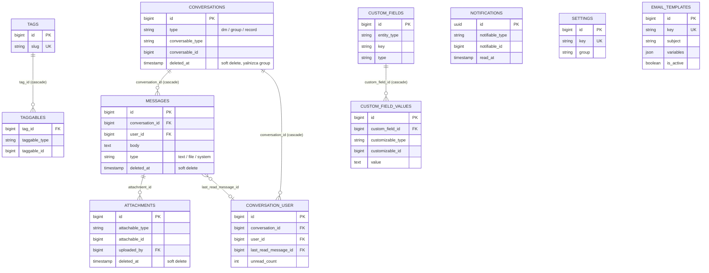

*`USERS` (Diagram A) links in via `conversation_user.user_id`, `messages.user_id`, `attachments.uploaded_by`, and `notifications.notifiable_id` (polymorphic) — not redrawn. `NOTIFICATIONS`/`SETTINGS`/`EMAIL_TEMPLATES`/`TAGS` have no FK of their own and appear here without a relationship line; `notifications` uses a UUID primary key to stay wire-compatible with Laravel's `Notification::send()`.*

*`USERS` (Diyagram A) buraya `conversation_user.user_id`, `messages.user_id`, `attachments.uploaded_by` ve `notifications.notifiable_id` (polymorphic) ile bağlanır — tekrar çizilmez. `NOTIFICATIONS`/`SETTINGS`/`EMAIL_TEMPLATES`/`TAGS` kendi başlarına bir FK taşımaz, burada ilişki çizgisi olmadan görünürler; `notifications` Laravel'in `Notification::send()` akışıyla tel-uyumlu kalmak için UUID birincil anahtar kullanır.*

#### Diyagram D — Log & Audit

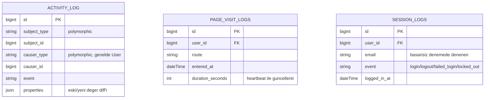

*No table in this group is soft-deleted — these are telemetry/audit rows pruned by retention (`logs:prune`: 90 days for page visits, 365 for sessions and the audit trail), not business records with a "restore" need. All three link to `USERS` (Diagram A) — `activity_log.causer_id` polymorphically, `page_visit_logs.user_id` (cascade — deleting the user deletes their browsing history) and `session_logs.user_id` (null-on-delete, so the row survives account deletion for audit purposes) — not redrawn here.*

*Bu gruptaki hiçbir tablo soft delete kullanmaz — bunlar retention ile budanan (`logs:prune`: sayfa ziyaretleri 90 gün, oturum ve audit trail 365 gün) telemetri/audit satırlarıdır, "geri getirme" ihtiyacı olan iş kayıtları değildir. Üçü de `USERS`'a (Diyagram A) bağlanır — `activity_log.causer_id` polymorphic olarak, `page_visit_logs.user_id` (cascade — kullanıcı silinince gezinme geçmişi de silinir) ve `session_logs.user_id` (nullOnDelete, satır denetim amacıyla hesap silinse de kalır) — burada tekrar çizilmez.*

#### Diyagram E — Sistem (Kimlik/Yetki, Kayıtlı Görünümler, Otomasyon, Kur)

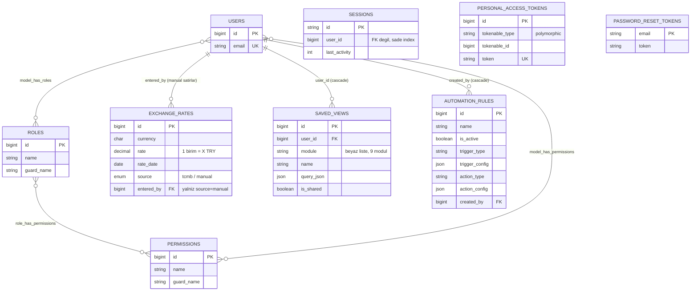

*`EXCHANGE_RATES`/`SAVED_VIEWS`/`AUTOMATION_RULES` are the three Phase 14 tables — none of them carry a real FK to `deals`/`quotes`/business data: `exchange_rates` is looked up by `(currency, rate_date)`, not joined; `saved_views.query_json` is validated filter metadata, never executed data; `automation_rules` config is validated against a fixed catalog, never interpolated into a query. `personal_access_tokens` exists in schema (Sanctum) but is unused in practice — this app authenticates via cookie/session only, `User` deliberately does not use `HasApiTokens`. Deliberately excluded from every diagram above: `cache`, `cache_locks`, `jobs`, `job_batches`, `failed_jobs`, and Laravel's own `migrations` ledger table — pure framework plumbing with no FK to any business table.*

*`EXCHANGE_RATES`/`SAVED_VIEWS`/`AUTOMATION_RULES`, Faz 14'ün üç tablosudur — hiçbiri `deals`/`quotes`/iş verisine gerçek bir FK taşımaz: `exchange_rates` `(currency, rate_date)` ile aranır, JOIN edilmez; `saved_views.query_json` doğrulanmış filtre metadata'sıdır, hiçbir zaman çalıştırılan veri değildir; `automation_rules` konfigürasyonu sabit bir kataloğa karşı doğrulanır, asla bir sorguya enterpole edilmez. `personal_access_tokens` şemada vardır (Sanctum) ama pratikte KULLANILMAZ — bu uygulama yalnızca çerez/oturum ile kimlik doğrular, `User` bilinçli olarak `HasApiTokens` KULLANMAZ. Yukarıdaki diyagramların tümünden bilinçli olarak dışarıda bırakılanlar: `cache`, `cache_locks`, `jobs`, `job_batches`, `failed_jobs` ve Laravel'in kendi `migrations` defter tablosu — hiçbirinin iş tablolarına FK'si olmayan saf framework altyapısı.*

### Dokümantasyon (backend & frontend)

Aşağıdaki dokümanlar iç geliştirme referanslarıdır (yol haritası, karar günlükleri, modül sözleşmeleri) ve **Türkçe** kalır — yalnızca bu README ve İngilizce karşılığı (`README.md`) iki dillidir.

| Doküman | Ne anlatır |
| --- | --- |
| [docs/ROADMAP.md](docs/ROADMAP.md) | Faz faz proje yol haritası ve paralelleştirme planı. |
| [docs/PROGRESS.md](docs/PROGRESS.md) | Canlı ilerleme kaydı ve doğrulanmış ortam durumu — her çalışma oturumu başında okunur. |
| [docs/DATABASE.md](docs/DATABASE.md) | Migration'lardan üretilen tam veritabanı şema dokümantasyonu (tüm tablolar, foreign key'ler, index stratejisi). |
| [docs/AUTH-FLOWS.md](docs/AUTH-FLOWS.md) | İlk girişte zorunlu şifre değişimi (`must_change_password`) akışının bağlayıcı sözleşmesi. |
| [docs/SLA-DESIGN.md](docs/SLA-DESIGN.md) | Ticket SLA geri sayımı ve durum akışı tasarım sözleşmesi. |
| [docs/QUOTE-FINANCIALS.md](docs/QUOTE-FINANCIALS.md) | Teklif hesaplama modeli — KDV, indirim ve toplamlar — tek doğruluk kaynağı olarak. |
| [docs/SETTINGS-SAFETY.md](docs/SETTINGS-SAFETY.md) | Ayarlar modülü (pipeline aşamaları, özel alanlar, izin matrisi) veri bütünlüğü sözleşmesi. |
| [docs/DESIGN-SYSTEM.md](docs/DESIGN-SYSTEM.md) | Figma kaynaklı tasarım sistemi: token'lar, tipografi, spacing ve kontrast doğrulaması. |
| [docs/PHASE-AUDIT.md](docs/PHASE-AUDIT.md) | Faz 13 sözleşmesi: kırmızı takım güvenlik denetimi ve 6-rol kullanıcı kabul turu. |
| [docs/PHASE-INTL.md](docs/PHASE-INTL.md) | Faz 14 sözleşmesi: uluslararasılaştırma, çoklu para birimi ve Attio esinli özellikler (komut paleti, kayıtlı görünümler, ilişkili kayıtlar, otomasyon kuralları). |

## Lisans

MIT — bkz. [LICENSE](LICENSE). Telif hakkı (c) 2026 Ayberk Arda.

