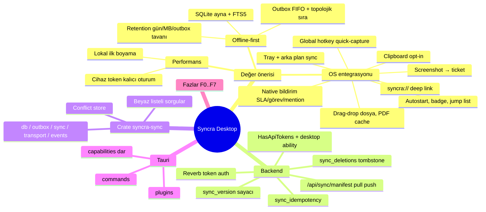

# SYNCRA DESKTOP — Engineering Specification & Build Plan

Repo: `ayberkaarda/Syncra-CRM` (Laravel 12.67 / PHP 8.2 / MariaDB 10.4 / Redis / Reverb + React 18.3 / Vite / TanStack Query 5 / Zustand 5 / Tailwind 4 / i18next).
Hedef: monorepo'ya `desktop/` altında **Tauri 2** tabanlı, **offline-first**, OS ile bütünleşik bir masaüstü istemci eklemek; backend'e cihaz kimlik doğrulama ve delta senkron API katmanı eklemek.

Bu belge bağlayıcıdır. Belgede "ZORUNLU", "YASAK", "KARAR" ile işaretli maddeler tartışmaya açık değildir; sapma gerekiyorsa dur, gerekçeyle sor.

---

## 0. OPERASYONEL KURALLAR

### 0.1 Şerit hiyerarşisi
- **Teknik lider (sen):** planlama, sözleşme yazımı, faz bütünleştirme, şerit çıktısı doğrulama.
- **Heavy şerit:** sync protokolü, çakışma algoritması, Rust crate tasarımı, migration risk analizi.
- **Default şerit:** i18n key ekleme, test yazma, boilerplate, doküman güncelleme.
- Her şeride 0.2–0.6 aynen iletilir.

### 0.2 Git — ZORUNLU
- Çalışma branch'i `feat/desktop`; **ben** açarım. Sen `git status | diff | log` dışında hiçbir git komutu çalıştırmazsın. Commit/push/stash/reset/checkout YASAK; ben "commit et" dediğimde, verdiğim mesajla tek commit.

### 0.3 Faz kapıları — ZORUNLU
- Her faz sonunda DUR, §11 formatında raporla, onay bekle. Onaysız sonraki faza geçmek YASAK.
- "Çalışıyor / test ettim / doğrulandı" iddiası yalnızca komut + gerçek çıktı ile. Çalıştırılmayan test raporlanmaz. Şeridin "confirmed" dediği her şeyi kendin yeniden çalıştır.

### 0.4 Regresyon — ZORUNLU
Her faz sonunda aşağıdakiler yeşil olmalı, çıktıları raporda:
```
cd backend  && php artisan test                                  # 1316 test tabanı + yeniler
cd frontend && npx tsc -p tsconfig.app.json --noEmit            # bare `tsc --noEmit` YASAK (root tsconfig solution-style, sessiz 0)
cd frontend && npm run i18n:check && npm run i18n:check-bootstrap
cd frontend && npm run build                                    # web bundle etkilenmemeli
cd desktop/crates/syncra-sync && cargo test && cargo clippy --all-targets -- -D warnings
cd desktop  && npm run build:desktop                            # Faz 3'ten itibaren
```

### 0.5 Scope
Bu belgede olmayan özellik eklenmez; öneri raporun "Öneriler (uygulanmadı)" bölümüne yazılır. Onaylanmış bir karar/kod açık talimat olmadan değiştirilmez.

### 0.6 Dil ve isimlendirme
Kod, identifier, commit, log, dosya adı, doküman başlıkları içindeki teknik terimler → İngilizce. Bana rapor → Türkçe. UI metni hard-code YASAK; 27 namespace'e uygun yeni namespace `desktop` açılır, tr/en/de/fr dördü de doldurulur.

### 0.7 Oturum başında oku
`docs/PROGRESS.md`, `docs/DATABASE.md`, `docs/AUTH-FLOWS.md`, `docs/QUOTE-FINANCIALS.md`, `docs/SLA-DESIGN.md`, `docs/SETTINGS-SAFETY.md`, `docs/PHASE-AUDIT.md`, `README.md` API tablosu.

---

## 1. KESİNLEŞMİŞ KARARLAR

| # | Karar | Gerekçe (kısa) |
|---|---|---|
| K1 | **Tauri 2** (Rust 1.80+, `tauri = "2"`), UI = mevcut `frontend/src` (Vite alias) | UI yeniden yazımı yok; tek React kod tabanı; ~15 MB kurulum |
| K2 | Sync çekirdeği **UI'dan bağımsız lib crate** `syncra-sync` | Test edilebilirlik, olası taşınabilirlik |
| K3 | Lokal DB: **SQLite (rusqlite, `bundled-sqlcipher-vendored-openssl`)**, WAL, FTS5 | Şifreli disk, tek dosya, FTS |
| K4 | Cihaz auth: `User` modeline `HasApiTokens`, token yalnızca `desktop` ability ile, yalnızca `POST /api/auth/device` üretir | Sanctum test edilmiş; web cookie akışı değişmez |
| K5 | Delta cursor için **`sync_version BIGINT UNSIGNED`** (global monoton sayaç), `TIMESTAMP(6)` dönüşümü YAPILMAZ | Tablo yeniden yazımı riski yok, saat kaymasından bağımsız, keyset kararlı |
| K6 | Çakışma: sunucu kuralı > alan bazlı LWW (`activity_log` diff tabanlı) > Conflict Inbox; sessiz üzerine yazma YASAK | Veri kaybı yok, mevcut audit altyapısı kullanılır |
| K7 | Sync yolu **mevcut Action/Service/Policy/FormRequest** üzerinden geçer; iş mantığı kopyalanmaz | `deals.version`, `QUOTE_LOCKED`, state machine, horizontal boundary atlanamaz |
| K8 | Retention: `retention_days=30`, `max_db_size_mb=500`, `max_outbox=5000` (kullanıcı ayarlanabilir, alt sınırlar 7 gün / 100 MB / 500) | "belirli süre / belirli veri" tavanı |
| K9 | Token OS keychain'de (`keyring` crate), SQLCipher anahtarı keychain'de, düz dosya YASAK | |
| K10 | Clipboard yakalama v1'de var, **varsayılan KAPALI**, opt-in | Gizlilik |
| K11 | Platform hedefi: **Windows 10+ (MSI+NSIS) ve Linux (AppImage + deb; Ubuntu 22.04+/Fedora 39+, WebKitGTK 2.42+) eşit öncelikli birinci sınıf hedefler**; her OS özelliği iki platformda da doğrulanır. macOS yalnızca derlenir, test edilmez | Geliştirme ortamı Windows + WSL2 Ubuntu; ikisi de elde var |
| K13 | Paralel fazlar **git worktree** ile izole çalışır (`../syncra-wt-backend`, `../syncra-wt-crate`, …); worktree'leri **ben** açarım, şeritler kendi worktree'si dışına yazamaz | Aynı çalışma dizininde iki şeridin çakışması YASAK |
| K12 | Bootstrap'ta retention penceresi dışındaki kayıtlar **gelmez**; "Download archive" ile pencere genişletilir | Disk tavanı |

---

## 2. AKIL HARİTASI



---

## 3. REPO YERLEŞİMİ

```
Syncra-CRM/
├── backend/
│   ├── app/Http/Controllers/Api/Sync/{ManifestController,PullController,PushController}.php
│   ├── app/Http/Controllers/Api/Auth/DeviceTokenController.php
│   ├── app/Http/Controllers/Api/Me/DeviceController.php
│   ├── app/Services/Sync/{SyncPullService,SyncPushService,MutationApplier,ConflictDetector,SyncScope}.php
│   ├── app/Sync/{Mutation,MutationResult,SyncableRegistry}.php
│   ├── app/Observers/SyncDeletionObserver.php
│   ├── database/migrations/2026_09_*_desktop_sync_*.php
│   └── tests/Feature/Sync/*.php
├── frontend/src/platform/{index.ts,web.ts,types.ts}     # desktop.ts desktop/ altında
├── desktop/
│   ├── package.json  vite.desktop.config.ts  tsconfig.json
│   ├── src/{main.desktop.tsx, platform/desktop.ts, bridge/*.ts}
│   ├── crates/syncra-sync/{Cargo.toml, migrations/, src/, tests/}
│   └── src-tauri/{Cargo.toml, tauri.conf.json, capabilities/, src/{main.rs,lib.rs,commands/,os/,state.rs}}
├── docs/DESKTOP-SYNC-PROTOCOL.md   docs/DESKTOP-ARCHITECTURE.md   docs/DESKTOP-THREAT-MODEL.md
└── .github/workflows/{desktop-ci.yml,desktop-release.yml}
```

---

## 4. BACKEND SPESİFİKASYONU

### 4.1 Sync kapsamı (`SyncableRegistry`)

| Tablo | Mod | Push op'ları | Notlar |
|---|---|---|---|
| companies, contacts, leads, deals, tasks, activities, tickets, quotes, quote_items | RW | create/update/delete/action | soft delete → tombstone doğal |
| conversations, messages, conversation_user, notifications | RW (kısıtlı) | messages: create/update/delete; conversation_user: action(read, delivered); notifications: action(read, read_all, delete) | |
| tags, taggables, custom_field_values | RW | taggables/custom_field_values entity ile birlikte payload'da (ayrı mutasyon değil) | hard delete → `sync_deletions` |
| pipeline_stages, custom_fields, products, price_lists, price_list_items, exchange_rates (son 7 gün), saved_views, settings(public) | RO | — | |
| users | RO, projeksiyon `id,name,email,avatar_url,is_active,department` | — | başka kolon YASAK |
| permissions (efektif, oturum sahibi) | RO, manifest içinde | — | |
| activity_log, page_visit_logs, session_logs, sessions, personal_access_tokens, password_reset_tokens, email_templates, automation_rules, jobs*, cache* | **HİÇ** | | |

Pull'da modül `.view` izni yoksa tablo hiç gönderilmez (anahtar bile yok — `GlobalSearchService` ile aynı ilke). Push'ta mevcut Policy'ler aynen çalışır.

### 4.2 Migration'lar (ayrı dosyalar, geri alınabilir)

```sql
-- (a) Her RW ve RO ayna tablosuna:
ALTER TABLE <t> ADD COLUMN sync_version BIGINT UNSIGNED NOT NULL DEFAULT 0, ADD INDEX idx_<t>_sync_version (sync_version);
-- (b) Her RW tablosuna:
ALTER TABLE <t> ADD COLUMN client_id CHAR(36) NULL, ADD UNIQUE INDEX uq_<t>_client_id (client_id);

CREATE TABLE sync_counter (id TINYINT PRIMARY KEY CHECK (id=1), value BIGINT UNSIGNED NOT NULL);
INSERT INTO sync_counter VALUES (1, 0);

CREATE TABLE sync_deletions (
  id BIGINT UNSIGNED AUTO_INCREMENT PRIMARY KEY,
  table_name VARCHAR(64) NOT NULL,
  row_key VARCHAR(191) NOT NULL,          -- pk ya da composite (tag_id:taggable_type:taggable_id)
  sync_version BIGINT UNSIGNED NOT NULL,
  deleted_at TIMESTAMP NOT NULL,
  INDEX (table_name, sync_version)
);

CREATE TABLE sync_idempotency (
  idempotency_key CHAR(36) PRIMARY KEY,
  user_id BIGINT UNSIGNED NOT NULL,
  result_json JSON NOT NULL,
  created_at TIMESTAMP NOT NULL,
  INDEX (user_id), INDEX (created_at)
);
```

`sync_version` ataması: `SyncVersionObserver` — her `saving`/`deleting` event'inde `UPDATE sync_counter SET value = LAST_INSERT_ID(value+1) WHERE id=1` ile atomik artış, modele yazılır. Soft delete de `saving` tetikler → tombstone `deleted_at != null` + yeni `sync_version`. Hard delete tablolarında `deleting` → `sync_deletions` satırı. `updated_at`'e dokunulmaz.

Backfill migration: mevcut satırlara `id` sırasıyla `sync_version` atanır (`sync_counter` = max).

`logs:prune`: `sync_deletions` 90 gün, `sync_idempotency` 7 gün.

### 4.3 Auth

`User` → `use HasApiTokens`. `personal_access_tokens` mevcut.

**`POST /api/auth/device`** (public, `throttle:login` ile aynı keyed lockout: email+IP hash, 5/dk, 1→2→4→8→16→32→60 dk)
```json
req:  { "email": "", "password": "", "device_name": "AYBERK-PC", "device_fingerprint": "sha256-hex", "platform": "windows|macos|linux", "app_version": "1.0.0" }
200:  { "token": "<plain>", "token_id": 12, "user": {...meMe payload...}, "must_change_password": false, "abilities": ["desktop"] }
401:  { "code": "INVALID_CREDENTIALS" }   423: { "code": "LOCKED_OUT", "retry_after": 120 }
403:  { "code": "USER_INACTIVE" }
```
Kurallar: token `name=device_name`, `abilities=['desktop']`, `expires_at=null`; aynı `device_fingerprint` için eski token silinir (cihaz başına 1 token). Session log'a `event=login`, `channel=desktop` yazılır (`session_logs` tablosuna `channel VARCHAR(16) DEFAULT 'web'` eklenir).

**`GET /api/me/devices`** → `[{ id, name, platform, last_used_at, created_at, is_current }]`
**`DELETE /api/me/devices/{token}`** → yalnızca kendi token'ı; 404 aksi halde.
`PATCH /api/users/{user}/active` (false) ve `DELETE /api/users/{user}` → `$user->tokens()->delete()` eklenir (mevcut instant revoke genişler). Şifre değişikliğinde diğer cihaz token'ları silinir, mevcut korunur.

Middleware: `auth:sanctum` token'ı zaten tanır. `EnsureUserIsActive`, `EnsurePasswordIsChanged` değişmeden çalışır. Sync route'ları ek olarak `ability:desktop`. `/broadcasting/auth`: `Authorization: Bearer` ile çalıştığı test edilir; Reverb client desktop'ta `authEndpoint` + bearer header kullanır.

### 4.4 Sync endpoint'leri (`Route::prefix('sync')->middleware(['auth:sanctum','active','password.changed','ability:desktop'])`)

**`GET /api/sync/manifest`** (`throttle:30,1,sync`)
```json
{ "protocol_version": 1, "server_time": "...", "tables": { "deals": {"mode":"rw"}, "products": {"mode":"ro"}, ... },   // yalnızca izinli tablolar
  "permissions": ["deals.view","deals.update",...], "user": {...}, "policy": { "retention_days_max": 365, "push_batch_max": 200, "push_bytes_max": 2097152, "pull_limit_max": 1000 } }
```
`protocol_version` uyuşmazsa istemci güncelleme ister ve sync'i durdurur.

**`POST /api/sync/pull`** (`throttle:30,1,sync`)
```json
req:  { "cursors": { "deals": 184320, "contacts": 0 }, "limit": 500, "window_days": 30 }
200:  { "server_time": "...", "tables": { "deals": { "rows": [ {...full row, sync_version, deleted_at} ], "deletions": [ {"row_key":"..","sync_version":..} ], "next_cursor": 185001, "has_more": false } } }
```
Sorgu: `WHERE sync_version > :cursor ORDER BY sync_version ASC LIMIT :limit` — keyset, tek kolon, kararlı. `window_days`: cursor=0 (bootstrap) iken `updated_at >= now()-window_days` filtresi; delta'da filtre yok. `deleted_at != null` satırlar döner. `rows` içinde ilişkili `taggables` ve `custom_field_values` gömülü (`tags: [ids]`, `custom_fields: {key: value}`). Toplam yanıt 5 MB'ı aşarsa `has_more=true` ile kesilir.

**`POST /api/sync/push`** (`throttle:20,1,sync-push`; batch ≤ 200 mutasyon, ≤ 2 MB)
```json
req: { "batch_id": "uuid", "mutations": [
  { "seq": 1, "idempotency_key": "uuidv7", "op": "create", "entity": "contact", "client_id": "uuidv7",
    "occurred_at": "2026-08-26T09:12:11.482Z", "payload": { "first_name":"..", "company_client_id":"uuidv7|null", "company_id": 44|null, "tags":[..], "custom_fields":{..} } },
  { "seq": 2, "idempotency_key": "..", "op": "update", "entity": "deal", "server_id": 18342, "base_sync_version": 184000,
    "occurred_at": "..", "changed_fields": ["title","amount"], "payload": { "title":"..", "amount": 1500.00 } },
  { "seq": 3, "idempotency_key": "..", "op": "action", "entity": "deal", "server_id": 18342, "action": "move",
    "occurred_at": "..", "payload": { "pipeline_stage_id": 4, "version": 8, "after_deal_id": 17000|null, "before_deal_id": null } },
  { "seq": 4, "idempotency_key": "..", "op": "delete", "entity": "task", "server_id": 991, "base_sync_version": 183990 }
]}
200: { "batch_id": "..", "results": [
  { "seq": 1, "status": "applied",   "server_id": 5012, "sync_version": 185002 },
  { "seq": 2, "status": "conflict",  "code": "FIELD_CONFLICT", "conflicting_fields": ["amount"], "server_row": {...}, "sync_version": 184990 },
  { "seq": 3, "status": "rejected",  "code": "DEAL_VERSION_CONFLICT", "server_row": {...} },
  { "seq": 4, "status": "duplicate", "server_id": 991 }
], "server_time": ".." }
```
İşleme kuralları:
- Mutasyon başına `DB::transaction`; hata diğerlerini durdurmaz.
- `idempotency_key` varsa → `duplicate` + kayıtlı sonuç.
- FK çözümleme: payload'daki `*_client_id` alanları, aynı batch'te önce oluşturulmuş client_id → server_id eşlemesinden veya DB'den (`client_id` UNIQUE) çözülür; çözülemezse `rejected` `code=UNRESOLVED_REFERENCE`.
- `op=create`: ilgili `Store*Request` kuralları `Validator::make` ile uygulanır, Policy `create`, mevcut create Action/Service çağrılır, `client_id` set edilir. Aynı `client_id` zaten varsa → `duplicate`.
- `op=update`: `changed_fields ⊆ payload keys` doğrulanır; `changed_fields` dışı alan **yazılmaz**. Policy `update` + mevcut horizontal boundary. Yasak alanlar (`pipeline_stage_id, position, version, status` deals için) 422 `rejected`.
- `op=action`: beyaz liste — `deal.move, deal.assign, task.complete, task.assign, ticket.status, ticket.assign, lead.assign, quote.status(draft→…yalnız accepted/rejected/expired), conversation.read, conversation.delivered, notification.read, notification.read_all`. Mevcut controller'ların çağırdığı Action sınıfları kullanılır. `lead.convert, quote.send, quote.revise` beyaz listede DEĞİL → `rejected` `code=ONLINE_ONLY`.
- `op=delete`: Policy `delete` + mevcut kısıtlar (won/lost deal, resolved ticket vb. → `rejected`).
- `ConflictDetector` (update için): `server.sync_version > base_sync_version` ise `activity_log` içinde `subject=(entity,server_id)` ve `created_at > occurred_at` olan kayıtların `properties.attributes` anahtarlarını topla; `changed_fields ∩ değişen_anahtarlar ≠ ∅` → `conflict` (kesişim `conflicting_fields`), aksi halde alanlar uygulanır ve `applied`. `activity_log` tutmayan entity'de (kontrol et, Faz 0) kayıt düzeyinde: `sync_version` farklıysa `conflict`.
- Sonuç `sync_idempotency`'ye yazılır.
- Her `applied` sonrası `activity_log` `causer` = token sahibi, `properties.channel='desktop'`, `batch_id` eklenir.
- Broadcast event'leri normal akışta olduğu gibi atılır (web kullanıcıları görür).

### 4.5 Hata kodları (yeni)
`ONLINE_ONLY, UNRESOLVED_REFERENCE, FIELD_CONFLICT, RECORD_DELETED, PROTOCOL_VERSION_MISMATCH, PUSH_BATCH_TOO_LARGE, INVALID_MUTATION, ABILITY_REQUIRED`. Mevcutlar aynen: `DEAL_VERSION_CONFLICT, QUOTE_LOCKED, INVALID_STATUS_TRANSITION, ROLE_NOT_EDITABLE`.

### 4.6 Backend test matrisi (`tests/Feature/Sync`)
1. Device token: başarı, lockout eskalasyonu, inactive → 403, fingerprint tekrarında eski token silinir, deaktive → token anında 401, `ability:desktop` olmayan token → sync 403 `ABILITY_REQUIRED`.
2. Manifest: izinsiz modül tabloda yok; `protocol_version`.
3. Pull: bootstrap `window_days`; delta; tombstone (soft ve `sync_deletions`); 600 kayıt / limit 500 keyset kararlılığı (sıfır tekrar, sıfır atlama); 5 MB kesme; izinsiz tablo yok.
4. Push: create + client_id eşleme; batch içi FK çözümü; `UNRESOLVED_REFERENCE`; idempotency tekrarı; `changed_fields` dışı alan yazılmıyor; `FIELD_CONFLICT` (activity_log ile); `DEAL_VERSION_CONFLICT`; `QUOTE_LOCKED`; `INVALID_STATUS_TRANSITION`; `ONLINE_ONLY`; horizontal boundary reddi; silinmiş kayıt `RECORD_DELETED`; converted lead update reddi; won/lost deal delete reddi; batch 201 → 422.
5. Broadcasting auth bearer ile.
6. `logs:prune` yeni tablolar.

---

## 5. `syncra-sync` CRATE SPESİFİKASYONU

### 5.1 Cargo
```toml
[package] name = "syncra-sync" edition = "2021" rust-version = "1.80"
[dependencies]
rusqlite = { version = "0.32", features = ["bundled-sqlcipher-vendored-openssl", "functions", "backup"] }
tokio = { version = "1", features = ["rt-multi-thread","sync","time","macros"] }
reqwest = { version = "0.12", default-features = false, features = ["json","rustls-tls","gzip"] }
serde = { version="1", features=["derive"] }  serde_json = "1"
uuid = { version = "1", features = ["v7","serde"] }
thiserror = "1"  tracing = "0.1"  keyring = "3"  chrono = { version="0.4", features=["serde"] }
[dev-dependencies] wiremock = "0.6"  tempfile = "3"  tokio-test = "0.4"
```

### 5.2 Modüller ve public API
```rust
pub struct SyncConfig { pub api_base: Url, pub db_path: PathBuf, pub retention_days: u32, pub max_db_size_mb: u32, pub max_outbox: u32, pub keychain_service: String }

pub struct SyncEngine { /* Arc<Inner> */ }
impl SyncEngine {
  pub async fn open(cfg: SyncConfig) -> Result<Self, SyncError>;               // keychain'den DB key, migrate
  pub async fn login(&self, email: &str, password: &str, device: DeviceInfo) -> Result<Session, SyncError>;
  pub async fn restore_session(&self) -> Result<Option<Session>, SyncError>;   // keychain token → manifest → ok
  pub async fn logout(&self, force: bool) -> Result<LogoutOutcome, SyncError>; // pending varsa force gerekir
  pub async fn bootstrap(&self, progress: impl Fn(BootstrapProgress)) -> Result<(), SyncError>;
  pub async fn sync_now(&self) -> Result<SyncReport, SyncError>;                // push → pull, mutex
  pub fn status(&self) -> SyncStatus;
  pub fn subscribe(&self) -> broadcast::Receiver<EngineEvent>;
  pub fn query(&self, q: NamedQuery, params: QueryParams) -> Result<Vec<Row>, SyncError>;  // yalnız beyaz liste
  pub fn get(&self, entity: Entity, client_id: Uuid) -> Result<Option<Row>, SyncError>;
  pub fn mutate(&self, m: LocalMutation) -> Result<Uuid, SyncError>;           // outbox'a yaz + lokal DB'ye uygula
  pub fn search(&self, fts: &str, entities: &[Entity], limit: u16) -> Result<Vec<SearchHit>, SyncError>;
  pub fn conflicts(&self) -> Result<Vec<Conflict>, SyncError>;
  pub fn resolve_conflict(&self, id: Uuid, choice: Resolution) -> Result<(), SyncError>;  // Resolution::{KeepMine, TakeServer, Merge(fields)}
  pub fn storage_stats(&self) -> StorageStats;
  pub fn update_settings(&self, s: DesktopSettings) -> Result<(), SyncError>;
  pub async fn download_archive(&self, extra_days: u32) -> Result<(), SyncError>;
  pub fn set_online(&self, online: bool);                                       // OS network event
  pub async fn handle_realtime(&self, ev: RealtimeEvent);                      // tablo bazlı mini-pull tetikler
}

pub enum EngineEvent { TablesChanged(Vec<Entity>), StatusChanged(SyncStatus), ConflictAdded(Uuid), StorageWarning(StorageStats), AuthLost, ProtocolMismatch{server:u32} }
pub struct SyncStatus { pub online: bool, pub syncing: bool, pub pending: u32, pub conflicts: u32, pub last_sync_at: Option<DateTime<Utc>>, pub write_blocked: Option<WriteBlockReason> }
pub enum SyncError { Auth, Offline, Protocol(String), Db(rusqlite::Error), Http(reqwest::Error), WriteBlocked(WriteBlockReason), Validation(String) }
```
`NamedQuery`: enum (`DealsBoard{stage_ids}`, `DealsList{filter,sort,page}`, `ContactList`, `TicketList`, `ConversationMessages{conv,before,limit}`, ...). Ham SQL UI'dan kabul edilmez — YASAK.

### 5.3 Lokal şema (özet; `migrations/0001_init.sql`)
Her ayna tablosu: sunucu kolonları (sync kapsamı) + `client_id TEXT PRIMARY KEY, server_id INTEGER UNIQUE, sync_state TEXT CHECK(sync_state IN ('synced','pending','conflict','tombstone')), server_sync_version INTEGER, local_updated_at TEXT, deleted_at TEXT`. FK'lar `*_client_id` ile; sunucudan gelen `*_id` → lokal `client_id` eşlemesi pull sırasında yapılır (server_id → client_id map; sunucuda `client_id` null olan web kayıtları için deterministik `uuid5(namespace, "entity:server_id")`).

```sql
CREATE TABLE outbox (id TEXT PRIMARY KEY, seq INTEGER UNIQUE, idempotency_key TEXT UNIQUE, entity TEXT, op TEXT, action TEXT, client_id TEXT, server_id INTEGER,
  base_sync_version INTEGER, changed_fields TEXT, payload TEXT, occurred_at TEXT, attempts INTEGER DEFAULT 0, last_error TEXT, state TEXT CHECK(state IN ('queued','inflight','failed')));
CREATE TABLE conflicts (id TEXT PRIMARY KEY, outbox_id TEXT, entity TEXT, client_id TEXT, code TEXT, conflicting_fields TEXT, mine TEXT, theirs TEXT, created_at TEXT);
CREATE TABLE cursors (table_name TEXT PRIMARY KEY, sync_version INTEGER NOT NULL DEFAULT 0);
CREATE TABLE desktop_settings (key TEXT PRIMARY KEY, value TEXT);
CREATE TABLE cached_files (id TEXT PRIMARY KEY, kind TEXT, ref TEXT, path TEXT, bytes INTEGER, fetched_at TEXT);
CREATE VIRTUAL TABLE fts_records USING fts5(entity UNINDEXED, client_id UNINDEXED, title, body, tokenize='unicode61 remove_diacritics 2');
```
FTS trigger'ları: deals(title, company name), contacts(first+last, email, phone), companies(name), leads(name,email,phone,company), tickets(ticket_number, subject), quotes(quote_number), messages(body). Türkçe `İ/ı` için `remove_diacritics 2` + uygulama tarafı `to_lowercase` normalizasyonu.

### 5.4 Outbox sıralama (topolojik)
Öncelik: `company(0) → contact(1) → lead(1) → deal(2) → quote(3) → quote_item(4) → task/activity/ticket(3) → message(3) → actions(5, kendi entity'sinin create'inden sonra)`. Aynı entity için `create < update < action < delete`, eşitlikte `seq`. Bir `create` `rejected` olursa ona bağımlı mutasyonlar `failed` + `UNRESOLVED_REFERENCE` olarak Conflict Inbox'a düşer (kullanıcı yeniden dener/siler).

Coalescing: aynı `client_id` için ardışık `update`'ler tek mutasyona birleştirilir (`changed_fields` union, son payload); `create` sonrası `update` create'e katlanır; `create` sonrası `delete` her ikisini siler.

### 5.5 Sync döngüsü
```
sync_now():
  guard mutex (bekleyen tetik varsa coalesce)
  if !online → return Offline
  manifest (10 dk cache) → protocol check
  push: outbox[queued] topolojik sıra, 200'lük batch, inflight işaretle
        results: applied→synced+server_id; duplicate→synced; conflict→conflicts tablosu+state=conflict; rejected(ONLINE_ONLY|4xx)→failed+inbox; 5xx/ağ→attempts++, backoff
  pull: tüm tablolar, has_more döngüsü, upsert (server_sync_version karşılaştırmalı: local pending ise sunucu satırını 'theirs' olarak sakla, pending alanları ezme)
  retention_maintenance() (günde 1)
  emit TablesChanged, StatusChanged
backoff: 1s,2s,4s,…,300s + jitter ±20%; 401 → AuthLost (outbox korunur, yeniden aynı user login → devam; farklı user → wipe)
tetikleyiciler: open, set_online(true), handle_realtime, 60 s timer (online), manuel
```

### 5.6 Retention
`retention_maintenance()`: (1) `tombstone` ve `deleted_at < now - retention_days` → DELETE; (2) `sync_state='synced'` ve `updated_at < now - retention_days` ve outbox/conflict referansı yok → DELETE (FK sırası tersine); (3) `cached_files` LRU ile 100 MB; (4) `PRAGMA incremental_vacuum`. Boyut: `page_count*page_size`; ≥%80 → `StorageWarning`; ≥%100 veya outbox ≥ max → `write_blocked=Some(DiskFull|OutboxFull)`, `mutate()` `WriteBlocked` döner; okuma devam.

### 5.7 Crate test matrisi (`wiremock`)
bootstrap → tablolar dolu, cursor'lar set; delta pull tombstone; server_id→client_id eşleme (web kayıtları uuid5); 50 offline mutasyon → push sırası topolojik, batch'leme, idempotency tekrarında duplicate; coalescing; conflict → `conflicts` + `sync_state`; resolve KeepMine yeni mutasyon üretir (base_sync_version güncel); 401 → outbox korunur; farklı user login → wipe; retention pending silmiyor; disk tavanı → WriteBlocked; FTS Türkçe karakter; protocol mismatch → durur.

---

## 6. TAURİ UYGULAMASI

### 6.1 Plugin'ler
`tauri-plugin-notification, global-shortcut, deep-link, autostart, updater, window-state, single-instance, clipboard-manager, dialog, fs, os, process, shell(open only), log`.

### 6.2 Komutlar (`src-tauri/src/commands/`)
`auth::{login, restore, logout, list_devices, revoke_device}` · `data::{query, get, mutate, search}` · `sync::{sync_now, status, conflicts, resolve_conflict, download_archive}` · `storage::{stats, update_settings, clear_local}` · `files::{cache_quote_pdf, open_cached, attach_from_paths, screenshot_to_ticket}` · `os::{set_badge, register_hotkey, set_autostart, notify}`.
Her komut `SyncError` → `{code, message}` JSON; UI'da `desktop.errors.*` i18n.

### 6.3 Capabilities (`capabilities/default.json`) — dar kapsam
`core:default, core:window:allow-*state*, notification:default, global-shortcut:allow-register/unregister, deep-link:default, autostart:default, updater:default, clipboard-manager:allow-read-text (yalnız clipboard opt-in aktifken runtime izin), dialog:allow-open, fs: scope = [$APPDATA/syncra/**, $TEMP/syncra/**] + dialog ile seçilen`. CSP: `default-src 'self'; connect-src 'self' https://<api-host> wss://<reverb-host>; img-src 'self' data: https://<api-host>; style-src 'self' 'unsafe-inline'`.

### 6.4 OS özellikleri
- Tray: ikon durumu (online/offline/syncing/conflict), menü: Open, Sync now, Quick capture, Pause sync, Quit. Pencere kapatma → tray'e (ayar).
- Notification: `notifications` tablosundan (pull + realtime) yeni satır → native; tıklama → `syncra://<entity>/<id>` yönlendirme. Task reminder ve SLA event'leri mevcut `private-user.{id}` kanalından.
- Global hotkey (varsayılan `CmdOrCtrl+Shift+Space`, ayarlanabilir, çakışma tespiti): `quick-capture` penceresi (always-on-top, 480×360, frameless), 4 tip (lead/note/task/activity), offline çalışır (`mutate`).
- Deep link `syncra://{deal|lead|contact|company|ticket|quote|task|conversation}/{id}`; regex `^[a-z]+/[0-9]{1,12}$`, aksi reddedilir; single-instance ile mevcut pencereye iletilir.
- Drag-drop: `tauri://drag-drop` → `attach_from_paths` (uzantı beyaz listesi mevcut `attachments` kurallarıyla aynı, tek dosya ≤25 MB, offline kuyruk ≤100 MB).
- PDF cache: `GET /api/quotes/{id}/pdf` → `$APPDATA/syncra/cache/quotes/{id}-{rev}.pdf`.
- Clipboard (opt-in, varsayılan kapalı): 1 sn polling, regex e-posta/E.164 telefon; eşleşme → sessiz tray bildirimi "Add as lead?"; içerik disk/log'a yazılmaz.
- Autostart (opt-in), window-state, badge (`set_badge_count`), Windows JumpList / macOS Dock recent (son 5 kayıt).
- Screenshot: hotkey → bölge seç (`screenshots` crate) → PNG → ticket attach.

### 6.5 Updater
Minisign imzalı; manifest `https://<release-host>/desktop/latest.json`; kanal `stable`. Güncelleme sync döngüsü boşta iken uygulanır.

---

## 7. FRONTEND ADAPTÖRÜ

### 7.1 `frontend/src/platform/types.ts`
```ts
export interface Platform {
  kind: 'web' | 'desktop';
  http: HttpClient;                                  // web: mevcut axios instance; desktop: bearer+invoke fallback
  data: DataSource;                                  // web: http; desktop: invoke('query'|'get'|'mutate'|'search')
  connectivity: { isOnline(): boolean; subscribe(cb: (s: ConnState) => void): () => void };
  realtime: RealtimeAdapter;                         // web: Echo/Reverb; desktop: Echo(bearer) → engine.handle_realtime
  notify(n: AppNotification): void;
  capabilities: Set<'offline'|'deep-link'|'hotkey'|'tray'|'files'|'clipboard'|'screenshot'>;
  onlineOnly<T>(fn: () => T): T | OnlineOnlyError;
}
```
- `DataSource` arayüzü mevcut API istemcisinin çağrı yüzeyini **aynen** yansıtır (`deals.list(params)`, `deals.move(id, body)`, ...). Web implementasyonu mevcut fonksiyonlara delegasyon; bileşen kodu değişmez. Faz 0'da gerçek dosya adları ile "minimum dokunuş" listesi çıkarılır; hedef ≤ 15 dosya.
- Desktop'ta TanStack Query `queryFn` → `platform.data.*` → `invoke`. `EngineEvent::TablesChanged` → `queryClient.invalidateQueries({queryKey:[entity]})`.
- Online-only aksiyonlar `platform.onlineOnly` ile sarılır; offline'da buton `disabled` + tooltip `desktop.onlineOnly.<action>`.
- `desktop/vite.desktop.config.ts`: `resolve.alias['@'] = ../frontend/src`, `define: { __PLATFORM__: 'desktop' }`, giriş `desktop/src/main.desktop.tsx` (mevcut `App` + `PlatformProvider`).

### 7.2 Yeni UI (desktop namespace, 4 dil)
Connectivity bar/tray durumu · kayıt rozetleri (`pending`, `conflict`) · Conflict Inbox sayfası (diff görünümü, KeepMine/TakeServer/alan bazlı merge, toplu) · Storage ayarları (retention gün, MB, kullanım, Download archive, Clear local) · Devices sayfası (`/api/me/devices`) · Quick-capture penceresi · Dashboard/rapor "last synced X min ago" damgası · Command palette lokal FTS + online sunucu birleşik (kaynak etiketi).

---

## 8. ONLINE-ONLY LİSTESİ (offline'da devre dışı + tooltip)
`leads.convert, leads.import, quotes.send, quotes.revise, quotes.pdf (cache yoksa), quotes.calculate (lokal hesap yok — `docs/QUOTE-FINANCIALS.md` tek kaynak, kopyalanmaz), settings.*, users.*, roles, reports.*, dashboard.* (son cache), logs.*, exchange-rates manuel, attachments upload (kuyruk), saved-views create/update, password change`.

---

## 9. GÜVENLİK KONTROL LİSTESİ (Faz 6 kabul)
- [ ] `desktop` ability'siz token → `/api/sync/*` 403 (test)
- [ ] Deaktive/silinen kullanıcı → 401 → lokal DB + keychain tamamen wipe (test)
- [ ] DB dosyası düz `sqlite3` ile açılamıyor (test: header `SQLite format 3` yok)
- [ ] Keychain'de anahtar; app data'da anahtar/token dosyası yok (dizin taraması)
- [ ] Deep link regex reddi (fuzz 50 örnek)
- [ ] Clipboard içeriği log/diske yazılmıyor (grep + tracing filtre testi)
- [ ] CSP ve capabilities dar; `shell` yalnız `open`
- [ ] Updater imza doğrulaması; imzasız manifest reddi
- [ ] `tracing` PII filtresi (email/phone masked)
- [ ] `docs/DESKTOP-THREAT-MODEL.md` (STRIDE tablosu, `PHASE-AUDIT.md` formatı)

---

## 10. FAZ PLANI

### F0 — Keşif ve sözleşme (kod yok)
1. Aşağıdaki tabloyu gerçek dosya/sınıf adlarıyla doldur: entity → model, Store/Update Request, Policy, create/update/move/status Action-Service, activity_log tutuyor mu, soft delete mi, `version` var mı.
2. `frontend/src` API istemcisi giriş noktaları, Echo kurulumu, TanStack Query key konvansiyonu; `Platform` için ≤15 dosyalık dokunuş listesi.
3. `docs/DESKTOP-SYNC-PROTOCOL.md` (§4–5 gerçek adlarla) ve `docs/DESKTOP-ARCHITECTURE.md` (§3, §6, §7).
4. Risk listesi: `HasApiTokens` → mevcut testlere etkisi; observer'ların `withoutEvents`/seeder/import (queued 500+ CSV) yollarında `sync_version` atlaması; `activity_log` kapsamı dışı entity'ler.
**Kabul:** 2 doküman + tablo + risk listesi. **DUR VE RAPORLA.**

### F1 — Backend
§4.2 migration'lar + backfill · observer'lar · §4.3 auth · §4.4 endpoint'ler + service'ler · §4.5 kodlar · `logs:prune` · README API tablosu + `docs/DATABASE.md` · §4.6 test matrisi tamamı.
**Kabul:** §0.4 backend komutları yeşil; test matrisi 1–6 tamam; import yolu (queued) `sync_version` atıyor (test). **DUR VE RAPORLA.**

### F2 — `syncra-sync` crate
§5 tamamı. `cargo doc` ile public API belgeli. `examples/cli.rs` (login, bootstrap, mutate, sync — manuel smoke).
**Kabul:** §5.7 matrisi yeşil, clippy temiz, `cargo audit` temiz. **DUR VE RAPORLA.**

### F3 — Tauri kabuğu + adaptör
`src-tauri` init, §6.1–6.3, komutlar; `frontend/src/platform` (≤15 dosya, web build byte-identical davranış); `desktop/` Vite config; login (device token) + `must_change_password` sözleşmesi; bootstrap ekranı; lokal veriden liste/Kanban/detay/chat.
**Kabul:** Windows'ta login → bootstrap → offline açılış → online CRUD; ekran görüntüleri; §0.4 tamamı yeşil (web dahil). **DUR VE RAPORLA.**

### F4 — Offline UX
§7.2 tamamı, §8 listesi, Kanban offline move (yalnız sahip olunan, izinler manifest'ten) + snap-back, coalescing'in UI'da görünür etkisi (tek pending rozeti).
**Kabul:** Senaryo dokümanı `docs/DESKTOP-OFFLINE-TEST.md`: ağ kes → 20 işlem (5 create, 6 update, 3 move, 3 message, 2 task complete, 1 delete) → ağ aç → ≤60 sn'de sunucuda, sıra doğru, kasıtlı 2 çakışma inbox'ta, çözüm sonrası tutarlı. Sonuçlar gerçek çıktı/ekran görüntüsü. **DUR VE RAPORLA.**

### F5 — OS özellikleri (§6.4, sırayla, her madde ayrı mini-rapor)
1 tray+arka plan · 2 native bildirim · 3 hotkey quick-capture · 4 deep link · 5 drag-drop + PDF cache · 6 clipboard opt-in · 7 autostart/window-state/badge/recent · 8 screenshot→ticket.
**Kabul:** Windows'ta her madde doğrulanmış; macOS/Linux "derleniyor, manuel test bekliyor". **DUR VE RAPORLA.**

### F6 — Güvenlik
§9 listesi tamamı + threat model + bulgu/düzeltme tablosu.
**DUR VE RAPORLA.**

### F7 — Paketleme ve CI
`tauri build` (MSI+NSIS, DMG, AppImage+deb); `desktop-ci.yml` (3 OS matrix: cargo test/clippy, tsc, vite build, `tauri build --debug`), `desktop-release.yml` (tag `desktop-v*` → artifact + `latest.json` imzalı); mevcut CI bozulmaz; README/README.tr "Desktop" bölümü; `docs/PROGRESS.md`.
**Kabul:** CI yeşil; Windows MSI < 25 MB; boşta RAM < 150 MB (ölçüm çıktısı). **DUR VE RAPORLA.**

---

## 11. RAPOR FORMATI
```
## FAZ N RAPORU
### Yapılanlar (madde madde, dosya referanslı)
### Dokunulan dosyalar — path | neden
### Çalıştırılan komutlar → gerçek çıktı (sayılar, süreler)
### Kabul kriterleri — [x]/[ ] + gerekçe
### Riskler / açık sorular
### Öneriler (uygulanmadı)
### Onay bekliyorum: F(N+1)
```

---

## 12. AÇIK SORULAR (F0 keşfinde cevapla, F1 öncesi bana sun)
1. `activity_log` hangi entity'lerde yok? Oralarda kayıt düzeyi conflict kabul mü, yoksa `LogsActivity` eklenmesi mi?
2. Queued CSV import ve seeder yolları observer'ları tetikliyor mu; tetiklemiyorsa `sync_version` backfill job'ı gerekir mi?
3. `Platform` dokunuş listesi 15 dosyayı aşıyorsa hangi bileşenler API'yi doğrudan çağırıyor?
4. Reverb `/broadcasting/auth` bearer ile çalışıyor mu (mevcut `web` middleware grubu cookie bekliyor olabilir) — çözüm: route'u `auth:sanctum` ile ikinci kez `api` grubuna kaydetmek mi?

F0'a hemen başlayabilirsin.