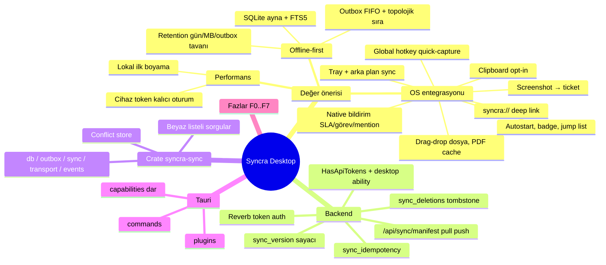

# SYNCRA DESKTOP — Engineering Specification & Build Plan

Repo: `ayberkaarda/Syncra-CRM` (Laravel 12.67 / PHP 8.2 / MariaDB 10.4 / Redis / Reverb + React 18.3 / Vite / TanStack Query 5 / Zustand 5 / Tailwind 4 / i18next).
Hedef: monorepo'ya `desktop/` altında **Tauri 2** tabanlı, **offline-first**, OS ile bütünleşik bir masaüstü istemci eklemek; backend'e cihaz kimlik doğrulama ve delta senkron API katmanı eklemek.

Bu belge bağlayıcıdır. Belgede "ZORUNLU", "YASAK", "KARAR" ile işaretli maddeler tartışmaya açık değildir; sapma gerekiyorsa dur, gerekçeyle sor.

> **Revizyon durumu (2026-08-31).** Bu belge F0 öncesinde yazıldı; keşif ve F1–F6 turlarında **doğrulanmış olgularla çeliştiği 40+ nokta** karar belgelerinde birikti (protokol D1–D13/P1–P20, mimari S1–S10/A11–A28). Hepsi bu sürümde **yerinde** düzeltilmiştir; her düzeltme **§13 revizyon günlüğünde** bölüm + karar ID + tarih ile izlenebilir.
>
> **Kodda karşılığı olmayan kararlar burada "yapılacak" gibi yazılmaz** — mevcut hâliyle yazılır ve 🔴 **AÇIK** işaretiyle `docs/DESKTOP-OPEN-ITEMS.md`'deki madde numarasına bağlanır. Bu belge bir dilek listesi değildir.
>
> **Çapa kuralı:** bu belgeye **satır numarasıyla atıf verilmez**; bölüm numarası (`§4.4`) veya çapa kimliği (`#k-a25-authlost`) kullanılır. Satır numaraları her revizyonda kayar; §13'ün ikinci tablosu eski atıfların karşılığını verir.

---

## 0. OPERASYONEL KURALLAR

### 0.1 Şerit hiyerarşisi
- **Teknik lider (sen):** planlama, sözleşme yazımı, faz bütünleştirme, şerit çıktısı doğrulama.
- **Heavy şerit:** sync protokolü, çakışma algoritması, Rust crate tasarımı, migration risk analizi.
- **Default şerit:** i18n key ekleme, test yazma, boilerplate, doküman güncelleme.
- Her şeride 0.2–0.6 aynen iletilir.

### 0.2 Git — ZORUNLU
- Çalışma branch'i `feat/desktop`; **ben** açarım. Sen `git status | diff | log | ls-files` dışında hiçbir git komutu çalıştırmazsın. Commit/push/stash/reset/checkout/merge/rebase/cherry-pick/branch/worktree YASAK; ben "commit et" dediğimde, verdiğim mesajla tek commit.

### 0.3 Faz kapıları — ZORUNLU
- Her faz sonunda DUR, §11 formatında raporla, onay bekle. Onaysız sonraki faza geçmek YASAK.
- "Çalışıyor / test ettim / doğrulandı" iddiası yalnızca komut + gerçek çıktı ile. Çalıştırılmayan test raporlanmaz. Şeridin "confirmed" dediği her şeyi kendin yeniden çalıştır.

### 0.4 Regresyon — ZORUNLU
Her faz sonunda aşağıdakiler yeşil olmalı, çıktıları raporda:
```
cd backend  && php artisan test                                   # 1427 test tabanı (2026-08-31 ölçümü) + yeniler
cd frontend && npx tsc -p tsconfig.app.json --noEmit              # çıplak `tsc --noEmit` YASAK
cd frontend && npm run i18n:check && npm run i18n:check-bootstrap
cd frontend && npm run build                                      # web bundle etkilenmemeli
cd desktop/crates/syncra-sync && cargo test && cargo clippy --all-targets -- -D warnings
cd desktop  && npm run build:desktop                              # F3'ten itibaren
```

> Bu blok `docs/ENGINEERING-RULES.md` §2 ile **birebir aynıdır**; biri değişirse ikisi birlikte değişir.
>
> **Tuzak 1:** root `tsconfig.json` solution-style'dır; çıplak `tsc --noEmit` hiçbir şey kontrol etmeden sessizce 0 döner. Her zaman `-p tsconfig.app.json` ver.
> **Tuzak 2:** `npm run i18n:check-bootstrap` `src/i18n/index.ts` ve `src/main.tsx` **kaynak metnine** statik assert'ler yapar (KARAR D-6 ile `main.desktop.tsx`'i de kapsar); bu dosyalara dokunan değişiklik script'i de günceller.
>
> **Taban sayı notu:** `1316` F0 anındaki tabandı, `1411` F1 turları sonrası. Yukarıdaki `1427`, 2026-08-31'de teknik liderin `syncra_crm_test` üzerinde koştuğu tam takımın gerçek çıktısıdır (1427 passed, 10152 assertions, 249.76s). `docs/ENGINEERING-RULES.md` §2 ile birebir eşittir.
>
> **Kapı olmayan ama mevcut yapısal kontroller** (ilgili şerit dokunduğunda koşulur, `desktop/package.json`): `npm run check:data` (`check-data-wiring.mjs`, A19 `DataSource` yüzeyi) ve `npm run check:realtime` (`check-realtime-wiring.mjs`, A11 köprüsü).

### 0.5 Scope
Bu belgede olmayan özellik eklenmez; öneri raporun "Öneriler (uygulanmadı)" bölümüne yazılır. Onaylanmış bir karar/kod açık talimat olmadan değiştirilmez.

### 0.6 Dil ve isimlendirme
Kod, identifier, commit, log, dosya adı, doküman başlıkları içindeki teknik terimler → İngilizce. Bana rapor → Türkçe. UI metni hard-code YASAK; 27 namespace'e uygun yeni namespace `desktop` açılır, tr/en/de/fr dördü de doldurulur.

### 0.7 Oturum başında oku
`docs/PROGRESS.md`, `docs/DATABASE.md`, `docs/AUTH-FLOWS.md`, `docs/QUOTE-FINANCIALS.md`, `docs/SLA-DESIGN.md`, `docs/SETTINGS-SAFETY.md`, `docs/PHASE-AUDIT.md`, `README.md` API tablosu.

---

## 1. KESİNLEŞMİŞ KARARLAR

| # | Karar | Gerekçe (kısa) |
|---|---|---|
| K1 | **Tauri 2** (Rust 1.80+, `tauri = "2"`), UI = mevcut `frontend/src` (Vite alias) | UI yeniden yazımı yok; tek React kod tabanı; ~15 MB kurulum |
| K2 | Sync çekirdeği **UI'dan bağımsız lib crate** `syncra-sync` | Test edilebilirlik, olası taşınabilirlik |
| K3 | Lokal DB: **SQLite (rusqlite, `bundled-sqlcipher-vendored-openssl`)**, WAL, FTS5 | Şifreli disk, tek dosya, FTS |
| K4 | Cihaz auth: `User` modeline `HasApiTokens`, token yalnızca `desktop` ability ile, yalnızca `POST /api/auth/device` üretir | Sanctum test edilmiş; web cookie akışı değişmez |
| K5 | Delta cursor için **`sync_version BIGINT UNSIGNED`** (global monoton sayaç), `TIMESTAMP(6)` dönüşümü YAPILMAZ | Tablo yeniden yazımı riski yok, saat kaymasından bağımsız, keyset kararlı |
| K6 | Çakışma: sunucu kuralı > alan bazlı LWW (`activity_log` diff tabanlı) > Conflict Inbox; sessiz üzerine yazma YASAK | Veri kaybı yok, mevcut audit altyapısı kullanılır |
| K7 | Sync yolu **mevcut Action/Service/Policy/FormRequest** üzerinden geçer; iş mantığı kopyalanmaz | `deals.version`, `QUOTE_LOCKED`, state machine, horizontal boundary atlanamaz |
| K8 | Retention: `retention_days=30`, `max_db_size_mb=500`, `max_outbox=5000` (kullanıcı ayarlanabilir, alt sınırlar 7 gün / 100 MB / 500) | "belirli süre / belirli veri" tavanı |
| K9 | Token OS keychain'de (`keyring` crate), SQLCipher anahtarı keychain'de, düz dosya YASAK | |
| K10 | Clipboard yakalama v1'de var, **varsayılan KAPALI**, opt-in | Gizlilik |
| K11 | Platform hedefi: **Windows 10+ (MSI+NSIS) ve Linux (AppImage + deb; Ubuntu 22.04+/Fedora 39+, WebKitGTK 2.42+) eşit öncelikli birinci sınıf hedefler**; her OS özelliği iki platformda da doğrulanır. macOS yalnızca derlenir, test edilmez | Geliştirme ortamı Windows + WSL2 Ubuntu; ikisi de elde var |
| K13 | Paralel fazlar **git worktree** ile izole çalışır (`../syncra-wt-backend`, `../syncra-wt-crate`, …); worktree'leri **ben** açarım, şeritler kendi worktree'si dışına yazamaz | Aynı çalışma dizininde iki şeridin çakışması YASAK |
| K12 | Bootstrap'ta retention penceresi dışındaki kayıtlar **gelmez**; "Download archive" ile pencere genişletilir | Disk tavanı |

> ⚠️ **Karar kimliği çakışması — okurken dikkat.** Bu tablodaki `K1–K13` **şartname** kararlarıdır. Oturum denetimlerinden (RISK-2) çıkan `K1/K2/K3` **ayrı bir seridir**: RISK-2 `K2` = RO referans tablolarının pencerelenmemesi (§4.1), RISK-2 `K3` = bu belgenin revizyonu (§13). Karar belgelerinde ve raporlarda ikinci seri her zaman **`KARAR K2 (RISK-2)`** biçiminde, kaynak belirtilerek anılır.

---

## 2. AKIL HARİTASI



---

## 3. REPO YERLEŞİMİ

```
Syncra-CRM/
├── backend/
│   ├── app/Http/Controllers/Api/Sync/{ManifestController,PullController,PushController}.php
│   ├── app/Http/Controllers/Api/Auth/DeviceTokenController.php
│   ├── app/Http/Controllers/Api/Me/DeviceController.php
│   ├── app/Services/Sync/{SyncPullService,SyncPushService,MutationApplier,ConflictDetector,SyncScope}.php
│   ├── app/Sync/{Mutation,MutationResult,SyncableRegistry}.php
│   ├── app/Observers/SyncDeletionObserver.php
│   ├── database/migrations/2026_09_*_desktop_sync_*.php
│   └── tests/Feature/Sync/*.php
├── frontend/src/platform/{index.ts,web.ts,types.ts}     # desktop.ts desktop/ altında
├── desktop/
│   ├── package.json  vite.desktop.config.ts  tsconfig.json
│   ├── src/{main.desktop.tsx, platform/desktop.ts, bridge/*.ts}
│   ├── crates/syncra-sync/{Cargo.toml, migrations/, src/, tests/}
│   └── src-tauri/{Cargo.toml, tauri.conf.json, capabilities/, src/{main.rs,lib.rs,commands/,os/,state.rs}}
├── docs/DESKTOP-SYNC-PROTOCOL.md   docs/DESKTOP-ARCHITECTURE.md   docs/DESKTOP-THREAT-MODEL.md
├── docs/DESKTOP-OPEN-ITEMS.md      # AÇIK İŞLER DEFTERİ — Karar/Kod/Test üç sütunu; bir madde ancak üçü de ✅ ise kapanır
└── .github/workflows/{desktop-ci.yml,desktop-release.yml}
```

---

## 4. BACKEND SPESİFİKASYONU

### 4.1 Sync kapsamı (`SyncableRegistry`)

| Tablo | Mod | Push op'ları | Notlar |
|---|---|---|---|
| companies, contacts, leads, deals, tasks, activities, tickets, quotes | RW | create/update/delete/action | soft delete → tombstone doğal |
| conversations, messages, conversation_user, notifications | RW (kısıtlı) | messages: create/update/delete; conversation_user: action(read, delivered); notifications: action(read, read_all, delete) | |
| tags | RW | — (silme ucu yok) | hard delete → `sync_deletions`, `row_key = id` |
| **quote_items, taggables, custom_field_values** | **PULL SETİNDE DEĞİL** | ayrı mutasyon **yok** | **KARAR P1 / P1b** — sahip satırın payload'ına gömülür; kendi `sync_version`'ını **almazlar**, `sync_deletions`'a **girmezler** |
| pipeline_stages, custom_fields, products, price_lists, price_list_items, exchange_rates (son 7 gün), saved_views, settings(public) | RO | — | `price_list_items` hard delete edilir → `sync_deletions` (**KARAR P19**) |
| users | RO, projeksiyon `id,name,email,avatar_url,is_active,department` | — | başka kolon YASAK |
| permissions (efektif, oturum sahibi) | RO, manifest içinde | — | |
| activity_log, page_visit_logs, session_logs, sessions, personal_access_tokens, password_reset_tokens, email_templates, automation_rules, jobs*, cache* | **HİÇ** | | |

Pull'da modül `.view` izni yoksa tablo hiç gönderilmez (anahtar bile yok — `GlobalSearchService` ile aynı ilke). Push'ta mevcut Policy'ler aynen çalışır.

<a id="k-p1b"></a>
**KARAR P1 / P1b — üç tablo payload'a gömülür.** `taggables` → sahip satırın `tags: [ids]` alanı; `quote_items` → `quotes` satırının `items: [...]` alanı; `custom_field_values` → sahip satırın `custom_fields: {key: value}` alanı. Gerekçeler `docs/DESKTOP-SYNC-PROTOCOL.md` §1.4–1.5'te olgu referanslarıyla: `taggables`'ın `id` kolonu ve PK'si **yok**; `QuoteRepository::replaceItems()` her düzenlemede tüm kalemleri silip yeniden yaratıyor (ayrı senkron = her düzenlemede N tombstone + N yeni satır).

**Sahip bump zorunluluğu:** yalnızca gömülü veri değişip sahip entity'nin kendi alanları temiz kaldığında delta **kaçar**. Üçü için de `TagSyncService` deseninde bir sarmalayıcı sahip satırın `sync_version`'ını garanti bump'lar (çağrı noktaları protokol §1.4–1.5).

<a id="k-ro-window"></a>
**KARAR K2 (RISK-2) — RO referans tabloları pencerelenmez.** Bootstrap `window_days` filtresi **hacim** aracıdır ve yalnız zaman-sıralı ana varlıklara (`companies…quotes`) uygulanır. Bu tablodaki RO referans/lookup grubunun tamamı pencere **muafiyeti** taşır; **tek istisna `exchange_rates`**'tir, çünkü penceresi ("son 7 gün") tablo listesinin kendisine yazılıdır.

Gerekçe ölçülmüştür (defter O21): 30 günlük pencerede `products` 20 satırın **0**'ını, `users` 10'un **7**'sini, `tags` 12'nin **0**'ını gönderiyordu — sonuç, istemcide "Ürün: —", "Atanan: —", "Tags: —" görünen kayıtlar. Kod karşılığı `SyncableRegistry::windowExemptTables()`.

### 4.2 Migration'lar (ayrı dosyalar, geri alınabilir)

```sql
-- (a) Her RW ve RO ayna tablosuna:
ALTER TABLE <t> ADD COLUMN sync_version BIGINT UNSIGNED NOT NULL DEFAULT 0, ADD INDEX idx_<t>_sync_version (sync_version);
-- (b) Her RW tablosuna:
ALTER TABLE <t> ADD COLUMN client_id CHAR(36) NULL, ADD UNIQUE INDEX uq_<t>_client_id (client_id);

CREATE TABLE sync_counter (id TINYINT PRIMARY KEY CHECK (id=1), value BIGINT UNSIGNED NOT NULL);
INSERT INTO sync_counter VALUES (1, 0);

CREATE TABLE sync_deletions (
  id BIGINT UNSIGNED AUTO_INCREMENT PRIMARY KEY,
  table_name VARCHAR(64) NOT NULL,
  row_key VARCHAR(191) NOT NULL,          -- pk ya da composite (tag_id:taggable_type:taggable_id)
  sync_version BIGINT UNSIGNED NOT NULL,
  deleted_at TIMESTAMP NOT NULL,
  INDEX (table_name, sync_version)
);

CREATE TABLE sync_idempotency (
  idempotency_key CHAR(36) PRIMARY KEY,
  user_id BIGINT UNSIGNED NOT NULL,
  result_json JSON NOT NULL,
  created_at TIMESTAMP NOT NULL,
  INDEX (user_id), INDEX (created_at)
);
```

<a id="k-p2-p4"></a>
`sync_version` ataması: `SyncVersionObserver` — her `saving`/`deleting` event'inde `UPDATE sync_counter SET value = LAST_INSERT_ID(value+1) WHERE id=1` ile atomik artış, modele yazılır. Soft delete de `saving` tetikler → tombstone `deleted_at != null` + yeni `sync_version`. Hard delete tablolarında `deleting` → `sync_deletions` satırı. `updated_at`'e dokunulmaz.

**KARAR P2 — mekanizma tablo bazlıdır, tek tip değildir.** `conversation_user`'ın tüm yazma yüzeyi ham SQL'dir (`attach/detach/sync` Eloquent event'i **üretmez**), bu yüzden o tabloda observer değil **DB trigger** kullanılır (protokol §2.2, düzeltme D4).

**KARAR P4b — no-op UPDATE guard'ı (ZORUNLU).** Probe T7 ölçtü: `SET title = title` gibi değer değiştirmeyen bir UPDATE de trigger'ı tetikliyor (sayaç 10→11) ve **sahte delta** üretiyor. `conversation_user` trigger'ının `BEFORE UPDATE` dalına NULL-safe (`<=>`) alan karşılaştırması guard'ı yazılır: senkronlanan kolonların hiçbiri değişmediyse sayaç bump'lanmaz. Observer tarafında bu sorun yoktur (Eloquent temiz modelde UPDATE atmaz).

**KARAR P5 — satır başına TEKİL versiyon ZORUNLU.** Cursor tek skaler olduğu için (`{"deals": 184320}`), `LIMIT` sınırı aynı `sync_version`'a sahip iki satırın arasına düşerse ikinci satır **bir daha asla dönmez**. Trigger/observer `FOR EACH ROW` çalışır. Sonuç: **"transaction başına tek versiyon" optimizasyonu kalıcı olarak masadan kalkmıştır** — toplu UPDATE'lerde tüm satırlara aynı versiyonu vermek YASAK.

<a id="k-p19-tombstone"></a>
**`sync_deletions` kapsamı — KARAR P19 ile düzeltilmiş tam liste:**

| Tablo | Mekanizma | `row_key` |
|---|---|---|
| `tags` | `SyncDeletionObserver` (savunma amaçlı; bugün silme ucu yok) | `id` |
| `notifications` | `DatabaseNotification::observe(SyncDeletionObserver::class)` | `id` (UUID) |
| `conversation_user` | **`AFTER DELETE` trigger — tek yol** (`detach()` query-builder DELETE'tir) | `conversation_id:user_id` |
| **`price_list_items`** | `SyncDeletionObserver` (**KARAR P19**) | `id` |
| ~~`taggables`, `quote_items`, `custom_field_values`~~ | **Tombstone YAZILMAZ** — §4.1 P1/P1b gereği sahip payload'ına gömülü | — |

**KARAR P19 gerekçesi:** `price_list_items` RO pull setindedir ve hard delete edilir; tombstone olmadan istemcinin lokal aynası **hiç küçülemez** — silinen bir fiyat satırı sonsuza dek yanlış fiyat gösterir. `conversation_user` için surrogate `id` yerine mantıksal anahtar kullanılır: üye ayrılıp yeniden katılırsa yeni bir `id` doğar.

**`SyncDeletionObserver` uygulama notu:** `deleted` değil **`deleting`** kullanılır (aynı transaction; DELETE geri alınırsa tombstone da geri alınır). Soft-delete kullanan modellerde `usesSoftDelete() && ! isForceDeleting()` durumunda **tombstone yazılmaz** — o satır zaten `deleted_at != null` + yeni `sync_version` ile delta'da döner.

> **AÇIK RİSK (protokol §2.8, probe D3):** FK `ON DELETE CASCADE` ile silinen çocuk satır çocuk tablonun `AFTER DELETE` trigger'ını **tetiklemez**; ne observer ne trigger bu yolu yakalar. Bugün tüm cascade zincirleri yalnızca soft delete sayesinde uykudadır — bu bir tesadüftür, tasarım değil. **KARAR P16:** `RESTRICT` migration'ı **yapılmaz** (kapsam genişletmesi); bunun yerine F1'de iki katmanlı mimari regresyon testi bugünkü durumu sözleşmeye çevirir (şema kilidi + hard-delete yolu kilidi).

Backfill migration: mevcut satırlara `id` sırasıyla `sync_version` atanır (`sync_counter` = max). **KARAR D12 — backfill yalnız seeder yolu için gereklidir:** `LeadImportService` Eloquent kullanıyor (event **var**, atlama yok); `DemoDataSeeder` toplu insert yapıyor (event **yok**) → aynı helper `DemoDataSeeder::run()` sonunda çağrılır. `taggables` §4.1 gereği kapsam dışıdır.

`logs:prune`: `sync_deletions` 90 gün, `sync_idempotency` 7 gün.

### 4.3 Auth

<a id="k-p6-p7"></a>
`User` → `use HasApiTokens`. `personal_access_tokens` mevcut.

**KARAR P7 (düzeltme D1) — `ability` alias'ı kayıtlı DEĞİLDİR.** Laravel 11+ `defaultAliases()`'tan kaldırılmıştır ve Sanctum hiçbir alias kaydetmez. §4.4'ün route tanımı bu hâliyle boot'ta `BindingResolutionException` verir. F1 **ön koşulu**: `bootstrap/app.php` alias bloğuna `'ability' => \Laravel\Sanctum\Http\Middleware\CheckForAnyAbility::class`. Hata eşlemesi kendiliğinden doğrudur (`MissingAbilityException` → 403; `currentAccessToken()` boşsa → 401).

**KARAR P6 (düzeltme D2) — `ability:desktop` TEK BAŞINA YETMEZ.** `HasApiTokens` eklendiği an Sanctum her SPA cookie oturumuna `can()` → koşulsuz `true` dönen bir `TransientToken` verir; yani **her cookie oturumu** `ability:desktop`'tan geçer. Sync route'ları ek olarak `currentAccessToken() instanceof \Laravel\Sanctum\PersonalAccessToken` kontrolü yapan **`EnsureDeviceToken`** middleware'i (`device.token`) taşır. §9/1 testleri gerçek `createToken()` + `withToken()` ile yazılır; `actingAs()` o testlerde **YASAK** (tek istisna: kırılganlığı kanıtlayan cookie testi).

**`POST /api/auth/device`** (public, `throttle:login` ile aynı keyed lockout: email+IP hash, 5/dk, 1→2→4→8→16→32→60 dk)
```json
req:  { "email": "", "password": "", "device_name": "AYBERK-PC", "device_fingerprint": "sha256-hex", "platform": "windows|macos|linux", "app_version": "1.0.0" }
200:  { "token": "<plain>", "token_id": 12, "user": {...meMe payload...}, "must_change_password": false, "abilities": ["desktop"] }
401:  { "code": "INVALID_CREDENTIALS" }   423: { "code": "LOCKED_OUT", "retry_after": 120 }
403:  { "code": "USER_INACTIVE" }
```
Kurallar: token `name=device_name`, `abilities=['desktop']`, `expires_at=null`; aynı `device_fingerprint` için eski token silinir (cihaz başına 1 token). Session log'a `event=login`, `channel=desktop` yazılır (`session_logs` tablosuna `channel VARCHAR(16) DEFAULT 'web'` eklenir — **düzeltme D13**, kolon gerçekten yoktu).

<a id="k-fingerprint"></a>
**KARAR K-E (düzeltme D8) — `device_fingerprint` ayrı kolondur, `name`'e gömülmez.** `personal_access_tokens`'ta bu kolon yoktu; eklenir:

```sql
ALTER TABLE personal_access_tokens
  ADD COLUMN device_fingerprint CHAR(64) NULL AFTER abilities,
  ADD INDEX idx_pat_device_fingerprint (device_fingerprint),
  ADD COLUMN device_platform VARCHAR(16) NULL AFTER device_fingerprint;
```

**Biçim ZORUNLU — 64 hex.** `DeviceTokenRequest` kuralı: `['required','string','size:64','regex:/^[0-9a-f]{64}$/']`. 36 karakterlik tireli UUID **geçersizdir** ve 422 döndürür (defter U1: masaüstü `Uuid::new_v4()` ürettiği için bir tur boyunca **hiçbir koşulda giriş yapamadı**). İstemci CSPRNG'den 64 hex üretir.

`name` `text` tipindedir ve kullanıcıya gösterilen cihaz adıdır; anahtar niteliğindeki değer gösterim alanına gömülmez.

**Değiştirilmemesi gerekenler:** `config/sanctum.php` `expiration = null` (kalıcı token için doğru; değişirse tüm token'lar toptan süreli olur) ve `guard = ['web']` (önce session, sonra bearer).

**`GET /api/me/devices`** → `[{ id, name, platform, last_used_at, created_at, is_current }]`
**`DELETE /api/me/devices/{token}`** → yalnızca kendi token'ı; 404 aksi halde.
<a id="k-p8-revoke"></a>
**KARAR P8 — token iptal noktaları (DÖRT akış; düzeltme D7 üçüncüsünü ekledi):**

| Akış | Servis | Not |
|---|---|---|
| `PATCH /api/users/{user}/active` (false) | `UserService::toggleActive()` | `$user->tokens()->delete()`, `save()` ile `event(new UserDeactivated)` arasına, `DB::transaction` içine |
| `DELETE /api/users/{user}` | `UserService::delete()` | `save()` ile `repository->delete()` arasına |
| **`POST /api/users/{user}/reset-password`** | **`UserService::resetPassword()`** | **düzeltme D7 — şartnamede ATLANMIŞTI.** Yönetici şifre sıfırlaması tipik olarak "hesap ele geçirildi" senaryosudur; tüm cihaz token'ları silinir |
| `POST /api/password/change` | `AuthService::changePassword()` | `save()` ile `session()->regenerate()` arasına; `docs/AUTH-FLOWS.md` §3.2 sırası bağlayıcı |

**TUZAK — "mevcut cihaz korunur" naif yazılırsa sessizce hiçbir şey silmez.** `where('id','!=',$user->currentAccessToken()?->id)`: cookie oturumundan gelen bir şifre değişiminde `currentAccessToken()` bir `TransientToken`'dır ve `->id`'si yoktur; `where('id','!=',null)` SQL semantiği gereği **hiçbir satırı eşleştirmez**. Doğru koşul token tipini açıkça ayırır: SPA'dan gelen değişimde **tüm** cihaz token'ları silinir, masaüstünden gelende **kendisi hariç** hepsi.

Middleware: `auth:sanctum` token'ı zaten tanır. `EnsureUserIsActive`, `EnsurePasswordIsChanged` değişmeden çalışır. Sync route'ları ek olarak `ability:desktop` **+ `device.token`** (P6).

<a id="k-p9-broadcast"></a>
**KARAR P9 (düzeltme D9 / S7) — `/broadcasting/auth` bearer.** `withBroadcasting` **ikinci kez ÇAĞRILMAZ**: `BroadcastManager::routes()` URI'yi hard-code eder, ikinci kayıt da `/broadcasting/auth` üretir ve route'ların adı olmadığı için "duplicate name" hatası **çıkmaz** — `RouteCollection` ilk eşleşeni döndürür, ikinci kayıt **sessizce hiç çalışmaz**. Bunun yerine `routes/api.php` içinden `Broadcast::routes(['middleware' => ['auth:sanctum','active']])` çağrılır → `GET|POST /api/broadcasting/auth`. Mevcut `/broadcasting/auth` **olduğu gibi kalır**; SPA yolu değişmez. `password.changed` bilinçli olarak eklenmez.

<a id="k-a12-stateful"></a>
**KARAR A12 (S8) — TUZAK: `SANCTUM_STATEFUL_DOMAINS`.** `EnsureFrontendRequestsAreStateful::fromFrontend()` yalnız `Origin`/`Referer` başlığına bakar. Masaüstü webview'ının origin'i (Windows'ta `http://tauri.localhost`) bu listeyle eşleşirse istek **stateful** sayılır, `ValidateCsrfToken` devreye girer ve bearer'lı `POST` **419 CSRF_TOKEN_MISMATCH** alır — `POST /api/broadcasting/auth` en çok orada ısırır. **ZORUNLU:** masaüstü origin'i `SANCTUM_STATEFUL_DOMAINS`'in **dışında** tutulur; not `backend/.env.example`'a yazılır.

### 4.4 Sync endpoint'leri (`Route::prefix('sync')->middleware(['auth:sanctum','active','password.changed','ability:desktop','device.token'])`)

(`device.token` = §4.3 P6'daki `EnsureDeviceToken`. Zincirin beş halkası da ZORUNLU.)

**`GET /api/sync/manifest`** (`throttle:30,1,sync`)
```json
{ "protocol_version": 1, "server_time": "...", "tables": { "deals": {"mode":"rw"}, "products": {"mode":"ro"}, ... },   // yalnızca izinli tablolar
  "permissions": ["deals.view","deals.update",...], "user": {...}, "policy": { "retention_days_max": 365, "push_batch_max": 200, "push_bytes_max": 2097152, "pull_limit_max": 1000 } }
```
`protocol_version` uyuşmazsa istemci güncelleme ister ve sync'i durdurur.

**`POST /api/sync/pull`** (`throttle:30,1,sync`)
```json
req:  { "cursors": { "deals": 184320, "contacts": 0 }, "limit": 500, "window_days": 30 }
200:  { "server_time": "...", "tables": { "deals": { "rows": [ {...full row, sync_version, deleted_at} ], "deletions": [ {"row_key":"..","sync_version":..} ], "next_cursor": 185001, "has_more": false } } }
```
Sorgu: `WHERE sync_version > :cursor ORDER BY sync_version ASC LIMIT :limit` — keyset, tek kolon, kararlı; doğruluk ön koşulu §4.2 P5'in satır başına tekil versiyon garantisidir. `deleted_at != null` satırlar döner. `rows` içinde `tags: [ids]`, `custom_fields: {key: value}` ve `quotes` için `items: [...]` **gömülü** gider (§4.1 P1/P1b). Toplam yanıt 5 MB'ı aşarsa `has_more=true` ile kesilir.

<a id="k-window-days"></a>
**`window_days` semantiği — ZORUNLU, üç kural:**

1. **Yalnız bootstrap'ta anlamlıdır.** `cursor = 0` iken `updated_at >= now()-window_days` filtresi uygulanır; **delta'da filtre yoktur**.
2. **Delta'da alan GÖNDERİLMEZ.** Sunucu doğrulaması `['sometimes','nullable','integer','min:1','max:365']`'tir — yani `window_days: 0` **422 döndürür**. "Delta'da filtre yok" cümlesi "sıfır gönder" demek değildir; alan istekten tamamen çıkarılır. (Defter U3: istemci `0` gönderdiği için **her senkron turunun pull yarısı 422 alıyordu**; canlı doğrulama `0`→422, `30`→200.)
3. **RO referans tabloları pencerelenmez** — §4.1 KARAR K2 (RISK-2); tek istisna `exchange_rates`.

<a id="k-u9-closure"></a>
**İlişkisel bütünlük — derinlik-1 kapanış (U9).** §4.4 bootstrap penceresini tanımlıyordu ama **ilişkisel bütünlükten hiç söz etmiyordu**: pencere içindeki bir `contact`/`deal`/`ticket`/`quote` satırının `company_id`'si pencere dışında kalan bir firmayı gösterebilir ve istemcide ilişki boş görünür (canlı: 18 fırsat geldi, **1 firma** → 18/18 satırda "Company: —").

**Sözleşme:** bootstrap pull'unda (`cursor = 0`) ana döngüden sonra bir kez **derinlik-1** kapanış çalışır: yanıtta yer alan satırların FK hedefleri, pencere dışında kalsalar bile yanıta eklenir. Derinlik **1 ile sınırlıdır** — kapanışla eklenen bir firmanın kendi FK'ları kovalanmaz. Kapanış satırları da aynı yanıtın 5 MB bütçesine tabidir ve delta pull'da **hiç çalışmaz**. Kod karşılığı `SyncPullService::applyCompanyClosure()`.

> **AÇIK (defter O22) — bütçe kenar durumu:** bir pull, bütçe dolduğu için kapanışı hiç işleyemezse o adaylar kaçar ve `companies` cursor'ı 0'ın üstüne çıktığı için **bir daha denenmez**. Mevcut veri setinde ulaşılamaz (payload/bütçe oranı %0.28), büyük kurumsal veri tabanında gerçek bir sınırdır. Bilinçli kabul edilmiştir.
>
> **AÇIK (defter O21) — `users` kapanışı:** `assigned_to`/`owner_id` üzerinden aynı sınıf bir kapanışın gerekip gerekmediği **doğrulanmadı**; ayrı bir tur gerektirir.

<a id="k-a26-sla"></a>
**KARAR A26 — SLA alanları pull satırındadır, formül istemciye AÇILMAZ.** `sla_remaining_seconds`, `sla_total_seconds`, `sla_target_hours`, `sla_breached` web'de de fiziksel kolon değildir; `TicketResource` bunları `SlaService` ile hesaplar. Sunucu aynı `SlaService` metotlarını çağırıp sonucu pull satırına koyar (`SyncPullService::attachTicketSla()`); aritmetik **kopyalanmaz** (K7). `docs/SLA-DESIGN.md` §1 gereği geri sayımı her zaman sunucu hesaplar; istemci aldığı kalan saniyeyi monoton saatle eritir — ham alanlardan istemcide yeniden hesaplamak bu kuralın **ihlalidir**.

> **AÇIK (defter O2/U8):** sunucu tarafı tam ve testli; **istemci henüz tüketmiyor** — `mappers.ts` hâlâ A23'ün `null`/`0` davranışında, SLA sütunu `—` basıyor.

**`POST /api/sync/push`** (`throttle:20,1,sync-push`; batch ≤ 200 mutasyon, ≤ 2 MB)
```json
req: { "batch_id": "uuid", "mutations": [
  { "seq": 1, "idempotency_key": "uuidv7", "op": "create", "entity": "contact", "client_id": "uuidv7",
    "occurred_at": "2026-08-26T09:12:11.482Z", "payload": { "first_name":"..", "company_client_id":"uuidv7|null", "company_id": 44|null, "tags":[..], "custom_fields":{..} } },
  { "seq": 2, "idempotency_key": "..", "op": "update", "entity": "deal", "server_id": 18342, "base_sync_version": 184000,
    "occurred_at": "..", "changed_fields": ["title","amount"], "payload": { "title":"..", "amount": 1500.00 } },
  { "seq": 3, "idempotency_key": "..", "op": "action", "entity": "deal", "server_id": 18342, "action": "move",
    "occurred_at": "..", "payload": { "to_stage_id": 4, "version": 8, "after_deal_id": 17000|null, "before_deal_id": null } },
  { "seq": 4, "idempotency_key": "..", "op": "delete", "entity": "task", "server_id": 991, "base_sync_version": 183990 },
  { "seq": 5, "idempotency_key": "..", "op": "action", "entity": "notification", "action": "read_all",
    "scope": "user", "occurred_at": ".." }
]}
200: { "batch_id": "..", "results": [
  { "seq": 1, "status": "applied",   "server_id": 5012, "sync_version": 185002 },
  { "seq": 2, "status": "conflict",  "code": "FIELD_CONFLICT", "conflicting_fields": ["amount"], "server_row": {...}, "sync_version": 184990 },
  { "seq": 3, "status": "rejected",  "code": "DEAL_VERSION_CONFLICT", "server_row": {...} },
  { "seq": 4, "status": "duplicate", "server_id": 991 },
  { "seq": 5, "status": "applied",   "affected": 37 }
], "server_time": ".." }
```

<a id="k-p20-move"></a>
**KARAR P20 — `deal.move` payload alan adı `to_stage_id`'dir.** Bu belgenin önceki sürümü `pipeline_stage_id` yazıyordu; **yanlıştı**. Gerçek sözleşme `Http/Requests/Deals/MoveDealRequest.php`'te `to_stage_id`'dir ve K7 gereği mevcut sözleşme kazanır. `deals.pipeline_stage_id` **kolonu** ayrı bir şeydir ve doğrudur (satır payload'ında ve crate'in FK haritasında öyle kalır) — ikisi karıştırılmamalıdır. *(Bu maddenin yanlış hâli bir kez fixture'a kopyalandı; şartnamenin yanlış olması hatayı şerit sayısıyla çarpar.)*

<a id="k-p17-delete"></a>
**KARAR P17 — `op=delete` `occurred_at` ve `payload` TAŞIMAZ.** `occurred_at` yalnızca `ConflictDetector`'ın `activity_log.created_at` kıyaslaması içindir ve bu **yalnız `op=update`** için geçerlidir; delete'te çakışma kararı `base_sync_version` karşılaştırmasıyla verilir. Sunucu bu iki alanı delete'te **zorunlu kılmaz**.

<a id="k-p18-clientid"></a>
**KARAR P18 — `update`/`action`/`delete` `client_id` ile adreslenebilir.** Mutasyonda `server_id` yoksa `client_id` **zorunludur**. Zorunlu durum: offline oluşturulup henüz push edilmemiş bir kayda action uygulanması (görev oluştur → tamamla); `action` ayrı bir topolojik seviyedir (§5.4) ve aynı batch'te create'i takip edebilir — o anda `server_id` henüz yoktur. Sunucu hedefi FK çözümlemesiyle **aynı** mekanizmayla bulur: (a) batch içi `client_id → server_id` eşlemesi, (b) DB'de `client_id` UNIQUE araması. Çözülemezse `rejected` + `UNRESOLVED_REFERENCE`. Sonuç: `client_id` UNIQUE index'i yalnız FK çözümü için değil, **mutasyon hedefi çözümü** için de kullanılır.

<a id="k-p10-readall"></a>
**KARAR P10 — `notification.read_all` genel şemaya uymaz.** `op=action`'ın şekli `entity` + `server_id`/`client_id` odaklıdır; `read_all` ise **kullanıcı kapsamlıdır** ve satır id'si taşımaz. Bu tek durumda `server_id` ve `client_id` **yoktur**, yerine `scope: "user"` gelir; sunucu chunk'lı döngüyü çalıştırır (§4.2 P5 gereği her satır **tekil** `sync_version` alır) ve `{"status":"applied","affected":N}` döner.
İşleme kuralları:
- Mutasyon başına `DB::transaction`; hata diğerlerini durdurmaz.
- **KARAR P4a — kilit çakışması retry politikası (bağlayıcı).** `sync_counter` küresel bir yazma mutex'idir (KARAR K-B: serileşme bir bedel değil, "commit sırası = versiyon sırası" garantisinin kendisidir; alternatifi sessiz veri kaybıdır). Ölçüldü: iki eşzamanlı transaction `1205 Lock wait timeout` ile ölüyor. Politika — **yalnız** `SyncPushService`'in mutasyon-başına transaction'ında (web yazma yollarına retry **eklenmez**), yakalanan hatalar `1205` ve `1213`, en fazla **3 deneme**, backoff **100/400/900 ms** ±%25 jitter, `innodb_lock_wait_timeout = 10 sn` bağlantı düzeyinde (`PDO::MYSQL_ATTR_INIT_COMMAND`). Tükenirse mutasyon `rejected` işaretlen**mez** — geçici hata terminal statü alamaz; batch kesilir ve kısmi yanıt döner (P10b).
- `idempotency_key` varsa → `duplicate` + kayıtlı sonuç.
- FK çözümleme: payload'daki `*_client_id` alanları, aynı batch'te önce oluşturulmuş client_id → server_id eşlemesinden veya DB'den (`client_id` UNIQUE) çözülür; çözülemezse `rejected` `code=UNRESOLVED_REFERENCE`.
- `op=create`: ilgili `Store*Request` kuralları `Validator::make` ile uygulanır, Policy `create`, mevcut create Action/Service çağrılır, `client_id` set edilir. Aynı `client_id` zaten varsa → `duplicate`.
- `op=update`: `changed_fields ⊆ payload keys` doğrulanır; `changed_fields` dışı alan **yazılmaz**. Policy `update` + mevcut horizontal boundary. Yasak alanlar (`pipeline_stage_id, position, version, status` deals için) 422 `rejected`.
- `op=action`: beyaz liste — `deal.move, deal.assign, task.complete, task.assign, ticket.status, ticket.assign, lead.assign, quote.status(draft→…yalnız accepted/rejected/expired), conversation.read, conversation.delivered, notification.read, notification.read_all`. Mevcut controller'ların çağırdığı Action sınıfları kullanılır. `lead.convert, quote.send, quote.revise` beyaz listede DEĞİL → `rejected` `code=ONLINE_ONLY`.

  <a id="k-action-bare"></a>
  > **BU LİSTE WIRE ALANI DEĞİLDİR — `entity.action` ANAHTARIDIR (2026-08-31).** Yukarıdaki
  > `deal.move` gibi noktalı adlar, "hangi *entity + action* çifti izinli" sorusunun
  > adlandırmasıdır. **Wire şekli §4.4'te tanımlıdır ve orada nokta yoktur:** `entity` ve
  > `action` iki **ayrı** alandır (`{"entity":"deal","action":"move"}`), `protocol.rs`
  > `WireMutation` de böyle serileştirir.
  >
  > **Bu ayrımın atlanması gerçek bir hataydı.** `MutationApplier` çıplak `action` alanını bu
  > noktalı listeyle karşılaştırıyordu; sonuç, **12 fiilin tamamının** `INVALID_MUTATION` ile
  > reddedilmesiydi — `deal.move` dahil. F4 kabul senaryosu koşulana kadar hiçbir test
  > yakalamadı, çünkü backend fixture'ları noktalı gönderiyordu (sunucunun kendi
  > konvansiyonunu test ediyorlardı) ve crate testleri kendi tarafında çıplak gönderip yeşil
  > kalıyordu. Defter O45.
  >
  > **Tek lehçe kuralı:** sunucu artık `action` alanında nokta görürse mutasyonu
  > `INVALID_MUTATION` ile **açıkça reddeder**. "Her ikisini de kabul et" bilinçle
  > reddedildi — iki lehçe kalıcılaşmış drift demektir.
- `op=delete`: Policy `delete` + mevcut kısıtlar (won/lost deal, resolved ticket vb. → `rejected`).
- `ConflictDetector` (update için): `server.sync_version > base_sync_version` ise `activity_log` içinde `subject=(entity,server_id)` ve `created_at > occurred_at` olan kayıtların `properties.attributes` anahtarlarını topla; `changed_fields ∩ değişen_anahtarlar ≠ ∅` → `conflict` (kesişim `conflicting_fields`), aksi halde alanlar uygulanır ve `applied`. `activity_log` tutmayan entity'de (kontrol et, Faz 0) kayıt düzeyinde: `sync_version` farklıysa `conflict`.
- **KARAR P10b — kısmi push yanıtı (wire sözleşmesi).** P4a retry'ı tükendiğinde sunucu **HTTP 200** ile o ana kadar işlenmiş sonuçları döner. Bağlayıcı cümle: **`results` dizisinde `seq`'i bulunmayan her mutasyon işlenmemiş sayılır; istemcide `queued` durumunda kalır ve sonraki turda yeniden gönderilir.** Yeni bir hata kodu veya statü **gerekmez** — `idempotency_key` tekrar gönderimi güvenli kılar. İstemci karşılığı §5.5 P15'tir.
- **KARAR P11 — `activity_log` tutmayan entity'lerde kayıt düzeyi çakışma.** `conversations`, `messages`, `custom_field_values`, `notifications` audit tutmaz (bilinçli tasarım). Bu tablolarda alan bazlı LWW **uygulanmaz**; `sync_version` farkı varsa doğrudan kayıt düzeyi `conflict` üretilir. `LogsActivity` eklemek **reddedilmiştir** (düzeltme D11) — chat'te her mesaj için audit satırı yazmak mevcut tasarımın bilinçle reddettiği bir maliyettir ve `activity_log` §4.1 gereği zaten hiç senkronlanmaz.
- Sonuç `sync_idempotency`'ye yazılır.
- Her `applied` sonrası `activity_log` `causer` = token sahibi, `properties.channel='desktop'`, `batch_id` eklenir.
- Broadcast event'leri normal akışta olduğu gibi atılır (web kullanıcıları görür).

### 4.5 Hata kodları (yeni)
`ONLINE_ONLY, UNRESOLVED_REFERENCE, FIELD_CONFLICT, RECORD_DELETED, PROTOCOL_VERSION_MISMATCH, PUSH_BATCH_TOO_LARGE, INVALID_MUTATION, ABILITY_REQUIRED`. Mevcutlar aynen: `DEAL_VERSION_CONFLICT, QUOTE_LOCKED, INVALID_STATUS_TRANSITION, ROLE_NOT_EDITABLE`.

### 4.6 Backend test matrisi (`tests/Feature/Sync`)
1. Device token: başarı, lockout eskalasyonu, inactive → 403, fingerprint tekrarında eski token silinir, deaktive → token anında 401, `ability:desktop` olmayan token → sync 403 `ABILITY_REQUIRED`.
2. Manifest: izinsiz modül tabloda yok; `protocol_version`.
3. Pull: bootstrap `window_days`; delta; tombstone (soft ve `sync_deletions`); 600 kayıt / limit 500 keyset kararlılığı (sıfır tekrar, sıfır atlama); 5 MB kesme; izinsiz tablo yok.
4. Push: create + client_id eşleme; batch içi FK çözümü; `UNRESOLVED_REFERENCE`; idempotency tekrarı; `changed_fields` dışı alan yazılmıyor; `FIELD_CONFLICT` (activity_log ile); `DEAL_VERSION_CONFLICT`; `QUOTE_LOCKED`; `INVALID_STATUS_TRANSITION`; `ONLINE_ONLY`; horizontal boundary reddi; silinmiş kayıt `RECORD_DELETED`; converted lead update reddi; won/lost deal delete reddi; batch 201 → 422.
5. Broadcasting auth bearer ile.
6. `logs:prune` yeni tablolar.

**Ek zorunlu testler (protokol §7.3):** cookie oturumu `/api/sync/*`'a **403** alır (§4.3 P6 kilidi) · teklif kalemi silindiğinde sahip `quote` bump'lanır · `notification.read_all` sonrası etkilenen her satırın **tekil** `sync_version`'ı vardır (P5) · 600 kayıt / limit 500 keyset kararlılığı · kapsam tablolarında hard cascade tetiklenemez (P16 iki katmanlı mimari regresyon) · `conversation_user` trigger'ı (`markRead`/`markDelivered`/`fanOutNewMessage` sonrası bump; `detach()` sonrası `conversation_id:user_id` tombstone'u) · `DemoDataSeeder` sonrası hiçbir kapsam tablosunda `sync_version = 0` kalmaz (D12) · şifre değişikliğinde SPA'dan gelen istek **tüm** cihaz token'larını siler, masaüstünden gelen kendininkini korur (P8).

**KESİN KIRILACAK MEVCUT TEST — sessizce güncellenmez.** `tests/Feature/Security/PasswordChangeGateTest.php` `password.changed` taşımayan route'ları dört elemana `assertSame` ile kilitliyor. P9'un `GET|POST api/broadcasting/auth`'u listeye **5. eleman olarak eklenir** ve gerekçesi test içinde yorumla yazılır. `GET|DELETE /api/me/devices*` bilinçli olarak `password.changed` grubuna konur (zorunlu şifre değişimi bekleyen kullanıcı cihaz kaydetmemeli) → listeyi etkilemez. `POST /api/auth/device` public olduğu için etkilemez.

**Test izolasyonu:** paralel worktree'lerde `DB_DATABASE=test_tmp_<sonek>` (`docs/ENGINEERING-RULES.md` §5).

---

## 5. `syncra-sync` CRATE SPESİFİKASYONU

### 5.1 Cargo
```toml
[package] name = "syncra-sync" edition = "2021" rust-version = "1.80"
[dependencies]
rusqlite = { version = "0.32", features = ["bundled-sqlcipher-vendored-openssl", "functions", "backup"] }
tokio = { version = "1", features = ["rt-multi-thread","sync","time","macros"] }
reqwest = { version = "0.12", default-features = false, features = ["json","rustls-tls","gzip"] }
serde = { version="1", features=["derive"] }  serde_json = "1"
uuid = { version = "1", features = ["v7","serde"] }
thiserror = "1"  tracing = "0.1"  keyring = "3"  chrono = { version="0.4", features=["serde"] }
[dev-dependencies] wiremock = "0.6"  tempfile = "3"  tokio-test = "0.4"
```

### 5.2 Modüller ve public API
```rust
pub struct SyncConfig { pub api_base: Url, pub db_path: PathBuf, pub retention_days: u32, pub max_db_size_mb: u32, pub max_outbox: u32, pub keychain_service: String }

pub struct SyncEngine { /* Arc<Inner> */ }
impl SyncEngine {
  pub async fn open(cfg: SyncConfig) -> Result<Self, SyncError>;               // keychain'den DB key, migrate
  pub async fn login(&self, email: &str, password: &str, device: DeviceInfo) -> Result<Session, SyncError>;
  pub async fn restore_session(&self) -> Result<Option<Session>, SyncError>;   // keychain token → manifest → ok
  pub async fn logout(&self, force: bool) -> Result<LogoutOutcome, SyncError>; // pending varsa force gerekir
  pub async fn bootstrap(&self, progress: impl Fn(BootstrapProgress)) -> Result<(), SyncError>;
  pub async fn sync_now(&self) -> Result<SyncReport, SyncError>;                // push → pull, mutex
  pub fn status(&self) -> SyncStatus;
  pub fn subscribe(&self) -> broadcast::Receiver<EngineEvent>;
  pub fn query(&self, q: NamedQuery, params: QueryParams) -> Result<Vec<Row>, SyncError>;  // yalnız beyaz liste
  pub fn get(&self, entity: Entity, client_id: Uuid) -> Result<Option<Row>, SyncError>;
  pub fn mutate(&self, m: LocalMutation) -> Result<Uuid, SyncError>;           // outbox'a yaz + lokal DB'ye uygula
  pub fn search(&self, fts: &str, entities: &[Entity], limit: u16) -> Result<Vec<SearchHit>, SyncError>;
  pub fn conflicts(&self) -> Result<Vec<Conflict>, SyncError>;
  pub fn resolve_conflict(&self, id: Uuid, choice: Resolution) -> Result<(), SyncError>;  // Resolution::{KeepMine, TakeServer, Merge(fields)}
  pub fn storage_stats(&self) -> StorageStats;
  pub fn update_settings(&self, s: DesktopSettings) -> Result<(), SyncError>;
  pub async fn download_archive(&self, extra_days: u32) -> Result<(), SyncError>;
  pub fn set_online(&self, online: bool);                                       // OS network event
  pub async fn handle_realtime(&self, ev: RealtimeEvent);                      // tablo bazlı mini-pull tetikler
}

pub enum EngineEvent { TablesChanged(Vec<Entity>), StatusChanged(SyncStatus), ConflictAdded(Uuid), StorageWarning(StorageStats), AuthLost, ProtocolMismatch{server:u32} }
pub struct SyncStatus { pub online: bool, pub syncing: bool, pub pending: u32, pub conflicts: u32, pub last_sync_at: Option<DateTime<Utc>>, pub write_blocked: Option<WriteBlockReason> }
pub enum SyncError { Auth, Offline, Protocol(String), Db(rusqlite::Error), Http(reqwest::Error), WriteBlocked(WriteBlockReason), Validation(String) }
```
`NamedQuery`: enum (`DealsBoard{stage_ids}`, `DealsList{filter,sort,page}`, `ContactList`, `TicketList`, `ConversationMessages{conv,before,limit}`, ...). Ham SQL UI'dan kabul edilmez — YASAK.

### 5.3 Lokal şema (özet; `migrations/0001_init.sql`)
Her ayna tablosu: sunucu kolonları (sync kapsamı) + `client_id TEXT PRIMARY KEY, server_id INTEGER UNIQUE, sync_state TEXT CHECK(sync_state IN ('synced','pending','conflict','tombstone')), server_sync_version INTEGER, local_updated_at TEXT, deleted_at TEXT`. FK'lar `*_client_id` ile; sunucudan gelen `*_id` → lokal `client_id` eşlemesi pull sırasında yapılır (server_id → client_id map; sunucuda `client_id` null olan web kayıtları için deterministik `uuid5(namespace, "entity:server_id")`).

<a id="k-p12-p13"></a>
**KARAR P13 — üç tablo lokal şemada ayna tablosu DEĞİLDİR.** §4.1 P1/P1b gereği `taggables`, `quote_items` ve `custom_field_values` pull setinde yoktur; istemcide de ayrı tablo tutulmaz. Sırasıyla sahip satırın `tags`, `quotes.items` ve `custom_fields` alanlarında saklanırlar. Somut etkileri: (1) lokal şemadan bu üç ayna tablosu **düşer**; (2) §5.4'ün topolojik sırasından **`quote_item(4)` seviyesi kalkar**; (3) FTS trigger'ları etkilenmez.

**KARAR P12 — `notifications` lokal şeması istisnadır.** `notifications.id` zaten `CHAR(36)` UUID'dir, hiçbir zaman null olamaz ve auto-increment `id` yoktur (düzeltme D10). Bu tabloda `client_id = notifications.id` **doğrudan** kullanılır; ayrı `client_id` kolonu **eklenmez**, `server_id INTEGER UNIQUE` alanı **atlanır**. Yukarıdaki `uuid5` türetme adımı bu tablo için **yapısal olarak gereksizdir** — o durum burada var olamaz.

```sql
CREATE TABLE outbox (id TEXT PRIMARY KEY, seq INTEGER UNIQUE, idempotency_key TEXT UNIQUE, entity TEXT, op TEXT, action TEXT, client_id TEXT, server_id INTEGER,
  base_sync_version INTEGER, changed_fields TEXT, payload TEXT, occurred_at TEXT, attempts INTEGER DEFAULT 0, last_error TEXT, state TEXT CHECK(state IN ('queued','inflight','failed')));
CREATE TABLE conflicts (id TEXT PRIMARY KEY, outbox_id TEXT, entity TEXT, client_id TEXT, code TEXT, conflicting_fields TEXT, mine TEXT, theirs TEXT, created_at TEXT);
CREATE TABLE cursors (table_name TEXT PRIMARY KEY, sync_version INTEGER NOT NULL DEFAULT 0);
CREATE TABLE desktop_settings (key TEXT PRIMARY KEY, value TEXT);
CREATE TABLE cached_files (id TEXT PRIMARY KEY, kind TEXT, ref TEXT, path TEXT, bytes INTEGER, fetched_at TEXT);
CREATE VIRTUAL TABLE fts_records USING fts5(entity UNINDEXED, client_id UNINDEXED, title, body, tokenize='unicode61 remove_diacritics 2');
```
FTS trigger'ları: deals(title, company name), contacts(first+last, email, phone), companies(name), leads(name,email,phone,company), tickets(ticket_number, subject), quotes(quote_number), messages(body). Türkçe `İ/ı` için `remove_diacritics 2` + uygulama tarafı `to_lowercase` normalizasyonu.

### 5.4 Outbox sıralama (topolojik)
Öncelik: `company(0) → contact(1) → lead(1) → deal(2) → quote(3) → task/activity/ticket(3) → message(3) → actions(5, kendi entity'sinin create'inden sonra)`. *(`quote_item(4)` seviyesi §5.3 P13 gereği **kalkmıştır** — kalemler `quote` mutasyonunun payload'ında taşınır.)* Aynı entity için `create < update < action < delete`, eşitlikte `seq`. Bir `create` `rejected` olursa ona bağımlı mutasyonlar `failed` + `UNRESOLVED_REFERENCE` olarak Conflict Inbox'a düşer (kullanıcı yeniden dener/siler).

Coalescing: aynı `client_id` için ardışık `update`'ler tek mutasyona birleştirilir (`changed_fields` union, son payload); `create` sonrası `update` create'e katlanır; `create` sonrası `delete` her ikisini siler.

### 5.5 Sync döngüsü
```
sync_now():
  guard mutex (bekleyen tetik varsa coalesce)
  if !online → return Offline
  manifest (10 dk cache) → protocol check
  push: outbox[queued] topolojik sıra, 200'lük batch, inflight işaretle
        results: applied→synced+server_id; duplicate→synced; conflict→conflicts tablosu+state=conflict; rejected(ONLINE_ONLY|4xx)→failed+inbox; 5xx/ağ→attempts++, backoff
  pull: tüm tablolar, has_more döngüsü, upsert (server_sync_version karşılaştırmalı: local pending ise sunucu satırını 'theirs' olarak sakla, pending alanları ezme)
  retention_maintenance() (günde 1)
  emit TablesChanged, StatusChanged
backoff: 1s,2s,4s,…,300s + jitter ±20%
tetikleyiciler: open, set_online(true), handle_realtime, 60 s timer (online), manuel
```

<a id="k-a25-authlost"></a>
**KARAR A25 — 401 ile deaktivasyon AYNI OLAY DEĞİLDİR.** Bu belgenin önceki sürümü kendi içinde çelişiyordu: §5.5 "401 → outbox korunur" derken §9/2 "401 → tamamen wipe" diyordu. İkisi ayrı sinyale bağlanır:

| Sinyal | Davranış | Gerekçe |
|---|---|---|
| **403 `USER_DEACTIVATED`** | **Wipe** — lokal DB + keychain | `EnsureUserIsActive` bunu açıkça döndürür: sunucu-bilgili, kesin sinyal. §9/2'nin kastı budur. |
| **Genel 401** | **Outbox korunur**, `AuthLost`. Aynı kullanıcı geri girerse devam; **farklı kullanıcı → wipe** | Sebebi belirsizdir (süresi dolmuş token, sunucu hıçkırığı). Naif "her 401'de wipe" masum kullanıcının bekleyen işini yok eder. |

**Artık risk (kabul edildi):** silinmiş bir kullanıcının şifreli DB'si diskte kalır; anahtar o OS hesabının keychain'inde olduğu için erişim aynı OS hesabıyla sınırlıdır, temizlik retention penceresi veya farklı kullanıcı girişindeki wipe ile olur.

> 🔴 **AÇIK — kodda karşılığı YOK (defter O1 / U16).** Karar ✅ · Kod ❌ · Test ❌. Bugün `transport.rs` 403'ü ayrıştırmadan `SyncError::Protocol`'e katlıyor, `USER_DEACTIVATED` masaüstü kodunda **hiç geçmiyor** (grep 0) ve `handle_auth_lost` yalnız 401'de çalışıyor. **Bugünkü davranış karardan da kötüdür:** deaktive edilmiş kullanıcı oturumu düşmeden "protocol error" görüyor ve wipe hiç olmuyor. §9/2 bu yüzden AÇIK'tır ve F6 bu madde kapanmadan kapatılamaz.

<a id="k-p15-partial"></a>
**KARAR P15 — push sonuç işleyicisi kısmi yanıtı ele alır.** §4.4 P10b gereği: sunucudan dönen `results` dizisinde `seq`'i bulunmayan outbox kaydı **`queued` durumunda bırakılır** (`inflight`'tan geri alınır), `attempts` **artırılmaz** ve sonraki `sync_now()` turunda yeniden gönderilir. Bu kural baştan implemente edilir; sonradan eklenmesi push state machine'inin yeniden yazılmasını gerektirir.

### 5.6 Retention
`retention_maintenance()`: (1) `tombstone` ve `deleted_at < now - retention_days` → DELETE; (2) `sync_state='synced'` ve `updated_at < now - retention_days` ve outbox/conflict referansı yok → DELETE (FK sırası tersine); (3) `cached_files` LRU ile 100 MB; (4) `PRAGMA incremental_vacuum`. Boyut: `page_count*page_size`; ≥%80 → `StorageWarning`; ≥%100 veya outbox ≥ max → `write_blocked=Some(DiskFull|OutboxFull)`, `mutate()` `WriteBlocked` döner; okuma devam.

<a id="k-crate-tests"></a>
### 5.7 Crate test matrisi (`wiremock`)
bootstrap → tablolar dolu, cursor'lar set; delta pull tombstone; server_id→client_id eşleme (web kayıtları uuid5); 50 offline mutasyon → push sırası topolojik, batch'leme, idempotency tekrarında duplicate; coalescing; conflict → `conflicts` + `sync_state`; resolve KeepMine yeni mutasyon üretir (base_sync_version güncel); **401 → outbox korunur** ve **403 `USER_DEACTIVATED` → wipe** (§5.5 A25, iki ayrı test); farklı user login → wipe; kısmi push yanıtı (`results`'ta `seq` yoksa `queued` kalır, `attempts` artmaz — §5.5 P15); retention pending silmiyor; disk tavanı → WriteBlocked; FTS Türkçe karakter; protocol mismatch → durur.

---

## 6. TAURİ UYGULAMASI

### 6.1 Plugin'ler
`tauri-plugin-notification, global-shortcut, deep-link, autostart, updater, window-state, single-instance, clipboard-manager, dialog, fs, os, process, shell(open only), log`.

### 6.2 Komutlar (`src-tauri/src/commands/`)
`auth::{login, session, restore, logout, list_devices, revoke_device}` · `data::{query, mutate, search}` · `sync::{sync_now, status, conflicts, resolve_conflict, download_archive, bootstrap, handle_realtime}` · `storage::{storage_stats, storage_settings, update_settings, clear_local}` · `files::{cache_quote_pdf, open_cached, attach_from_paths, screenshot_to_ticket}` · `os::{set_badge, register_hotkey, set_autostart, get_autostart, set_tray_language, notify}`.
Her komut `SyncError` → `{code, message}` JSON; UI'da `desktop.errors.*` i18n (bilinmeyen `code` → `desktop.errors.unknown`; eksik anahtar dev/test'te **throw** eder).

<a id="k-handle-realtime"></a>
**ŞARTNAME DÜZELTMESİ — `handle_realtime` komut listesinde EKSİKTİ.** §5.2 (`SyncEngine::handle_realtime`) ve mimari §6.3 bu akışı **zorunlu** kılıyor: masaüstünde Echo olayı doğrudan `invalidateQueries` çağırmaz; `invoke('handle_realtime')` ile motora gider, motor mini-pull yapar, `TablesChanged` köprüden cache'e döner (KARAR A11). Ad üç yerde birden tutarlı olmalıdır ve statik olarak doğrulanır: TS `invoke` adı · Rust `#[tauri::command] fn` · `lib.rs` `generate_handler!`. Bu üçlünün sessizce ayrışması en olası kırılma noktasıdır (`npm run check:realtime`).

`bootstrap` da aynı gerekçeyle listelenir: `BootstrapProgress` yayan tek yoldur (§5.2).

<a id="k-cmd-names"></a>
**ŞARTNAME DÜZELTMESİ — `session` eksikti, `stats` yanlıştı (2026-08-31).** İki hata da `npm run check:commands` (`desktop/scripts/check-command-wiring.mjs`) ilk kez koştuğunda ortaya çıktı:

- **`auth::session`** kayıtlıydı ve `platform/auth.ts` onu kullanıyordu, ama §6.2 hiç listelemiyordu. Açılışta ağa gitmeden oturumu ve device token’ı veren tek komuttur (F3 teslimi); listeye eklendi.
- **`storage::stats`** kodda ve bu listede `stats`, sözleşme metninin başka yerlerinde `storage_stats` diye anılıyordu. **Uzun ad kazandı:** Rust fonksiyonu, `generate_handler!` girdisi ve TS çağrı yeri `storage_stats` olarak hizalandı (defter O5).
- **`data::get` listeden düşürüldü.** Kayıtlıydı ve bu sözleşmede duruyordu, ama hiçbir tüketicisi yoktu: TS tarafında `rowById` yerel `query` yolundan (`platform/data/engine.ts`, `rows_by_server_ids`) gidiyor ve doğru desen budur. Kayıtlı-ama-ölü bir komut hem bakım hem saldırı yüzeyidir; komut, `generate_handler!` girdisi ve kontrolörün `CONTRACT` sabiti birlikte silindi (defter O29). **Komut sayısı 27 → 26, teslim 19 → 19.**
- **`storage_settings` eklendi (defter O8).** Motorda `SyncEngine::settings()` zaten vardı ve testliydi, ama hiçbir komuta bağlı değildi; ayar ekranı bu yüzden `retention_days`'i bir `localStorage` aynasından okuyordu ve yeniden kurulumda bayat değer gösteriyordu. `update_settings` yazma yolunun simetriği olarak kaydedildi; ayna kaldırıldı.

`handle_realtime` için yukarıda yazılan üçlü-tutarlılık kuralı **tüm komutlar için** geçerlidir ve artık statik olarak zorlanır: TS `invoke` adı · Rust `#[tauri::command] fn` · `lib.rs` `generate_handler!` · bu §6.2 listesi. Dördü ayrışırsa `check:commands` kırmızı verir (iki yönde negatif kontrolle doğrulandı). F5 kapsamındaki `files::*` ve `os::*` kontrolörde gerekçeli **DEFERRED** listesindedir; teslim edildiklerinde o listeden çıkarılırlar.

> ⚠️ **AÇIK (defter O5) — komut adları sözleşmeden sapıyor.** `generate_handler!` komutları **fonksiyon adıyla** kaydeder; bu yüzden bugün kayıtlı ad `storage_stats` değil **`stats`**'tir ve UI da `'stats'` çağırmaktadır. Hiçbir kontrol komut adlarını taramıyor — bir taraf sözleşmedeki adı kullandığı gün **sessizce kırılır**. Karar ❌ · Kod ❌ · Test ❌.
>
> ⚠️ **AÇIK (defter U15):** `bootstrap` bir dönem `generate_handler!`'a hiç eklenmemişti; ilerleme `download_archive(0)` + sayım anketiyle taklit edilmek zorunda kalındı.

### 6.3 Capabilities (`capabilities/default.json`) — dar kapsam
`core:default, core:window:allow-*state*, notification:default, global-shortcut:allow-register/unregister, deep-link:default, autostart:default, updater:default, clipboard-manager:allow-read-text (yalnız clipboard opt-in aktifken runtime izin), dialog:allow-open, fs: scope = [$APPDATA/syncra/**, $TEMP/syncra/**] + dialog ile seçilen`.

<a id="k-csp"></a>
**CSP — düzeltilmiş (S1–S3; önceki hâli uygulamayı hiç açmıyordu).**

```
default-src 'self';
connect-src 'self' ipc: http://ipc.localhost https://<api-host> wss://<reverb-host>;
img-src 'self' data: https://<api-host>;
style-src 'self' 'unsafe-inline';
style-src-attr 'unsafe-inline';
font-src 'self' data:;
object-src 'none';
frame-ancestors 'none'
```

- **S1 — `ipc: http://ipc.localhost` ZORUNLU.** Tauri 2 IPC çağrıları `connect-src` politikasına tabidir; bu olmadan **her `invoke()`** bloke olur ve uygulama hiç çalışmaz.
- **S2 — `style-src-attr 'unsafe-inline'` ZORUNLU.** Tauri `style-src`'a kendi nonce'ını eklediği anda tarayıcı, spesifikasyon gereği `'unsafe-inline'`ı **yok sayar** ve inline `style=""` üreten kütüphaneler sessizce bozulur. `style-src-attr` nonce'tan etkilenmez.
- **S3 — dev'de CSP HİÇ uygulanmaz.** `tauri dev`'de webview doğrudan `devUrl`'i yükler; `tauri.conf.json`'daki `csp` devreye girmez. Bu, "dev'de çalıştı, prod'da beyaz ekran" sınıfı bir tuzaktır. Ayrı dev politikası isteniyorsa `app.security.devCsp` kullanılır.
- `font-src 'self' data:`: Poppins `@fontsource` ile **self-host** edilir (`docs/DESIGN-SYSTEM.md` §9 kapalı devre kararı); dış font CDN'i yoktur.
- `<api-host>`/`<reverb-host>` **build-time** yer tutucudur (KARAR D-3).

> ⚠️ **AÇIK (defter O4) — R4.** `tauri.conf.json` bugün sabit kodlanmış `http://localhost:8000` taşıyor; doğru CSP yalnızca `scripts/tauri.mjs` sarmalayıcısından geçildiğinde üretiliyor. `npx tauri build` doğrudan çağrılırsa **sessizce localhost-CSP'li paket** çıkar. Karar ❌ · Kod ❌ · Test ❌.

**F3 kabul ölçütü:** `tauri build --debug` binary'sinde (dev sunucusu **kapalıyken**) login → bootstrap → liste akışı çalışır ve konsolda CSP ihlali **sıfırdır**.

### 6.4 OS özellikleri
- Tray: ikon durumu (online/offline/syncing/conflict), menü: Open, Sync now, Quick capture, Pause sync, Quit. Pencere kapatma → tray'e (ayar).
- Notification: `notifications` tablosundan (pull + realtime) yeni satır → native; tıklama → `syncra://<entity>/<id>` yönlendirme. Task reminder ve SLA event'leri mevcut `private-user.{id}` kanalından.
- Global hotkey (varsayılan `CmdOrCtrl+Shift+Space`, ayarlanabilir, çakışma tespiti): `quick-capture` penceresi (always-on-top, 480×360, frameless), 4 tip (lead/note/task/activity), offline çalışır (`mutate`).
- Deep link `syncra://{deal|lead|contact|company|ticket|quote|task|conversation}/{id}`; regex `^[a-z]+/[0-9]{1,12}$`, aksi reddedilir; single-instance ile mevcut pencereye iletilir.
- Drag-drop: `tauri://drag-drop` → `attach_from_paths` (uzantı beyaz listesi mevcut `attachments` kurallarıyla aynı, tek dosya ≤25 MB, offline kuyruk ≤100 MB).
- PDF cache: `GET /api/quotes/{id}/pdf` → `$APPDATA/syncra/cache/quotes/{id}-{rev}.pdf`.
- Clipboard (opt-in, varsayılan kapalı): 1 sn polling, regex e-posta/E.164 telefon; eşleşme → sessiz tray bildirimi "Add as lead?"; içerik disk/log'a yazılmaz.
- Autostart (opt-in), window-state, badge (`set_badge_count`).
- Windows JumpList / macOS Dock recent (son 5 kayıt) → **F7'ye devredildi (defter O85).** İki sebep: (1) JumpList girişleri `syncra://<entity>/<id>` ile açılır ve şema OS'a **yalnız paketlenmiş kurulumla** kaydedilir (defter O87) — dev build'de uçtan uca doğrulanamaz, dolayısıyla F5'in kendi kabul standardıyla ("Windows'ta doğrulanmış") ölçülemez; (2) "son 5 kayıt"ın veri kaynağı yok — uygulama son bakılan kayıtları hiçbir yerde izlemiyor, o izleme mekanizması F7'de tasarlanır.
- Screenshot: hotkey → bölge seç (`screenshots` crate) → PNG → ticket attach.

### 6.5 Updater
Minisign imzalı; manifest `https://<release-host>/desktop/latest.json`; kanal `stable`. Güncelleme sync döngüsü boşta iken uygulanır.

---

## 7. FRONTEND ADAPTÖRÜ

### 7.1 `frontend/src/platform/types.ts`
```ts
export interface Platform {
  kind: 'web' | 'desktop';
  http: HttpClient;                                  // web: mevcut axios instance; desktop: bearer+invoke fallback
  data: DataSource;                                  // web: http; desktop: invoke('query'|'get'|'mutate'|'search')
  connectivity: { isOnline(): boolean; subscribe(cb: (s: ConnState) => void): () => void };
  realtime: RealtimeAdapter;                         // web: Echo/Reverb; desktop: Echo(bearer) → engine.handle_realtime
  notify(n: AppNotification): void;
  capabilities: Set<'offline'|'deep-link'|'hotkey'|'tray'|'files'|'clipboard'|'screenshot'>;
  onlineOnly<T>(action: string, fn: () => T): T | OnlineOnlyError;   // S9: tooltip anahtarı aksiyon adını çağrı yerinde gerektirir
}
```
<a id="k-a19-datasource"></a>
- **KARAR A19 — `DataSource` FİİL BAZLIDIR** (`list/get/create/update/delete` + alana özgü `assign`, `move`, `convert`, `timeline`, `status`…), modül tipi (`typeof import(...)`) **değil**. Modül tipiyle tiplemek desktop implementasyonunu hook'ları yeniden yazmaya zorlar — K1'in ("UI yeniden yazımı yok") tam olarak engellemek istediği şey; web'de fark edilmez (özdeşlik), desktop'ta sonsuz regres olur. Uygulanan yüzey: **16 domain, 124 metot**, her biri mevcut bir düz fonksiyonun 1:1 karşılığı. Hook / `Keys` factory'si / `queryClient` sözleşmeye **girmez**.
- **Dokunuş listesi ikiye ayrılır** (F0'ın "≤15 dosya" hedefi *adaptör çekirdeği* için tutmuştur): adaptör çekirdeği **6** dosya (`platform/{types,web,index}.ts` + `lib/axios.ts` + `lib/echo.ts` + `index.css`) · A19 delegasyon geçişi **26** dosya (14 feature `api/*.ts` + 12 feature `hooks/*.ts`) · D-4'e bağlı ertelenen **3** dosya. Bileşen ve sayfa dosyaları **hiç değişmez** (K1).
- Desktop'ta TanStack Query `queryFn` → `platform.data.*` → `invoke`. `EngineEvent::TablesChanged` → `queryClient.invalidateQueries(...)`; `Entity` → query key eşlemesi **elle tutulan bir tablodur** (KARAR D-5), otomatik türetme **kalıcı olarak yasaktır** — doğrulanmış karşı örnekler var (`searchKeys.all = ['global-search']`, `boardKeys.all = ['deals','board']`).
- Online-only aksiyonlar `platform.onlineOnly(action, fn)` ile sarılır; offline'da buton `disabled` + tooltip `desktop.onlineOnly.<action>`.
- **KARAR S5 / A3 — platform seçimi ENTRY'de yapılır.** `index.ts` içinde naif bir runtime seçimi Tauri kodunu **web bundle'ına sızdırır**; seçim giriş dosyası düzeyindedir.
- **KARAR D-1 (S4) — `__PLATFORM__` define'ı HİÇ KULLANILMAZ.** Yalnız bir build'de tanımlı bir global, paylaşılan koda ilk sızdığı gün web build'ini kırar. `desktop/vite.desktop.config.ts`: `resolve.alias['@'] = ../frontend/src`, `envDir: '../frontend'` (tek `.env`, KARAR D-2), giriş `desktop/src/main.desktop.tsx`.

<a id="k-a27-a28"></a>
- **KARAR A27 — masaüstü yüzeyi ROUTE değil, KABUK KROMASIDIR.** `frontend/src/router.tsx` modül seviyesinde `createBrowserRouter([...])` kurup bitmiş router'ı export ediyor; React Router 7'de kurulmuş bir data router'a route eklemenin desteklenen yolu **yok** (`patchRoutesOnNavigation` yalnız *oluşturma* seçeneği; tek runtime kancası alt çizgili ve yayınlanan typings'te yok). Gezinme de `Sidebar.tsx` içinde, o da bu kapsamda yasak. **Karar:** `main.desktop.tsx` → `<PlatformProvider><DesktopShell><App/></DesktopShell></PlatformProvider>`. Masaüstü ekranları `App`'i saran bir **panel**dir, route ağacına girmez. Kazanç: sıfır `frontend/**` düzenlemesi · `/login` dahil **her route'ta** çalışır · `router.tsx` web'in byte-byte aynısı kalır (K1).
- **KARAR A28 — `desktop/src` üçüncü parti React kütüphanelerini ÇÖZEMEZ.** A1/A2 iki bağımlılık ağacını ayırdığı için `@tanstack/react-query`, `react-i18next` ve `lucide-react` `desktop/src`'ten erişilemez. Kalıcı sonuçları: masaüstü ekranları react-query değil düz `useState` + `invoke` kullanır · çeviri `@/i18n` **singleton'ına** bağlanan yerel bir `useT()` hook'undan gelir (ikinci bir i18next kurmak sözlüğü boş bırakır) · ikonlar inline SVG · `desktop/package.json`'a bu iş için bağımlılık **eklenmez**.

### 7.2 Yeni UI (desktop namespace, 4 dil)
Connectivity bar/tray durumu · kayıt rozetleri (`pending`, `conflict`) · Conflict Inbox sayfası (diff görünümü, KeepMine/TakeServer/alan bazlı merge, toplu) · Storage ayarları (retention gün, MB, kullanım, Download archive, Clear local) · Devices sayfası (`/api/me/devices`) · Quick-capture penceresi · Dashboard/rapor "last synced X min ago" damgası · Command palette lokal FTS + online sunucu birleşik (kaynak etiketi).

<a id="k-quickcapture-f5"></a>
> **DİPNOT — Quick-capture penceresi F5'te teslim edilir (2026-08-31).** Yukarıdaki liste
> quick-capture'ı F4 kapsamındaki UI'lar arasında sayıyor, ama §10 aynı özelliği **F5 madde 3**
> (hotkey quick-capture) olarak listeliyor. Şartname kendi içinde çelişiyordu; **F5 kazanır.**
>
> Gerekçe: quick-capture'ın tetikleyicisi global hotkey'dir ve hotkey tartışmasız F5-3'tür.
> Hotkey'siz bir quick-capture penceresi güdük kalır — açılış yolu olmayan bir pencere.
> İkisini birlikte teslim etmek, F4'te yarısını yazıp F5'te yeniden ele almaktan ucuzdur.
>
> **F4 kabulü bu maddeden etkilenmez;** §7.2'nin kalan yedi maddesi F4 kapsamındadır ve
> "§7.2 tamamı" ifadesi bundan böyle "quick-capture hariç yedi madde" diye okunur.
> Defter: O44.

---

## 8. ONLINE-ONLY LİSTESİ (offline'da devre dışı + tooltip)
`leads.convert, leads.import, quotes.send, quotes.revise, quotes.pdf (cache yoksa), quotes.calculate (lokal hesap yok — `docs/QUOTE-FINANCIALS.md` tek kaynak, kopyalanmaz), settings.*, users.*, roles, reports.*, dashboard.* (son cache), logs.*, exchange-rates manuel, attachments upload (kuyruk), saved-views create/update, password change`.

---

## 9. GÜVENLİK KONTROL LİSTESİ (Faz 6 kabul)

<a id="k-sec-list"></a>
Durum sütunu `docs/DESKTOP-THREAT-MODEL.md` §3/§6 ve `docs/DESKTOP-OPEN-ITEMS.md` ile eşitlenmiştir. **Bir madde ancak Karar + Kod + Test üçü de sağlandığında kapanır.**

| # | Madde | Durum |
|---|---|---|
| 1 | **Device token taşımayan istemci (cookie oturumu dahil) → `/api/sync/*` 403** (test) | ✅ KAPALI |
| 2 | **403 `USER_DEACTIVATED` → lokal DB + keychain wipe; genel 401 → outbox korunur** (test) | ✅ KAPALI (2026-08-31) — `sync/mod.rs:1072`, sunucu tarafı `AuthService.php:355`; `tests/wire_contract.rs` 3 test, ikisi negatif kontrol (`a_plain_403_does_not_wipe_anything`, `a_bare_401_still_keeps_the_outbox`) |
| 3 | DB dosyası düz `sqlite3` ile açılamıyor (test: header `SQLite format 3` yok) | ✅ KAPALI |
| 4 | Keychain'de anahtar; app data'da anahtar/token dosyası yok (dizin taraması) | ✅ KAPALI |
| 5 | Deep link reddi (fuzz 50 örnek) — korpus, plugin'in verdiği **ayrıştırılmış `url::Url`** katmanından beslenir. Ham dizgi üzerinden test etmek yanıltıcıdır: `deal/../29` ham hâlde reddedilir ama gerçek yolda URL normalizasyonu `..`'yi siler ve hedef **kabul edilir** (defter O89). İddia şudur: normalizasyon sonrası ne kalırsa kalsın, emit edilen hedef regex + sekiz-isim allowlist'inden geçmiştir. | ⬜ DEĞERLENDİRİLEMEZ — **F6** |
| 6 | Clipboard içeriği log/diske yazılmıyor | ⬜ DEĞERLENDİRİLEMEZ — F5-6 |
| 7 | CSP ve capabilities dar; `shell` yalnız `open` | ✅ KAPALI (bugünkü yüzey için) |
| 8 | Updater imza doğrulaması; imzasız manifest reddi | ⬜ DEĞERLENDİRİLEMEZ — F7 (bugün fail-closed) |
| 9 | Log PII filtresi (email/phone masked) | ✅ KAPALI |
| 10 | `docs/DESKTOP-THREAT-MODEL.md` (STRIDE tablosu, `PHASE-AUDIT.md` formatı) | ✅ VAR — canlı tutulur |

**Madde 1 — düzeltilmiş metin (D2).** Önceki ifade "`desktop` ability'siz token → 403" idi ve **fiziksel olarak sağlanamıyordu**: `HasApiTokens` eklendiği an her cookie oturumu koşulsuz `can()` → `true` dönen bir `TransientToken` alır, yani `ability:desktop` tek başına hiçbir şey elemez. Doğru ifade: **device token taşımayan istemci → 403**. Kapama iki parçalıdır — route zinciri (`…,'ability:desktop','device.token'`) + `EnsureDeviceToken`'ın `instanceof PersonalAccessToken` şartı (§4.3 P6/P7).

**Madde 2 — düzeltilmiş metin (A25).** Önceki ifade "Deaktive/silinen kullanıcı → 401 → tamamen wipe" idi ve hem §5.5 ile **çelişiyordu** hem de sağlanamıyordu: istemci bir 401'in "deaktive" mi "şifre değişti" mi olduğunu **ayırt edemez**; naif "her 401'de wipe" masum kullanıcının gönderilmemiş outbox'unu yok eder. Doğru ifade §5.5 A25 tablosudur: **403 `USER_DEACTIVATED` → wipe**, **genel 401 → outbox korunur**. Sunucu yarısı kapalıdır (iptal üç akışta da var, sonraki bearer istek 401 alır); **istemci yarısı AÇIK** — bkz. §5.5 A25 altındaki açık kaydı ve defter O1.

**Madde 9 notu:** maskeleme yazım katmanındadır (`Builder::format(...)` ile tüm hedeflerden önce), çağrı yerinde değil — biri unutsa da tutar. Kapsam sınırı: regex yalnız **e-posta ve E.164 telefon** yakalar; serbest metin mesaj gövdesi veya tam ad taşıyan bir `Debug` değeri maskelenmez.

**Bilinen açıklar (kapatılmadan F6 kapanmaz):** `sync_deletions` sahibe kapsamlanamıyor (TM-F2 / defter O3) — tombstone satır silindikten **sonra** yazıldığı için sahip geriye dönük çözülemez; bugün yalnız `conversation_user` kapsamlanıyor, `notifications` tombstone'ları kapsamsız, yani `notifications.view` izni olan herhangi bir kullanıcı başkasının silinmiş bildirim uuid'lerini görebiliyor. *(Bu maddenin `owner_key` çözümü bu revizyon sırasında backend şeridinde **uygulanmaktaydı**; sözleşme metni, karar bir karar belgesine yazılıp defterde Karar/Kod/Test üçü de ✅ olunca yazılacaktır — §13.3.)* · CSP host'ları build-time ve `.env` yanlışsa sessizce yanlış (TM-F6, defter O4) · `device_fingerprint` istemci beyanıdır (TM-F4) · FK `ON DELETE CASCADE` kör noktası (§4.2 P16).

---

## 10. FAZ PLANI

### F0 — Keşif ve sözleşme (kod yok)
1. Aşağıdaki tabloyu gerçek dosya/sınıf adlarıyla doldur: entity → model, Store/Update Request, Policy, create/update/move/status Action-Service, activity_log tutuyor mu, soft delete mi, `version` var mı.
2. `frontend/src` API istemcisi giriş noktaları, Echo kurulumu, TanStack Query key konvansiyonu; `Platform` için ≤15 dosyalık dokunuş listesi.
3. `docs/DESKTOP-SYNC-PROTOCOL.md` (§4–5 gerçek adlarla) ve `docs/DESKTOP-ARCHITECTURE.md` (§3, §6, §7).
4. Risk listesi: `HasApiTokens` → mevcut testlere etkisi; observer'ların `withoutEvents`/seeder/import (queued 500+ CSV) yollarında `sync_version` atlaması; `activity_log` kapsamı dışı entity'ler.
**Kabul:** 2 doküman + tablo + risk listesi. **DUR VE RAPORLA.**

### F1 — Backend
§4.2 migration'lar + backfill · observer'lar · §4.3 auth · §4.4 endpoint'ler + service'ler · §4.5 kodlar · `logs:prune` · README API tablosu + `docs/DATABASE.md` · §4.6 test matrisi tamamı.
**Kabul:** §0.4 backend komutları yeşil; test matrisi 1–6 tamam; import yolu (queued) `sync_version` atıyor (test). **DUR VE RAPORLA.**

### F2 — `syncra-sync` crate
§5 tamamı. `cargo doc` ile public API belgeli. `examples/cli.rs` (login, bootstrap, mutate, sync — manuel smoke).
**Kabul:** §5.7 matrisi yeşil, clippy temiz, `cargo audit` temiz. **DUR VE RAPORLA.**

### F3 — Tauri kabuğu + adaptör
`src-tauri` init, §6.1–6.3, komutlar; `frontend/src/platform` (≤15 dosya, web build byte-identical davranış); `desktop/` Vite config; login (device token) + `must_change_password` sözleşmesi; bootstrap ekranı; lokal veriden liste/Kanban/detay/chat.
**Kabul:** Windows'ta login → bootstrap → offline açılış → online CRUD; ekran görüntüleri; §0.4 tamamı yeşil (web dahil). **DUR VE RAPORLA.**

### F4 — Offline UX
§7.2 tamamı, §8 listesi, Kanban offline move (yalnız sahip olunan, izinler manifest'ten) + snap-back, coalescing'in UI'da görünür etkisi (tek pending rozeti).
**Kabul:** Senaryo dokümanı `docs/DESKTOP-OFFLINE-TEST.md`: ağ kes → 20 işlem (5 create, 6 update, 3 move, 3 message, 2 task complete, 1 delete) → ağ aç → ≤60 sn'de sunucuda, sıra doğru, kasıtlı 2 çakışma inbox'ta, çözüm sonrası tutarlı. Sonuçlar gerçek çıktı/ekran görüntüsü. **DUR VE RAPORLA.**

### F5 — OS özellikleri (§6.4, sırayla, her madde ayrı mini-rapor)
1 tray+arka plan · 2 native bildirim · 3 hotkey quick-capture · 4 deep link · 5 drag-drop + PDF cache · 6 clipboard opt-in · 7 autostart/window-state/badge (**recent → F7**, defter O85) · 8 screenshot→ticket.
**Kabul:** Windows'ta her madde doğrulanmış; macOS/Linux "derleniyor, manuel test bekliyor". **DUR VE RAPORLA.**

### F6 — Güvenlik
§9 listesi tamamı + threat model + bulgu/düzeltme tablosu.
**DUR VE RAPORLA.**

### F7 — Paketleme ve CI
`tauri build` (MSI+NSIS, DMG, AppImage+deb); `desktop-ci.yml` (3 OS matrix: cargo test/clippy, tsc, vite build, `tauri build --debug`), `desktop-release.yml` (tag `desktop-v*` → artifact + `latest.json` imzalı); mevcut CI bozulmaz; README/README.tr "Desktop" bölümü; `docs/PROGRESS.md`.
**Kabul:** CI yeşil; Windows MSI < 25 MB; boşta RAM < 150 MB (ölçüm çıktısı).
**Ayrıca — yalnız paketlenmiş kurulumla doğrulanabilen üç madde (F5'ten devredildi):**
- MSI/NSIS kurulumundan sonra, uygulama **kapalıyken** `Start-Process "syncra://deal/<id>"` uygulamayı açar **ve kayda gider** (defter O86 — soğuk başlangıç teslimi); uygulama **açıkken** aynı link mevcut pencereye iletilir.
- `HKCU\Software\Classes\syncra` kaydının **kurulumla geldiği** doğrulanır; gelmiyorsa `deep_link().register_all()` eklenir (defter O87).
- JumpList "son 5 kayıt" görünür ve tıklanan giriş ilgili kaydı açar (defter O85).
**DUR VE RAPORLA.**

---

## 11. RAPOR FORMATI
```
## FAZ N RAPORU
### Yapılanlar (madde madde, dosya referanslı)
### Dokunulan dosyalar — path | neden
### Çalıştırılan komutlar → gerçek çıktı (sayılar, süreler)
### Kabul kriterleri — [x]/[ ] + gerekçe
### Riskler / açık sorular
### Öneriler (uygulanmadı)
### Onay bekliyorum: F(N+1)
```

---

## 12. AÇIK SORULAR — F0'da CEVAPLANDI

<a id="k-q12"></a>
Dördü de kapanmıştır; cevaplar bağlayıcıdır.

**1. `activity_log` hangi entity'lerde yok? Kayıt düzeyi conflict mi, `LogsActivity` mi?**
**CEVAP (P11 / D11):** Altı entity **kasıtlı olarak** audit tutmaz — `Conversation`, `Message`, `CustomFieldValue`, `Attachment`, `PageVisitLog`, `SessionLog` (+ `notifications`). Sync kapsamında olanlar: `conversations`, `messages`, `custom_field_values`, `notifications`. **Karar: kayıt düzeyi çakışma; `LogsActivity` eklenmez.** Chat'te her mesaj için audit satırı yazmak mevcut tasarımın bilinçle reddettiği bir maliyettir ve `activity_log` §4.1 gereği zaten hiç senkronlanmaz. Pratik etkisi sınırlıdır: `custom_field_values` sahip payload'ına gömülü gider, `notifications` yalnız `read`/`delete` alır.

**2. Import ve seeder yolları observer'ları tetikliyor mu; backfill job'ı gerekir mi?**
**CEVAP (D12):** `LeadImportService` **Eloquent kullanıyor → event var**, atlama yok, queued import için ek iş gerekmez. `DemoDataSeeder` **toplu insert yapıyor → event yok**. **Karar: backfill yalnız seeder yolu için** — §4.2'nin backfill helper'ı `DemoDataSeeder::run()` sonunda çağrılır. `conversation_user` trigger'lı olduğu için seeder'ın o insert'i kendiliğinden versiyonlanır.

**3. Dokunuş listesi 15 dosyayı aşıyorsa hangi bileşenler API'yi doğrudan çağırıyor?**
**CEVAP:** **Hiçbiri** — bu sorunun cevabı iyi haberdir; hiçbir bileşen API katmanını bypass etmiyor. Ama dikişin *nerede* atılacağı hafife alınmıştı: adaptör çekirdeği **6** dosyada kalır, A4/A19'un gerektirdiği delegasyon geçişi **ayrı bir kalemdir** ve **26** dosyadır (§7.1). Bileşen ve sayfa dosyaları hiç değişmez.

**4. `/broadcasting/auth` bearer ile çalışıyor mu; route'u ikinci kez `api` grubuna kaydetmek mi?**
**CEVAP (P9 / D9 / S7): HAYIR — ikinci kayıt sessizce ölür.** `BroadcastManager::routes()` URI'yi hard-code eder; ikinci `withBroadcasting` de `/broadcasting/auth` üretir ve route'ların adı olmadığı için "duplicate name" hatası **çıkmaz** — `RouteCollection` ilk eşleşeni döndürür. **Doğru çözüm:** `routes/api.php` içinden `Broadcast::routes(['middleware' => ['auth:sanctum','active']])` → `GET|POST /api/broadcasting/auth`. Mevcut SPA yolu değişmez. Ayrıca §4.3 A12 tuzağı geçerlidir: masaüstü origin'i `SANCTUM_STATEFUL_DOMAINS` dışında tutulmazsa bearer'lı `POST` **419** alır.

F0'a hemen başlayabilirsin.

---

## 13. REVİZYON GÜNLÜĞÜ

Bu belge F0 öncesinde yazıldı ve keşif ilerledikçe **projenin en yanlış belgesi** hâline geldi. §0.2–0.6 her şerit brifingine aynen kopyalandığı için buradaki bir hata **şerit sayısıyla çarpılır**; P20 vakası bunu bir kez üretti (`deal.move` payload alanı burada `pipeline_stage_id` yazıyordu, gerçekte `to_stage_id`; bir şerit şartnameye uydu ve fixture yanlış yazıldı).

**Biçim kararı — KARAR K3 (RISK-2):** yerinde cerrahi düzeltme + bu günlük. İki alternatif ölçülerek reddedildi: *revizyon eki* `docs/DESKTOP-ARCHITECTURE.md`'de denendi ve gövdesi kendi ekiyle çelişen 1384 satırlık bir belge üretti (defter O16); *üst-not* `docs/PROGRESS.md`'de zaten vardı ve **P20'yi önlemedi** — çünkü şerit §4.4'ü okurken hangi satırın bayat olduğunu bilemez.

### 13.1 Ne değişti — bölüm × karar ID

| Bölüm | Karar ID | Ne değişti | Tarih |
|---|---|---|---|
| §0.4 | `docs/ENGINEERING-RULES.md` §2 | Regresyon bloğu `docs/ENGINEERING-RULES.md` ile birebir eşitlendi; iki tuzak notu, gerçek test tabanı (1411) ve kapı-olmayan yapısal kontroller (`check:data`, `check:realtime`) eklendi | 2026-08-31 |
| §6.2 | O5 / `check:commands` | `auth::session` listeye eklendi; `storage::stats` → `storage_stats` (üç taraf hizalandı); komut adı üçlü-tutarlılık kuralı tüm komutlara genişletildi | 2026-08-31 |
| §6.2 | O29 | `data::get` sözleşmeden düşürüldü — kayıtlıydı, hiçbir tüketicisi yoktu; komut + `generate_handler!` + kontrolör `CONTRACT`'ı birlikte silindi | 2026-08-31 |
| §6.2 | O8 | `storage_settings` komut listesine eklendi — motordaki `settings()` getter'ı tel'e bağlandı, ayar ekranının `localStorage` aynası kaldırıldı | 2026-08-31 |
| §9 madde 2 | A25 / O1 | 🔴 AÇIK → ✅ KAPALI: karar koda ve teste bağlandı; tehdit modeli TM-F1 ile birlikte eşitlendi | 2026-08-31 |
| §7.2 | O44 | Quick-capture penceresi F5 madde 3'e devredildi; §10 ile çelişki dipnotla çözüldü, F4 kabulü "§7.2'nin yedi maddesi" olarak okunur | 2026-08-31 |
| §4.4 | O45 / B1 | `op=action` beyaz listesinin **wire alanı değil `entity.action` anahtarı** olduğu açıkça yazıldı; tek lehçe kuralı (noktalı `action` açık redle döner) belgelendi | 2026-08-31 |
| §1 | — | Karar kimliği çakışması uyarısı: şartname `K1–K13` ile RISK-2 serisi `K1/K2/K3` ayrıştırıldı | 2026-08-31 |
| §6.4 / §10 F5 | O85 | JumpList / "son 5 kayıt" F5'ten **F7'ye devredildi**. Elle ölçüm turu kodda `SHAddToRecentDocs`/`ICustomDestinationList`/`IShellLink` için **tek eşleşme bulamadı** — ölçülmemiş değil, **yazılmamış** bir gereksinimdi. Bir F5 maddesinin "doğrulandı" sayılabilmesi için önce var olması gerekir | 2026-09-01 |
| §10 F7 | O86 / O87 | F7 kabulüne üç madde eklendi: soğuk başlangıç deep link'i, `syncra://` şema kaydının kurulumla gelmesi, JumpList. Üçü de **yalnız paketlenmiş kurulumla** doğrulanabilir; dev build'de şema OS'a hiç kayıtlı değil | 2026-09-01 |
| §9 madde 5 | O89 | Fuzz iddiası düzeltildi ve **F5-4'ten F6'ya** taşındı. Korpus ham dizgiden besleniyordu; gerçek yolda plugin ayrıştırılmış `url::Url` veriyor ve `..` ret mantığına ulaşmadan normalize oluyor — `deal/../29` birim testte reddedilirken gerçek uygulamada **kabul edildi** | 2026-09-01 |
| §3 | — | `docs/DESKTOP-OPEN-ITEMS.md` repo ağacına eklendi | 2026-08-31 |
| §4.1 | **P1, P1b** | `quote_items` RW satırından çıkarıldı; `taggables`/`quote_items`/`custom_field_values` "PULL SETİNDE DEĞİL" olarak ayrı satıra alındı — kendi `sync_version`'ını almaz, tombstone'a girmez; sahip bump zorunluluğu yazıldı | 2026-08-31 |
| §4.1 | **P19** | `price_list_items` hard delete → `sync_deletions` notu RO satırına eklendi | 2026-08-31 |
| §4.1 | **K2 (RISK-2)** | RO referans tablolarının pencerelenmediği, tek istisnanın `exchange_rates` olduğu karara bağlandı; ölçüm (products 0/20, users 7/10, tags 0/12) kayda geçti | 2026-08-31 |
| §4.2 | **P2, D4** | Mekanizmanın tablo bazlı olduğu; `conversation_user`'da observer değil **trigger** kullanıldığı yazıldı | 2026-08-31 |
| §4.2 | **P4b** | No-op UPDATE guard'ı (`<=>`, probe T7) ZORUNLU olarak eklendi | 2026-08-31 |
| §4.2 | **P5, K-C** | Satır başına tekil versiyon zorunluluğu ve "transaction başına tek versiyon" optimizasyonunun kalıcı yasağı eklendi | 2026-08-31 |
| §4.2 | **P19** | `sync_deletions` kapsamı tam tablo olarak yazıldı (tags, notifications, conversation_user, price_list_items); gömülü üç tablo açıkça dışarıda | 2026-08-31 |
| §4.2 | **P16** | FK `ON DELETE CASCADE` kör noktası ve iki katmanlı regresyon testi kararı eklendi; `RESTRICT` migration'ı yapılmayacağı yazıldı | 2026-08-31 |
| §4.2 | **D12** | Backfill'in yalnız seeder yolu için gerektiği (import Eloquent, event var) karara bağlandı | 2026-08-31 |
| §4.3 | **P7, D1** | `ability` alias'ının kayıtlı **olmadığı** ve F1 ön koşulu olduğu eklendi (aksi hâlde boot'ta `BindingResolutionException`) | 2026-08-31 |
| §4.3 | **P6, D2** | `ability:desktop`'ın tek başına yetmediği; `EnsureDeviceToken` (`device.token`) zorunluluğu eklendi | 2026-08-31 |
| §4.3 | **K-E, D8** | `device_fingerprint CHAR(64)` + `device_platform` kolonları; **64 hex** biçim kuralı (`size:64`, `^[0-9a-f]{64}$`) ve U1 vakası eklendi | 2026-08-31 |
| §4.3 | **D13** | `session_logs.channel` kolonunun gerçekten olmadığı doğrulaması not edildi | 2026-08-31 |
| §4.3 | **P8, D7** | Token iptali dört akışa çıkarıldı — **`UserService::resetPassword()` eklendi** (şartnamede atlanmıştı); "mevcut cihaz korunur" tuzağı yazıldı | 2026-08-31 |
| §4.3 | **P9, D9, S7** | `withBroadcasting` ikinci kaydının **sessizce öldüğü**; doğru çözümün `Broadcast::routes()` olduğu yazıldı | 2026-08-31 |
| §4.3 | **A12, S8** | `SANCTUM_STATEFUL_DOMAINS` / 419 tuzağı eklendi | 2026-08-31 |
| §4.4 | **P6** | Route grubuna `device.token` eklendi (başlık dahil) | 2026-08-31 |
| §4.4 | **U3** | `window_days` semantiği üç kurala bağlandı: delta'da alan **gönderilmez** (`0` göndermek 422'dir), sunucu `min:1` | 2026-08-31 |
| §4.4 | **U9** | Bootstrap'ta **derinlik-1 ilişkisel kapanış** sözleşmeye eklendi; O22 bütçe kenar durumu ve `users` kapanışı AÇIK olarak işaretlendi | 2026-08-31 |
| §4.4 | **A26** | SLA alanlarının pull satırına konduğu, formülün istemciye açılmadığı eklendi; istemcinin henüz tüketmediği (O2/U8) AÇIK işaretlendi | 2026-08-31 |
| §4.4 | **P20** | `deal.move` payload örneği `pipeline_stage_id` → **`to_stage_id`** düzeltildi; `deals.pipeline_stage_id` kolonuyla karışmaması not edildi | 2026-08-31 |
| §4.4 | **P17** | `op=delete`'in `occurred_at`/`payload` taşımadığı; sunucunun bunları zorunlu kılmadığı yazıldı | 2026-08-31 |
| §4.4 | **P18** | `update`/`action`/`delete`'in `client_id` ile adreslenebildiği; `server_id` yoksa zorunlu olduğu eklendi | 2026-08-31 |
| §4.4 | **P10** | `notification.read_all` için `scope:"user"` alt-türü ve `affected: N` yanıtı örneğe eklendi | 2026-08-31 |
| §4.4 | **P4a, K-B** | Kilit çakışması retry politikası (1205/1213, 3 deneme, 100/400/900 ms, `innodb_lock_wait_timeout=10s`) bağlayıcı olarak eklendi | 2026-08-31 |
| §4.4 | **P10b** | Kısmi push yanıtı wire sözleşmesi: `results`'ta `seq`'i olmayan mutasyon istemcide `queued` kalır | 2026-08-31 |
| §4.4 | **P11, D11** | `activity_log` tutmayan entity'lerde kayıt düzeyi çakışma; `LogsActivity` eklenmeyeceği yazıldı | 2026-08-31 |
| §4.6 | protokol §7.1/§7.3 | Sekiz yeni zorunlu test ve **kesin kırılacak** `PasswordChangeGateTest` maddesi eklendi | 2026-08-31 |
| §5.3 | **P13** | Üç tablonun lokal şemada ayna tablosu olmadığı yazıldı | 2026-08-31 |
| §5.3 | **P12, D10** | `notifications` için `client_id = id`, `server_id` atlanır, `uuid5` gereksiz | 2026-08-31 |
| §5.4 | **P13** | Topolojik sıradan `quote_item(4)` seviyesi kaldırıldı | 2026-08-31 |
| §5.5 | **A25** | 401/403 ayrımı tabloya bağlandı; sync döngüsündeki eski "401 → AuthLost (…)" cümlesi kaldırıldı; **kodda karşılığı olmadığı 🔴 AÇIK olarak işaretlendi (O1)** | 2026-08-31 |
| §5.5 | **P15** | Kısmi yanıtın istemci tarafı (queued'a geri alma, `attempts` artmaz) eklendi | 2026-08-31 |
| §5.7 | **A25, P15** | Crate test matrisine 403 wipe testi ve kısmi yanıt testi eklendi | 2026-08-31 |
| §6.2 | **A11** | **`handle_realtime` komut listesine eklendi** (§5.2 ve mimari §6.3 zorunlu kılıyordu, listede yoktu); `bootstrap` da eklendi; O5/U15 ad sapmaları AÇIK işaretlendi | 2026-08-31 |
| §6.3 | **S1** | CSP `connect-src`'a `ipc: http://ipc.localhost` eklendi — yoksa `invoke()` bloke, uygulama hiç açılmaz | 2026-08-31 |
| §6.3 | **S2** | `style-src-attr 'unsafe-inline'` eklendi — Tauri nonce eklediğinde `'unsafe-inline'` yok sayılıyor | 2026-08-31 |
| §6.3 | **S3** | Dev'de CSP'nin hiç uygulanmadığı ve `devCsp` alanı yazıldı; O4 (hardcoded localhost) AÇIK işaretlendi | 2026-08-31 |
| §7.1 | **S9** | `onlineOnly<T>(fn)` → `onlineOnly<T>(action, fn)` imzası düzeltildi | 2026-08-31 |
| §7.1 | **A19** | `DataSource`'un fiil bazlı olduğu (16 domain / 124 metot) ve dokunuş listesinin 6 + 26 + 3 olarak ayrıldığı yazıldı | 2026-08-31 |
| §7.1 | **D-1, S4** | `define: { __PLATFORM__: 'desktop' }` kaldırıldı — define **hiç kullanılmaz**; `envDir` (D-2) eklendi | 2026-08-31 |
| §7.1 | **S5, A3** | Platform seçiminin entry'de yapıldığı (naif `index.ts` seçimi Tauri kodunu web bundle'ına sızdırır) eklendi | 2026-08-31 |
| §7.1 | **D-5** | `Entity` → query key eşlemesinin elle tutulduğu, otomatik türetmenin kalıcı yasak olduğu eklendi | 2026-08-31 |
| §7.1 | **A27** | Masaüstü yüzeyinin route değil kabuk kroması olduğu; `router.tsx`'in değişmediği eklendi | 2026-08-31 |
| §7.1 | **A28** | `desktop/src`'in üçüncü parti React kütüphanelerini çözemediği ve sonuçları (düz `useState`, yerel `useT()`, inline SVG) eklendi | 2026-08-31 |
| §9 | **D2** | Madde 1 yeniden yazıldı: "`desktop` ability'siz token → 403" → **"device token taşımayan istemci (cookie dahil) → 403"** | 2026-08-31 |
| §9 | **A25** | **Madde 2 yeniden yazıldı:** "deaktive → 401 → wipe" fiziksel olarak sağlanamıyordu → **403 `USER_DEACTIVATED` → wipe, genel 401 → outbox korunur** | 2026-08-31 |
| §9 | tehdit modeli §3/§6 | Kutucuk listesi durum tablosuna çevrildi (10 maddenin gerçek hâli); bilinen açıklar (TM-F2/O3, TM-F6/O4, TM-F4) eklendi | 2026-08-31 |
| §12 | P11/D11, D12, A19, P9/D9 | Dört açık sorunun tamamı cevaplarıyla kapatıldı | 2026-08-31 |

### 13.2 Satır-numarası atıfları → bölüm çapaları

`docs/DESKTOP-ARCHITECTURE.md` EK 4'ün A25 kaydı bu belgeye **satır numarasıyla** atıf veriyordu; revizyon o numaraları kırar. Aşağıdaki eşleme teknik lider tarafından karar belgelerinde uygulanır. **Bundan sonra bu belgeye satır numarasıyla atıf verilmez.**

| Eski atıf | Neydi | Yeni çapa |
|---|---|---|
| `SYNCDESKTOP.md:342` | §5.5 sync döngüsü — "401 → AuthLost (outbox korunur…)" | **§5.5 `#k-a25-authlost`** (cümle döngü bloğundan çıkarıldı; yerini A25 tablosu aldı) |
| `SYNCDESKTOP.md:350` | §5.7 crate test matrisi — "401 → outbox korunur; farklı user login → wipe" | **§5.7 `#k-crate-tests`** |
| `SYNCDESKTOP.md:414` | §9/2 — "Deaktive/silinen kullanıcı → 401 → tamamen wipe" | **§9 madde 2, `#k-sec-list`** (metin A25 ile yeniden yazıldı) |

**Bu revizyonda tanımlanan kararlı çapalar** (ileride atıf için kullanılacak):

| Çapa | Bölüm | Konu |
|---|---|---|
| `#k-p1b` | §4.1 | P1/P1b — üç tablo payload'a gömülür |
| `#k-ro-window` | §4.1 | K2 (RISK-2) — RO pencere muafiyeti |
| `#k-p2-p4` | §4.2 | P2/P4b/P5 — sayaç mekanizması ve guard'lar |
| `#k-p19-tombstone` | §4.2 | P19 — `sync_deletions` tam kapsamı |
| `#k-p6-p7` | §4.3 | P6/P7 — `EnsureDeviceToken` ve `ability` alias'ı |
| `#k-fingerprint` | §4.3 | K-E/D8 — `device_fingerprint` 64 hex |
| `#k-p8-revoke` | §4.3 | P8/D7 — token iptal noktaları |
| `#k-p9-broadcast` | §4.3 | P9/D9 — `/api/broadcasting/auth` |
| `#k-a12-stateful` | §4.3 | A12/S8 — `SANCTUM_STATEFUL_DOMAINS` tuzağı |
| `#k-window-days` | §4.4 | U3 — `window_days` semantiği |
| `#k-u9-closure` | §4.4 | U9 — derinlik-1 ilişkisel kapanış |
| `#k-a26-sla` | §4.4 | A26 — SLA alanları pull satırında |
| `#k-p20-move` | §4.4 | P20 — `deal.move` → `to_stage_id` |
| `#k-p17-delete` | §4.4 | P17 — `op=delete` alanları |
| `#k-p18-clientid` | §4.4 | P18 — `client_id` ile adresleme |
| `#k-p10-readall` | §4.4 | P10 — `notification.read_all` `scope:"user"` |
| `#k-p12-p13` | §5.3 | P12/P13 — lokal şema istisnaları |
| `#k-a25-authlost` | §5.5 | A25 — 401 vs 403 `USER_DEACTIVATED` |
| `#k-p15-partial` | §5.5 | P15 — kısmi push yanıtı (istemci) |
| `#k-crate-tests` | §5.7 | Crate test matrisi |
| `#k-handle-realtime` | §6.2 | A11 — `handle_realtime` komutu |
| `#k-csp` | §6.3 | S1/S2/S3 — CSP düzeltmeleri |
| `#k-a19-datasource` | §7.1 | A19 — fiil bazlı `DataSource` |
| `#k-a27-a28` | §7.1 | A27/A28 — kabuk kroması, bağımlılık sınırı |
| `#k-sec-list` | §9 | Güvenlik kontrol listesi durum tablosu |
| `#k-q12` | §12 | Kapatılmış açık sorular |

### 13.3 Bu revizyonda İŞLENMEYENLER

Kararı olmayan boşluklar **doldurulmadı** (§0.5). Bunlar `docs/DESKTOP-OPEN-ITEMS.md`'de izlenir ve karara bağlanmadan şartnameye girmez:

| Madde | Defter | Durum |
|---|---|---|
| `sync_deletions` sahip kapsamı (`owner_key`) | O3 / TM-F2 | **Hiçbir karar belgesinde kararı yok** — ama bu revizyon yazılırken backend şeridinde uygulanmaktaydı (`…_add_owner_key_to_sync_deletions_table.php`, `SyncPullService`, `SyncDeletionObserver`). Şartname **koda bakarak sözleşme yazmaz**: karar belgeye geçtiğinde §4.2'ye işlenecek. F6 buna bloklu |
| Komut adı sözleşmesi (`stats` vs `storage_stats`) | O5 | Kararı yok; hangi adın kazanacağı belirlenmedi |
| `tauri.conf.json` hardcoded localhost CSP | O4 | Kararı yok; `scripts/tauri.mjs` dışından build sessizce yanlış paket üretir |
| `boardApi`'nin `DataSource` dışında kalması / Kanban offline move | O7 / U7 | F4'ün kalan işi buna bloklu; karar F3'te verilmesi gerekiyordu, verilmedi |
| `storage::settings` getter'ı | O8 | Küçük crate işi, kararı var sayılabilir ama kapsamı yazılmadı |
| `download_archive` `extra_days` adım tanımı | EK 5 / F4-6 | Sözleşmede adım tanımı yok |
| `users` için U9 tipi ilişkisel kapanış | O21 | Gerekliliği doğrulanmadı |
| §0.7 oturum-başı okuma listesine `DESKTOP-OPEN-ITEMS.md` | — | `docs/ENGINEERING-RULES.md` §0 ile birlikte değişmesi gerekir; tek taraflı değiştirilmedi |