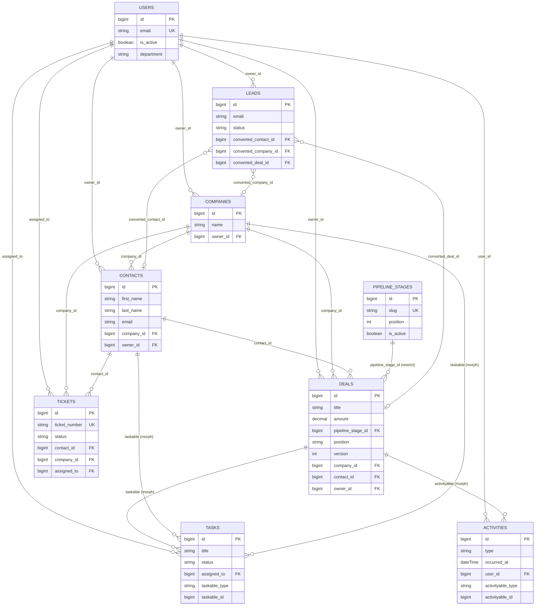
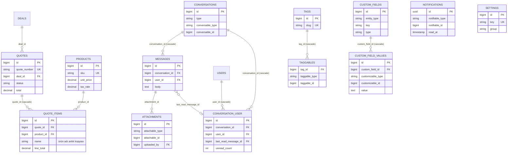
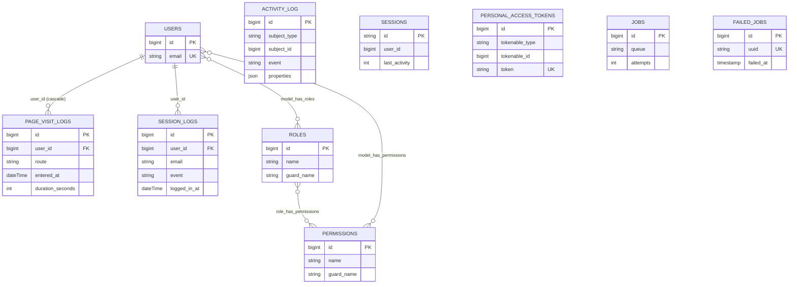

# Veritabanı Şeması

Bu doküman, `backend/database/migrations/` altındaki migration dosyalarından üretilen Syncra veritabanı şemasını belgeler. Kaynak: `migrate:fresh` ile kurulan `syncra_crm` şeması (MariaDB 10.4.32).

> **Sayım notu:** Uygulama migration dosyaları **40 tablo** oluşturur (43 foreign key ile — Faz 9'da `price_lists`/`price_list_items` ve `quotes.parent_quote_id` ile 3 FK eklendi). Buna ek olarak Laravel'in migration çalıştırıcısının kendisinin oluşturduğu, herhangi bir migration dosyasına karşılık gelmeyen `migrations` defter (ledger) tablosu vardır — bu doküman onu da "Laravel altyapı" grubunda ayrıca listeler, dolayısıyla veritabanında fiziksel olarak **41 tablo** görünür. `information_schema` üzerinden salt okunur doğrulama: `table_count = 41`, `fk_count = 43`.

## 1. Genel Bakış

Tablolar altı gruba ayrılır:

### (a) Kimlik & Yetki
`users`, `roles`, `permissions`, `model_has_permissions`, `model_has_roles`, `role_has_permissions`, `sessions`, `password_reset_tokens`, `personal_access_tokens`

### (b) CRM Çekirdeği
`companies`, `contacts`, `leads`, `pipeline_stages`, `deals`, `tasks`, `activities`, `tickets`

### (c) Ticaret
`products`, `price_lists`, `price_list_items`, `quotes`, `quote_items`

### (d) Destek Altyapısı
`conversations`, `conversation_user`, `messages`, `attachments`, `notifications`, `tags`, `taggables`, `custom_fields`, `custom_field_values`, `settings`

### (e) Loglar
`activity_log`, `page_visit_logs`, `session_logs`

### (f) Laravel Altyapı
`cache`, `cache_locks`, `jobs`, `job_batches`, `failed_jobs`, `migrations`

---

## 2. Tablo Referansı

### 2.1 Kimlik & Yetki

#### `users`
Sistemdeki tüm çalışanlar (kapalı devre CRM — self-servis kayıt yok, kullanıcılar davetle/admin tarafından oluşturulur).

| Kolon | Tip | Null | Varsayılan | Açıklama |
| --- | --- | --- | --- | --- |
| id | bigint unsigned (PK) | hayır | — | |
| name | string | hayır | — | |
| email | string | hayır | — | unique |
| email_verified_at | timestamp | evet | null | |
| password | string | hayır | — | `hashed` cast |
| remember_token | string(100) | evet | null | |
| is_active | boolean | hayır | true | index |
| department | string | evet | null | |
| last_login_at | timestamp | evet | null | |
| must_change_password | boolean | hayır | false | |
| deleted_at | timestamp | evet | null | softDeletes |
| created_at / updated_at | timestamp | evet | null | |

İndeksler: `email` (unique), `is_active` (index).
FK: yok (users, diğer tüm tabloların sahiplik referansı aldığı köktür).

#### `password_reset_tokens`
Laravel standart şifre sıfırlama tablosu. PK: `email` (string). `token`, `created_at`. FK yok.

#### `sessions`
Laravel standart oturum deposu (DB session driver). PK: `id` (string). `user_id` (nullable, index), `ip_address`, `user_agent`, `payload`, `last_activity` (index). FK tanımlı değil (`user_id` sade index, `constrained()` kullanılmamış).

#### `personal_access_tokens`
Sanctum API token tablosu. `tokenable_type` + `tokenable_id` (morphs), `token` (unique), `abilities`, `last_used_at`, `expires_at` (index), `timestamps()`. FK yok (morph).

#### `roles`, `permissions`, `model_has_roles`, `model_has_permissions`, `role_has_permissions`
spatie/laravel-permission paketinin standart tabloları (`2026_08_23_123321_create_permission_tables.php`, paket varsayılan konfigürasyonuyla — takım/`teams` özelliği kapalı).

| Tablo | Anahtar | Açıklama |
| --- | --- | --- |
| `roles` | id (PK) | `name` + `guard_name` unique çift |
| `permissions` | id (PK) | `name` + `guard_name` unique çift |
| `model_has_roles` | (`role_id`, `model_id`, `model_type`) composite PK | polymorphic pivot — hangi modelin (User) hangi rolü taşıdığı |
| `model_has_permissions` | (`permission_id`, `model_id`, `model_type`) composite PK | polymorphic pivot — doğrudan izin ataması |
| `role_has_permissions` | (`permission_id`, `role_id`) composite PK | rol → izin eşlemesi |

FK'ler: `model_has_roles.role_id → roles.id` (cascade), `model_has_permissions.permission_id → permissions.id` (cascade), `role_has_permissions.permission_id → permissions.id` (cascade), `role_has_permissions.role_id → roles.id` (cascade).

---

### 2.2 CRM Çekirdeği

#### `companies`
Müşteri hesabı / firma kaydı. CRM'in üst seviye varlığı; contacts, deals, tickets bir company'ye bağlanabilir.

| Kolon | Tip | Null | Varsayılan | Açıklama |
| --- | --- | --- | --- | --- |
| id | bigint unsigned (PK) | hayır | — | |
| name | string | hayır | — | index |
| email | string | evet | null | |
| phone | string | evet | null | |
| website | string | evet | null | |
| industry | string | evet | null | index |
| address | text | evet | null | |
| city | string | evet | null | |
| country | string | evet | null | |
| employee_count | unsigned int | evet | null | |
| annual_revenue | decimal(15,2) | evet | null | |
| owner_id | bigint unsigned (FK) | evet | null | → `users.id`, **nullOnDelete** |
| notes | text | evet | null | |
| deleted_at | timestamp | evet | null | softDeletes |
| created_at / updated_at | timestamp | evet | null | |

İndeksler: `name`, `industry`.
FK: `owner_id → users.id` (nullOnDelete).

#### `contacts`
Firmaya bağlı bireysel iletişim kişisi.

| Kolon | Tip | Null | Varsayılan | Açıklama |
| --- | --- | --- | --- | --- |
| id | bigint unsigned (PK) | hayır | — | |
| first_name | string | hayır | — | |
| last_name | string | hayır | — | |
| email | string | evet | null | index (yinelenen tespiti) |
| phone | string | evet | null | |
| mobile | string | evet | null | |
| position | string | evet | null | |
| company_id | bigint unsigned (FK) | evet | null | → `companies.id`, nullOnDelete |
| owner_id | bigint unsigned (FK) | evet | null | → `users.id`, nullOnDelete |
| is_primary | boolean | hayır | false | |
| address | text | evet | null | |
| city | string | evet | null | |
| country | string | evet | null | |
| notes | text | evet | null | |
| deleted_at | timestamp | evet | null | softDeletes |
| created_at / updated_at | timestamp | evet | null | |

İndeksler: `email`.
FK: `company_id → companies.id` (nullOnDelete), `owner_id → users.id` (nullOnDelete).

#### `leads`
Nitelendirme sürecindeki aday kayıt; `converted_*` alanları ile Contact/Company/Deal'a dönüştürülür.

| Kolon | Tip | Null | Varsayılan | Açıklama |
| --- | --- | --- | --- | --- |
| id | bigint unsigned (PK) | hayır | — | |
| first_name | string | hayır | — | |
| last_name | string | hayır | — | |
| email | string | evet | null | index (yinelenen tespiti) |
| phone | string | evet | null | index |
| company_name | string | evet | null | serbest metin (henüz Company kaydı yok) |
| position | string | evet | null | |
| source | string | hayır | `other` | index |
| status | string | hayır | `new` | index |
| score | unsigned tinyint | hayır | 0 | |
| owner_id | bigint unsigned (FK) | evet | null | → `users.id`, nullOnDelete |
| converted_at | timestamp | evet | null | |
| converted_contact_id | bigint unsigned (FK) | evet | null | → `contacts.id`, nullOnDelete |
| converted_company_id | bigint unsigned (FK) | evet | null | → `companies.id`, nullOnDelete |
| converted_deal_id | bigint unsigned (FK) | evet | null | → `deals.id`, nullOnDelete |
| notes | text | evet | null | |
| deleted_at | timestamp | evet | null | softDeletes |
| created_at / updated_at | timestamp | evet | null | |

İndeksler: `email`, `phone`, `source`, `status`.
FK: `owner_id → users.id`, `converted_contact_id → contacts.id`, `converted_company_id → companies.id`, `converted_deal_id → deals.id` (hepsi nullOnDelete).

#### `pipeline_stages`
Kanban sütunları (satış aşamaları). **Soft delete kullanmaz** — bkz. §3.

| Kolon | Tip | Null | Varsayılan | Açıklama |
| --- | --- | --- | --- | --- |
| id | bigint unsigned (PK) | hayır | — | |
| name | string | hayır | — | |
| slug | string | hayır | — | unique |
| position | unsigned int | hayır | — | index — sütun sırası |
| probability | unsigned tinyint | hayır | 0 | aşamanın varsayılan kazanma olasılığı (%) |
| color | string | evet | null | |
| is_won | boolean | hayır | false | |
| is_lost | boolean | hayır | false | |
| is_active | boolean | hayır | true | index |
| created_at / updated_at | timestamp | evet | null | |

İndeksler: `slug` (unique), `position`, `is_active`.
FK: yok.

#### `deals`
Kanban kartı / satış fırsatı. Bkz. §3 için `position` ve `version` tasarım gerekçesi.

| Kolon | Tip | Null | Varsayılan | Açıklama |
| --- | --- | --- | --- | --- |
| id | bigint unsigned (PK) | hayır | — | |
| title | string | hayır | — | index |
| description | text | evet | null | |
| amount | decimal(15,2) | hayır | 0 | |
| currency | char(3) | hayır | `TRY` | |
| pipeline_stage_id | bigint unsigned (FK) | hayır | — | → `pipeline_stages.id`, **restrictOnDelete** |
| position | string(64) | hayır | — | fractional index (bkz. §3) |
| version | unsigned int | hayır | 1 | optimistic locking sayacı (bkz. §3) |
| probability | unsigned tinyint | evet | null | |
| expected_close_date | date | evet | null | index |
| closed_at | timestamp | evet | null | |
| status | string | hayır | `open` | index (`open` / `won` / `lost`) |
| lost_reason | string | evet | null | |
| won_reason | string | evet | null | |
| company_id | bigint unsigned (FK) | evet | null | → `companies.id`, nullOnDelete |
| contact_id | bigint unsigned (FK) | evet | null | → `contacts.id`, nullOnDelete |
| owner_id | bigint unsigned (FK) | evet | null | → `users.id`, nullOnDelete |
| deleted_at | timestamp | evet | null | softDeletes |
| created_at / updated_at | timestamp | evet | null | |

İndeksler: `title`, `expected_close_date`, `status`, **`(pipeline_stage_id, position)`** (composite — Kanban sorgusunun temeli).
FK: `pipeline_stage_id → pipeline_stages.id` (**restrictOnDelete**), `company_id`, `contact_id`, `owner_id` → sırasıyla `companies`/`contacts`/`users` (hepsi nullOnDelete).

#### `tasks`
Görev — deal/contact/company/lead/ticket gibi kayıtlara `taskable` polymorphic ilişkisiyle bağlanır (ilişkisiz de olabilir, `nullableMorphs`).

| Kolon | Tip | Null | Varsayılan | Açıklama |
| --- | --- | --- | --- | --- |
| id | bigint unsigned (PK) | hayır | — | |
| title | string | hayır | — | |
| description | text | evet | null | |
| due_at | dateTime | evet | null | index |
| reminder_at | dateTime | evet | null | |
| priority | string | hayır | `normal` | index |
| status | string | hayır | `pending` | index |
| completed_at | timestamp | evet | null | |
| assigned_to | bigint unsigned (FK) | evet | null | → `users.id`, nullOnDelete |
| created_by | bigint unsigned (FK) | evet | null | → `users.id`, nullOnDelete |
| taskable_type | string | evet | null | polymorphic |
| taskable_id | bigint unsigned | evet | null | polymorphic, index (`nullableMorphs`) |
| deleted_at | timestamp | evet | null | softDeletes |
| created_at / updated_at | timestamp | evet | null | |

İndeksler: `due_at`, `priority`, `status`, `(taskable_type, taskable_id)`.
FK: `assigned_to → users.id`, `created_by → users.id` (nullOnDelete).

#### `activities`
Geçmişe dönük etkileşim kaydı (çağrı, toplantı, e-posta, not). `activityable` ile herhangi bir CRM kaydına bağlanabilir.

| Kolon | Tip | Null | Varsayılan | Açıklama |
| --- | --- | --- | --- | --- |
| id | bigint unsigned (PK) | hayır | — | |
| type | string | hayır | — | index (`call`, `meeting`, `email`, `note` vb.) |
| subject | string | hayır | — | |
| body | text | evet | null | |
| occurred_at | dateTime | hayır | — | index |
| duration_minutes | unsigned int | evet | null | |
| outcome | string | evet | null | |
| user_id | bigint unsigned (FK) | evet | null | → `users.id`, nullOnDelete |
| activityable_type | string | evet | null | polymorphic |
| activityable_id | bigint unsigned | evet | null | polymorphic, index |
| deleted_at | timestamp | evet | null | softDeletes |
| created_at / updated_at | timestamp | evet | null | |

İndeksler: `type`, `occurred_at`, `(activityable_type, activityable_id)`.
FK: `user_id → users.id` (nullOnDelete).

#### `tickets`
Destek talebi, SLA takibi ile. SLA duraklama semantiği (sayaç `pending` durumunda durur,
ihlal kalıcı bayrak değil türetilmiş değerdir) `docs/SLA-DESIGN.md`'de tanımlıdır — bağlayıcı sözleşme.

| Kolon | Tip | Null | Varsayılan | Açıklama |
| --- | --- | --- | --- | --- |
| id | bigint unsigned (PK) | hayır | — | |
| ticket_number | string | hayır | — | unique |
| subject | string | hayır | — | |
| description | text | hayır | — | |
| priority | string | hayır | `normal` | index |
| status | string | hayır | `open` | index |
| category | string | evet | null | |
| contact_id | bigint unsigned (FK) | evet | null | → `contacts.id`, nullOnDelete |
| company_id | bigint unsigned (FK) | evet | null | → `companies.id`, nullOnDelete |
| assigned_to | bigint unsigned (FK) | evet | null | → `users.id`, nullOnDelete |
| created_by | bigint unsigned (FK) | evet | null | → `users.id`, nullOnDelete |
| sla_due_at | dateTime | evet | null | index |
| first_response_at | timestamp | evet | null | |
| resolved_at | timestamp | evet | null | |
| closed_at | timestamp | evet | null | |
| sla_paused_at | dateTime | evet | null | aktif duraklamanın başlangıcı |
| sla_paused_seconds | unsignedInteger | hayır | 0 | birikmiş toplam duraklama |
| sla_warning_notified_at | dateTime | evet | null | "ihlale yaklaşıyor" bildirimi idempotency damgası |
| sla_breach_notified_at | dateTime | evet | null | "ihlal edildi" bildirimi idempotency damgası |
| deleted_at | timestamp | evet | null | softDeletes |
| created_at / updated_at | timestamp | evet | null | |

İndeksler: `ticket_number` (unique), `priority`, `status`, `sla_due_at`.
FK: `contact_id`, `company_id`, `assigned_to`, `created_by` (hepsi nullOnDelete).

---

### 2.3 Ticaret

#### `products`
Ürün/hizmet kataloğu.

| Kolon | Tip | Null | Varsayılan | Açıklama |
| --- | --- | --- | --- | --- |
| id | bigint unsigned (PK) | hayır | — | |
| name | string | hayır | — | index |
| sku | string | evet | null | unique |
| description | text | evet | null | |
| category | string | evet | null | index |
| unit_price | decimal(15,2) | hayır | 0 | |
| currency | char(3) | hayır | `TRY` | |
| tax_rate | decimal(5,2) | hayır | 20.00 | KDV varsayılanı |
| unit | string | hayır | `adet` | |
| stock_quantity | int | evet | null | |
| is_active | boolean | hayır | true | index |
| deleted_at | timestamp | evet | null | softDeletes |
| created_at / updated_at | timestamp | evet | null | |

İndeksler: `name`, `sku` (unique), `category`, `is_active`.
FK: yok.

#### `price_lists` (Faz 9)
Ürün kataloğunun üzerine kanal/müşteri bazlı fiyat ezmesi tanımlayan liste (ör. PERAKENDE, TOPTAN).

| Kolon | Tip | Null | Varsayılan | Açıklama |
| --- | --- | --- | --- | --- |
| id | bigint unsigned (PK) | hayır | — | |
| name | string | hayır | — | |
| code | string | hayır | — | unique, insan-okunur |
| description | text | evet | null | |
| currency | char(3) | hayır | `TRY` | |
| is_default | boolean | hayır | false | index — yalnızca bir liste varsayılan olabilir (bkz. §3) |
| is_active | boolean | hayır | true | index |
| valid_from | date | evet | null | |
| valid_until | date | evet | null | |
| deleted_at | timestamp | evet | null | softDeletes |
| created_at / updated_at | timestamp | evet | null | |

İndeksler: `code` (unique), `is_default`, `is_active`.
FK: yok.
Kaynak migration: `2026_08_24_200001_create_price_lists_table.php`.

#### `price_list_items` (Faz 9)
Bir fiyat listesindeki ürün başına özel fiyat (kalem).

| Kolon | Tip | Null | Varsayılan | Açıklama |
| --- | --- | --- | --- | --- |
| id | bigint unsigned (PK) | hayır | — | |
| price_list_id | bigint unsigned (FK) | hayır | — | → `price_lists.id`, **cascadeOnDelete** |
| product_id | bigint unsigned (FK) | hayır | — | → `products.id`, **cascadeOnDelete** |
| unit_price | decimal(15,2) | hayır | — | |
| created_at / updated_at | timestamp | evet | null | |

İndeksler: **`(price_list_id, product_id)`** unique — aynı listede bir ürün iki kez fiyatlanamaz.
FK: `price_list_id → price_lists.id` (cascadeOnDelete), `product_id → products.id` (cascadeOnDelete).
Kaynak migration: `2026_08_24_200002_create_price_list_items_table.php`.

#### `quotes`
Teklif belgesi; bir deal/company/contact'a bağlanabilir. Hesap modeli (KDV matrahı, indirim
dağıtımı, yuvarlama) **`docs/QUOTE-FINANCIALS.md`'de bağlayıcı sözleşme olarak tanımlıdır** —
bu tablodaki `discount_*`/`subtotal`/`tax_amount`/`total` kolonlarının anlamı o dokümana göre okunmalıdır.
`discount_type`, `discount_value`, `parent_quote_id`, `revision` kolonları Faz 9'da additive
migration ile eklendi: `2026_08_24_300001_add_discount_and_revision_to_quotes_table.php`.

| Kolon | Tip | Null | Varsayılan | Açıklama |
| --- | --- | --- | --- | --- |
| id | bigint unsigned (PK) | hayır | — | |
| quote_number | string | hayır | — | unique |
| title | string | hayır | — | |
| deal_id | bigint unsigned (FK) | evet | null | → `deals.id`, nullOnDelete |
| parent_quote_id | bigint unsigned (FK) | evet | null | → `quotes.id`, nullOnDelete — revizyon zinciri, bir öncekini gösterir (Faz 9) |
| revision | unsigned smallint | hayır | 1 | revizyon numarası (Faz 9) |
| company_id | bigint unsigned (FK) | evet | null | → `companies.id`, nullOnDelete |
| contact_id | bigint unsigned (FK) | evet | null | → `contacts.id`, nullOnDelete |
| status | string | hayır | `draft` | index (`draft`/`sent`/`accepted`/`rejected`/`expired`) |
| valid_until | date | evet | null | |
| subtotal | decimal(15,2) | hayır | 0 | |
| discount_amount | decimal(15,2) | hayır | 0 | uygulanan indirimin TL karşılığı — her zaman `QuoteCalculator` tarafından yazılır |
| discount_type | string | hayır | `amount` | (`amount`/`percent`) — kullanıcının indirim giriş biçimi (Faz 9) |
| discount_value | decimal(15,2) | hayır | 0 | girilen ham değer (yüzdeyse 0–100, tutarsa TL) (Faz 9) |
| tax_amount | decimal(15,2) | hayır | 0 | |
| total | decimal(15,2) | hayır | 0 | |
| currency | char(3) | hayır | `TRY` | |
| notes | text | evet | null | |
| terms | text | evet | null | |
| sent_at | timestamp | evet | null | |
| accepted_at | timestamp | evet | null | |
| rejected_at | timestamp | evet | null | |
| created_by | bigint unsigned (FK) | evet | null | → `users.id`, nullOnDelete |
| deleted_at | timestamp | evet | null | softDeletes |
| created_at / updated_at | timestamp | evet | null | |

İndeksler: `quote_number` (unique), `status`.
FK: `deal_id`, `parent_quote_id`, `company_id`, `contact_id`, `created_by` (hepsi nullOnDelete).

#### `quote_items`
Teklif kalemi — teklifle birlikte yaşar/ölür (cascade).

| Kolon | Tip | Null | Varsayılan | Açıklama |
| --- | --- | --- | --- | --- |
| id | bigint unsigned (PK) | hayır | — | |
| quote_id | bigint unsigned (FK) | hayır | — | → `quotes.id`, **cascadeOnDelete** |
| product_id | bigint unsigned (FK) | evet | null | → `products.id`, nullOnDelete |
| name | string | hayır | — | ürünün **anlık kopyası** (bkz. §3) |
| description | text | evet | null | |
| quantity | decimal(10,2) | hayır | 1 | |
| unit_price | decimal(15,2) | hayır | — | |
| discount_percent | decimal(5,2) | hayır | 0 | |
| tax_rate | decimal(5,2) | hayır | 20.00 | |
| line_total | decimal(15,2) | hayır | — | |
| position | unsigned int | hayır | 0 | kalem sırası |
| created_at / updated_at | timestamp | evet | null | |

İndeksler: yok (ad-hoc; `quote_id` FK'si zımni index taşır).
FK: `quote_id → quotes.id` (cascadeOnDelete), `product_id → products.id` (nullOnDelete).

---

### 2.4 Destek Altyapısı

#### `conversations`
Sohbet oturumu — dm/group tipinde ya da bir kayda (`conversable`, ör. deal/ticket) gömülü olabilir.

| Kolon | Tip | Null | Varsayılan | Açıklama |
| --- | --- | --- | --- | --- |
| id | bigint unsigned (PK) | hayır | — | |
| type | string | hayır | `dm` | index (`dm`/`group`/`record`) |
| name | string | evet | null | |
| conversable_type | string | evet | null | polymorphic |
| conversable_id | bigint unsigned | evet | null | polymorphic, index |
| created_by | bigint unsigned (FK) | evet | null | → `users.id`, nullOnDelete |
| last_message_at | timestamp | evet | null | index |
| deleted_at | timestamp | evet | null | softDeletes |
| created_at / updated_at | timestamp | evet | null | |

İndeksler: `type`, `(conversable_type, conversable_id)`, `last_message_at`.
FK: `created_by → users.id` (nullOnDelete).

#### `messages`
Sohbet mesajı.

| Kolon | Tip | Null | Varsayılan | Açıklama |
| --- | --- | --- | --- | --- |
| id | bigint unsigned (PK) | hayır | — | |
| conversation_id | bigint unsigned (FK) | hayır | — | → `conversations.id`, **cascadeOnDelete** |
| user_id | bigint unsigned (FK) | evet | null | gönderen, → `users.id`, nullOnDelete |
| body | text | evet | null | |
| attachment_id | bigint unsigned (FK) | evet | null | → `attachments.id`, nullOnDelete |
| type | string | hayır | `text` | (`text`/`file`/`system`) |
| edited_at | timestamp | evet | null | |
| deleted_at | timestamp | evet | null | softDeletes |
| created_at / updated_at | timestamp | evet | null | |

İndeksler: **`(conversation_id, created_at)`** (composite — mesaj listesi sorgusunun temeli).
FK: `conversation_id → conversations.id` (cascadeOnDelete), `user_id → users.id` (nullOnDelete), `attachment_id → attachments.id` (nullOnDelete).

#### `conversation_user`
Sohbet katılımcı pivotu; okunmamış sayaç mantığını taşır (bkz. §3).

| Kolon | Tip | Null | Varsayılan | Açıklama |
| --- | --- | --- | --- | --- |
| id | bigint unsigned (PK) | hayır | — | |
| conversation_id | bigint unsigned (FK) | hayır | — | → `conversations.id`, cascadeOnDelete |
| user_id | bigint unsigned (FK) | hayır | — | → `users.id`, cascadeOnDelete |
| last_read_message_id | bigint unsigned (FK) | evet | null | → `messages.id`, nullOnDelete |
| unread_count | unsigned int | hayır | 0 | |
| joined_at | timestamp | evet | null | |
| is_muted | boolean | hayır | false | |
| created_at / updated_at | timestamp | evet | null | |

İndeksler: `(conversation_id, user_id)` unique.
FK: `conversation_id → conversations.id` (cascadeOnDelete), `user_id → users.id` (cascadeOnDelete), `last_read_message_id → messages.id` (nullOnDelete).

#### `attachments`
Ek dosya; herhangi bir kayda (`attachable`) bağlanabilir.

| Kolon | Tip | Null | Varsayılan | Açıklama |
| --- | --- | --- | --- | --- |
| id | bigint unsigned (PK) | hayır | — | |
| filename | string | hayır | — | diskteki rastgele ad |
| original_name | string | hayır | — | kullanıcının yüklediği ad |
| mime_type | string | hayır | — | |
| size | unsigned bigint | hayır | — | bayt |
| disk | string | hayır | `local` | |
| path | string | hayır | — | |
| attachable_type | string | evet | null | polymorphic |
| attachable_id | bigint unsigned | evet | null | polymorphic, index |
| uploaded_by | bigint unsigned (FK) | evet | null | → `users.id`, nullOnDelete |
| deleted_at | timestamp | evet | null | softDeletes |
| created_at / updated_at | timestamp | evet | null | |

İndeksler: `(attachable_type, attachable_id)`.
FK: `uploaded_by → users.id` (nullOnDelete).

#### `notifications`
Laravel'in standart bildirim tablosu (Notification facade ile uyumlu — bkz. §3).

| Kolon | Tip | Null | Varsayılan | Açıklama |
| --- | --- | --- | --- | --- |
| id | **uuid (PK)** | hayır | — | |
| type | string | hayır | — | bildirim sınıf adı |
| notifiable_type | string | hayır | — | polymorphic |
| notifiable_id | bigint unsigned | hayır | — | polymorphic, index |
| data | text | hayır | — | JSON payload |
| read_at | timestamp | evet | null | |
| created_at / updated_at | timestamp | evet | null | |

FK: yok (morph).

#### `tags`, `taggables`
Etiketleme sistemi — çoktan-çoğa polymorphic.

`tags`: `id` (PK), `name`, `slug` (unique), `color`, `timestamps()`. FK yok.

`taggables` (saf pivot, **timestamps yok**): `tag_id` (FK → `tags.id`, cascadeOnDelete), `taggable_type`, `taggable_id` (morphs). Unique: `(tag_id, taggable_type, taggable_id)` (kısa isim: `taggables_unique`).

#### `custom_fields`, `custom_field_values`
EAV (Entity-Attribute-Value) deseni — bkz. §3.

`custom_fields`: `id` (PK), `entity_type` (index — `leads`/`contacts`/`companies`/`deals` vb.), `name`, `key`, `type` (`text`/`textarea`/`number`/`date`/`select`/`multiselect`/`boolean`), `options` (json, nullable — select seçenekleri), `is_required` (bool, default false), `position` (unsigned int, default 0), `is_active` (bool, default true), `timestamps()`. Unique: `(entity_type, key)`. FK yok.

`custom_field_values`: `id` (PK), `custom_field_id` (FK → `custom_fields.id`, cascadeOnDelete), `customizable_type` + `customizable_id` (morphs), `value` (text, nullable), `timestamps()`. Unique: `(custom_field_id, customizable_type, customizable_id)` (kısa isim: `cfv_unique`, 64 karakter sınırı nedeniyle).

#### `settings`
Sistem ayarları — key/value, `type` alanına göre çalışma zamanında cast edilir.

| Kolon | Tip | Null | Varsayılan | Açıklama |
| --- | --- | --- | --- | --- |
| id | bigint unsigned (PK) | hayır | — | |
| key | string | hayır | — | unique |
| value | text | evet | null | |
| type | string | hayır | `string` | (`string`/`integer`/`boolean`/`json`) |
| group | string | hayır | — | index (`company`/`pipeline`/`email`/`general`) |
| is_public | boolean | hayır | false | |
| description | string | evet | null | |
| created_at / updated_at | timestamp | evet | null | |

İndeksler: `key` (unique), `group`.
FK: yok.

---

### 2.5 Loglar

#### `activity_log`
spatie/laravel-activitylog paketinin standart tablosu (auditlog — model değişikliklerini otomatik kaydeder).

| Kolon | Tip | Açıklama |
| --- | --- | --- |
| id | bigint unsigned (PK) | |
| log_name | string, nullable | index |
| description | text | |
| subject_type / subject_id | nullableMorphs | değişen kayıt |
| event | string, nullable | sonradan eklendi (`add_event_column...` migration) |
| causer_type / causer_id | nullableMorphs | değişikliği yapan (genelde User) |
| properties | json, nullable | eski/yeni değerler |
| batch_uuid | uuid, nullable | sonradan eklendi — toplu işlemleri gruplamak için |
| created_at / updated_at | timestamp | |

FK: yok (morph). Not: bu tablo üç ayrı migration dosyasıyla evrildi (`create_activity_log_table`, `add_event_column_to_activity_log_table`, `add_batch_uuid_column_to_activity_log_table`).

#### `page_visit_logs`
Sayfa ziyaret/analitik logu — bkz. §3 (heartbeat neden yeni satır eklemiyor).

| Kolon | Tip | Null | Varsayılan | Açıklama |
| --- | --- | --- | --- | --- |
| id | bigint unsigned (PK) | hayır | — | |
| user_id | bigint unsigned (FK) | hayır | — | → `users.id`, **cascadeOnDelete** |
| route | string | hayır | — | |
| path | string | hayır | — | |
| title | string | evet | null | |
| entered_at | dateTime | hayır | — | |
| last_heartbeat_at | dateTime | evet | null | |
| duration_seconds | unsigned int | hayır | 0 | heartbeat ile güncellenir |
| ip_address | string(45) | evet | null | |
| session_id | string | evet | null | |
| created_at / updated_at | timestamp | evet | null | |

İndeksler: **`(user_id, entered_at)`**.
FK: `user_id → users.id` (**cascadeOnDelete** — burada sahiplik FK'lerinin genel `nullOnDelete` kuralının istisnası; kullanıcı silinirse kendi ziyaret geçmişi de silinir, çünkü bu tablo zaten kişisel/geçici analitik veridir, iş kaydı değildir).

#### `session_logs`
Giriş/çıkış ve başarısız giriş denemesi logu — bkz. §3 (`user_id` neden nullable, `email` neden ayrı tutuluyor).

| Kolon | Tip | Null | Varsayılan | Açıklama |
| --- | --- | --- | --- | --- |
| id | bigint unsigned (PK) | hayır | — | |
| user_id | bigint unsigned (FK) | evet | null | → `users.id`, nullOnDelete |
| email | string | evet | null | başarısız denemede denenen e-posta |
| event | string | hayır | — | index (`login`/`logout`/`failed_login`/`locked_out`) |
| ip_address | string(45) | evet | null | |
| user_agent | text | evet | null | |
| device | string | evet | null | |
| browser | string | evet | null | |
| platform | string | evet | null | |
| session_id | string | evet | null | |
| logged_in_at | dateTime | evet | null | |
| logged_out_at | dateTime | evet | null | |
| duration_seconds | unsigned int | evet | null | |
| created_at / updated_at | timestamp | evet | null | |

İndeksler: `event`, **`(user_id, created_at)`**.
FK: `user_id → users.id` (nullOnDelete).

---

### 2.6 Laravel Altyapı

Kolon dökümü gerekmez — Laravel'in kendi standart tabloları, hiçbiri iş verisiyle ilişkili FK taşımaz.

| Tablo | Açıklama |
| --- | --- |
| `cache` | Laravel cache sürücüsü (DB cache driver) key/value deposu. |
| `cache_locks` | Cache tabanlı atomic lock mekanizması. |
| `jobs` | Kuyruğa alınmış (queued) işler. |
| `job_batches` | Toplu (batched) kuyruk işlerinin durumu. |
| `failed_jobs` | Başarısız kuyruk işlerinin kaydı. |
| `migrations` | Artisan migration çalıştırıcısının kendi defteri; herhangi bir migration dosyasına karşılık gelmez (framework tarafından otomatik oluşturulur). |

---

### 2.7 Senkronizasyon Altyapısı (masaüstü istemcisi)

> Bağlayıcı sözleşme: `docs/DESKTOP-SYNC-PROTOCOL.md`. Bu bölüm yalnızca şemayı belgeler.

#### Yeni tablolar

| Tablo | Kolonlar | Not |
|---|---|---|
| `sync_counter` | `id TINYINT PK CHECK (id=1)`, `value BIGINT UNSIGNED` | Tek satırlı global monoton sayaç. `UPDATE sync_counter SET value = LAST_INSERT_ID(value+1)` ile atomik artar. Bu satırın kilidi tüm yazma yollarını serileştirir — **bu kasıtlıdır**: commit sırası = versiyon sırası garantisi, keyset cursor'ın satır atlamamasının ön koşuludur (protokol §2.4). |
| `sync_deletions` | `id BIGINT UNSIGNED AI PK`, `table_name VARCHAR(64)`, `row_key VARCHAR(191)`, `sync_version BIGINT UNSIGNED`, `deleted_at TIMESTAMP`, index `(table_name, sync_version)` | Hard delete edilen satırların mezar taşları. Yalnız **dört** tablo yazar: `tags`, `notifications`, `conversation_user`, `price_list_items` (protokol §2.7 / P19). Üyelik testi: "tablo hard delete ediyor mu". |
| `sync_idempotency` | `idempotency_key CHAR(36) PK`, `user_id BIGINT UNSIGNED FK`, `result_json JSON`, `created_at TIMESTAMP`, index `(user_id)`, `(created_at)` | Push mutasyonlarının tekrar tespiti; kayıtlı sonuç `duplicate` yanıtında aynen döner. |

#### Mevcut tablolara eklenen kolonlar

| Ekleme | Kapsam | Not |
|---|---|---|
| `sync_version BIGINT UNSIGNED NOT NULL DEFAULT 0` + `idx_<t>_sync_version` | **22 tablo** (13 RW + 9 RO) | Delta cursor'ı. `updated_at`'e dokunulmaz. Satır başına **tekil** olmak zorundadır (protokol §2.5) — aksi hâlde `LIMIT` sınırına denk gelen ikinci satır bir daha dönmez. |
| `client_id CHAR(36) NULL` + `uq_<t>_client_id` | **12 RW tablo** | Offline oluşturulan kayıtların istemci kimliği. **HARİÇ:** `notifications` (PK zaten uuid), `taggables` / `quote_items` / `custom_field_values` (sahip satırın payload'ına gömülüler, ayrı sync tablosu değiller — protokol §1.4/§1.5). Index yalnız FK çözümü için değil, **mutasyon hedefi çözümü** için de kullanılır (protokol §4.3 P18). |
| `device_fingerprint CHAR(64) NULL` + index, `device_platform VARCHAR(16) NULL` | `personal_access_tokens` | Cihaz başına tek token kuralı ve `GET /api/me/devices` yanıtının `platform` alanı. |
| `channel VARCHAR(16) DEFAULT 'web'` | `session_logs` | `web` \| `desktop`. |

#### Veritabanı trigger'ları — projedeki TEK trigger seti

`conversation_user_sync_version_bi` (BEFORE INSERT), `..._bu` (BEFORE UPDATE), `..._ad` (AFTER DELETE).

Bu tablo, `sync_version`'ı observer ile alamayan tek tablodur: tüm mutasyon yüzeyi ham SQL'dir (`Services/Chat/ChatReadState.php:71,104,129,144` + `ConversationService`/`MessageService`'teki query-builder yazımları) ve Laravel 12'de `attach()/detach()/sync()` **hiçbir model event'i üretmez**. Eloquent'e çevirmek `GREATEST(...)` ve cross-member `+1` atomikliğini bozardı.

`BEFORE UPDATE` dalı **NULL-safe (`<=>`) no-op guard'ı** taşır: senkronlanan kolonların hiçbiri değişmediyse sayaç bump'lanmaz. Bu olmasa değer değiştirmeyen bir UPDATE bile sahte delta üretirdi (protokol §2.4 P4b).

> **DİKKAT:** `pint` ve PHPStan trigger'ları görmez. `conversation_user` şemasında değişiklik yapan her migration bu üç trigger'ı elden geçirmelidir.

#### FK cascade kilidi

Kapsam tablolarının `DELETE_RULE` haritası artık `tests/Feature/Sync/SyncSchemaTest.php` ile `information_schema.REFERENTIAL_CONSTRAINTS` üzerinden kilitlidir. Yeni bir `CASCADE` eklemek testi kırar — çünkü FK cascade ile silinen satır **ne trigger ne Eloquent event'i** tetikler (deneyle doğrulandı) ve sessiz veri kaybı doğururdu. Bugün tüm cascade zincirleri yalnızca soft delete sayesinde ölüdür; test bu tesadüfü sözleşmeye çevirir (protokol §2.8 P16).

#### Retention

`php artisan logs:prune` iki yeni hedef alır: **`sync_deletions` 90 gün**, **`sync_idempotency` 7 gün** (`config/syncra.php`).

---

## 3. Tasarım Kararları

**`deals.position` neden string (fractional index) ve `deals.version` neden var:**
Kanban panosunda bir kartı iki kart arasına taşımak, tamsayı sıralama kullanılsaydı araya yer açmak için etkilenen tüm kartların `position` değerinin toplu olarak (renumbering) güncellenmesini gerektirirdi — çok kullanıcılı bir panoda bu hem pahalı hem de eşzamanlı taşımalarla çakışmaya çok açık bir işlemdir. Bunun yerine `position` bir **fractional index** string'i olarak tutulur (ör. `"aa"`, `"ab"`, `"b"`): iki kart arasına yeni bir kart eklemek, sadece o kartın kendi `position` değerini iki komşusu arasında sözlüksel olarak sıralanan yeni bir string ile güncellemeyi gerektirir, başka hiçbir satıra dokunulmaz. `version` alanı ise **optimistic locking** sağlar: iki kullanıcı aynı kartı eşzamanlı olarak farklı sütunlara/sıralara taşırsa, sunucu tarafı güncelleme isteğinde beklenen `version` ile mevcut `version` karşılaştırılır; uyuşmuyorsa istek reddedilir ve istemci (TanStack Query invalidation ile) güncel durumu yeniden çeker. Bu tasarım ROADMAP R4 riskine (Kanban realtime çakışması) doğrudan yanıt verir.

**`deals.pipeline_stage_id` neden restrictOnDelete ve `pipeline_stages` neden soft delete kullanmaz:**
Bir pipeline aşaması silinebilseydi, o aşamadaki tüm deal kayıtları FK bütünlüğü nedeniyle ya cascade ile silinir (iş verisi kaybı, kabul edilemez) ya da sahipsiz kalırdı (`pipeline_stage_id` geçersiz referans, Kanban ekranı hangi sütuna çizileceğini bilemez ve kırılır). Bu yüzden `deals.pipeline_stage_id` FK'si **restrictOnDelete** olarak tanımlanmıştır — bir aşamada hâlâ deal varsa o aşama veritabanı seviyesinde silinemez. `pipeline_stages` tablosunun kendisi de `softDeletes()` kullanmaz: aşamaları "silme" ihtiyacı aslında "artık kullanılmasın" ihtiyacıdır, bu da `is_active=false` ile karşılanır — aşama Kanban'da görünmez ama geçmiş deal'lar hâlâ ona referans verebilir ve raporlama bozulmaz.

**`quote_items.name` neden ürünün anlık kopyası:**
`quote_items.product_id` nullable bir FK'dir ve ürün silinebilir ya da adı/fiyatı sonradan değişebilir. Eğer teklif kalemi ürün adını her seferinde `products` tablosundan canlı okusaydı, geçmişte gönderilmiş bir teklif, ürün kataloğunda yapılan bir değişiklikle sessizce değişmiş olurdu — bu, hem muhasebe/hukuki açıdan hem de müşteri iletişimi açısından kabul edilemez. Bu yüzden `name` (ve `unit_price`, `tax_rate` gibi diğer fiyat alanları) teklif oluşturulduğu andaki değerin **anlık kopyasını (snapshot)** tutar; ürün sonradan silinse (`nullOnDelete`) veya güncellense bile teklif olduğu gibi kalır.

**`quotes` tablosuna `price_list_id` neden eklenmedi (Faz 9):**
Bir fiyat listesi seçildiğinde, listeden çözülen fiyat teklif kalemine (`quote_items`) **kopyalanır** —
tıpkı `quote_items.name`'in ürün adının anlık kopyası olması gibi. `quotes` tablosunda ayrı bir
`price_list_id` kolonu tutulmadı: teklif kaydedildikten sonra uygulanan fiyat kalemde kalıcıdır,
fiyat listesi sonradan değişse veya silinse (soft delete) geçmiş teklif etkilenmez. Teklif↔liste
arasında canlı bir FK ilişkisi olsaydı, listenin güncellenmesi geçmiş teklifin tutarını sessizce
değiştirebilirdi — muhasebe/hukuki açıdan kabul edilemez, tıpkı ürün adı örneğinde olduğu gibi.

**Soft delete ile `cascadeOnDelete` uyuşmazlığı (Faz 9, `price_lists`/`price_list_items`):**
`PriceList` modeli `softDeletes()` kullandığı için `->delete()` çağrısı veritabanı seviyesinde bir
**UPDATE**'tir (`deleted_at` doldurulur), bir `DELETE` değildir — dolayısıyla `price_list_items.price_list_id`
üzerindeki `cascadeOnDelete()` FK'si **hiç tetiklenmez**. İlk düşünülen çözüm (liste soft-silinirken
kalemleri elle silmek) yanlıştı: bu, soft delete'i fiilen yıkıcı hale getirir — liste geri yüklenince
(`restore()`) kalemleri boş döner. Doğru davranış: soft delete çocuk kayıtları (`price_list_items`)
**korur**; FK cascade'i yalnızca `forceDelete()` çağrıldığında (kalıcı silme) tetiklenir. Bu desen
`quotes`/`quote_items` ve `conversations`/`messages` ile tutarlıdır — oradaki üst kayıtlar da soft
delete kullanır ve cascade yalnızca gerçek (force) silmede devreye girer.

**`page_visit_logs` neden soft delete kullanmaz ve heartbeat neden yeni satır eklemek yerine `duration_seconds` günceller:**
Bu tablo analitik/telemetri verisidir, iş kaydı değildir — "silinmiş ama arşivde tutulsun" ihtiyacı yoktur, bu yüzden `softDeletes()` yoktur (ve `user_id` FK'si de istisnai olarak `cascadeOnDelete` taşır, kullanıcı silinince kendi ziyaret geçmişi de temizlenir). Heartbeat mekanizması, kullanıcı bir sayfada kaldığı sürece periyodik olarak (ör. 30 saniyede bir) sunucuya sinyal gönderir; bu sinyal her seferinde yeni bir satır olarak eklenseydi, aktif bir kullanıcı tabanında tablo günler içinde milyonlarca satıra şişer, hem yazma hem okuma performansını düşürürdü. Bunun yerine her heartbeat, o ziyaretin **mevcut son satırındaki** `duration_seconds` ve `last_heartbeat_at` alanlarını GÜNCELLER (UPDATE), yeni satır INSERT etmez — satır sayısı ziyaret sayısıyla orantılı kalır, heartbeat sıklığıyla değil. Bu tasarım ROADMAP R5 riskine yanıttır; ayrıca 90 günlük bir retention politikası (zamanlanmış `php artisan logs:prune` komutu, Faz 5 kapsamı) tabloyu sınırlı tutmayı hedefler.

**`session_logs.user_id` neden nullable ve `email` kolonu neden ayrıca tutuluyor:**
Bu tablo başarılı girişlerin yanı sıra **başarısız giriş denemelerini** ve hesap kilitlenmelerini de kaydeder (`event`: `login`/`logout`/`failed_login`/`locked_out`). Başarısız bir girişte, denenen e-posta adresi sistemde kayıtlı bir kullanıcıya karşılık gelmeyebilir (yazım hatası, var olmayan hesap, brute-force denemesi) — bu durumda `user_id` bilinemez, bu yüzden nullable'dır ve `nullOnDelete` ile tanımlıdır. `email` kolonu ise `users.email` üzerinden dolaylı bir JOIN yerine, denenen e-posta değerini **doğrudan** tutar; böylece kullanıcı FK'si null olsa (veya sonradan kullanıcı silinse) bile hangi e-posta ile deneme yapıldığı denetim (audit) amacıyla korunur.

**`notifications` tablosu neden uuid primary key kullanır:**
Bu tablo, Laravel'in `Illuminate\Notifications\DatabaseNotification` standart şemasının birebir kopyasıdır ve `Notification::send()` / `notify()` facade akışıyla doğrudan uyumlu çalışması amaçlanmıştır. Laravel'in bildirim sistemi, bildirim ID'sini istemci tarafında (ör. e-posta içinde "bildirimi okundu işaretle" linki, ya da dağıtık/kuyruklu üretim senaryosu) önceden üretebilmek için varsayılan olarak uuid PK bekler; bu konvansiyonun dışına çıkmak paket entegrasyonunu (`morphMany(Notification::class, 'notifiable')`, `MarkAsRead` vb.) kırar.

**Sahiplik FK'lerinin neden nullOnDelete olduğu:**
`owner_id`, `assigned_to`, `created_by`, `uploaded_by` gibi "bu kaydı kim sahipleniyor/oluşturdu" alanlarının neredeyse tamamı `nullOnDelete` ile tanımlıdır (istisna: `page_visit_logs.user_id` ve pivot/log tablolarındaki bazı zorunlu FK'ler — bkz. yukarı). Bir kullanıcı hesabı silindiğinde (ör. işten ayrılma), o kullanıcının sahip olduğu company/contact/deal/task/ticket gibi iş kayıtlarının **silinmemesi** gerekir — bu veriler kurumun malıdır, sahibi değişse de kaybolmamalıdır. `cascadeOnDelete` bu durumda büyük veri kaybına yol açar, `restrictOnDelete` ise kullanıcı silmeyi imkansız hale getirirdi. `nullOnDelete` her iki sorunu da çözer: kullanıcı silinir, kayıt kalır, sadece "sahipsiz" (`owner_id = null`) hale gelir ve arayüzde yeniden atanabilir.

**`conversation_user.last_read_message_id` + `unread_count` ikilisi:**
Bu iki alan birlikte "okunmamış mesaj sayacı / çift tik" mantığını uygular. `last_read_message_id`, bir kullanıcının bir sohbette en son okuduğu mesajı işaret eder (mesaj silinirse `nullOnDelete` ile null'a düşer, sayaç sıfırlanmaz ama referans kaybolur). `unread_count` ise her yeni mesaj geldiğinde o sohbetteki diğer katılımcılar için artırılan, kullanıcı sohbeti açtığında (okundu işaretlenince) sıfırlanan bir sayaçtır. Sayacı her seferinde `last_read_message_id`'den sonraki mesajları COUNT ederek hesaplamak yerine ayrı bir kolonda tutmak, sohbet listesi ekranında (çok sayıda sohbet için) N+1 COUNT sorgusu yerine tek bir SELECT ile tüm okunmamış sayaçların çekilebilmesini sağlar.

**Morph (polimorfik) ilişkiler — nerede ve neden:**
Aşağıdaki tablolar `*_type` + `*_id` çifti ile birden fazla model tipine aynı yapıyla bağlanabilir; amaç, her hedef model için ayrı bir pivot/ilişki tablosu (ör. `deal_tasks`, `contact_tasks`, `company_tasks`, ...) çoğaltmak yerine tek bir genel tabloyu yeniden kullanmaktır:
- `taskable` (`tasks`) — bir görev deal/contact/company/lead/ticket'a bağlanabilir.
- `activityable` (`activities`) — bir aktivite kaydı da aynı model kümesine bağlanabilir.
- `attachable` (`attachments`) — dosya eki hemen hemen her modele eklenebilir.
- `taggable` (`taggables`) — etiketler contact/company/deal/lead vb. üzerinde kullanılabilir.
- `customizable` (`custom_field_values`) — özel alan değerleri herhangi bir "entity_type" için.
- `conversable` (`conversations`) — bir sohbet bir deal veya ticket detayına gömülebilir.
- `notifiable` (`notifications`) — Laravel bildirim sisteminin standart hedefi (şu an yalnızca `User`, ama şema herhangi bir modeli destekler).

Bu desenin bedeli: veritabanı seviyesinde klasik FK bütünlüğü kurulamaz (`*_type` sütunu veritabanına "hangi tabloya bakılacağı" bilgisini vermez), bütünlük uygulama katmanında (Eloquent) sağlanır; bu yüzden ilgili `*_id` sütunları her zaman **index**'lenir (bkz. §4) ki morph sorguları tam tablo taraması yapmasın.

**`tickets` SLA ihlali neden kalıcı bir bayrak kolonu değil, türetilmiş bir değerdir:**
Bir `is_sla_breached` boolean kolonu tutulsaydı, bu değerin duraklama girişi/çıkışı, öncelik değişimi ve yeniden açma gibi her senaryoda senkron tutulması gerekirdi; bu yollardan birini güncellemeyi unutan herhangi bir kod yolu sessizce yanlış veri üretirdi. Bunun yerine ihlal, `sla_due_at`/`sla_paused_at`/`resolved_at` alanlarından her sorguda türetilir (tek tanım `SlaService`'te, ham SQL'siz); tarayıcı, filtre ve istatistik uçları aynı tanımı paylaşır. Ayrıntı: `docs/SLA-DESIGN.md`.

**`custom_fields` + `custom_field_values` EAV deseni:**
CRM'in farklı kurumlarda farklı özel alan ihtiyaçları olabileceğinden (ör. bir firma için "vergi numarası", başka biri için "bölge kodu"), her `entity_type` (leads/contacts/companies/deals ...) için şema migration'ı gerektirmeden çalışma zamanında alan tanımlayabilmek amacıyla EAV (Entity-Attribute-Value) deseni kullanılmıştır: `custom_fields` alan tanımını (ad, tip, seçenekler), `custom_field_values` ise `customizable` polymorphic ilişkisiyle her kayda ait değeri tutar. Bunun sınırları bilinçli olarak kabul edilmiştir: `value` kolonu `text` tipindedir (tip güvenliği yoktur, doğrulama uygulama katmanında yapılır), sayısal/tarihsel alanlarda SQL seviyesinde aralık sorgusu ya da toplama (SUM/AVG) verimsizdir, ve her özel alan okuması bir JOIN gerektirir. Bu desen, "sık değişmeyen çekirdek şema + seyrek/kuruma özel ek alan" senaryosu için tercih edilmiştir; yüksek hacimli analitik sorgular için uygun değildir.

---

## 4. Index Stratejisi

Her index, gerçek bir sorgu erişim yolunu (query access path) desteklemek için eklenmiştir; "belki lazım olur" mantığıyla eklenen index yoktur.

| Index | Tablo | Neden |
| --- | --- | --- |
| **`(pipeline_stage_id, position)`** | `deals` | Kanban panosunun **tek** temel sorgusu: "bu aşamadaki kartları sıra numarasına göre getir" (`WHERE pipeline_stage_id = ? ORDER BY position`). Composite index olmadan bu sorgu her aşama değişiminde tam tablo taraması + filesort gerektirirdi. |
| **`(conversation_id, created_at)`** | `messages` | Mesaj listesi/sohbet geçmişi sorgusunun temeli: "bu sohbetin mesajlarını kronolojik sırayla getir" (sayfalama ile). Chat arayüzünün her açılışında çalışan en sık sorgu. |
| **`(user_id, entered_at)`** | `page_visit_logs` | "Bu kullanıcının belirli bir zaman aralığındaki sayfa ziyaretleri" — kullanıcı bazlı analitik/aktivite raporlarının temeli, ayrıca 90 günlük retention temizliğinin (`entered_at` aralık taraması) verimli çalışması için gerekli. |
| **`(user_id, created_at)`** | `session_logs` | "Bu kullanıcının giriş/çıkış geçmişi, en yeniden eskiye" — güvenlik/denetim ekranının temel sorgusu, aynı zamanda retention temizliği için. |

Ayrıca:
- **`leads.email`** ve **`contacts.email`** — her ikisi de tek başına index'lidir; amaç, yeni bir lead/contact oluşturulurken veya bir lead dönüştürülürken aynı e-posta ile önceden kayıt var mı sorgusunu (yinelenen/duplicate tespiti) hızlandırmaktır. Bu iki tabloda `email` unique **değildir** (aynı kişi farklı zamanlarda birden fazla lead kaydı bırakabilir), sadece aranabilir olması yeterlidir.
- Durum/öncelik/tip gibi düşük kardinaliteli ama sık filtrelenen kolonlar (`deals.status`, `tasks.status`, `tasks.priority`, `tickets.status`, `tickets.priority`, `leads.status`, `leads.source`, `activities.type`, `session_logs.event`) tek başlarına index'lenmiştir — liste/filtre ekranlarının `WHERE status = ?` sorgularını destekler.
- Tüm polymorphic çiftler (`*_type`, `*_id`) `nullableMorphs()`/`morphs()` tarafından otomatik olarak composite index alır — morph sorgularının (ör. "bu deal'a ait tüm görevler") tam tablo taraması yapmaması için zorunludur.
- Foreign key sütunları Laravel/MySQL konvansiyonu gereği `constrained()` çağrısıyla örtük index alır; ayrıca yukarıdaki tabloda listelenmeyen tekil FK'ler (`owner_id`, `company_id`, `assigned_to` vb.) için ayrıca açık index eklenmemiştir çünkü FK index'i zaten bu erişim yolunu karşılar.

---

## 5. Mermaid ER Diyagramı

Okunabilirlik için şema üç ayrı diyagrama bölünmüştür. Aralarındaki bağlantılar (§ metinlerinde belirtilmiştir):
- **Diyagram A (CRM Çekirdeği)**, `users`'a `owner_id`/`assigned_to`/`created_by` ile bağlanır (Diyagram B/C'de tekrar gösterilmez).
- **Diyagram B (Ticaret + Destek Altyapısı)**, `deals`/`companies`/`contacts`'a (Diyagram A) FK ile bağlanır ve `users`'a sahiplik FK'leriyle bağlanır.
- **Diyagram C (Log + Altyapı)**, `users`'a (Diyagram A) FK ile bağlanır; kimlik/yetki tabloları (`roles`, `permissions` vb.) ayrı gösterilir.

### Diyagram A — CRM Çekirdeği

### Diyagram B — Ticaret + Destek Altyapısı

### Diyagram C — Log + Kimlik/Yetki + Laravel Altyapı

---

## 6. Konvansiyonlar

- **Tablo adları:** çoğul, snake_case (`companies`, `pipeline_stages`). Pivot tablolar iki modelin alfabetik/anlamlı tekil-küçük hâllerinin birleşimi (`conversation_user`, `taggables`) veya paket konvansiyonu (`model_has_roles`) izler.
- **Kolon adları:** snake_case. Yabancı anahtarlar `<tekil_model>_id` (`company_id`, `owner_id`) biçiminde; rol belirten sahiplik alanları model adından farklı isimlendirilir (`owner_id`, `assigned_to`, `created_by`, `uploaded_by`) — aynı tabloda `users`'a birden fazla FK olabildiği için.
- **`timestamps()`:** neredeyse tüm iş tablolarında var (`created_at`, `updated_at`). İstisnalar: saf pivot tablo `taggables` (ilişkinin ne zaman kurulduğu önemsiz kabul edilmiştir) ve Laravel'in kendi `sessions`/`cache`/`jobs` gibi altyapı tabloları (kendi zaman damgası mantıklarını taşırlar).
- **`softDeletes()`:** iş kaydı taşıyan ve "geri getirilebilir olmalı / referans bütünlüğü için iz bırakmalı" tablolarda kullanılır: `users`, `companies`, `contacts`, `leads`, `deals`, `tasks`, `activities`, `tickets`, `products`, `quotes`, `attachments`, `conversations`, `messages`. **Kullanılmayan** tablolar ve nedeni: `pipeline_stages` (silme yerine `is_active`, §3), `quote_items` (üst kaydı `quotes` ile birlikte cascade silinir, kalemin kendi başına "silinmiş ama arşivde" durumu anlamsızdır), `page_visit_logs`/`session_logs`/`activity_log` (telemetri/audit verisi, retention ile budanır, soft-delete arşivleme ihtiyacı yoktur), pivot ve referans tabloları (`conversation_user`, `taggables`, `custom_field_values`, `custom_fields`, `settings`, `products` hariç diğer basit lookup tabloları).
- **Para alanları:** tutar kolonları `decimal(15,2)` (ör. `deals.amount`, `quotes.total`, `products.unit_price`) — kayan noktalı (`float`/`double`) yerine `decimal` kullanılır ki yuvarlama hatası birikmesin. Para birimi ayrı bir `currency` kolonunda `char(3)` (ISO 4217, ör. `TRY`, `USD`) olarak tutulur, varsayılan **`TRY`**.
- **Oran alanları:** yüzde/oran değerleri (`products.tax_rate`, `quote_items.tax_rate`, `quote_items.discount_percent`) `decimal(5,2)` — 3 basamak tam kısım + 2 ondalık, ör. `100.00`'a kadar yeterli hassasiyet. KDV oranı varsayılanı **20.00** (Türkiye standart KDV oranı).
- **Enum yerine `string` + index:** durum/tip/öncelik gibi sabit küme değerleri (`deals.status`, `tasks.priority`, `leads.source`, `quotes.status` vb.) veritabanı `ENUM` tipi yerine indexli `string` kolon olarak tutulur. Gerekçe: MySQL/MariaDB `ENUM` şema değişikliği (yeni bir değer eklemek) `ALTER TABLE` gerektirir ve production'da kilitlenmeye/downtime'a yol açabilir; `string` + uygulama katmanında (Enum/Cast sınıfları, form request validasyonu) tanımlı sabit küme, yeni bir durum eklemek istendiğinde şema migration'ı gerektirmez, sadece uygulama kodu değişir. Index, `ENUM`'un sağladığı sorgu hızını zaten karşılar.
