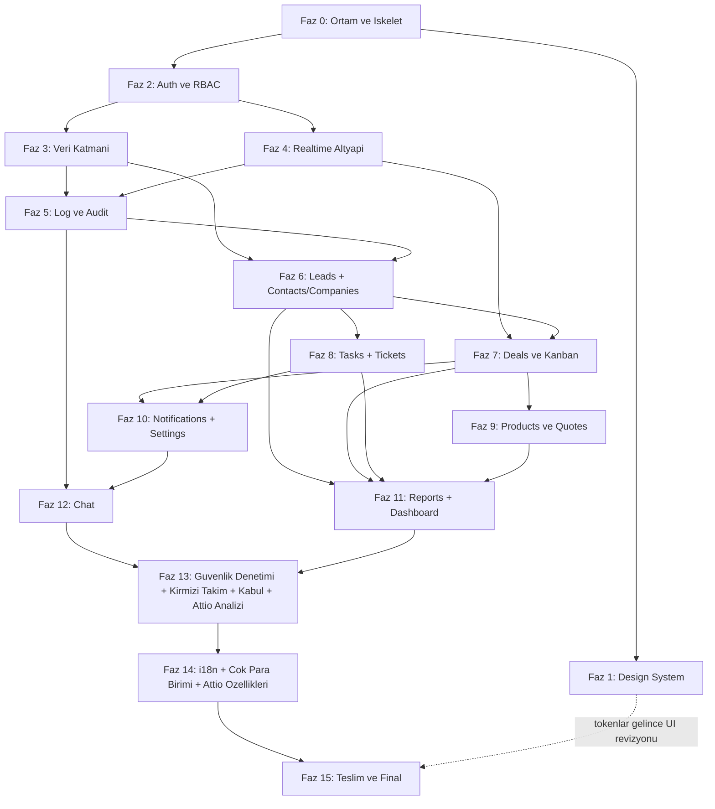

# Syncra — Yol Haritası (ROADMAP)

> Kaynaklar: `PRODUCT-BRIEF.md` (ürün gereksinimleri) + `docs/ENGINEERING-RULES.md` (şerit çalışma kuralları).
> Canlı durum takibi için: `docs/PROGRESS.md` (her oturum başında okunur).

---

## 1. Genel Bakış & Prensipler

**Kapsam:** Kurumsal seviye, production-ready, **kapalı devre** CRM. Monorepo: `backend/` (Laravel 12, PHP 8.2+, Sanctum SPA auth) + `frontend/` (React 18 + Vite + React Router + TanStack Query + Zustand + Tailwind). Veritabanı MySQL (XAMPP, `127.0.0.1:3306`, root/şifresiz). Gerçek zamanlı katman: Laravel Reverb + Laravel Echo + Redis (broadcast + queue + cache + presence). Kuyruk: Redis queue (+ opsiyonel Horizon).

**Kapalı devre tanımı:** Public register YOK. Hesaplar yalnızca Super Admin tarafından Kullanıcı Yönetimi modülünden açılır; ilk Super Admin seeder ile gelir. Pasifleştirilen kullanıcı WebSocket üzerinden anında düşürülür (session revoke). "Şifremi unuttum" yalnızca admin onaylı çalışır. RBAC: `spatie/laravel-permission`, granüler izinler (`deals.create`, `logs.view` ...), her endpoint'te Policy/Gate.

**Katmanlı mimari (backend):** `Controller → Service → Repository`. Business logic controller'da olmaz.
- `backend/app/Http/Controllers/Api/` — ince controller'lar
- `backend/app/Services/` — iş kuralları (ör. `Services/Deals/DealService.php`)
- `backend/app/Repositories/` — Eloquent erişimi (ör. `Repositories/DealRepository.php`)
- `backend/app/Http/Requests/` — Form Request validasyon; `backend/app/Http/Resources/` — API Resource
- `backend/app/Policies/`, `backend/app/Events/`, `backend/app/Jobs/`, `backend/app/Observers/`

**API response sözleşmesi:** Her endpoint API Resource üzerinden döner: başarıda `{ "data": ..., "meta": {...} }` (liste uçlarında `meta.pagination`: `current_page`, `per_page`, `total`, `last_page`), hatada `{ "errors": { "message": ..., "code": ..., "fields": {...} } }` (422'de alan bazlı). Bu sözleşme tüm fazlar ve tüm şeritler için bağlayıcıdır.

**Feature-based frontend:**
- `frontend/src/features/<modül>/` → `api/` (TanStack Query hook'ları), `components/`, `pages/`, `types.ts`
- Modüller: `auth`, `users`, `dashboard`, `leads`, `contacts`, `companies`, `deals`, `tasks`, `tickets`, `products`, `quotes`, `reports`, `notifications`, `settings`, `logs`, `chat`
- Ortak: `frontend/src/components/ui/` (primitive'ler), `frontend/src/lib/` (`axios.ts`, `echo.ts`, `queryClient.ts`), `frontend/src/stores/` (Zustand), `frontend/src/hooks/`

**Değişmez kalite çizgisi:** Ham SQL yok (`DB::raw` zorunluysa bind'lı), `dangerouslySetInnerHTML` yok, mass-assignment `$fillable`, IDOR için sahiplik/yetki kontrolü, tüm liste ekranlarında server-side pagination/sort/filter/search, her ekranda empty/loading(skeleton)/error state + toast, WCAG 2.1 AA, dark/light mode.

---

## 2. Faz Tablosu

| Faz | İsim | Çıktı (Deliverable) | Bağımlılık | Bitti Kriteri (DoD) |
|---|---|---|---|---|
| 0 | Ortam & İskelet | XAMPP/MySQL/Redis (Memurai veya WSL) kurulum notları README taslağında; `backend/` Laravel 12 + `frontend/` Vite iskeleti; `.env.example` eksiksiz; Pint + ESLint/Prettier; klasör yapısı | — (ortam 2026-08-23'te kuruldu ve doğrulandı) | ✅ TAMAMLANDI (2026-08-23). `composer install` + `php artisan serve` ve `npm run dev` ayağa kalkıyor; `.env` git'te yok; lint komutları temiz |
| 1 | Design System | Figma'dan design token'lar (renk/tipografi/spacing/radius/shadow, dark+light) → `frontend/src/styles/tokens.css` (Tailwind v4 `@theme`); UI primitive'leri: Button, Input, Select, Modal, Table, Card, Toast, Skeleton, EmptyState; `/showcase` sayfası | 0 | ✅ TAMAMLANDI (2026-08-23). DoD: tüm primitive'ler showcase'te iki temada, WCAG AA kontrast doğrulanmış Token kaynağı: docs/DESIGN-SYSTEM.md |
| 2 | Auth & RBAC & Kullanıcı Yönetimi | Sanctum SPA + CSRF akışı, login ekranı ("beni hatırla", kilitlenme uyarısı), rate limit (5/dk + artan bekleme), roller (Super Admin, Admin, Satış Müdürü, Satış Temsilcisi, Destek Temsilcisi, İzleyici) + granüler izinler, Super Admin seeder, Kullanıcı Yönetimi CRUD, aktif/pasif + anlık session revoke, admin onaylı şifre sıfırlama, route guard | 0 (UI cilası 1'e) | ✅ TAMAMLANDI (2026-08-23). Login/logout uçtan uca; pasif yapılan kullanıcı anında atılıyor; her endpoint Policy'li; İzleyici hiçbir şey yazamıyor |
| 3 | Veri Katmanı | Tüm migration + factory + seeder (users, roles, permissions, leads, contacts, companies, deals, pipeline_stages, tasks, activities, tickets, products, quotes, quote_items, messages, conversations, conversation_user, notifications, activity_logs, page_visit_logs, session_logs, custom_fields, custom_field_values, tags, taggables, attachments, settings); FK + index + soft delete; mermaid ER diyagramı | 2 | ✅ TAMAMLANDI (2026-08-23). `php artisan migrate:fresh --seed` tek komutla dolu demo sistem; phpMyAdmin'de temiz şema; ER diyagramı README'de |
| 4 | Realtime Altyapı | Reverb sunucu + Echo client + Redis broadcast/queue; kanal mimarisi: `private-user.{id}`, `presence-online`, `presence-record.{type}.{id}`, whisper altyapısı; "online kullanıcılar" presence temeli | 2 | ✅ TAMAMLANDI (2026-08-23). İki tarayıcıda presence listesi canlı; private kanal yetki kontrolü çalışıyor; `reverb:start` + `queue:work` README'de |
| 5 | Log & Audit | `session_logs` (login/logout, IP, user-agent, cihaz/tarayıcı, süre, başarısız denemeler), `page_visit_logs` (route change + heartbeat ile sayfada kalınan süre), audit trail (`spatie/laravel-activitylog`, JSON diff eski→yeni), Loglar sayfası (`logs.view`): canlı akış sekmesi (WebSocket), online panel (kim/hangi sayfa/ne kadardır), filtre (kullanıcı/tarih/aksiyon/modül), CSV/Excel export (`maatwebsite/excel`) | 3, 4 | ✅ TAMAMLANDI (2026-08-23). Her CRUD audit'e düşüyor; canlı akışta anlık log; heartbeat süre ölçümü doğru; export çalışıyor |
| 6 | Leads + Contacts/Companies | Leads: kaynak takibi, skorlama, atama, CSV toplu import, lead→müşteri dönüştürme, duplicate tespiti. Contacts/Companies: ilişkili kayıtlar, iletişim geçmişi timeline, etiketleme, custom fields | 3, 5 (audit otomatik işler) | ✅ TAMAMLANDI (2026-08-24). Liste ekranları server-side pagination/sort/filter/search; dönüştürme akışı uçtan uca; tüm işlemler audit'te |
| 7 | Deals & Kanban Pipeline | dnd-kit Kanban, aşama bazlı olasılık/tutar, kazanma-kaybetme nedenleri, tahmini kapanış; her hareket WebSocket ile diğer kullanıcılara anlık yansır (optimistic update + sunucu doğrulaması) | 4, 6 | ✅ TAMAMLANDI (2026-08-24). İki tarayıcıda sürükle-bırak anlık senkron; çakışmada sunucu kazanır ve UI geri alır |
| 8 | Tasks/Activities + Tickets | Görev atama, hatırlatıcı, takvim görünümü, arama/toplantı/e-posta aktivite kayıtları; Tickets: öncelik, SLA sayacı, atama, durum akışı, iç notlar | 6 | ✅ TAMAMLANDI (2026-08-24). Takvim ve liste görünümleri çalışır; SLA sayacı canlı; atamalar bildirim eventi üretiyor (Faz 10'da tüketilecek) |
| 9 | Products & Quotes | Ürün kataloğu, fiyat listeleri, teklif oluşturma + PDF (`barryvdh/laravel-dompdf`), teklif→fırsat bağlantısı | 7 | ✅ TAMAMLANDI (2026-08-24). Tekliften PDF indiriliyor; `quote_items` toplamları doğru; teklif deal'a bağlı |
| 10 | Notifications + Settings | Bildirim merkezi (atama, mention, deal güncellemesi — Redis+WS anlık push, okunmamış sayaç); Settings: şirket profili, pipeline aşama editörü, custom field yönetimi, e-posta şablonları, rol/izin matrisi | 4, 7, 8 | ✅ TAMAMLANDI (2026-08-24). Bildirim anlık düşüyor ve kalıcı; pipeline aşaması pasifleştirilince açık kartlar zorunlu hedef aşamaya taşınıyor; izin matrisi çalışıyor |
| 11 | Reports + Dashboard | Raporlar: satış performansı, kullanıcı performansı, kaynak analizi, dönüşüm; tarih filtreli + export. Dashboard: KPI kartları (aylık gelir, açık fırsatlar, dönüşüm oranı, aktivite sayısı), satış hunisi, gelir trendi (Recharts), son aktiviteler, görev özeti — WebSocket ile canlı | 6, 7, 8, 9 | ✅ TAMAMLANDI (2026-08-24). Rakamlar demo veriyle elle SQL sayımıyla doğrulandı; dashboard canlı güncelleniyor (3 sn debounce); raporlar CSV/XLSX export edilebiliyor |
| 12 | Chat | DM + grup/kanal, yazıyor... (whisper), okundu bilgisi (çift tik), online/offline/son görülme (presence), dosya/görsel paylaşımı, mesaj arama, @mention, okunmamış sayaçları; deal/ticket detayında kayda bağlı sohbet paneli | 4, 5, 10 (mention→bildirim) | ✅ TAMAMLANDI (2026-08-24). İki kullanıcı arası anlık mesaj + tik + yazıyor göstergesi çalışıyor; kayda bağlı panel deal/ticket detayında canlı; mesajlar MySQL'de, fan-out Redis/Reverb üzerinden; 899 test / 7558 assertion yeşil |
| 13 | Güvenlik Denetimi, Kırmızı Takım, Kullanıcı Kabul & Attio Analizi | **İz A** kırmızı takım (auth/session, authz/IDOR, 8 kanal, mass-assignment, injection/XSS, upload, kaynak, sırlar; A1–A8) + ön bulgu kapatma (F1–F6) + sertleştirme (H1–H6, H8); **İz B** 6 rol kabul turu; **İz C** Attio ANALİZİ (kabul/red kararı — özellik İNŞASI yok, bkz. Faz 14). **Detay: `docs/PHASE-AUDIT.md`.** | 0–12 | Bulgular düzeltilip testle kilitlendi; 8 kanal + IDOR testli; güvenlik header'ları doğrulandı; 6 rol turu tamamlandı; Attio kabul/red kararı kayıtlı; `composer/npm audit` temiz |
| 14 | Uluslararasılaştırma (i18n + Çoklu Para Birimi) & Attio Özellikleri | **İz D** çok dilli destek (tr/en/de/fr, react-i18next) + README İngilizce; **İz E** çoklu para birimi + TCMB güncel kur (donmuş belge kuru, XXE-güvenli ayrıştırma + giden-çağrı sertleştirme H7, test A5.8); **İz F** Faz 13'te KABUL edilen Attio özelliklerinin (C1–C4) İNŞASI. **Detay: `docs/PHASE-INTL.md`.** | 13 | ✅ TAMAMLANDI (2026-08-25). 4 dilde gezilebilir (tam 4-dil nokta-kontrolü Faz 15'e ertelendi, bkz. PHASE-INTL §8) + anahtar-parite yeşil; kur donma/bayatlık görünür; XXE testi (A5.8) yeşil; C1–C4 çalışır durumda; `composer/npm audit` temiz. **1305 test / 9635 assertion.** |
| 15 | Teslim & Final Kabul | İşlevsel feature/E2E test kapsamını tamamlama (auth, yetki, deal CRUD, log kaydı, chat mesajı); README final (kurulum + API endpoint listesi + ER, iki dilde); Faz 14 sonrası kısa yeniden-kabul turu (metin + özellik smoke, tam İz B tekrarı değil); Bölüm 6 global kabul kriterleri son turu; teslim. (Güvenlik header/upload/IDOR/mass-assignment işleri Faz 13'te — burada tekrarlanmaz.) | 0–14 | ✅ TAMAMLANDI (2026-08-25). `php artisan test` yeşil (**1316 test / 9695 assertion**); README EN (birincil) + README.tr.md eksiksiz (kurulum + 167 uçluk API listesi + 5 gruplu mermaid ER + ekran görüntüleri); yeniden-kabul turu tamamlandı (140/140 rol×modül×dil hücresi); Bölüm 6 kabul kriterlerinin 8'i sağlandı, 2'si KISMEN (§6'da işaretli). **Detay: `docs/PHASE-DELIVERY.md`.** |

**Faz 1 durumu (2026-08-23 güncellendi):** Figma linki geldi ve dosya Figma REST API ile okundu (`Dashboard CRM (Community) (Copy)`, key `tlJ6qKhhmbBZAKIYaCIolE`). Tüm design token'ları ölçülüp `docs/DESIGN-SYSTEM.md` dosyasına yazıldı — bu doküman token'lar için tek doğruluk kaynağıdır. Kalan adımlar:
1. ✅ Token extraction (renk, tipografi, spacing, radius, shadow, layout) — tamamlandı
2. ✅ `frontend/src/styles/tokens.css` aktarımı — Tailwind v4 `@theme` bloğu + `:root` / `[data-theme="dark"]` CSS custom property'leri (v4'te `tailwind.config.js` yoktur)
3. ✅ Primitive'lerin inşası: Button, Input, Select, Modal, Table, Card, Toast, Skeleton, EmptyState, Badge, Avatar, Pagination, Tabs
4. ✅ `/showcase` sayfası — tüm primitive + state'ler
5. ✅ WCAG 2.1 AA kontrast denetimi — oranlar `docs/DESIGN-SYSTEM.md` §1.6'da hesaplandı; `/showcase` sayfası her iki temada gözle doğrulandı (2026-08-23)

**Açık tema:** Figma dosyasında yalnızca koyu tema frame'i çizilmişti. Açık tema paleti 2026-08-23'te karara bağlandı ve WCAG 2.1 AA için doğrulandı — dört accent ile text-muted, beyaz zeminde 4.5:1'i geçmedikleri için koyulaştırıldı. Değerler ve 18 çiftlik kontrast tablosu: `docs/DESIGN-SYSTEM.md` §1.6.

**Bilgi mimarisi kararı:** Kaynak template (DexignZone) genel bir admin temasıdır; menüsünde Employees/Core HR/Finance/Projects gibi bizim CRM'imizde olmayan öğeler var. **Tasarımın görsel dili alınır, bilgi mimarisi alınmaz** — modül listesi `PRODUCT-BRIEF.md`'den gelir. Eşleme tablosu: `docs/DESIGN-SYSTEM.md` §8.

### 2.1 Faz Detayları (paketler, komutlar, kilit dosyalar)

**Faz 0 — Ortam & İskelet**
> **Ortam durumu — KURULDU ve DOĞRULANDI (2026-08-23):** PHP 8.2.12 (`C:\xampp\php`, `zip`+`intl` açık), Composer 2.10.2, MariaDB 10.4.32 (çalışıyor, utf8mb4), Redis 8.0.5 (WSL2, `127.0.0.1:6379`), Node 26.7.0 / npm 11.19.0. Ayrıntılı tablo: `docs/PROGRESS.md` → Ortam Durumu.
>
> Bilinmesi gerekenler:
> - `C:\xampp\php` kullanıcı PATH'inde mevcut (`php`, `composer` bare komut olarak çalışır). Uyarı: Windows'ta ortam değişkenleri yalnızca yeni süreçlere miras kalır — oturum/terminal PATH değişikliğinden önce açıldıysa komutlar bulunamaz; yeni terminal açmak veya tam yol (`C:\xampp\php\php.exe`) kullanmak gerekir.
> - MariaDB Windows servisi olarak kurulu değil; makine yeniden başlatılınca XAMPP Control Panel'den başlatılmalı.
> - Redis WSL2 Ubuntu üzerinde çalışıyor — Memurai kurulmadı, gerekmedi.
> - PHP `redis` C eklentisi yok → `predis/predis` kullanılacak.
>
> **Faz 0 sonucu (2026-08-23):** Kurulu sürümler — Backend: Laravel 12.67.0, sanctum 4.3.3, spatie/laravel-permission 6.25.0, predis 3.6.0, pint 1.30.4 (PHP 8.2.12). Frontend: React 18.3.1, Tailwind 4.3.3, Vite, TypeScript, ESLint flat config + Prettier. Doğrulamalar: `composer audit` temiz, Redis ping PONG, Pint passed, `npm run build`/`lint`/`typecheck` temiz.
> Veritabanı `syncra_crm` HENÜZ OLUŞTURULMADI ve hiçbir migration çalıştırılmadı (Faz 3).
- Backend: `composer create-project laravel/laravel backend` (Laravel 12), ardından `composer require laravel/sanctum spatie/laravel-permission` + `predis/predis`.
- Frontend: `npm create vite@latest frontend -- --template react-ts`, ardından `npm i react-router-dom @tanstack/react-query zustand axios laravel-echo pusher-js` + `npm i -D tailwindcss @tailwindcss/vite eslint prettier`.
- `.env.example`: `DB_HOST=127.0.0.1`, `DB_PORT=3306`, `DB_USERNAME=root`, `DB_PASSWORD=` (XAMPP varsayılanları), `REDIS_*`, `REVERB_*`, `BROADCAST_CONNECTION=reverb`, `QUEUE_CONNECTION=redis`, `CACHE_STORE=redis`, `SESSION_DRIVER=redis`.
- Redis doğrulama: `php artisan tinker` → `Illuminate\Support\Facades\Redis::ping()` (WSL2'deki Redis 8.0.5'e bağlanır).
- Lint: `backend/pint.json` (`vendor/bin/pint`), `frontend/.eslintrc.cjs` + `.prettierrc`.
- Kök: `dev.bat` (4 süreç: `php artisan serve`, `php artisan reverb:start`, `php artisan queue:work`, `npm run dev`), `README.md` taslağı, `.gitignore` (`.env`, `node_modules`, `vendor`).

**Faz 1 — Design System** (token'lar çıkarıldı — bkz. docs/DESIGN-SYSTEM.md)
- Kilit dosyalar: `frontend/src/styles/tokens.css` (CSS custom properties, `[data-theme="dark"]` varyantları), `frontend/src/components/ui/*.tsx`, `frontend/src/pages/Showcase.tsx` (`/showcase` route'u yalnız dev ortamında).
- Layout sabitleri: sidebar 240px, sağ drawer 340px, baskın kart padding'i 20px, taban font 13px/20px (Poppins). Primitive prop imzaları Faz 0 sonunda sabitlenir.

> **Faz 1 sonucu (2026-08-23):** `src/styles/tokens.css` (Tailwind v4 `@theme inline` + `[data-theme]`), `src/stores/themeStore.ts` + `src/hooks/useTheme.ts` (light/dark/system, OS değişimini dinler), `src/lib/cn.ts`. 15 primitive: Button, Input, Select, Textarea, Checkbox, Badge, Avatar(+Group), Card(+Header/Body/Footer), Modal, Table(+alt bileşenler), Toast (Sonner), Skeleton, EmptyState, Pagination, Tabs — barrel `src/components/ui/index.ts` (29 export). Showcase: `/showcase`.
> Doğrulandı: build/typecheck/lint temiz; `src/` altında hex, `rgb()`, varsayılan Tailwind rengi veya `dark:` prefix'i yok. Görsel doğrulama: kullanıcı `/showcase` sayfasını her iki temada gözden geçirdi ve onayladı (2026-08-23).

**Faz 2 — Auth & RBAC**
- Sanctum SPA: `config/sanctum.php` `stateful` domain'leri, `config/cors.php` `supports_credentials: true`; frontend'te önce `GET /sanctum/csrf-cookie` sonra `POST /login`.
- Rate limit: `RateLimiter::for('login', ...)` — 5/dk, artan bekleme; başarısız denemeler `session_logs`'a (Faz 5'te tablo gelince geriye dönük bağlanır, o zamana kadar `Log::warning`).
- Session revoke: kullanıcı pasif yapılınca `UserDeactivated` eventi `private-user.{id}` kanalına düşer; client logout + token/oturum sunucuda geçersiz kılınır. Middleware `EnsureUserIsActive` her istekte kontrol eder.
- Seeder: `database/seeders/RolePermissionSeeder.php` + `SuperAdminSeeder.php`. İzin sözlüğü: `{modül}.{eylem}` (`leads.view|create|update|delete|import|convert`, `deals.*`, `reports.view`, `logs.view`, `users.manage`, `settings.manage`, `chat.use` ...).

> **Faz 2 sonucu (2026-08-23):** `syncra_crm` veritabanı kuruldu (utf8mb4/utf8mb4_unicode_ci); `users` tablosuna `is_active`, `department`, `last_login_at`, `must_change_password`, softDeletes eklendi. 63 izin (`{modül}.{eylem}`, guard `web`), 6 rol: Super Admin (0 izin — `Gate::before` ile tümü), Admin (57), Satış Müdürü (41), Satış Temsilcisi (26), İzleyici (15), Destek Temsilcisi (14). `UserPolicy` (otomatik keşif) — kendi hesabını pasifleştirememe/silememe, Super Admin'i yetkisiz değiştirememe, son aktif Super Admin'in korunması.
> Sanctum SPA cookie session modu (token modu değil): `POST /api/login` (session fixation'a karşı `session()->regenerate()`, 422/403 `USER_DEACTIVATED`), `POST /api/logout`, `GET /api/me`, `POST /api/password/forgot` (kapalı devre, her durumda 202), `POST /api/password/change`. Rate limiting: e-posta+IP karması, dakikada 5 deneme, artan bekleme 1→2→4→8→16→32→60 dk (Redis). Session revoke 3 katmanlı: `EnsureUserIsActive` middleware (asıl güvenlik sınırı), `UserDeactivated` broadcast (Faz 4'te aktifleşecek), remember token rotasyonu. Zorunlu şifre değişimi: `EnsurePasswordIsChanged` middleware, beyaz liste muafiyeti (yalnız `logout`, `me`, `password/change`).
> Kullanıcı Yönetimi: 8 endpoint (Controller → Service → Repository), server-side pagination/sıralama/filtreleme/arama, ham SQL yok, her endpoint'te Policy kontrolü, güçlü şifre politikası (`Password::min(12)->mixedCase()->numbers()->symbols()->uncompromised()`).
> Doğrulama: `php artisan test` → **50 passed / 221 assertions**, `pint --test` passed, frontend build/typecheck/lint temiz. Uçtan uca curl doğrulaması yapıldı.
> **`docs/AUTH-FLOWS.md`, zorunlu şifre değişimi tasarımı ve tehdit modeli için bağlayıcı sözleşmedir** — Faz 3+ endpoint'leri eklenirken bu sözleşmeye uyulmalıdır.

**Faz 3 — Veri Katmanı**
- 26 tablo (Bölüm 2 tablosundaki liste); tümünde `created_at/updated_at`, iş tablolarında `deleted_at` (soft delete), FK'larda `constrained()->cascadeOnDelete()` veya `nullOnDelete()` bilinçli seçilir.
- Kritik index'ler: `deals(pipeline_stage_id, position)`, `page_visit_logs(user_id, entered_at)`, `activity_logs(subject_type, subject_id)`, `messages(conversation_id, created_at)`, `leads(email)` (duplicate tespiti için).
- Her modele factory + gerçekçi Türkçe demo seeder; `DatabaseSeeder` sıralaması FK bağımlılığına göre.
- ER diyagramı mermaid `erDiagram` olarak README'ye.

> **Faz 3 sonucu (2026-08-23):** 39 fiziksel tablo (38'i migration'lardan + Laravel'in `migrations` defter tablosu), 40 foreign key, 13 tabloda soft delete. `migrate:fresh --seed` hatasız, ~2.8 saniye. Zorunlu composite index'ler doğrulandı: `deals(pipeline_stage_id, position)`, `messages(conversation_id, created_at)`, `page_visit_logs(user_id, entered_at)`, `session_logs(user_id, created_at)`. `spatie/laravel-activitylog` ^4.12 kuruldu (5.x PHP 8.4 istiyor, ortamda 8.2 var) — yalnızca `activity_log` tablosu oluşturuldu, loglama mantığı Faz 5'te bağlanacak.
> 20 yeni factory (UserFactory hariç, anlamlı state'lerle) + 5 seeder (`PipelineStageSeeder`, `SettingSeeder`, `CustomFieldSeeder`, `DemoDataSeeder`, `RolePermissionSeeder`/`SuperAdminSeeder` Faz 2'den).
> Demo veri: 9 kullanıcı · 25 firma · 60 kişi · 40 lead · 50 fırsat · 80 görev · 120 aktivite · 30 ticket · 20 ürün · 15 teklif (57 kalem) · 12 etiket (153 ilişki) · 8 konuşma (120 mesaj) · 18 ek · 20 sayfa ziyaret logu · 15 oturum logu. Demo kullanıcı şifresi `Demo!2026Syncra`, `must_change_password=false`.
> Referans bütünlüğü: 24/24 tutarlılık kontrolü temiz (deal durumu ↔ aşama uyumu, tekrarsız `position`, converted lead ↔ FK tutarlılığı, teklif toplamı ↔ kalem toplamı, dm konuşmalarında 2 katılımcı, `unread_count` ↔ `last_read_message_id`, morph alanlarında öksüz kayıt yok...) — `DemoDataSeeder::assertConsistency()` içinde de çalışıyor, ihlalde `RuntimeException` ile transaction geri alınıyor.
> Üretim koruması: `DatabaseSeeder`, demo veriyi yalnızca `! app()->environment('production')` iken üretiyor; `APP_ENV=production` ile test edildi.
> Ayrıntılı şema dökümü, tasarım kararları ve 3 mermaid ER diyagramı: `docs/DATABASE.md`.

**Faz 4 — Realtime Altyapı**
- `composer require laravel/reverb` + `php artisan reverb:install`; `config/broadcasting.php` default `reverb`, event fan-out kuyruğu Redis.
- Kanal sözlüğü (`routes/channels.php`): `private-user.{id}` (kişisel bildirim + revoke), `presence-online` (global online listesi), `presence-record.{type}.{id}` (deal/ticket detayını açık tutanlar), `private-conversation.{id}` (chat, Faz 12).
- `frontend/src/lib/echo.ts`: Echo + `pusher-js` client'ı Reverb'e bağlar; `frontend/src/hooks/usePresence.ts` ortak hook.

> **Faz 4 sonucu — backend (2026-08-23):** `laravel/reverb` v1.11.1, Windows'ta yerel çalışıyor (WSL/`ext-pcntl` gerekmedi). Kapı testi: ham bir Node WebSocket istemcisi `ws://127.0.0.1:8080/app/syncra-key` adresine bağlandı, `pusher:connection_established` aldı, ayrı bir süreçten `artisan tinker` ile dispatch edilen gerçek bir Laravel event'ini kanalda gördü; presence kanalı da doğrulandı (`{"presence":{"count":1,"ids":["2"]}}`) ve Reverb'ün üç HTTP API ucu yanıt verdi.
> Kanal sözlüğü (`routes/channels.php` + `app/Broadcasting/ChannelRegistry.php`): `private-user.{id}` (`$user->id === (int) $id`), `presence-online` (kimliği doğrulanmış + `is_active`; payload id/name/email/role/department), `presence-record.{type}.{id}` (whitelisted `type` + ilgili modülün `.view` izni + kayıt var mı kontrolü), `private-conversation.{id}` (katılımcı pivotu, Faz 12), `private-logs` (`logs.view`, Faz 5), `private-dashboard` (`dashboard.view`, Faz 11).
> Online kullanıcı kaynağı: `App\Broadcasting\OnlineUserRegistry`, Reverb'ün HTTP API'sinden (`/apps/syncra/channels/presence-online/users`) okur — soketlerin sahibi Reverb olduğu için tek doğru kaynak odur, soket kapanınca üye anında düşer, süpürücü job veya `is_online` kolonu gerekmez. Redis yalnızca sarmalayıcı: `syncra:online:ids` (5 sn önbellek), `syncra:online:snapshot` (5 dk, yalnız Reverb erişilemezken okunur, `meta.stale: true` ile). Online'lık asla veritabanından okunmaz/yazılmaz. Uç: `GET /api/presence/online`.
> Route güvenliği: `/broadcasting/auth` → `web → auth:sanctum → EnsureUserIsActive`; `/api/presence/online` → `api → auth:sanctum → EnsureUserIsActive → EnsurePasswordIsChanged`. `password.changed` bilinçli olarak `/broadcasting/auth`'a uygulanmadı (gerekçe: docs/PROGRESS.md karar günlüğü ve kod yorumları).
> Test: 88 passed / 316 assertions (50 mevcut + 38 yeni), Pint passed, `composer audit` temiz.

**Faz 5 — Log & Audit**
- `composer require spatie/laravel-activitylog maatwebsite/excel`.
- Session: `LogSuccessfulLogin/Logout` listener'ları (IP, user-agent, cihaz ayrıştırma), başarısız girişler `Illuminate\Auth\Events\Failed` listener'ı ile.
- Page-visit: `frontend/src/features/logs/usePageTracking.ts` — route change'de `POST /api/page-visits`, 30 sn'de bir `PATCH /api/page-visits/{id}/heartbeat` (yeni satır değil `duration` güncellemesi).
- Audit: loglanacak modellere `LogsActivity` trait'i, `->logOnlyDirty()`; canlı akış `LogCreated` eventi ile `private-logs` kanalına (yalnız `logs.view` yetkisi authorize olur).
- UI: `frontend/src/features/logs/pages/LogsPage.tsx` — sekmeler: Oturum / Gezinme / Aksiyon / Canlı Akış + online kullanıcı paneli; export uçları `GET /api/logs/export?format=csv|xlsx`.

> **Faz 5 sonucu (2026-08-23):** Oturum logları (`login`/`logout`/`failed_login`/`locked_out`) `AuthService`'ten doğrudan yazılıyor — Laravel auth event'lerinin hiçbiri kullanılamadı (Login ikinci regenerate()'ten önce fırlıyor, Failed ve Lockout hiç fırlamıyor); IP, user-agent, cihaz/tarayıcı/platform (bağımlılıksız `app/Support/UserAgentParser.php`), çıkış yeni satır açmaz, `session_id` ile eşleşen satırı günceller. Log yazımı try/catch ile korunuyor, kuyruk kullanılmıyor (worker çökerse güvenlik kaydı kaybolmamalı).
> Sayfa gezinme logları: `POST /api/page-visits` + `PATCH /api/page-visits/{id}/heartbeat` (30 sn), heartbeat yeni satır eklemez, birikimli süre günceller; 5 dakikadan uzun boşluk atlanır, tavan 8 saat; süre sunucuda hesaplanır; IDOR koruması (başkasının ziyaretine heartbeat → 403). Frontend `usePageTracking` hook'u route desenini `useMatches()` ile normalize eder, `AbortController` + nesil sayacıyla yarış durumunu çözer, sekme görünmezken heartbeat atlar.
> Audit trail: `spatie/laravel-activitylog` 15 modele bağlandı (Message/Conversation, PageVisitLog/SessionLog, Attachment, CustomFieldValue bilinçli dışarıda). `logFillable()` + global `logExcept()`; kırpma tek katmanda, DB'de 1024 karakter (`PropertyTruncator`), `_truncated` alan adı dizisi. Her satırda `properties._context`. Canlı yayın `ActivityLogged` → `private-logs` kanalı (kuyruklu), payload diff içermez.
> Log API + arayüz: `GET /api/logs/sessions|page-visits|activities` + `GET /api/logs/export` (`logs.view`/`logs.export`), server-side pagination/sıralama/filtreleme/arama; CSV UTF-8 BOM ile harici paketsiz akıtılıyor, XLSX `maatwebsite/excel`; export tavanı 50.000 satır. `/logs` sayfası 4 sekme (Oturum/Gezinme/Aksiyon/Canlı Akış) + online kullanıcı paneli.
> `logs:prune` komutu: `page_visit_logs` 90 gün, `session_logs`/`activity_log` 365 gün, günlük 03:17'de zamanlanmış.
> Doğrulama: 162 test / 588 assertion yeşil, Pint passed, `composer audit` temiz, frontend typecheck/lint/build temiz.

**Faz 6 — Leads + Contacts/Companies**
- Duplicate tespiti: e-posta/telefon/isim benzerliği üzerinden `app/Services/Leads/DuplicateDetector.php`; import öncesi ve kayıt sırasında uyarı.
- CSV import: kuyruğa alınan `ImportLeadsJob` + satır bazlı hata raporu; dönüştürme `LeadConversionService` (lead → contact + company + opsiyonel deal, tek transaction).
- Custom fields: `custom_fields` (tanım) + `custom_field_values` (morph) — Faz 10'daki yönetim ekranının veri temeli burada çalışır durumda olur.

> **Faz 6 sonucu (2026-08-24):** Doğrulandı — 279 test / 946 assertion yeşil (Faz 5 sonunda 162'ydi), Pint passed, ham SQL yok, frontend typecheck/lint/build temiz.
> **Duplicate tespit motoru:** `app/Services/Leads/DuplicateDetector.php` hem `leads` hem `contacts` tablosunda arar (bir aday mevcut bir müşteriyle de çakışabilir). Skorlama: e-posta tam eşleşme 100, telefon tam (normalize) 90, ad+soyad+firma 80, ad+soyad 50; bir kayıt birden fazla kurala uyarsa en yüksek skoru alır, skorlar toplanmaz. ≥80 `strong`, altı `possible`; sonuç 20 adayla, kural başına tarama 200 satırla sınırlı. `app/Support/PhoneNormalizer.php` son 10 haneyi normalize eder (bilinen sınırlar kodda belgeli). Telefon eşleştirme, ham SQL yasağı nedeniyle SQL'de garantili üst küme (joker serpiştirilmiş LIKE) + PHP'de kesin doğrulama yaklaşımıyla çözüldü. Demo veride bilerek bırakılan 4 duplicate lead'in dördü de doğru bulundu (2×100, 2×90).
> **Lead → müşteri dönüşümü:** `app/Services/Leads/LeadConversionService.php` tek `DB::transaction` içinde contact + (varsa) company + (opsiyonel) deal oluşturur; `lockForUpdate` ile çift dönüşüm engellenir. Lead'e bağlı `tasks/activities/attachments/taggables` yeni contact'a taşınır (toplu `update()`, model döngüsü değil). `custom_field_values` taşınmaz, hedefte aynı `key`+`type` ile aktif tanım varsa koşullu kopyalanır. Zaten dönüşmüş lead ikinci kez dönüştürülemez (422); lead silinmez. Deal, `is_active` + en küçük `position` değerli aşamaya düşer (sorgulanır, hard-code değil).
> **Leads/Contacts/Companies CRUD:** Liste sözleşmesi standartlaştı: `?page&per_page(max100)&sort&q&filter[...]`, yanıt `{data, meta.pagination}`; sıralama sütunları beyaz listeli, arama parantezli `where` grubunda. Dönüşmüş lead korunuyor (`status='converted'` doğrudan set edilemez — 422; güncellenemez/silinemez — 403). Firma başına tek birincil kişi transaction içinde korunur. Açık fırsatı olan kişi/firma silinemez (422).
> **İletişim geçmişi timeline'ı:** `app/Services/Shared/TimelineBuilder.php` aktivite/görev/fırsat/ticket/ek dosyaları "kaynak başına top-K" ile birleştirir (ham `UNION` yasak); her sayfa tam doğru, yaklaşık değil. Bilinen maliyet: sorgu `sayfa × per_page` ile doğrusal büyür (bkz. R19).
> **CSV toplu import:** `POST /api/leads/import` — 500 satır altı senkron, üstü `ImportLeadsJob` ile kuyruğa (202 + `batch_id`); durum Redis'te (`syncra:import:{uuid}`, 24 saat TTL). Dosya güvenliği: çift MIME doğrulama, max 5MB, rastgele UUID adıyla `storage/app/imports/` altına, işlem sonunda silinir. `duplicate_mode`: `skip`/`create`/`update` — `update` modunda duplicate lead güncellenir ama duplicate contact güncellenmez (satır `skipped`). Audit gürültüsü: per-lead loglama kapalı, sonunda tek `leads.imported` özet kaydı.
> **Arayüz:** `/leads`, `/leads/:id`, `/contacts`, `/contacts/:id`, `/companies`, `/companies/:id`; tüm liste durumları URL query string'inde. Duplicate uyarısı 500ms debounce ile kontrol edilir, kaydetmeyi engellemez ("Yine de Kaydet"). Dönüştürme modalı güçlü contact eşleşmesinde "Yeni kişi oluştur / Mevcut kişiye bağla" seçeneği sunar. Import modalı: şablon → dosya → `duplicate_mode` → sonuç raporu, batch sorgulama 2 sn aralıkla en fazla 60 deneme. Etiket renkleri `components/shared/tokenBadgeVariant.ts` ile literal `Record` eşlemesiyle `Badge` varyantlarına bağlanır (Tailwind v4 dinamik sınıf üretmediği için className'e string enterpolasyonu yok).
> **Model ilişkileri:** Faz 3'te oluşturulan `tags`/`taggables` ve `custom_fields`/`custom_field_values` morph ilişkileri `Lead, Contact, Company, Deal, Ticket, Product` modellerine düzgün bağlandı (önceki geçici çözümler kaldırıldı). `taggables` saf pivot olduğu için ilişkilerde `withTimestamps()` kullanılmaz. N+1 ölçüldü ve teste bağlandı: 10 lead için toplam 7 sorgu (N+1 olsaydı ≥27).

**Faz 7 — Deals & Kanban**
- `npm i @dnd-kit/core @dnd-kit/sortable`; kart taşıma akışı: optimistic update → `PATCH /api/deals/{id}/move` (`{to_stage_id, position, version}`) → başarıda `DealMoved` broadcast'i (`toOthers()`), stale `version`'da 409 + query invalidation ile geri alma.
- `position` fractional-index (string) — araya ekleme toplu renumbering gerektirmez.

> **Faz 7 sonucu (2026-08-24):** Doğrulandı — 357 test / 1649 assertion yeşil (Faz 6 sonunda 279'du), Pint passed, `app/` altında sıfır ham SQL, frontend typecheck/lint/build temiz.
> **ROADMAP R4 çözüldü — eşzamanlı kart taşıma:** Faz 3'ten beri taşınan en zor risk kapandı. Teknik lider canlı sunucuda bağımsız doğruladı: geçerli `version` ile taşıma → 200, `version` artıyor, kart yeni aşamada; aynı bayat `version` ile ikinci istek → 409 `DEAL_VERSION_CONFLICT`, gövdede kartın güncel hali (15 alan), ve ikinci istek uygulanmıyor. İki kullanıcı aynı kartı aynı anda taşıdığında ikincisi sessizce ezilmiyor.
> **Fractional index — `app/Support/FractionalIndex.php`:** `between()`, `first()`, `last()`. Anahtarlar yalnızca küçük harfli base36 (`0-9a-z`) ile yazılıyor. Collation tuzağı: `position` kolonu `utf8mb4_unicode_ci` (harf duyarsız) — alfabede büyük harf olsaydı MySQL'in `ORDER BY`'ı ile PHP'nin `strcmp()`'i farklı sıra verirdi (testler yeşil kalırken üretimde Kanban sıralaması bozulurdu). Sondaki `'0'` yasağı: `'a'` ile `'a0'` arasına hiçbir string sığmaz; üretilen hiçbir değer `'0'` ile bitmiyor, dışarıdan gelen veriyle bu ölü noktaya denk gelinirse `RuntimeException`. Genişlik koruyan artırma: 200 ardışık ekleme hâlâ 5 hanede kalıyor. Uzunluk sınırı 64 (kolon genişliği), aşılırsa exception. `LeadConversionService` ve `DemoDataSeeder`'daki iki kopya bu sınıfa devredildi.
> **Taşıma ucu — `PATCH /api/deals/{deal}/move`:** Gövde `{ to_stage_id, before_deal_id?, after_deal_id?, version, lost_reason?, won_reason? }`. İstemci `position` göndermez, komşuları bildirir — pozisyon her zaman sunucuda üretilir. Akış: `lockForUpdate` satır kilidi → `version` kontrolü → hedef aşama doğrulama (pasif aşamaya taşıma 422) → komşuların hedef aşamada olduğu doğrulaması → pozisyon hesabı → aşama geçiş kuralları → `version` artırımı. Aşama geçiş kuralları: `is_won` → `status='won'` + `closed_at`; `is_lost` → `status='lost'` + `lost_reason` ZORUNLU (422); açık aşamaya dönüş → `status='open'`, nedenler temizlenir. `probability` kart aşama değiştirdiğinde yalnızca `null` ise aşamanınki devralınır. 409 yanıtı 200 ile aynı kart şeklini taşır (`DealCardResource`). `DealVersionConflictException extends HttpResponseException` — merkezî handler'a dokunmadan doğru zarf üretiliyor ve Laravel'in raporlama hattından geçmiyor.
> **Yayın:** `DealMoved` → `private-deals` kanalı (`deals.view` izni), `broadcastAs()` = `deal.moved`, `toOthers()` ile. Yayın transaction dışında, commit sonrası. Payload düz skaler dizi, model değil.
> **Pano ucu — `GET /api/deals/board`:** Aşama başına kart sınırı varsayılan 50 (max 200, `?per_stage=`), `has_more` ile fazlası bildiriliyor. `meta.total_amount` aşamadaki TÜM kartların toplamı. N+1: aşama başına bir kart sorgusu, sonra tüm kartlar tek `Collection`'da birleştirilip ilişkiler tek seferde yükleniyor.
> **Liste ucu — `GET /api/deals`:** Faz 6 standardı + `meta.totals`: `{ count, total_amount, open_amount, won_amount, lost_amount, currency }`. Toplamlar sayfalanmış sonucun değil, filtrelenmiş TÜM kümenin (canlı doğrulama: sayfada 5 kayıt, `totals.count` 50). Tek `groupBy('status')->selectRaw()` 3 sorgu tasarruf ederdi ama ham SQL gerektirir — ham-SQL-sıfır garantisi tercih edildi.
> **CRUD kısıtları:** `PATCH /api/deals/{deal}` `pipeline_stage_id`, `position`, `version`, `status` alanlarını reddeder (422) — aşama/durum değişimi yalnızca `/move` ucundan. `POST /api/deals` bu alanları sessizce yok sayar. Kazanılmış/kaybedilmiş deal silinemez → 403.
> **Arayüz:** `/deals` (Kanban), `/deals/list` (tablo), `/deals/:id` (detay). Geri alma pano fotoğrafı değil kartın kendisi üzerinden. `version` her zaman optimistic güncellemeden ÖNCEKİ karttan okunuyor, cache'ten değil. 409'da pano invalidate edilmiyor, yalnızca ilgili kart düzeltiliyor. Realtime payload tam kart değil — yalnızca gelen alanlar cache'teki karta yazılıyor, sütun toplamları delta olarak düzeltiliyor. Klavye erişilebilirliği: `KeyboardSensor` + Türkçe ekran okuyucu duyuruları. Kayıp aşamasına bırakmada `lost_reason` modal'ı istek gönderilmeden önce açılıyor.

**Faz 8 — Tasks/Activities + Tickets**
- Takvim görünümü hafif tutulur (kendi grid bileşenimiz, ağır takvim kütüphanesi yok); hatırlatıcılar `SendTaskReminderJob` (Redis queue, `php artisan schedule:work`).
- SLA: `app/Services/Tickets/SlaService.php` — önceliğe göre hedef süre, kalan süre canlı sayaçla; ihlale yaklaşan ticket'lar bildirim eventi üretir.

> **Faz 8 sonucu (2026-08-24):** Doğrulandı — 470 test / 2147 assertion yeşil (Faz 7 sonunda 357'ydi), Pint passed, `app/` altında sıfır ham SQL, frontend typecheck/lint/build temiz.
> **Görevler ve Aktiviteler:** 8 görev + 5 aktivite ucu. Morph beyaz listesi `app/Support/MorphTargets.php` (`deal|lead|contact|company|ticket` → FQCN, API'de yalnızca kısa ad, FQCN dışarı sızmaz), `ChannelRegistry`/`LogRepository::SUBJECT_TYPE_MAP` desenleriyle tutarlı; hedef kaydın gerçekten var olduğu da doğrulanır (yoksa 422). `is_overdue` sunucuda hesaplanır. İş kuralları: `reminder_at ≤ due_at`, `completed_at` yalnız `/complete`'ten, `cancelled` görev tamamlanamaz, `/complete` idempotent, aktivite `occurred_at` gelecekte olamaz, aktivitede `user_id` istemciden kabul edilmez. Yetki: görev tamamlama `tasks.update` ile; aktivite silme oluşturan kişi veya `activities.delete` izniyle. Takvim ucu `?from`/`?to` zorunlu, max 90 gün, sayfalama yok. In-app hatırlatıcı `TaskReminderDue` → `private-user.{assigned_to}`, `tasks:dispatch-reminders` komutu dakikalık, cache anahtarıyla (`tasks:reminder-dispatched:{task_id}:{reminder_at_ts}`, 7 gün TTL) tekrar gönderim engellenir.
> **Destek Talepleri ve SLA:** Tasarım sözleşmesi `docs/SLA-DESIGN.md` (bağlayıcı). SLA çözüm süresini ölçer, `first_response_at` ayrı metrik. Sayaç `pending` durumunda durur, çıkışta duraklama süresi kadar `sla_due_at` ileri kayar: `sla_due_at = created_at + hedef_saat(priority) + sla_paused_seconds`. Yeni migration: `tickets` tablosuna 4 kolon (`sla_paused_at`, `sla_paused_seconds`, `sla_warning_notified_at`, `sla_breach_notified_at`), additive, 30 demo ticket korundu. İhlal kalıcı bayrak DEĞİL, türetilmiş değer — tek tanım `SlaService`'te, `filter[sla_breached]`/`stats`/tarayıcı aynı metodu paylaşır. Durum makinesi `TicketStatusMachine::TRANSITIONS`; `closed` terminal, geçersiz geçiş 422 `INVALID_STATUS_TRANSITION`; durum yalnızca `PATCH /api/tickets/{id}/status`'ten değişir. Öncelik değişiminde `sla_due_at` yeniden hesaplanır (`normal→urgent` anında ihlale düşebilir — istenen davranış). `sla_total_seconds` ticket'ın kendi taahhüdünden türetilir, ayardan okunmaz. Yayın: `TicketSlaWarning`/`TicketSlaBreached` → `private-tickets`, `tickets:scan-sla` komutu 5 dakikalık, idempotent, `--dry-run` destekli. `resolved`/`closed` ticket silinemez (403). İç notlar için yeni tablo açılmadı — `activities` tablosunda `type='note'` olarak tutuluyor. `first_response_at` ilk `call`/`email`/`meeting` aktivitesinde yazılır (`note` tetiklemez), yan etki `try/catch` ile sarmalı.
> **Arayüz:** `/tasks` (liste + aylık takvim ızgarası, native `Intl`/`Date`), `/activities`, `/tickets`, `/tickets/:id`. SLA geri sayımı `performance.now()` monoton saatiyle, `Date.now()` ile `sla_due_at` asla karşılaştırılmaz. Durum geçiş tablosu istemcide de tutulur. Görev listesinde satır başı `Checkbox` ile optimistic hızlı tamamlama.

**Faz 9 — Products & Quotes**
- `composer require barryvdh/laravel-dompdf`; şablon `backend/resources/views/pdf/quote.blade.php`; para/KDV hesapları tek yerde: `app/Services/Quotes/QuoteCalculator.php` (satır toplamı → indirim → KDV → genel toplam, kuruş yuvarlama kuralı sabit).

> **Faz 9 sonucu (2026-08-24):** Doğrulandı — 646 test / 6744 assertion yeşil (Faz 8 sonunda 470'ti), Pint passed, `app/` altında sıfır ham SQL, `composer audit` temiz, frontend typecheck/lint/build temiz.
> **En önemli bulgu:** demo veri müşteriye fazla KDV yansıtıyordu. Faz 3'teki formül KDV'yi teklif geneli indirim düşülmeden ÖNCEKİ tutar üzerinden hesaplıyordu; KDVK md. 25/a uyarınca iskonto matraha dahil edilmez. Gerçek veride ölçüldü: 15 teklifin indirimli olan 4'ünde toplam **37.645,12 TL fazla KDV**. Karar ve formül `docs/QUOTE-FINANCIALS.md`'de bağlayıcı sözleşme olarak yazıldı, `QuoteCalculator` buna göre uygulandı, `DemoDataSeeder` onu çağıracak şekilde güncellendi ve demo veri `migrate:fresh --seed` ile yeniden üretildi.
> **Hesap motoru:** `QuoteCalculator` saf bir sınıf (Laravel `TestCase` değil `PHPUnit\Framework\TestCase` ile test edilir). Toplama/çıkarma/karşılaştırma **int kuruş** (kayıpsız), çarpma/bölme **bcmath** — `quantity × unit_price × (10000-indirim)` çarpımı taşma riski taşıdığı için (bkz. R27). Teklif geneli indirim, kaleme değil **KDV oranı grubuna** ciro payıyla orantılı dağıtılır; kuruş artığı floor + largest-remainder ile kapatılır. Yuvarlama half-up, 2 hane, yalnızca 4 sabit noktada.
> **Şema:** `quotes` tablosuna additive migration ile `discount_type`, `discount_value`, `parent_quote_id`, `revision`. İki yeni tablo: `price_lists`, `price_list_items` (`unique(price_list_id, product_id)`). `quotes`'a `price_list_id` EKLENMEDİ — fiyat kaleme kopyalanır (bkz. R28 ve `docs/DATABASE.md` §3).
> **İş kuralları:** `sent` sonrası tutarı etkileyen alanlar kilitli (422 `QUOTE_LOCKED`); revizyon zinciri `sent|rejected|expired` durumundan başlar, numara kökten türer (`QTE-000007-R2`); kalemi olmayan teklif gönderilemez.
> **PDF:** `barryvdh/laravel-dompdf` v3.1.2, dompdf'e gömülü DejaVu Sans Türkçe glyph'leri ve ₺ simgesini ilk denemede karşıladı; font subsetting ile 5 kalemlik bir teklif 860KB → 30KB. Doğrulama `smalot/pdfparser` ile PDF'ten metin geri okunarak yapıldı ve kalıcı regresyon testine dönüştürüldü.
> **Arayüz:** `/products`, `/price-lists`, `/price-lists/:id`, `/quotes`, `/quotes/new`, `/quotes/:id`, `/quotes/:id/edit`. Para biçimlendirme `src/lib/money.ts` altında konsolide edildi (önceden 7 dosyada ayrı `Intl.NumberFormat`, üç farklı ondalık davranışı).

**Faz 10 — Notifications + Settings**
- Laravel notifications (`database` + `broadcast` kanalları) — `notifications` tablosu + `private-user.{id}` push; `frontend/src/features/notifications/` zil menüsü + okunmamış sayaç (Zustand).
- Settings: pipeline aşama editörü mevcut deal'ları koruyarak sıralama/ekleme/pasifleştirme yapar (silme yerine pasifleştirme — Kanban kırılmaz).

> **Faz 10 sonucu (2026-08-24):** Bildirim payload standardı `{type, title, body, link, meta}`; kanal `private-user.{id}`, event `.notification.created`, broadcast payloduna `unread_count` dahil. Kanallar `['database','broadcast']`, `ShouldQueue` (Redis). 11 bildirim tipi: `deal.assigned`, `deal.stage_changed`, `deal.won`, `deal.lost`, `task.assigned`, `task.reminder`, `ticket.assigned`, `ticket.sla_warning`, `ticket.sla_breached`, `lead.assigned`, `quote.status_changed`. Tetikleyiciler Faz 6/7/8 servislerine dispatch satırı eklenmeden, model observer + mevcut event listener ile kuruldu.
> Toplu içe aktarmada bildirim susturması: `LeadImportService` audit gürültüsünü zaten `ActivityLogStatus` toggle'ıyla susturuyordu; ikinci bir susturma mekanizması kurmak yerine tek gönderim kapısı (`NotificationDispatcher`) aynı bayrağı okuyor. `DemoDataSeeder` ham `DB::table()->insert()` kullandığı için observer'ları hiç tetiklemiyor.
> `CrmNotification` alanları `readonly` DEĞİL: `SerializesModels::__unserialize()` alanları Reflection ile alt sınıf kapsamından geri yüklüyor ve PHP bunu readonly için reddediyor; `QUEUE_CONNECTION=sync` dahil her koşulda fatal veriyordu.
> Ayarlar: pipeline aşama editöründe pasifleştirme zorunlu hedef aşama ister — açık kartlar tek transaction'da, mevcut fractional index üreteci yeniden kullanılarak hedef aşamaya taşınır, kart başına `DealMoved` yayınlanır. Ayrıca: şirket profili, özel alan yönetimi, e-posta şablonları, rol/izin matrisi.
> **Arayüz:** `/settings` (5 sekme), `/notifications`.

**Faz 11 — Reports + Dashboard**
- `npm i recharts`; rapor uçları agregasyonu Eloquent/query builder ile yapar (ham SQL yok), tarih aralığı parametreleri standart: `?from=Y-m-d&to=Y-m-d`.
- Dashboard canlılığı: ilgili modül eventleri (`DealMoved`, `DealWon` ...) dashboard kanalını tetikler, TanStack Query `invalidateQueries` ile tazelenir.

> **Faz 11 sonucu (2026-08-24):** Doğrulandı — 805 test / 7237 assertion yeşil (Faz 9 sonunda 646'ydı), Pint temiz, frontend `npx tsc -b --noEmit` 0 hata, `npm run build` başarılı. `routes/api.php`'ye Faz 10 ile birlikte 31 yeni uç eklendi (5 bildirim, 16 ayarlar, 5 rapor, 5 dashboard).
> 4 rapor: satış performansı, kullanıcı performansı, kaynak analizi, dönüşüm; CSV/XLSX export (Faz 5 export altyapısı yeniden kullanıldı). Para değerleri JSON'da string dönüyor (float precision kaybı sessiz veri bozulmasıdır); biçimlendirme frontend'de `lib/money.ts` ile yapılır, sayaç/oranlar sayı olarak kalır. `previous` sıfırken `delta_pct: null` (sıfıra bölme / yanıltıcı %0 yerine rozet gösterilmiyor).
> `ConversionReport` lead durumlarını sabit listeden değil veriden türetiyor — sabit liste `status='lost'` lead'leri sessizce düşürüyordu, `total_leads` 40 yerine 35 okunuyordu.
> Dashboard: 8 KPI, satış hunisi, gelir trendi, son aktiviteler, görev özeti; Recharts ile grafikler. Canlılık: `DashboardInvalidated` → `private-dashboard` / `.dashboard.invalidate`, 3 sn leading-edge debounce (`Cache::add`) — tek kullanıcı eylemi (örn. aşama pasifleştirme) N fırsatı taşıyabildiği için N broadcast yerine tek invalidate yeterli; frontend `keys`'e göre seçici `invalidateQueries`. Rakamlar gerçek demo veriyle elle SQL sayımıyla doğrulandı (gelir 2.752.633,00 · kazanılan 12 · kaybedilen 8 · açık 30/7.923.575,00 · 50 fırsat).
> Yeni migration: `email_templates` tablosu + rapor/dashboard index'leri (`deals(status,closed_at)`, `deals(status,created_at)`, `deals(owner_id,status,closed_at)`, `deals(pipeline_stage_id,created_at)`, `leads(created_at)`, `leads(source,created_at)`, `leads(status,converted_at)`, `activities(user_id,occurred_at)`, `tasks(status,due_at)`). Yeni npm paketi: recharts 3.10.1.
> **Arayüz:** `/reports` (4 sekme), `/` (dashboard, `dashboard.view` ile sarmalı).

**Faz 12 — Chat**
- Model: `conversations` (`type: dm|group|record`), `conversation_user` (pivot: `last_read_message_id`, `unread_count`), `messages` (`body`, `attachment_id`, soft delete).
- Tik makinesi: gönderildi (kayıt OK) → iletildi (broadcast alındı) → okundu (`POST /api/conversations/{id}/read` → `MessageRead` eventi). Yazıyor göstergesi client-to-client whisper (sunucuya yazılmaz).
- Kayda bağlı sohbet: `type=record` konuşma `presence-record.{type}.{id}` ile aynı detay sayfasına gömülür.

> **Faz 12 sonucu (2026-08-24):** Doğrulandı — 899 test / 7558 assertion yeşil (Faz 11 sonunda 805'ti), Pint temiz, `composer audit` temiz, frontend `npx tsc -b --noEmit` 0 hata, `npm run build` başarılı, `npm run lint` `features/chat/` altında 0 hata (dashboard/reports/settings altında Faz 10/11'den kalma 4 hata + 1 uyarı devam ediyor, bilinen borç).
> Backend: 7 event (`app/Events/Chat/`: MessageCreated, MessageUpdated, MessageDeleted, MessageRead, MessageDelivered, ConversationUpdated, ChatUnread), 12 FormRequest (`app/Http/Requests/Chat/`), 4 Resource (`app/Http/Resources/Chat/`), 6 servis (`app/Services/Chat/`: ConversationService, MessageService, ChatReadState, TickState, MentionResolver, RecordChatRegistry) + 2 ek servisi (`app/Services/Attachments/`: AttachmentUploadService, AttachmentTypeGuard), 3 controller (Conversation/Message/Attachment), 3 policy, `ChatMentionNotification`, `config/chat.php`, `PruneOrphanAttachments` komutu, 1 migration (`last_delivered_message_id`). 20 yeni uç (13 conversation, 5 message, 2 attachment).
> **Tik makinesi:** Okundu/iletildi durumu mesaj başına satırda değil, katılımcı başına iki imleçte (`conversation_user.last_read_message_id` + yeni `last_delivered_message_id`) tutuluyor — mesaj başına durum satırı 10 kişilik grupta 100.000 mesajda 1.000.000 satır demekti. `App\Services\Chat\TickState` üç tik durumunu (`sent`/`delivered`/`read`) bu çiftten türetiyor; grup tikinde kural "en az bir kişi okudu", WhatsApp'ın "herkes okudu"su değil. İmleç yazımları tek atomik `UPDATE` (`GREATEST(COALESCE(...),?)`) — PHP tarafında oku-değiştir-yaz yok, imleç asla geri gitmiyor; `unread_count` sıfırlanmıyor, imlecin yeni değerinden bağıntılı alt sorguyla yeniden sayılıyor.
> **@mention:** Sunucu metin ayrıştırmıyor, istemci `mentions: [user_id]` gönderiyor (serbest metin ayrıştırma sınır/çakışma/sessiz-başarısızlık belirsizliği taşırdı); konuşma üyesi olmayanlar sessizce eleniyor (422 değil).
> **Yetki:** Grup sohbet yetkisi izin matrisine değil `created_by` sahipliğine bağlandı (63 izin sabit kaldı, `chat.use` özelliği açıyor; kurucu ayrılınca sahiplik en eski üyeye devrediyor). `type=record` sohbet için ayrı izin açılmadı, görünürlük kaydın kendi `.view` iznine bağlı (`ChannelRegistry::record()` ile birebir aynı kural, ikinci kez yazılmıyor).
> **Sayfalama ve yayın:** Mesaj sayfalaması offset değil imleç (`?before=`, çıpa `id`) — `created_at` çıpası aynı saniyeye düşen mesajlerde kararsızlaşırdı. Yayınlar Faz 7 DealMoveService dersiyle transaction dışında, commit sonrası.
> **Dosya ekleri:** Allowlist uzantı + sunucu taraflı `finfo` MIME ikilisiyle doğrulanıyor (istemci `Content-Type`'ı güvenilmez); SVG bilinçli allowlist dışı (script/oturum çerezi riski); disk adı rastgele UUID, `local` diski (public dışı), servis yalnızca `AttachmentController::show()` üzerinden; sınırlar `config/chat.php`'de.
> **Frontend:** `frontend/src/features/chat/` altında 29 dosya; `/chat` + `/chat/:conversationId`, sidebar `chat.use`, deal/ticket detayına gömülü `RecordChatPanel`. Kanal aboneliği paylaşılan deftere alındı (`hooks/conversationChannel.ts`) — `Echo.leave()` referans saymadığı için `useChatSocket` ve `useTyping` aynı kanalı paylaşınca biri unmount'ta `leave` çağırırsa diğeri sessizce dinleyicisiz kalırdı.
> Testler: 5 dosya (ChatConversationTest, ChatMessageTest, ChatTickTest, ChatMentionTest, AttachmentApiTest). `attachments:prune-orphans` komutu yazıldı ama `routes/console.php`'ye zamanlanmadı — docs/ENGINEERING-RULES.md §6 uyarınca karar kullanıcıda.
> **Arayüz:** `/chat`, `/chat/:conversationId`; deal/ticket detay sayfalarına gömülü sohbet paneli.

**Faz 13 — Güvenlik Denetimi, Kırmızı Takım, Kullanıcı Kabul & Attio Analizi**
> **Bağlayıcı detay sözleşmesi: `docs/PHASE-AUDIT.md`** (§0 faz yerleşimi/numaralandırma kararı, §1 tehdit modeli, §2 test matrisi A1–A8, §3 6-rol kabul turu, §4 ön bulgular F1–F6, §5 Attio ANALİZİ, §6 kabul kriterleri, §7 sertleştirme H1–H8, §8 paralelleştirme, §9 Faz 13↔14↔15 sınır özeti). Aşağısı yalnız özet.
- Kırmızı takım: `tests/Feature/Security/` altında auth/session, authz/IDOR, 8 broadcast kanalı (yetkisiz abone, `reverb` sürücüsü), mass-assignment (`$fillable`×FormRequest), injection/XSS, upload, kaynak tüketimi, sırlar/konfig.
- Kod okuma ön bulguları (PHASE-AUDIT §4, kapatılacak): F1 CSV/XLSX formül enjeksiyonu (`LogQueryService`, `app/Exports/*`), F2 `.env.example` `APP_DEBUG=true`, F3 export/import rate limit yok, F4 rapor tarih aralığı max span yok, F5 `body_html` sanitize yok + `dangerouslySetInnerHTML`, F6 Türkçe İ/ı casing (H8).
- Sertleştirme (H1–H6, H8 — **H7 BURADA DEĞİL, Faz 14'te**): `app/Http/Middleware/SecurityHeaders.php` (CSP, HSTS, X-Frame-Options: DENY, X-Content-Type-Options: nosniff, Referrer-Policy); upload MIME/boyut/rastgele isim/public-dışı + imzalı URL (Faz 12 chat dosyası); `DuplicateDetector`/mention filtresi Türkçe İ/ı düzeltmesi (H8).
- İz B — 6-rol kabul turu (Türkçe UI üzerinde, PHASE-AUDIT §3).
- İz C — Attio (PHASE-AUDIT §5): **yalnız ANALİZ ve kabul/red kararı, özellik İNŞASI YOK.** KABUL adayları C1 global komut paleti/arama, C2 kayıtlı görünümler, C3 ilişkili-kayıt paneli, C4 küçük no-code otomasyon (İNŞASI Faz 14, İz F); RED: enrichment, email/calendar senkronu, email sequences, AI blokları, runtime custom object, public paylaşım, marketplace.

**Faz 14 — Uluslararasılaştırma (i18n + Çoklu Para Birimi) & Attio Özellikleri**
> **Bağlayıcı detay sözleşmesi: `docs/PHASE-INTL.md`** (§0 faz sınırları, §1 İz D i18n, §2 İz E para birimi, §3 İz F Attio özellik inşası, §4 kabul kriterleri, §5 paralelleştirme, §6 Faz 15 ile ilişki, §7 taşınan ön bulgular). Aşağısı yalnız özet. Kabul turu (İz B) Faz 13'te bittiği için **i18n'in kabul turundan önce bitmesi gibi bir sıra kısıtı YOK.**
- İz D — Çok dilli destek (PHASE-INTL §1): react-i18next; tr(varsayılan)/en/de/fr; ~1.100 FE + ~700 BE dize; enum etiketleri kodda→`enums` ns; `backend/lang/*` + `users.locale` kolonu; **bildirim metni anahtar+parametre saklanıp okuma anında çevrilir** (donma çözümü); kullanıcı-verisi (aşama/tag/custom field/şirket profili/teklif şartları) çevrilmez; anahtar-parite testi; README.md→EN, README.tr.md→TR (docs/ TR kalır).
- İz E — Çoklu para birimi + TCMB (PHASE-INTL §2): TCMB `ForexBuying/Unit` (VUK md.280), manuel yedek; TRY temel + USD/EUR/GBP; yeni `exchange_rates` + `deals.base_amount` (kapanışta donar) + `quotes.exchange_rate` (`sent`'te donar, revizyon taze kur) + `users.preferred_currency`; rapor: kapanmış=donmuş TRY, açık=güncel kur (group-by-currency + PHP kova, ham SQL yok); bayatlık >4 gün uyarısı; **XXE-güvenli ayrıştırma (`LIBXML_NONET`) + giden çağrı sertleştirme (H7) + test A5.8 — surface bu fazda doğar, yalnız burada tarif edilir**; dompdf DE/FR aksan DOĞRULANDI (font değişmez); `exchange:fetch-tcmb` 16:00.
- İz F — Attio özellik inşası (PHASE-INTL §3): Faz 13'te (İz C) KABUL edilen C1–C4'ün İNŞASI; yeni değerlendirme yapılmaz.

> **Faz 14 sonucu (2026-08-25):** İz D — react-i18next; tr eager, en/de/fr `import.meta.glob` ile lazy; 27 namespace × ~2089 anahtar; backend `lang/{tr,en,de,fr}` (`validation.php` 393 anahtar + 214 `attributes`, `auth.php`, `passwords.php`, `notifications.php` 36, `errors.php` 17, `pdf.php`); 80 Form Request'in 61'inden `messages()` kaldırıldı, 19'u `validation.custom.*`'a taşındı (`rules()` değişmedi); 12/12 bildirim tipi anahtar+parametre, okuma anında çözülür; `SetLocale` middleware; iki yönlü parite denetleyicisi `npm run i18n:check` (dil↔dil + kod→sözlük statik tarama, 185 dosya, 70 dinamik anahtar raporlanıp kapsam dışı bırakıldı) + `LocalizationParityTest`; README.md İngilizce, README.tr.md Türkçe (docs/ TR kaldı). İz E — `exchange_rates` + `ExchangeRateService` + `TcmbRateFetcher` + `exchange:fetch-tcmb` (16:00, idempotent, hafta sonu "yeni yok"=başarı); H7 sertleştirme (`LIBXML_NONET`, `NOENT`/`DTDLOAD` kapalı, boyut sınırı, sabit URL sabiti, timeout+TLS) + test A5.8; `deals.base_amount/base_rate/base_rate_date` kapanışta donar, açık fırsat güncel kurla; `quotes.exchange_rate/exchange_rate_date` `sent`'te donar, revizyon taze kur alır; rapor/dashboard: kapanmış=`SUM(base_amount)`, açık=group-by-currency+PHP kova (`rate_info` meta'sıyla); `users.preferred_currency` + `PATCH /api/me/preferences`; `GET /api/exchange-rates/current` yalnız `auth:sanctum` (izin yok, TCMB kuru kamuya açık); yönetim ucu `settings.manage` ile ayrı; `currencyDisplay:'narrowSymbol'` + `npm run test:money-currency` (16/16); PDF `LocaleNumberFormatter`. İz F — C1 komut paleti + `GET /api/search` (7 modül, `viewAny` filtresi, `throttle:60,1`, yetkisiz modül başlığı hiç basılmaz); C2 `saved_views` (beyaz liste gerçek Request kurallarından türetildi, confused-deputy testli); C3 çift-yönlü ilişkili-kayıt paneli (mevcut `show()` genişletildi, yeni route yok, N+1 testli); C4 `automation_rules` (3 sabit tetikleyici/eylem, keyfi kod yok, çift katmanlı yetki — yazma anında + çalışma anında yeniden doğrulama, sonsuz döngü koruması testli). **1305 test / 9635 assertion (2026-08-25)** (Faz 13 kapanışında 1098/8843'tü), frontend `npx tsc -p tsconfig.app.json --noEmit` 0 hata, `npm run i18n:check` iki yönde yeşil, `npm run test:money-currency` 16/16. Faz 15'e ertelenen karar (PDF tarih biçimi) ve bilinen sınırlar (Company'de `currency` yok, `Showcase.tsx` çevrilmedi, lead'in ters yönü şemada yok, teklif para birimi seçicisi yok, 70 dinamik anahtar kapsam dışı): `docs/PHASE-INTL.md` §8.

**Faz 15 — Teslim & Final Kabul**
- Testler: `backend/tests/Feature/` işlevsel kapsama tamamlama — `AuthTest`, `PermissionTest`, `DealCrudTest`, `ActivityLogTest`, `ChatMessageTest`; `RefreshDatabase` + factory'ler. (Güvenlik regresyon testleri Faz 13'te yazıldı — burada tekrarlanmaz.)
- README final: XAMPP + Redis kurulumu, çalıştırma komutları, **API endpoint listesi**, mermaid ER diyagramı — iki dilde (EN/TR).
- Faz 14 sonrası **kısa yeniden-kabul turu** (PHASE-INTL §6): metin + özellik smoke turu — 6 rolün ana akışları çevrilmiş UI'da, 4 locale temel akışta ham anahtar basmıyor, para birimi seçimi + rapor/PDF kur etiketi doğru, C1–C4 yetki sınırıyla çalışıyor. **Tam İz B tekrarı DEĞİL.**
- Son kabul turu: Bölüm 6 global kabul kriterlerinin tamamı.
- Aday (opsiyonel): frontend birim/entegrasyon test altyapısı (vitest) — şu an sıfır; Faz 13 güvenlik doğrulaması backend'de kilitlendiği için burada işlevsel kapsama olarak değerlendirilir.

---

## 3. Paralelleştirme Planı (docs/ENGINEERING-RULES.md Bölüm 3 & 4)

Genel kurallar: Teknik lider dosya değiştirmez — işi böler, sözleşmeyi yazar, çıktıyı inceler ve commit mesajını hazırlayıp kullanıcıya verir (commit'i kullanıcı atar). En kritik parça teknik liderin doğrudan yönettiği/üstlendiği iştir; **aynı anda ikinci bir eşit kritiklikte parça varsa** deneyimli bir şeride verilir (nadiren); hacimli/mekanik her şey standart şeritlere dağıtılır. Aynı dalgada iki şeride asla aynı dosya atanmaz. Düzeltmeler yeni şerit açılmadan aynı şeride iletilir; bir şerit aynı görevde 2 kez başarısız olursa iş deneyimli bir şeride, o da başarısız olursa teknik lidere devredilir. Hiçbir şerit — teknik lider dahil — Git komutu çalıştırmaz; commit yalnızca kullanıcı tarafından atılır.

| Faz | Dalga | Kritik parça (teknik lider) | 2. kritik parça (deneyimli şerit) | Hacimli parçalar (standart şerit, çakışmayan dosya sahipliği) | Contract-first |
|---|---|---|---|---|---|
| 0 | W1 | Klasör yapısı + `.env.example` + mimari iskelet kararları | — | S1: `backend/` Laravel kurulumu + Pint. S2: `frontend/` Vite kurulumu + ESLint/Prettier + `src/lib/`. S3: README taslağı + Redis/XAMPP kurulum notları | API sözleşmesi ve klasör standartları (Bölüm 1) dispatch'ten önce sabit |
| 1 | W1 | Token extraction kararları (Figma → token haritası) | — | S1: `frontend/src/styles/` (`@theme` + tema custom property'leri). S2: `frontend/src/components/ui/` (Button, Input, Select, Card, Skeleton, EmptyState). S3: Modal, Table, Toast + `/showcase` sayfası | Token isimleri (ör. `--color-primary-500`) ve primitive prop imzaları önce tanımlanır |
| 2 | W1 | Sanctum SPA + CSRF + session revoke mimarisi (`config/sanctum.php`, `config/cors.php`, `app/Http/Middleware/`) | Rol/izin matrisi + Policy iskeleti + Super Admin seeder (`app/Policies/`, `database/seeders/RolePermissionSeeder.php`) | S1: `frontend/src/features/auth/` (login sayfası, guard). S2: `frontend/src/features/users/` (kullanıcı yönetimi ekranları). S3: `app/Http/Controllers/Api/UserController.php` + Requests/Resources | İzin adları tam listesi (`deals.create` ...), auth uçları (`/login`, `/logout`, `/me`), 401/419 davranışı önce sabitlenir |
| 3 | W1→W2 | W1: Şema tasarımı + ER diyagramı (tablo/FK/index kararları — tek beyin, dispatch yok) | — | W2 (şema onayı sonrası paralel): S1: migration 1–13 (çekirdek CRM tabloları). S2: migration 14–26 (log/chat/custom field/tag/attachment/settings). S3: tüm factory'ler. S4: tüm seeder'lar | Tablo/kolon adları ve FK'lar W1'de tam liste olarak yazılır; migration zaman damgaları bloklar halinde atanır (çakışma yok) |
| 4 | W1 | Kanal mimarisi + yetkilendirme (`routes/channels.php`, `config/reverb.php`, `config/broadcasting.php`) | — | S1: `frontend/src/lib/echo.ts` + presence hook'ları. S2: `app/Events/` temel event sınıfları + README'ye reverb/queue çalıştırma bölümü | Kanal adlandırma şeması ve event payload formatları önce sabitlenir |
| 5 | W1 | Audit trail tasarımı: JSON diff formatı, loglanacak model listesi, Observer stratejisi | Heartbeat + page-visit ölçüm mantığı (`frontend/src/features/logs/` tracking hook + `app/Http/Controllers/Api/PageVisitController.php`) | S1: session log middleware + controller. S2: Loglar sayfası UI (sekmeler + filtreler). S3: CSV/Excel export + canlı akış eventi | Log API uçları ve heartbeat payload'ı (`{route, entered_at, heartbeat_interval}`) önce tanımlanır |
| 6 | W1 | Duplicate tespiti + lead→müşteri dönüştürme servisi (`app/Services/Leads/`) | — | S1: Leads backend geri kalanı (Controller/Request/Resource/Repository). S2: `frontend/src/features/leads/`. S3: Contacts/Companies backend. S4: `frontend/src/features/contacts/` + `features/companies/` | Liste query parametre standardı (`?page&sort&filter[x]&q`) tüm modüller için burada bir kez sabitlenir |
| 7 | W1 | Kanban realtime + optimistic update stratejisi (`DealMoved` eventi, sıra/versiyon çözümü — BE+FE sözleşmesi) | Deals backend (`app/Services/Deals/`, Repository, Policy, aşama geçiş kuralları) | S1: `frontend/src/features/deals/` Kanban UI (dnd-kit). S2: deal formları + detay sayfası | `DealMoved` payload'ı (`deal_id, from_stage, to_stage, position, version`) dispatch'ten önce sabit — projenin en kritik sözleşmesi |
| 8 | W1 | SLA sayacı + ticket durum akışı kuralları (`app/Services/Tickets/`) | — | S1: Tasks/Activities backend. S2: `features/tasks/` (takvim dahil). S3: Tickets backend CRUD katmanı. S4: `features/tickets/` | Aktivite tipleri enum'u ve SLA hesap kuralı önce yazılır |
| 9 | W1 | Teklif hesaplama + PDF şablon mimarisi (`app/Services/Quotes/QuotePdfService.php`) | — | S1: Products backend + `features/products/`. S2: Quotes backend + `features/quotes/` | `quote_items` satır hesap kuralları (KDV/indirim/toplam) önce sabitlenir |
| 10 | W1 | Bildirim event→kanal eşleme tasarımı (hangi olay kime, hangi kanaldan) | Settings backend (pipeline aşama editörü + custom field motoru — mevcut Kanban'ı kırmamalı) | S1: `features/notifications/` + bildirim merkezi UI. S2: `features/settings/` ekranları. S3: e-posta şablonları + rol/izin matrisi UI | Notification payload standardı (`type, title, body, link, meta`) önce sabit |
| 11 | W1 | Rapor sorgu stratejisi (index kullanımı, agregasyon uçları) | — | S1: Reports backend + `features/reports/`. S2: Dashboard backend uçları. S3: `features/dashboard/` (Recharts + canlı güncelleme) | Rapor/dashboard endpoint sözleşmeleri (metrik adları, tarih parametreleri) önce sabit |
| 12 | W1 | Chat mimarisi: conversation modeli, okundu/çift tik senkronizasyonu, fan-out (`app/Services/Chat/`) | Whisper (yazıyor...) + presence + okunmamış sayaç senkronu (FE `features/chat/` çekirdek hook'ları) | S1: Chat backend Controller/Resource/Policy + dosya paylaşımı. S2: Chat UI bileşenleri (mesaj listesi, kanal listesi). S3: kayda bağlı sohbet paneli (deal/ticket detay entegrasyonu) | Mesaj/konuşma event isimleri + payload'ları + tik durum makinesi önce sabit |
| 13 | W1 denetim | Tehdit modeli doğrulama + IDOR/authz/kanal turu (inceleme teknik liderde) | — (bulgular teknik liderde toplanır) | S1: A1/A2/A8 feature test iskeleti (`tests/Feature/Security/`). S2: A3 kanal testleri (`reverb` sürücüsü). S3: 6-rol kabul turu (İz B) | §2 matris + `tests/Feature/Security/` sözleşmesi önce (PHASE-AUDIT §8) |
| 13 | W2 sertleştir | H1 SecurityHeaders/CSP + H6 sanitize çekirdeği | H6 chat upload + imzalı URL (BE+FE) | S1: H2 CsvFormulaGuard + `app/Exports/*`. S2: H3 `.env` + H4 throttle + H5 date-range. S3: her düzeltme için regresyon testi | §7 dosya sahipliği (H1–H6, H8) çakışmasız sabit |
| 14 | W3 Attio özellikleri | C1 arama sözleşmesi + C4 otomasyon kapsam kararı | — | S1: C1 `GET /api/search` + komut paleti. S2: C2 `saved_views`. S3: C3 ilişkili-kayıt paneli | Yeni yüzeyler mevcut modül dosyalarına dokunmaz; route eklemeleri tek elden (PHASE-INTL §3/§5) |
| 14 | W4 i18n | i18n mimarisi + namespace/anahtar + notifications key+param refactor | Backend `lang/*` + `SetLocale` middleware + okuma-anı çözümü | S1: FE sözlük çıkarımı tr+en (~1.100 dize). S2: enum/validation/error + de/fr. S3: money.ts/tarih locale + dil seçici + README EN/tr | `formatMoney` imzası + notifications data sözleşmesi önce (PHASE-INTL §1.4/§1.8/§5) |
| 14 | W5 para birimi | Kur veri modeli + TCMB kaynak/rate + rapor toplama (donmuş base_amount) + XXE/giden-çağrı sertleştirme kararı (H7) | Rapor/dashboard toplama refactor (karışık para birimi) | S1: `exchange_rates` göç + `FetchTcmbRates` + Ayarlar manuel. S2: teklif donmuş kur + PDF kur/tarih. S3: FE para birimi seçici + görüntüleme dönüşümü | `money.ts` + `quote.blade.php` İz D ile ortak — tek şerit, imza önce (PHASE-INTL §2.5/§5) |
| 15 | W1 | Teslim kabul kararları (inceleme teknik liderde) | — | S1: işlevsel feature test kapsamı tamamlama. S2: README final + API endpoint listesi + ER (iki dilde). S3: Faz 14 sonrası kısa yeniden-kabul turu + Bölüm 6 son kabul turu | Test senaryo listesi ve README şablonu önce yazılır |

---

## 4. Bağımlılık Grafiği

Paralel yürütülebilir fazlar: **F3 ∥ F4** (ikisi de yalnız F2'ye bağlı), **F8 ∥ F9-hazırlığı**, **F10 ∥ F11** (ikisi de F7/F8 sonrası). F1 hiçbir fazı bloklamaz; token'lar hazır (docs/DESIGN-SYSTEM.md).

---

## 5. Risk & Karar Kayıtları

| # | Risk | Etki | Azaltma / Karar |
|---|---|---|---|
| R1 | Windows/XAMPP'ta Redis yok | Broadcast/queue/cache/presence tamamen Redis'e bağlı | ✅ ÇÖZÜLDÜ (2026-08-23): WSL2 Ubuntu üzerinde Redis 8.0.5 çalışıyor, `127.0.0.1:6379` üzerinden Windows'tan erişilebilir (PONG doğrulandı). Memurai gerekmedi. PHP `redis` C eklentisi olmadığı için client olarak `predis/predis` kullanılacak. |
| R2 | Reverb'ün Windows'ta çalıştırılması | WebSocket katmanı kalkmazsa tüm realtime fazlar etkilenir | ✅ ÇÖZÜLDÜ (2026-08-23): Reverb v1.11.1 Windows'ta yerel çalışıyor, WSL/pcntl gerekmedi. Gerçek WebSocket çerçeveleriyle doğrulandı (pusher:connection_established + canlı Laravel event'i). Faz 5/7/10/12'nin bağımlılığı kalktı. |
| R3 | 4 sürecin birlikte ayakta tutulması (`artisan serve`, `reverb:start`, `queue:work`, `npm run dev`) | Geliştirme sürtünmesi, "çalışmıyor" yanılgıları | Kök dizine `dev.bat` (4 süreci ayrı pencerelerde başlatır) + README'de sıralı manuel komutlar |
| R4 | Kanban realtime çakışması (iki kullanıcı aynı kartı aynı anda taşır) | Veri tutarsızlığı, kart "zıplaması" | ✅ ÇÖZÜLDÜ (2026-08-24): İstemci komşu id'leri gönderir, pozisyonu sunucu `FractionalIndex` ile üretir; `version` optimistic lock ile bayat istek 409 `DEAL_VERSION_CONFLICT` ile reddedilir ve kartın güncel hali döner. Canlı sunucuda bağımsız doğrulandı: aynı bayat version ile ikinci istek reddedildi ve kart değişmedi. Yayın `toOthers()` ile, geri alma pano fotoğrafı değil kart bazlı. |
| R5 | Page-visit heartbeat log hacmi | `page_visit_logs` hızla şişer, sorgular yavaşlar | ✅ ÇÖZÜLDÜ (2026-08-23): Heartbeat 30 sn'de bir ve yeni INSERT değil son kaydın `duration` alanının birikimli güncellemesi (5 dakikadan uzun boşluk atlanır, tavan 8 saat); `(user_id, entered_at)` index; 90 gün retention + `php artisan logs:prune` zamanlanmış komutu (günlük 03:17) |
| R6 | Audit log JSON diff boyutu | Büyük modellerde şişkin satırlar, yavaş log sayfası | ✅ ÇÖZÜLDÜ (2026-08-23): Kırpma tek katmanda, DB'ye yazarken 1024 karakter (`PropertyTruncator`, `Activity` modelinin `saving` observer'ına bağlı), `_truncated` kırpılan alan adlarının dizisi; `activity_logs.properties` JSON kolonu |
| R7 | Teklif PDF kütüphanesi seçimi | Geç fark edilirse şablonlar yeniden yazılır | ✅ ÇÖZÜLDÜ (2026-08-24): barryvdh/laravel-dompdf v3.1.2, saf PHP, harici binary yok. Türkçe karakterler ve ₺ simgesi DejaVu Sans ile ilk denemede doğrulandı (smalot/pdfparser ile PDF'ten metin geri okunarak, kalıcı regresyon testi). Font subsetting açık: 860KB → 30KB. enable_remote=false, enable_php=false. |
| R8 | Figma'da açık tema çizilmemiş | Dark/light mode gereksinimi (PRODUCT-BRIEF.md) yarım kalır | ✅ ÇÖZÜLDÜ (2026-08-23): Açık tema paleti tasarlandı ve WCAG AA doğrulandı (DESIGN-SYSTEM §1.6). Accent'ler açık temada koyulaştırıldı; token'lar CSS custom property olduğu için tema değişimi tek dosyada. Koyu tema Figma'dan ölçülen orijinal değerlerini korur ve o da AA geçiyor. |
| R9 | MariaDB servis olarak kurulu değil | Makine yeniden başlayınca DB kapalı olur, "çalışmıyor" yanılgısı | XAMPP Control Panel'de MySQL için "Service" kutusu işaretlenerek servis olarak kurulabilir; README'ye "önce MySQL'i başlat" adımı yazılacak; `dev.bat` başlangıçta 3306 kontrolü yapıp uyarı verecek |
| R10 | Laravel sürümü ürün gereksiniminden saptı (11 → 12) | `PRODUCT-BRIEF.md` "Laravel 11 DEĞİŞTİRİLEMEZ" diyor; sapma belgelenmezse ileride kafa karışıklığı | ✅ BİLİNÇLİ KARAR (2026-08-23, kullanıcı onaylı): Laravel 11.x'te yamalanmamış HIGH seviye CRLF injection (CVE-2026-48019, varsayılan `email` validation kuralı) ve MEDIUM signed-URL açığı var, 11.x hattında düzeltme yok. Aynı belgenin "GÜVENLİK KRİTİK" maddesi ağır bastı. Kurulu: 12.67.0, `composer audit` temiz. Mimari, paketler ve ROADMAP'in geri kalanı etkilenmedi |
| R11 | Faz 3+ endpoint'leri password.changed grubunun dışına yazılabilir | Zorunlu şifre değişimi atlanır — geçici şifreyle tüm modüllere erişim | routes/api.php'de grup sınırında uyarı yorumu var; beyaz liste yapısı gereği yeni uçlar varsayılan olarak grup içine yazılmalı. Faz 13 güvenlik turunda route:list ile doğrulanacak (PHASE-AUDIT §2-A1.3) |
| R12 | Laravel'de FK davranış metodundan sonra kolon metodu zincirlemek | `constrained()->nullOnDelete()->index()` index oluşturmaz; FK'nin ADINI `'1'` yapar ve ikinci kullanımda "Duplicate key" ile migrate patlar. Sessiz varyantı: ilk kullanım bozuk adla başarılı olur | Faz 3'te iki dosyada yaşandı ve düzeltildi. Kural: kolon metotları (`->index()`, `->nullable()`) FK davranışından ÖNCE gelir. Yeni migration'larda `grep -E "(nullOnDelete|cascadeOnDelete|restrictOnDelete)\(\)->"` ile kontrol edilmeli |
| R13 | `reverb:install` `.env`'e ikinci bir REVERB_* bloğu ekler | Dotenv'de son değer kazanır; uygulama anahtarı sessizce değişir, frontend sunucuya bağlanamaz ve hata mesajı nedeni göstermez | Faz 4'te yaşandı ve temizlendi. Kural: `reverb:install` sonrası `grep -c "^REVERB_APP_ID" .env` → 1 olmalı |
| R14 | `BROADCAST_CONNECTION=null` ile çalışan broadcasting testleri hiçbir şey doğrulamaz | `NullBroadcaster::auth()` her kanala 200 döner; yetkilendirme hatası testlerden geçer ve üretimde açık kanal olarak ortaya çıkar | Test suiti `reverb` sürücüsünü tek kullanımlık kimlik bilgileriyle zorluyor (sunucu gerekmez, imzalama yerel HMAC). Yeni kanal testlerinde bu kural korunmalı |
| R15 | `.gitignore`'daki çıplak dizin kuralları (`logs`, `dist`, `build`) her derinlikte eşleşir | `src/features/logs/` gibi bir kaynak klasörü sessizce ignore edilir; test/lint/build temiz geçer çünkü dosyalar diskte var, yalnızca git görmez — commit sonrası başka makinede klonlandığında ortaya çıkar | Faz 5'te yaşandı (14 dosya). `logs` → `/logs` yapıldı. Kural: yeni bir özellik klasörü eklendiğinde `git status -uall <klasor>` ile görünürlük teyit edilmeli |
| R16 | Paralel şeritlerin aynı test veritabanına eşzamanlı `RefreshDatabase` çalıştırması | Deadlock ve "table doesn't exist" hataları; testler kodla ilgisi olmayan nedenlerle kırmızı görünür ve gerçek hatalar gürültüde kaybolur | Faz 5'te 4 şerit paralel çalışırken yaşandı. Kural: tam test suiti tek koşucuyla (teknik lider) çalıştırılır; şeritler yalnızca `--filter` ile kendi testlerini koşar veya ayrı test DB'si kullanır |
| R17 | Laravel'in otomatik event keşfi `app/Listeners` altındaki `handle()` metotlarını sessizce bağlar | `Event::listen()` yazılmadan listener ilk parametresinin tipine bağlanır; yanlış zamanlamada tetiklenir ve `ArgumentCountError` üretir | Faz 5'te yaşandı. Listener metotları `handle()` dışında adlandırılarak (`log()`) keşiften çıkarıldı; gerekçe listener docblock'larında ve AppServiceProvider'da kayıtlı |
| R18 | Telefon duplicate araması indeks kullanmıyor | Normalize telefon karşılaştırması ham kolonda yapılamadığı için baştan-joker LIKE ile tablo taraması yapılıyor; on binler mertebesinde sorun değil ama yüz binlerde yavaşlar | Faz 6'da bilinçli kabul edildi (kural başına 200 satır tarama sınırı var). Ölçek gerektirdiğinde doğru çözüm: `leads.phone_normalized` / `contacts.phone_normalized` stored generated kolonu + indeks migration'ı. Faz 13'te değerlendirilecek |
| R19 | Timeline derin sayfalamada pahalılaşıyor | Kaynak başına top-K yaklaşımında sorgu maliyeti `sayfa × per_page` ile doğrusal büyür; tipik CRM kayıt geçmişi için sorun değil ama çok derin sayfalamada belirginleşir | Sayfa doğruluğu garantili (yaklaşık değil). Gerekirse maksimum sayfa sınırı veya keyset pagination. TimelineBuilder docblock'unda belgelendi |
| R20 | Tailwind v4 dinamik sınıf üretmez | `bg-${color}-tint` gibi enterpolasyonlu sınıf adları içerik taramasında bulunmaz; sınıf CSS'e hiç girmez ve eleman sessizce renksiz kalır — hata da vermez | Faz 6'da etiket renkleri için literal `Record` eşlemesi (`components/shared/tokenBadgeVariant.ts`) kullanıldı. Kural: token adı taşıyan hiçbir veri className'e enterpole edilmez, beyaz liste eşlemesinden geçer |
| R21 | Fractional index alfabesinde harf duyarsız collation tuzağı | `position` kolonu `utf8mb4_unicode_ci`; alfabeye büyük harf girerse MySQL `ORDER BY` ile PHP `strcmp()` farklı sıra verir — birim testler yeşil kalır, üretimde Kanban sıralaması bozulur | Alfabe yalnızca küçük harfli base36 (`0-9a-z`) olarak sabitlendi; `FractionalIndex` docblock'unda gerekçesiyle yazılı. Kolon collation'ı değiştirilirse bu varsayım yeniden değerlendirilmeli |
| R22 | Çoklu para birimi eklenirse `meta.totals` anlamsızlaşır | `GET /api/deals` düz toplam döndürüyor; 100 TRY + 100 USD = 200 gibi yanlış bir sayı üretir ve kullanıcı bunu fark etmez | Şu an tek para birimi (TRY) varsayımı `DealRepository::amountTotals()` ve `DealService::list()` docblock'larında yazılı. Çoklu para birimi gerekirse `totals` para birimine göre gruplanmış diziye çevrilmeli |
| R23 | Laravel controller örneğini Route nesnesinde hafızada tutar | `Route::getController()` örneği önbelleğe alır ve route'lar açılışta bir kez kaydedilir; aynı test içindeki ardışık istekler AYNI servis örneğini kullanır. Servise konan örnek-düzeyi önbellek testler arası sızar ve ayar değişimini görmez | Faz 8'de `SlaService`'e konan ayar önbelleği bir kabul kriterini bozdu, test yakaladı ve kaldırıldı. Kural: servislere örnek-düzeyi önbellek konmaz; gerekiyorsa `Cache` facade'i kullanılır |
| R24 | Zamana bağlı demo veri yaşlanır | Seed anında "8 SLA ihlali" olan veri, kısa hedefli açık ticket'lar vadeyi geçtikçe artar (ölçüldü: 17 saat sonra 10). Bunu hata sanmak yanlış teşhise yol açar | Kabul kriterleri testlerde sabit dağılımla doğrulanır, canlı demo veritabanındaki anlık sayıyla karşılaştırılmaz. `docs/SLA-DESIGN.md` §8'de not düşüldü |
| R25 | Doğrulama ile dönüştürme arasındaki boşluk | Form Request morph kısa adını (`deal`) doğruluyordu ama FQCN'e çevirmiyordu; DB'ye literal string yazılıyor ve `MorphTo` `Class "deal" not found` ile çöküyordu. Statik kontroller ve şema doğrulaması bunu göremez | Faz 8'de yaşandı ve düzeltildi (çevrim servise taşındı). Kural: istemciden gelen sembolik değerler kalıcılaştırılmadan önce çözümlenmeli ve bu bir testle kilitlenmelidir |
| R26 | `bccomp` varsayılan ölçeği 0'dır | Ondalık kısmı yok sayar: `bccomp('100.01','100')` sıfır döner. Ölçek verilmezse para/oran doğrulamaları sessizce geçer — "%100,01 indirim" ve negatif indirim kabul edilir | Faz 9'da yakalandı, `QuoteCalculator::COMPARE_SCALE = 10` ile kapatıldı ve testle kilitlendi. Kural: bcmath karşılaştırmalarında ölçek her zaman açıkça verilir |
| R27 | int-kuruş aritmetiği çarpımda taşabilir | `quantity` × `unit_price` × oran çarpımı 10²⁷ mertebesine çıkar; 64-bit int sınırı ≈9,2×10¹⁸. PHP taşmayı sessizce float'a çevirir — kaçınılmak istenen hatanın ta kendisi | Toplama/çıkarma/karşılaştırma int, çarpma/bölme bcmath. Gerekçe `QuoteCalculator` docblock'unda |
| R28 | Soft delete ile `cascadeOnDelete` uyuşmazlığı | Soft delete bir UPDATE'tir, FK cascade tetiklenmez. "Çocukları elle sil" çözümü soft delete'i yıkıcı yapar — kayıt geri yüklenince çocukları kaybolmuş olur | Faz 9'da `price_lists` için yaşandı ve geri alındı. Doğru davranış: soft delete çocukları KORUR, `forceDelete()` FK cascade'ini tetikler. `quotes`/`quote_items` ve `conversations`/`messages` de böyle |

---

## 6. Kabul Kriterleri (Global)

> **Faz 15 son turu (2026-08-25):** aşağıdaki kriterler gerçek sonuca göre işaretlendi. 2 madde
> KISMEN kaldı (madde 4, madde 7) — nedeni kutunun yanında yazılı; sahte tik atılmadı. Ayrıntılı
> kanıt: `docs/PHASE-DELIVERY.md`.

- [x] `php artisan migrate --seed` (temizden `migrate:fresh --seed`) tek komutla dolu, gezilebilir demo sistem kurar; Super Admin bilgileri README'de.
- [x] phpMyAdmin'de temiz şema: anlamlı tablo adları, FK'lar, index'ler, soft delete; ER diyagramı (mermaid) README'de.
- [x] Tüm liste ekranlarında server-side pagination + sıralama + filtreleme + arama.
- [ ] Her ekranda empty state, loading skeleton, error state ve toast; klavye erişilebilirliği; dark/light mode; WCAG 2.1 AA. **KISMEN:** empty/skeleton/error/toast/dark-light kod kanıtıyla doğrulandı (41 dosyada `EmptyState`, 53'te `Skeleton`, odak tuzağı, `aria-modal`, Esc, odak geri verme); WCAG 2.1 AA ve site geneli klavye turu tam otomatik denetlenemedi (araç/ortam kısıtı, Faz 15'te elle tamamlanmadı) — teslim sonrası aday.
- [x] Ham SQL yok; `dangerouslySetInnerHTML` yok; `.env` repoda yok, `.env.example` eksiksiz.
- [x] Her endpoint'te Policy/Gate; frontend guard yalnızca UX içindir, asıl kontrol daima backend'de.
- [ ] Güvenlik header'ları (CSP, HSTS, X-Frame-Options, X-Content-Type-Options, Referrer-Policy) yanıtlarda mevcut. **KISMEN:** CSP/X-Frame-Options/X-Content-Type-Options/Referrer-Policy canlı yanıtta doğrulandı (4/5); HSTS yalnız gerçek HTTPS bağlantısında gönderiliyor (`SecurityHeaders.php`, `config/security.php`'de `max_age=31536000` hazır) — yerel `http://localhost`'ta gözlemlenemedi, HTTPS ortamında doğrulanması teslim sonrası aday.
- [x] Feature testleri (auth, yetki, deal CRUD, log kaydı, chat mesajı) yeşil. **1316 test / 9695 assertion, 0 hata** (2026-08-25).
- [x] README: XAMPP + Redis (Memurai/WSL) kurulumu, çalıştırma komutları (`php artisan reverb:start`, `php artisan queue:work`, `npm run dev`), API endpoint listesi. EN (birincil) + TR, 167 uç, izin sütunlu, `route:list --json` ile birebir eşleşiyor.
- [x] Tüm CRUD işlemleri audit trail'de JSON diff ile izlenebilir; Loglar sayfası canlı akış + presence paneli çalışır.
